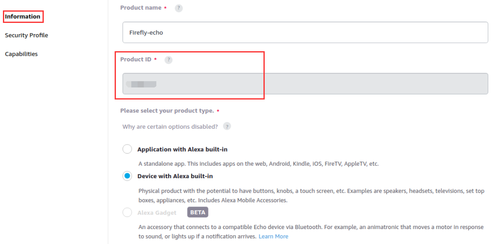
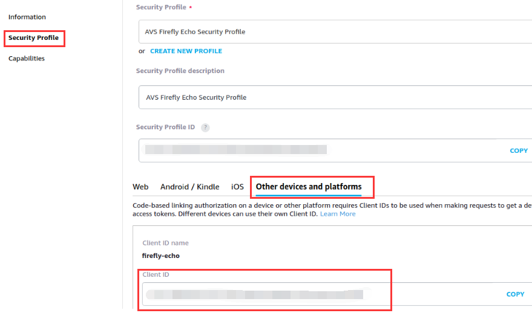
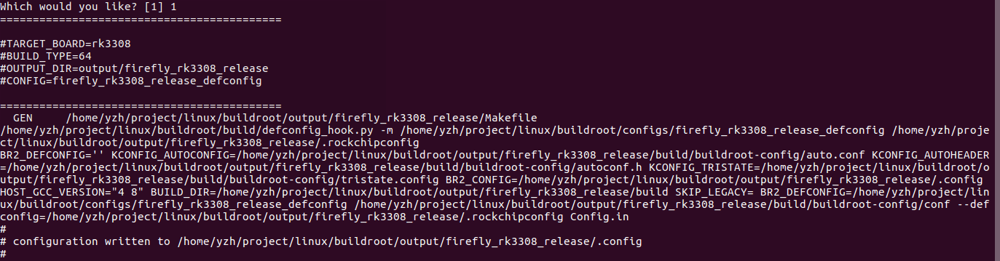
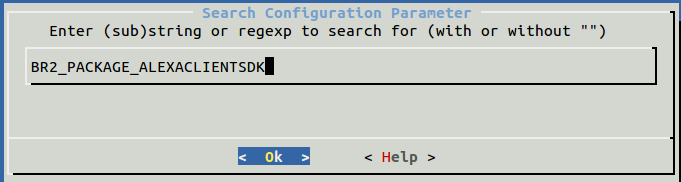
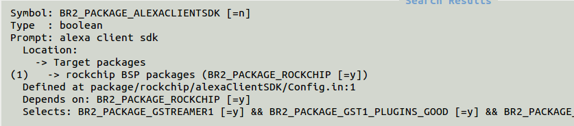
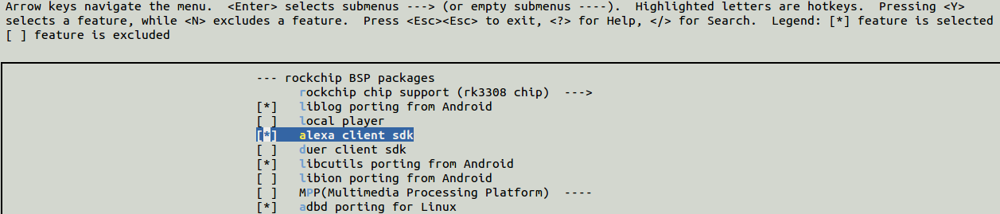

# Amazon Alexa

<!--

## 参考固件

固件：[ROC-RK3308B-CC Alexa](http://www.t-firefly.com/doc/download/55.html#other_185)
-->

## Amazon授权

使用 Alexa Voice Service，首先你需要注册一个Amazon账号，向 Amazon 注册你的产品，并对你的 alexa client 进行授权。

第一步，按照[官方指导](https://github.com/alexa/avs-device-sdk/wiki/Create-Security-Profile)，仔细的按照步骤，注册你的产品，并创建安全配置文件。

第二步，得到你的 Client ID 和 Product ID

**获取 Product ID：**



**获取 Client ID：**



## 配网

当前没有网络，或者网络不可用，我们参考[《网络配置》](network_config.html)中 [“配网”](network_config.html#shou-ji-pei-wang) 一节进行配网即可。

## 使用流程

**注意：Alexa Voice Service 不支持中文。**

● 上电开机，如果没有配置网络，先进行配网。

● 将上面获得的Client ID 和 Product ID填入 `/oem/AlexaClientSDKConfig.json`的`deviceInfo`属性：

```shell
"deviceInfo":{
    // Unique device serial number. e.g. 123456
    "deviceSerialNumber":"123456",
    // The Client ID of the Product from developer.amazon.com
    "clientId":"YOUR_CLIENT_ID",
    // Product ID from developer.amazon.com
    "productId":"YOUR_PRODUCT_ID"
},
```

● 执行下面命令启动 Alexa

```shell
SampleApp /oem/AlexaClientSDKConfig.json /oem/resources/
```

● 第一次启动需要进行认证授权，按提示打开对应网页，输入验证码进行认证即可

```shell
##################################
#       NOT YET AUTHORIZED       #
##################################

################################################################################################
#       To authorize, browse to: 'https://amazon.com/us/code' and enter the code: AT4HLU       #
################################################################################################

#################################################
#       Checking for authorization (1)...       #
#################################################
```

● 认证过程中，稍等几分钟后，就可以与 Alexa 进行对话，可通过呼叫“alexa”唤醒，不过大部分交互体验都要通过命令行引导。

```shell
+----------------------------------------------------------------------------+
|                                  Options:                                  |
| Wake word:                                                                 |
|       Simply say Alexa and begin your query.                               |
| Tap to talk:                                                               |
|       Press 't' and Enter followed by your query (no need for the 'Alexa').|
| Hold to talk:                                                              |
|       Press 'h' followed by Enter to simulate holding a button.            |
|       Then say your query (no need for the 'Alexa').                       |
|       Press 'h' followed by Enter to simulate releasing a button.          |
| Stop an interaction:                                                       |
|       Press 's' and Enter to stop an ongoing interaction.                  |
| Privacy mode (microphone off):                                             |
|       Press 'm' and Enter to turn on and off the microphone.               |
| Echo Spatial Perception (ESP): This is for testing purpose only!           |
|       Press 'e' followed by Enter at any time to adjust ESP settings.      |
| Playback Controls:                                                         |
|       Press '1' for a 'PLAY' button press.                                 |
|       Press '2' for a 'PAUSE' button press.                                |
|       Press '3' for a 'NEXT' button press.                                 |
|       Press '4' for a 'PREVIOUS' button press.                             |
| Settings:                                                                  |
|       Press 'c' followed by Enter at any time to see the settings screen.  |
| Speaker Control:                                                           |
|       Press 'p' followed by Enter at any time to adjust speaker settings.  |
| Firmware Version:                                                          |
|       Press 'f' followed by Enter at any time to report a different        |
|       firmware version.                                                    |
| Info:                                                                      |
|       Press 'i' followed by Enter at any time to see the help screen.      |
| Reset device:                                                              |
|       Press 'k' followed by Enter at any time to reset your device. This   |
|       will erase any data stored in the device and you will have to        |
|       re-register your device.                                             |
|       This option will also exit the application.                          |
| Reauthorize device:                                                        |
|       Press 'z' followed by Enter at any time to re-authorize your device. |
|       This will erase any data stored in the device and initiate           |
|       re-authorization.                                                    |
| Quit:                                                                      |
|       Press 'q' followed by Enter at any time to quit the application.     |
+----------------------------------------------------------------------------+
```

## 资源

Alexa 源码目录：

```
SDK/external/alexaClientSDK/
```

Buildroot 的 Alexa package 目录：

```
SDK/buildroot/package/rockchip/alexaClientSDK/
```

Alexa 没有自启动入口，需要进入系统后自己手动启动Alexa，方法如上一节。如果需要自启动，则可以参考DuerOS。

## 编译方法

● 编译之前，亦可将上面获得的Client ID 和 Product ID填入`SDK/device/rockchip/rk3308/alexa/AlexaClientSDKConfig.json`的`deviceInfo`属性，这样固件就默认的带有了Client ID 和 Product ID信息。

```shell
"deviceInfo":{
    // Unique device serial number. e.g. 123456
    "deviceSerialNumber":"123456",
    // The Client ID of the Product from developer.amazon.com
    "clientId":"YOUR_CLIENT_ID",
    // Product ID from developer.amazon.com
    "productId":"YOUR_PRODUCT_ID"
},
```

● 甚至可以从已经认证过的设备中，拷贝`/oem/application-necessities/cblAuthDelegate.db`到SDK中`device/rockchip/rk3308/alexa/application-necessities/cblAuthDelegate.db`，这样Alexa就会跳过认证，直接开始对话。

● 编辑 device/rockchip/rk3308/BoardConfig.mk 文件，将 `OEM_PATH=oem` 修改为 `OEM_PATH=alexa`，保存退出

● 配置 firefly_rk3308_release

```shell
source buildroot/build/envsetup.sh
```

选择`[1]`，按回车，配置成功后如下



● Buildroot配置：BR2_PACKAGE_ALEXACLIENTSDK

```shell
make menuconfig
```

进入图形选择界面，输入 `/`，跳出搜索界面如下，输入`BR2_PACKAGE_ALEXACLIENTSDK`，按回车进行搜索





选择`[1]`，然后按空格选择上 `alexa client sdk`



前面有 `[ * ]` 号，表示已经选上，然后`< Save >保存`，并`< Exit >退出`图形界面，输入配置保存命令：

```shell
make savedefconfig
```

保存配置，不保存的话，会在一键编译脚本中被重置

● 在编译前，如果当前仓库不是第一次编译，需要执行：

```
make gst1-plugins-good-reconfigure && make gst1-plugins-good-rebuild
```

● 最后全部编译

```shellS
./build.sh
```

