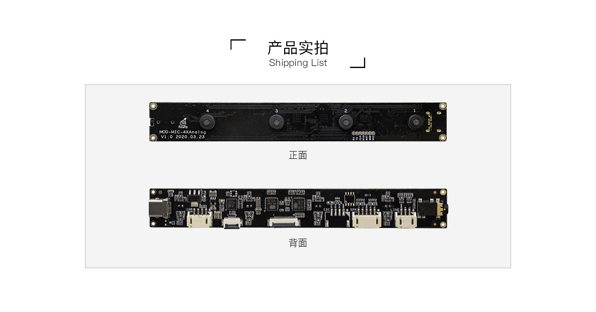
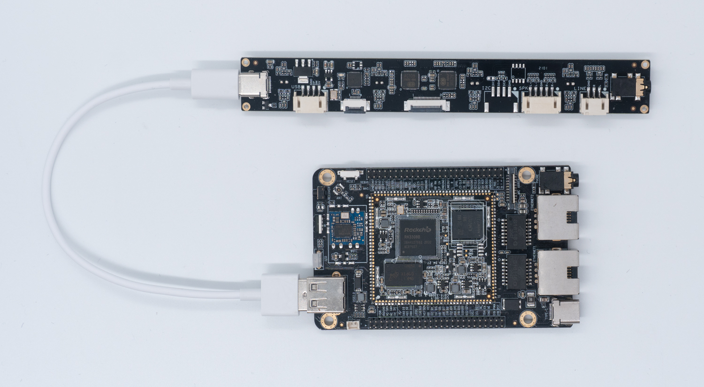

# 语音模组
## MIC阵列
### 产品参数
* 型号：MOD-MIC-4XAnalog
* 连接方式：USB连接

### 实物图


### 数字MIC使用说明
#### 连接图

#### 录音

查看系统识别到的声卡，其中 `USB-Audio` 为 `USB`声卡

```
/ # cat /proc/asound/cards
 0 [rockchiprk3308b]: rockchip_rk3308 - rockchip,rk3308b-acodec
                      rockchip,rk3308b-acodec
 1 [Audio          ]: USB-Audio - AC108 USB Audio
                      XPowers AND ST AC108 USB Audio at usb-ff440000.usb-1.1, full speed
 7 [Loopback       ]: Loopback - Loopback
                      Loopback 1
```

录音：

```
arecord -D hw:1,0 -c 8 -r 16000 -f S16_LE test.wav
```

播放：

```
aplay test.wav
```
