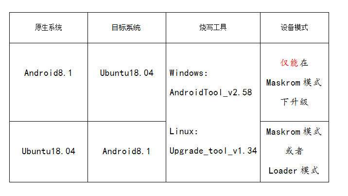

# 烧写须知(重要)

以下内容，仅针对烧写统一固件，请认真阅读本章再对EMMC进行烧写！

## 固件格式

目前CORE-RK3328-JD4官方提供的固件格式仅有：

- RK固件(Rockchip firmware)

[RK 固件]，是以 Rockchip专有格式打包的固件，使用 Rockchip 提供的 [upgrade_tool] (Linux) 或 [AndroidTool] (Windows) 工具烧写到eMMC 闪存中。[RK 固件]是 Rockchip 的传统固件打包格式，常用于 Android 设备上。另外，Android 的 [RK 固件]也可以使用 [SD  Firmware Tool] 工具烧写到 SD 卡中。

了解其他固件格式和分区映像可参考：[固件格式](http://wiki.t-firefly.com/zh_CN/ROC-RK3328-CC/started.html#gu-jian-ge-shi)

## 烧写固件工具

以下是支持的系统列表：

- Android 8.1
- Ubuntu 18.04

* 固件

	- 官方固件:官方提供的Linux固件中，目前仅有Ubuntu系统，带`GPT`字样为GPT分区格式固件；云盘提供的Android固件为Android8.1系统
	
	- DIY固件:根据[《编译Linux固件(GPT)》]编译出来的固件为GPT固件，根据[《编译 Android 固件》]为Android8.1固件。
    
根据所使用的操作系统来选择合适的工具去烧写固件：

- 烧写 SD 卡
    + 图形界面烧写工具：
        * [Etcher] (Linux/Windows/Mac)
    + 命令行烧写工具
        * [dd] (Linux)

- 烧写 eMMC
    + 图形界面烧写工具：
        * [AndroidTool] (Windows)
    + 命令行烧写工具：
        * [upgrade_tool] (Linux)

* 烧写工具下载地址(根据下表下载对应版本)

	- [upgrade_tool](https://community.t-firefly.com/doc/download/68) 
	
	- [Android_tool](https://community.t-firefly.com/doc/download/68)

## 烧写须知
请认真阅读下表，再进行烧写:

提示：在Loader模式和Maskrom模式均能够烧写固件时，优先选择Loader模式。

[《上手指南》]: started.md
[《常见问题解答》]: faqs.md
[《串口调试》]: debug.md
[《编译 Linux 根文件系统》]: linux_build_ubuntu_rootfs.md
[《编译 Linux 固件》]:linux_compile_gpt.md
[《编译 Android 固件》]:compile_android8.1_firmware.md
[《MaskRom》]:04-maskrom_mode.md
[《编译Linux固件(GPT)》]:linux_compile_gpt.md
[《烧写须知》]: 02-upgrade_table.md
[《ADB 介绍》]: adb_use.md
[Loader模式]:01-bootmode.md#loader_mode
[联系方式]: resource.md#社区
[原始固件]: started.md#raw-firmware-format
[RK 固件]: 02-upgrade_table.md#rk-firmware-format
[分区映像]: started.md#partition-image
[upgrade_tool]:03-upgrade_firmware.md#upgrade-tool
[AndroidTool]:03-upgrade_firmware.md#androidtool
[CORE-RK3328-JD4]:http://www.t-firefly.com/product/coreboard/core_3328_jd4.html?theme=pc
[下载页面]: https://community.t-firefly.com/doc/download/34
[论坛]: http://bbs.t-firefly.com
[脸书]: https://www.facebook.com/TeeFirefly
[Google+]: https://plus.google.com/u/0/communities/115232561394327947761
[油管]: https://www.youtube.com/channel/UCk7odZvUrTG0on8HXnBT7gA
[推特]: https://twitter.com/TeeFirefly
[在线商城]: http://store.t-firefly.com
[USB 转串口适配器]: https://store.t-firefly.com/goods.php?id=24
[5V2A 电源适配器]: https://store.t-firefly.com/goods.php?id=69
[《存储映射》]: http://opensource.rock-chips.com/wiki_Partitions#Default_storage_map