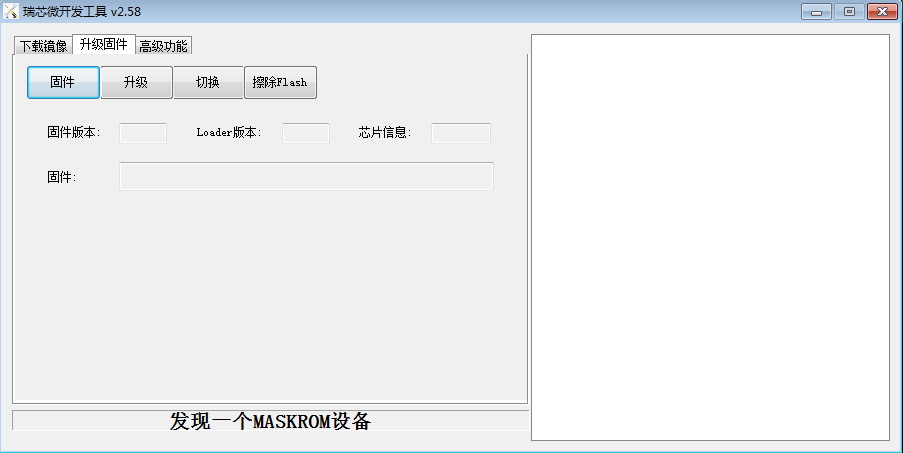

# MaskRom模式

***有关启动模式的介绍，请参阅[《启动模式》]一章***   
## 简介
`MaskRom` 模式是设备变砖的最后一条防线。强行进入 `MaskRom` 涉及硬件操作，有一定风险，因此仅在设备进入不了 `Loader` 模式的情况下，方可尝试 `MaskRom` 模式。   

* 请小心阅读，并谨慎操作！ 

## AIO-RK3328-JD4 进入MaskRom

#### 原理：
人为的把Flash的数据脚与地线短接，系统会认为Flash数据出错，从而清除Flash数据。
操作步骤如下：

*  1、找到AIO-RK3328-JD4 预留的焊点(CLK, GND)，在开发板的正面，如下图所示：

* 2、设备断开所有电源。
* 3、拔出 SD 卡。
* 4、用 Type-C 数据线连接好设备和主机。
* 5、用金属镊子接通AIO-RK3328-JD4预留的焊点(CLK, GND)，并保持。
* 6、设备插入电源。
* 7、稍候片刻，之后松开镊子，设备应该就会进入 MaskRom 模式。  

[《上手指南》]: started.md
[《常见问题解答》]: faqs.md
[《串口调试》]: debug.md
[《编译 Linux 根文件系统》]: linux_build_ubuntu_rootfs.md
[《编译 Linux 固件》]:linux_compile_gpt.md
[《编译 Android 固件》]:compile_android8.1_firmware.md
[《MaskRom》]:04-maskrom_mode.md
[《编译Linux固件(GPT)》]:linux_compile_gpt.md
[《烧写须知》]: 02-upgrade_table.md
[《ADB 介绍》]: adb_use.md
[Loader模式]:01-bootmode.md#loader_mode
[联系方式]: resource.md#社区
[原始固件]: started.md#raw-firmware-format
[RK 固件]: 02-upgrade_table.md#rk-firmware-format
[分区映像]: started.md#partition-image
[upgrade_tool]:03-upgrade_firmware.md#upgrade-tool
[AndroidTool]:03-upgrade_firmware.md#androidtool
[CORE-RK3328-JD4]:http://www.t-firefly.com/product/coreboard/core_3328_jd4.html?theme=pc
[下载页面]: https://community.t-firefly.com/doc/download/34
[论坛]: http://bbs.t-firefly.com
[脸书]: https://www.facebook.com/TeeFirefly
[Google+]: https://plus.google.com/u/0/communities/115232561394327947761
[油管]: https://www.youtube.com/channel/UCk7odZvUrTG0on8HXnBT7gA
[推特]: https://twitter.com/TeeFirefly
[在线商城]: http://store.t-firefly.com
[USB 转串口适配器]: https://store.t-firefly.com/goods.php?id=24
[5V2A 电源适配器]: https://store.t-firefly.com/goods.php?id=69
[《存储映射》]: http://opensource.rock-chips.com/wiki_Partitions#Default_storage_map