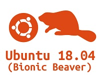
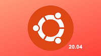
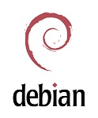
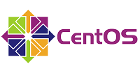

# 更多 Linux OS 支持

## Ubuntu 18.04

Ubuntu（乌班图）是一个基于Debian的以桌面应用为主的Linux操作系统，据说其名称来自非洲南部祖鲁语或科萨语的“ubuntu”一词，意思是“人性”、“我的存在是因为大家的存在”，是非洲传统的一种价值观。**用户可以通过查询[《Firefly Ubuntu 使用手册》](ubuntu_manual.md)在Firefly的板子上体验Ubuntu系统的魅力。**

## Ubuntu 20.04
与最近的 LTS 前身 Ubuntu 18.04 相比，Ubuntu 20.04 带来了许多变化和明显的改进。随着时间的流逝，Canonical 的未来似乎变得温和光明，并点缀着更好的装饰品。对于所有 Ubuntu 爱好者，我们相信您会喜欢这个新版本，您可以在下面的链接中找到它。

## Yocto

Yocto项目是一个开源协作项目，可帮助开发人员创建基于Linux的定制系统，这些系统专为嵌入式产品而设计，无论产品的硬件架构如何。Yocto Project提供灵活的工具集和开发环境，允许全球的嵌入式设备开发人员通过共享技术，软件堆栈，配置和用于创建这些定制的Linux映像的最佳实践进行协作。**Firefly为板子适配了Yocto项目，用户可以通过查看[《Yocto项目开发手册》](yocto_develop.md)进行快速开发。**

## Debian 10

Debian 项目由 Ian Murdock 于1993年创立，是一个真正的免费社区项目。从那时起该项目已发展成为最大和最有影响力的开源项目之一。来自世界各地的数千名志愿者共同创建和维护 Debian 软件。Debian提供70种语言，支持多种计算机类型，因此其自称为通用操作系统。**因 Debian 强大的的通用性，Firefly为此适配了[Debian 10](https://community.t-firefly.com/doc/download/62)以供开发者使用。**

## Centos 8

CentOS（Community Enterprise Operating System）是Linux发行版之一，它是来自于Red Hat Enterprise Linux（RHEL）依照开放源代码规定发布的源代码所编译而成。由于出自同样的源代码，因此有些要求高度稳定性的服务器以CentOS替代商业版的Red Hat Enterprise Linux使用。**因 Centos 强大的的通用性，Firefly为此适配了[Centos 8](https://community.t-firefly.com/doc/download/62)以供开发者使用。**

