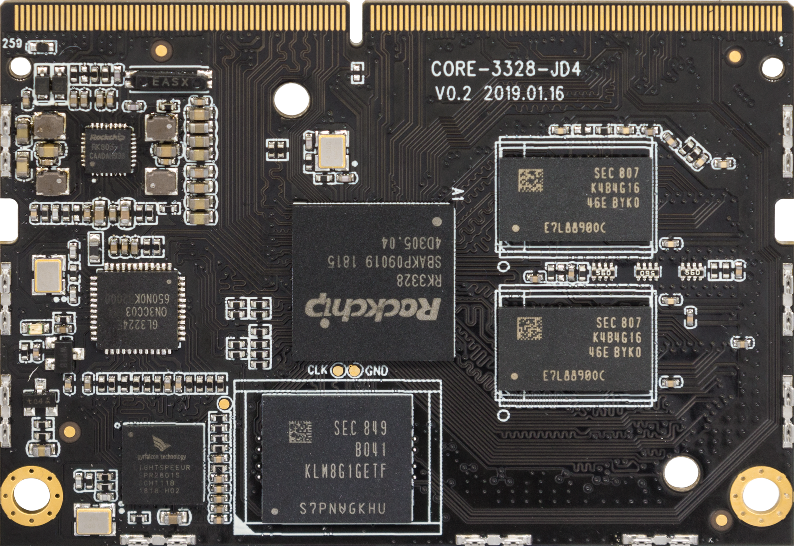
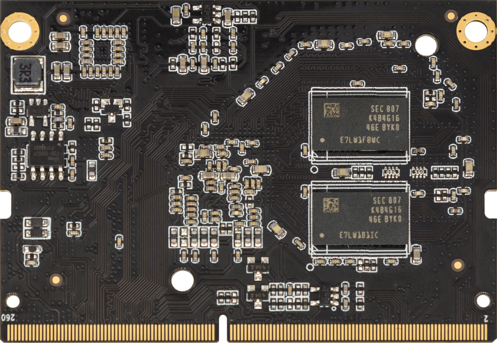
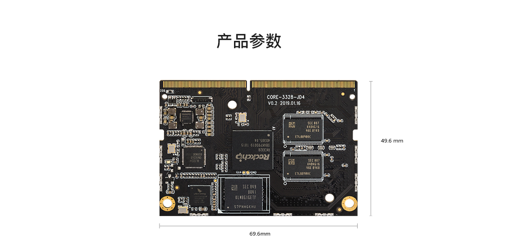
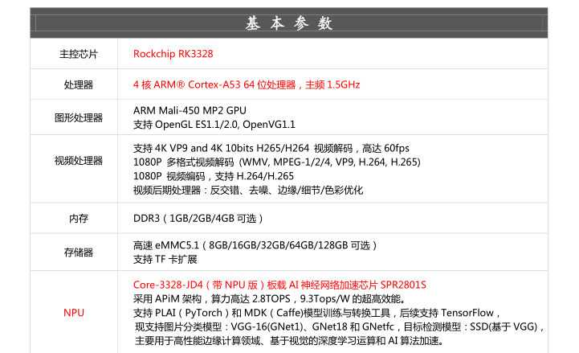
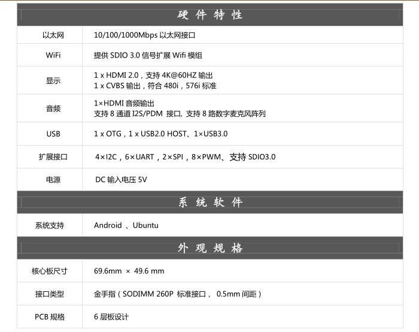

# 产品简介

## 产品概述

### 四核 64 位入门级核心板

Core-3328-JD4 采用 Rockchip RK3328 四核 64 位 Cortex-A53 处理器，板载 AI 神经网络加速芯片，具备较强的硬件解码能力和丰富的扩展接口，支持多种操作系统，适用于集群服务器、高性能计算与存储、工业电脑等场景。

## 产品参数

## 标准套装

Core-3328-JD4 标准套装包含：

* Core-3328-JD4 核心板 × 1
* MB-JD4-RK3328&PX30 底板 × 1
* 铜管天线 × 1
* 12V/2A 电源适配器 × 1
* Type-A 转 Type-C 数据线 × 1

使用过程中可能还需要：

* HDMI 显示器及 HDMI 线
* 100M 以太网线和有线路由器，或 Wi-Fi 路由器
* USB 鼠标、键盘或红外遥控器
* USB 转 TTL 串口适配器

## 开机

1. 连接 HDMI 显示器、USB 鼠标或键盘（可选）。
2. 检查所有连接无误后接通电源适配器。
3. 开机后蓝色电源指示灯亮起；连接 HDMI 屏幕时可看到 Firefly 启动画面。
 