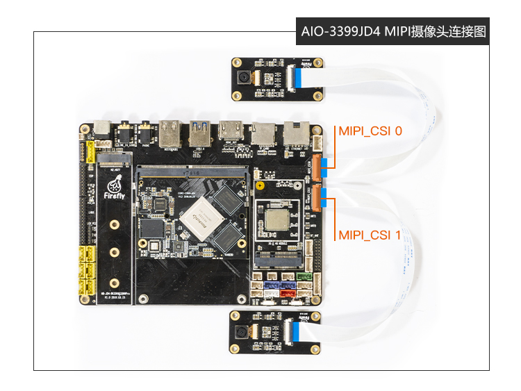
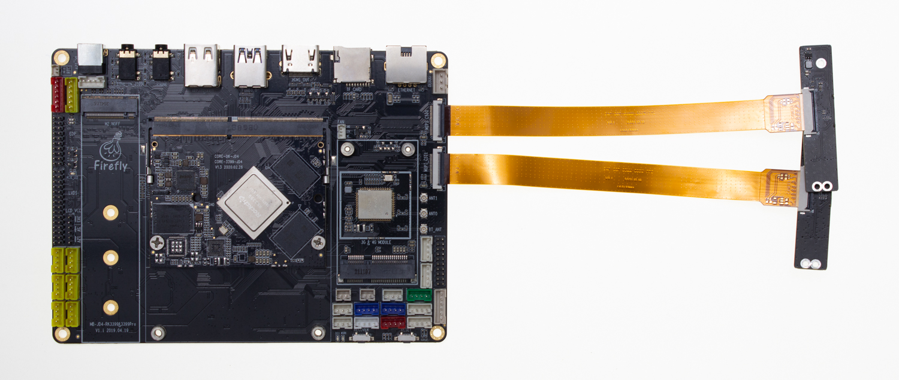
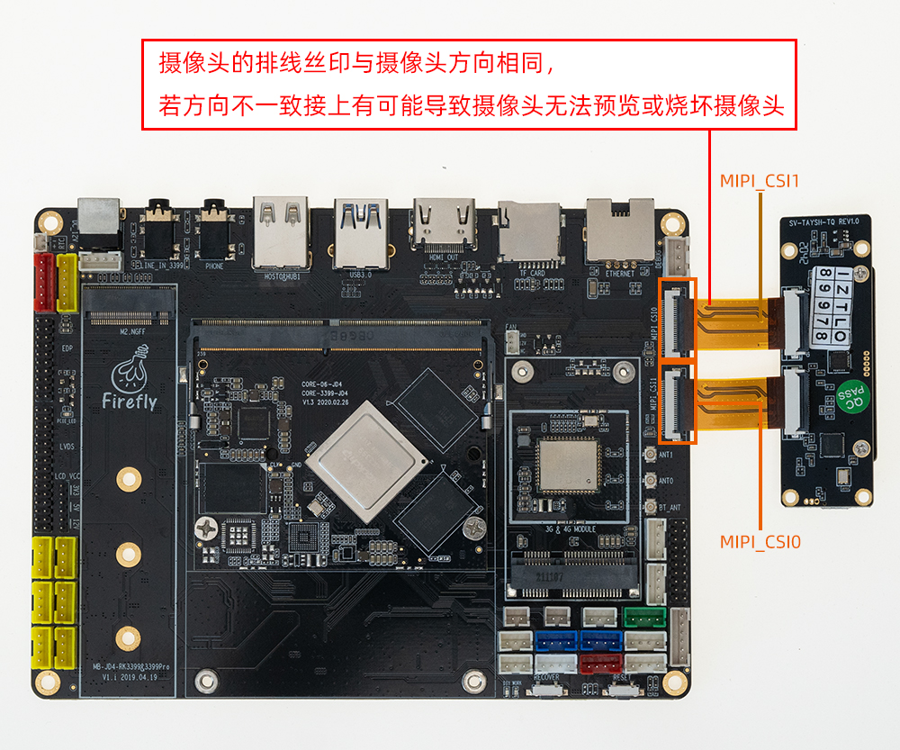

# 摄像头模组

## [OV13850 摄像头模组](https://store.t-firefly.com/goods.php?id=6)<font color=#ff0000>(已停产)</font> <br />

### 产品参数

* 品牌：Omnivision
* 型号：CMK-OV13850
* 接口：MIPI
* 像素：1320W


### 参考固件

公版固件默认支持 CMK-OV13850 摄像头模组


### 技术资料

[OV13850 摄像头 DataSheet](http://download.t-firefly.com/product/RK3288/Docs/Peripherals/OV13850%20datasheet/Sensor_OV13850-G04A_OmniVision_SpecificationV1.pdf)

### 实物图


### 连接方法



### 实拍图片


## [CAM-8MS1M 单目摄像头模组](https://item.taobao.com/item.htm?ft=t&id=659032651408)

### 产品参数
* **品牌**：SV
* **ISP**：XC7160
* **Sensor**: SC8238
* **接口**: MIPI
* **像素**: 800W(当前仅支持1080P，4K仍在适配中)

### 规格书
[CAM-8MS1M_800万单目MIPI摄像模组_规格书](https://www.t-firefly.com/doc/download/131.html#other_515)

### 参考固件
公版固件默认支持 CAM-8MS1M 单目摄像头模组。若无法使用单目摄像头 CAM-8MS1M，请更新固件
[Android7.1固件下载](https://www.t-firefly.com/doc/download/66.html#other_371)


### 实物图参考


### 连接方法



### 实拍图片


## SV-TAYSH-TQ摄像头模组

### 产品参数

* 型号：XC7022(RGB)/XC6130(IR)

* 接口：MIPI

* 像素：200W

### 修改方法 (手动修改)
「 Android 7.1 」device/rockchip/rk3399/rk3399_firefly_aiojd4.mk

```
 BOARD_NFC_SUPPORT := false
 BOARD_HAS_GPS := false
+BOARD_XC7022_XC6130_SUPPORT := true

 #for 3G/4G modem dongle support
 BOARD_HAVE_DONGLE := false
```
修改上述补丁后重新[编译Android](compile_android7.1_industry_firmware.html#shou-dong-bian-yi-core-3399-jd4)并烧写 system.img 后重启。


### 实物图


### 连接方式



### 实拍图片


