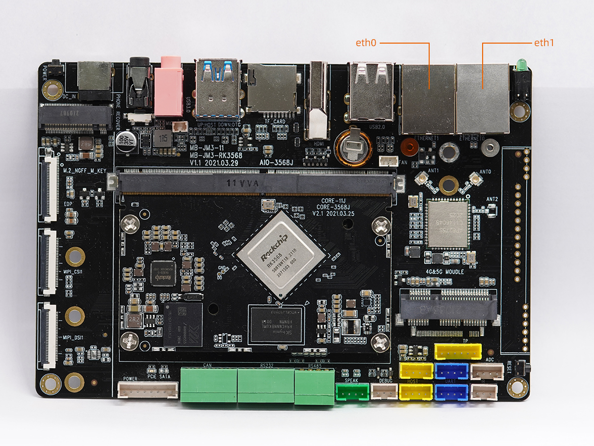

## Ethernet 使用

### dts 配置

#### 公共的配置
`kernel/arch/arm64/boot/dts/rockchip/rk3568-firefly-port.dtsi`
```
&gmac0 {
        phy-mode = "rgmii";
        clock_in_out = "input";zzz

        snps,reset-gpio = <&gpio2 RK_PD3 GPIO_ACTIVE_LOW>;
        snps,reset-active-low;
        /* Reset time is 20ms, 100ms for rtl8211f */
        snps,reset-delays-us = <0 20000 100000>;

        assigned-clocks = <&cru SCLK_GMAC0_RX_TX>, <&cru SCLK_GMAC0>;
        assigned-clock-parents = <&cru SCLK_GMAC0_RGMII_SPEED>, <&cru CLK_MAC0_2TOP>;

        pinctrl-names = "default";
        pinctrl-0 = <&gmac0_miim
                     &gmac0_tx_bus2
                     &gmac0_rx_bus2
                     &gmac0_rgmii_clk
                     &gmac0_rgmii_bus>;

        tx_delay = <0x3c>;
        rx_delay = <0x2f>;

        phy-handle = <&rgmii_phy0>;
        status = "disabled";
};

&gmac1 {
        phy-mode = "rgmii";
        clock_in_out = "input";

        snps,reset-gpio = <&gpio2 RK_PD1 GPIO_ACTIVE_LOW>;
        snps,reset-active-low;
        /* Reset time is 20ms, 100ms for rtl8211f */
        snps,reset-delays-us = <0 20000 100000>;

        assigned-clocks = <&cru SCLK_GMAC1_RX_TX>, <&cru SCLK_GMAC1>;
        assigned-clock-parents = <&cru SCLK_GMAC1_RGMII_SPEED>, <&cru CLK_MAC1_2TOP>;

        pinctrl-names = "default";
        pinctrl-0 = <&gmac1m1_miim
                     &gmac1m1_tx_bus2
                     &gmac1m1_rx_bus2
                     &gmac1m1_rgmii_clk
                     &gmac1m1_rgmii_bus>;

        tx_delay = <0x4f>;
        rx_delay = <0x26>;

        phy-handle = <&rgmii_phy1>;
        status = "disabled";
};
```

#### 板级的配置

`kernel/arch/arm64/boot/dts/rockchip/rk3568-firefly-aioj.dtsi`
```
&gmac0 {
    status = "okay";
    tx_delay = <0x39>;
    rx_delay = <0x2c>;
};

&gmac1 {
    status = "okay";
    tx_delay = <0x49>;
    rx_delay = <0x28>;
};
```


### Android双以太网的使用
此设备的双以太网口分内网和外网。 内网又称局域网（Local Area Network，LAN，是指在某一区域内由多台计算机以及网络设备构成的网络，无法连通外部网络；外网为广域网，又称公网，是连接不同地区局域网或城域网计算机通信的远程网，可以连通外部网络，如访问百度，搜狗。


* eth0 : 副网口，用于内网
* eth1 : 主网口，用于外网



Android 系统`Settings -> Network & internet -> Ethernet/Ethernet2`， 可以查看主副网口的 IP 地址。


#### 查看IP地址
* 双以太网口接入网络，可以通过调试串口或者adb来查看IP地址，比如

	```
	ifconfig eth0
    eth0    Link encap:Ethernet  HWaddr b2:d1:83:54:0e:62  Driver rk_gmac-dwmac
            inet addr:192.168.1.102  Bcast:192.168.1.255  Mask:255.255.255.0
            inet6 addr: fe80::721f:ee30:f2a3:7bac/64 Scope: Link
            UP BROADCAST RUNNING MULTICAST  MTU:1500  Metric:1
            RX packets:189 errors:0 dropped:0 overruns:0 frame:0
            TX packets:135 errors:0 dropped:0 overruns:0 carrier:0
            collisions:0 txqueuelen:1000
            RX bytes:18349 TX bytes:7022
            Interrupt:41
	```
	```
	ifconfig eth1
	eth1    Link encap:Ethernet  HWaddr ae:d1:83:54:0e:62  Driver rk_gmac-dwmac
            inet addr:168.168.108.98  Bcast:168.168.255.255  Mask:255.255.0.0
            inet6 addr: fe80::641:354:8888:73fe/64 Scope: Link
            UP BROADCAST RUNNING MULTICAST  MTU:1500  Metric:1
            RX packets:2016 errors:0 dropped:0 overruns:0 frame:0 
            TX packets:41 errors:0 dropped:0 overruns:0 carrier:0 
            collisions:0 txqueuelen:1000 
            RX bytes:128098 TX bytes:4374 
            Interrupt:51
	```

#### 连通性测试
* eth0

	```
	ping -I eth0 -c 10 192.168.1.1
	PING 192.168.1.1 (192.168.1.1) from 192.168.1.102 eth0: 56(84) bytes of data.
	64 bytes from 192.168.1.1: icmp_seq=1 ttl=64 time=0.936 ms
	64 bytes from 192.168.1.1: icmp_seq=2 ttl=64 time=1.10 ms
	64 bytes from 192.168.1.1: icmp_seq=3 ttl=64 time=0.962 ms
	64 bytes from 192.168.1.1: icmp_seq=4 ttl=64 time=0.959 ms
	64 bytes from 192.168.1.1: icmp_seq=5 ttl=64 time=1.14 ms
	64 bytes from 192.168.1.1: icmp_seq=6 ttl=64 time=0.966 ms
	64 bytes from 192.168.1.1: icmp_seq=7 ttl=64 time=1.02 ms
	64 bytes from 192.168.1.1: icmp_seq=8 ttl=64 time=1.03 ms
	64 bytes from 192.168.1.1: icmp_seq=9 ttl=64 time=1.03 ms
	64 bytes from 192.168.1.1: icmp_seq=10 ttl=64 time=1.04 ms

	--- 192.168.1.1 ping statistics ---
	10 packets transmitted, 10 received, 0% packet loss, time 9015ms
	rtt min/avg/max/mdev = 0.936/1.020/1.144/0.063 ms
	```

* eth1

	```
	ping -I eth1 -c 10 www.baidu.com
	PING www.a.shifen.com (14.215.177.39) from 168.168.108.98 eth1: 56(84) bytes of data.
	64 bytes from 14.215.177.39: icmp_seq=1 ttl=56 time=8.03 ms
	64 bytes from 14.215.177.39: icmp_seq=2 ttl=56 time=5.61 ms
	64 bytes from 14.215.177.39: icmp_seq=3 ttl=56 time=5.46 ms
	64 bytes from 14.215.177.39: icmp_seq=4 ttl=56 time=5.35 ms
	64 bytes from 14.215.177.39: icmp_seq=5 ttl=56 time=5.68 ms
	64 bytes from 14.215.177.39: icmp_seq=6 ttl=56 time=5.59 ms
	64 bytes from 14.215.177.39: icmp_seq=7 ttl=56 time=5.70 ms
	64 bytes from 14.215.177.39: icmp_seq=8 ttl=56 time=5.54 ms
	64 bytes from 14.215.177.39: icmp_seq=9 ttl=56 time=5.74 ms
	64 bytes from 14.215.177.39: icmp_seq=10 ttl=56 time=5.43 ms

	--- www.a.shifen.com ping statistics ---
	10 packets transmitted, 10 received, 0% packet loss, time 9015ms
	rtt min/avg/max/mdev = 5.354/5.816/8.031/0.753 ms
	```

