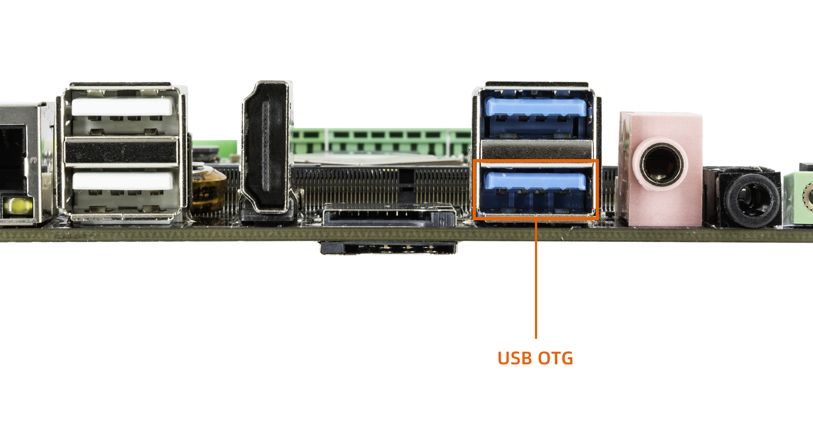
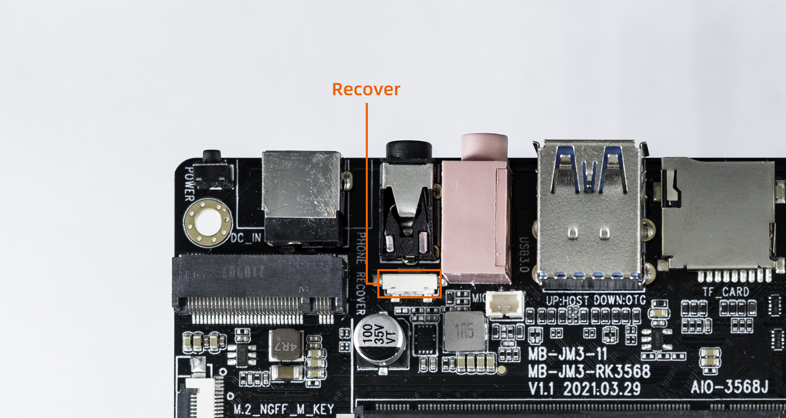

# Loader 升级模式

***有关启动模式的介绍，请参阅[《更新固件介绍》](01-bootmode.md)一章***

## 简介

在 Loader 模式下，bootloader 会进入升级状态，等待主机命令，用于固件升级等。要进入 Loader 模式，必须让 bootloader 在启动时检测到 `RECOVERY`（恢复）键按下，且 USB 处于连接状态。

使设备进入升级模式的方法如下:

* 先断开电源适配器连接
* 双公头 USB 数据线一端连接主机，一端连接开发板

* 按住设备上的 RECOVERY （恢复）键并保持

* 接上电源
* 大约两秒钟后，松开 RECOVERY 键

## 升级固件

开发者根据个人不同PC操作系统，可选用不同的固件升级工具。

* Windows 环境

**如果开发者使用在`Windows`主机上进行开发，可以使用`RKDevTool`升级工具。详情请参考[《使用 RKDevTool 升级固件》](Windows_upgrade_firmware.html)。**

* Linux 环境

**如果开发者使用在`Linux`主机上进行开发，可以使用`upgrade_tool`升级工具。详情请参考[《使用 upgrade_tool 升级固件》](Linux_upgrade_firmware.html)。**