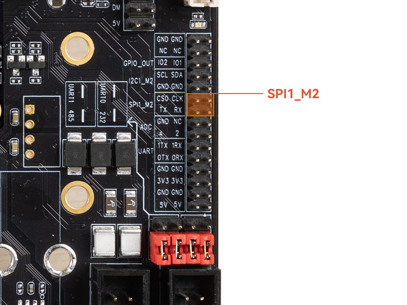

# SPI 使用

## SPI 简介

SPI 是一种高速的，全双工，同步串行通信接口，用于连接微控制器、传感器、存储设备等。 ITX-3588J  开发板提供了 SPI1接口，具体位置如下图：



## SPI 工作方式

SPI 以主从方式工作，这种模式通常有一个主设备和一个或多个从设备，需要至少 4 根线，分别是：

```
CS	    	片选信号
SCLK		时钟信号
MOSI		主设备数据输出、从设备数据输入
MISO		主设备数据输入，从设备数据输出
```

Linux 内核用 CPOL 和 CPHA 的组合来表示当前 SPI 的四种工作模式：

```
CPOL＝0，CPHA＝0		SPI_MODE_0
CPOL＝0，CPHA＝1		SPI_MODE_1
CPOL＝1，CPHA＝0		SPI_MODE_2
CPOL＝1，CPHA＝1		SPI_MODE_3
```

* CPOL：表示时钟信号的初始电平的状态，0为低电平，1为高电平。
* CPHA：表示在哪个时钟沿采样，0为第一个时钟沿采样，1为第二个时钟沿采样。

SPI 的四种工作模式波形图如下：


## 驱动编写

下面以 XM25QU128C Flash 模块为例简单介绍 SPI 驱动的编写。

### 硬件连接

ITX-3588J 与 XM25QU128C 硬件连接如下表：

| XM25QU128C | ITX-3588J   | 
| ----       | ----        |
| /CS        | SPI1_M2_CS0 |
| D0         | SPI1_M2_RX  |
| GND        | GND         |
| VCC        | 1.8V        |
| CLK        | SPI1_M2_CLK  |
| D1         | SPI1_M2_TX   |

### 编写Makefile/Kconfig

在 `kernel-5.10/drivers/spi/Kconfig` 中添加对应的驱动文件配置：

```
config SPI_FIREFLY
       tristate "Firefly SPI demo support "
       default y
        help
          Select this option if your Firefly board needs to run SPI demo.
```

在 `kernel-5.10/drivers/spi/Makefile` 中添加对应的驱动文件名：

```
obj-$(CONFIG_SPI_FIREFLY)              += spi-firefly-demo.o
```


### 配置 DTS 节点

在 `kernel-5.10/arch/arm64/boot/dts/rockchip/rk3588-firefly-demo.dtsi` 中添加 SPI 驱动结点描述，如下所示：

```
/* Firefly SPI demo */
&spi1{
    spi_demo: spi_demo@00{
        compatible = "firefly,rk3588-spi";
        status = "okay";
        reg = <0x00>;
        spi-max-frequency = <50000000>;
        //spi-cpha;   /* SPI mode: CPHA=1 */
        //spi-cpol; 	/* SPI mode: CPOL=1 */
        //spi-cs-high;
    };
};

&spidev1 {
    status = "disabled";
};
```

* status:如果要启用 SPI，则设为 `okay`，如不启用，设为 `disable`。
* spi-demo@00:由于本例子使用 CS0，故此处设为 `00`，如果使用 CS1，则设为 `01`。
* compatible:这里的属性必须与驱动中的结构体：of_device_id 中的成员 compatible 保持一致。
* reg:此处与 spi-demo@00 保持一致，本例设为：0x00。
* spi-max-frequency：此处设置 spi 使用的最高频率，ITX-3588J 最高支持 50000000。
* spi-cpha，spi-cpol：SPI 的工作模式在此设置，本例所用的模块 SPI 工作模式为 SPI_MODE_0 或者 SPI_MODE_3，这里我们选用 SPI_MODE_0，如果使用 SPI_MODE_3，spi_demo 中打开 spi-cpha 和 spi-cpol 即可。


### 定义SPI驱动

在内核源码目录 `kernel-5.10/drivers/spi/` 中创建新的驱动文件，如：`spi-firefly-demo.c`。

在定义 SPI 驱动之前，用户首先要定义变量 `of_device_id` 。`of_device_id` 用于在驱动中调用 DTS 文件中定义的设备信息，其定义如下所示：

```
static struct of_device_id firefly_match_table[] = { { .compatible = "firefly,rk3588-spi",},{},};
```

此处的 `compatible` 与 DTS 文件中的保持一致。

spi_driver定义如下所示：

```
static struct spi_driver firefly_spi_driver = {
	.driver = {
		.name = "firefly-spi",
		.owner = THIS_MODULE,
		.of_match_table = firefly_match_table,},
	.probe = firefly_spi_probe,};
};
```

### 注册SPI设备

在初始化函数 `static int __init firefly_spi_init(void)` 中向内核注册 SPI 驱动：`spi_register_driver(&firefly_spi_driver);`

如果内核启动时匹配成功，则 SPI 核心会配置 SPI 的参数（mode、speed 等），并调用 `firefly_spi_probe`。

### 读写 SPI 数据

* `firefly_spi_probe` 中使用了两种接口操作读取 `XM25QU128C` 的 ID:
* `firefly_spi_read_xm25x_id_0` 接口直接使用了 `spi_transfer` 和 `spi_message` 来传送数据。
* `firefly_spi_read_xm25x_id_1` 接口则使用 SPI 接口 `spi_write_then_read` 来读写数据。

成功后会打印：

```
console:/ $  dmesg | grep spi
[    1.791786] [    T1] firefly-spi spi1.0: Firefly SPI demo program
[    1.791788] [    T1] firefly spi demo
[    1.791795] [    T1] firefly-spi spi1.0: firefly_spi_probe: setup mode 0, 8 bits/w, 50000000 Hz max 
[    1.791797] [    T1] spi demo mode ; 0     
[    1.791838] [    T1] firefly_spi_read_xm25x_id_0 ID = 20 41 18
[    1.791875] [    T1] firefly_spi_read_xm25x_id_1 ID = 20 41 18


```

### 打开 SPI demo

`spi-firefly-demo` 默认没有打开，如果需要的话可以使用以下补丁打开 demo 驱动：

```
--- a/kernel-5.10/arch/arm64/boot/dts/rockchip/rk3588-firefly-demo.dtsi
+++ b/kernel-5.10/arch/arm64/boot/dts/rockchip/rk3588-firefly-demo.dtsi
@@ -64,7 +64,7 @@ /* Firefly SPI demo */
 &spi1 {spi_demo: spi-demo@00{
 -                status = "disabled";
 +                status = "okay";
                  compatible = "firefly,rk3588-spi";
                  reg = <0x00>;
                  spi-max-frequency = <50000000>;
```


### 常用 SPI 接口

下面是常用的 SPI API 定义：

```
void spi_message_init(struct spi_message *m);
void spi_message_add_tail(struct spi_transfer *t, struct spi_message *m);
int spi_sync(struct spi_device *spi, struct spi_message *message) ;
int spi_write(struct spi_device *spi, const void *buf, size_t len);
int spi_read(struct spi_device *spi, void *buf, size_t len);
ssize_t spi_w8r8(struct spi_device *spi, u8 cmd);
ssize_t spi_w8r16(struct spi_device *spi, u8 cmd);
ssize_t spi_w8r16be(struct spi_device *spi, u8 cmd);
int spi_write_then_read(struct spi_device *spi, const void *txbuf, unsigned n_tx, void *rxbuf, unsigned n_rx);
```

## 接口使用

Linux 提供了一个功能有限的 SPI 用户接口，如果不需要用到 IRQ 或者其他内核驱动接口，可以考虑使用接口 `spidev` 编写用户层程序控制 SPI 设备。在 ITX-3588J 开发板中对应的路径为： `/dev/spidev1.0`

spidev 对应的驱动代码：`kernel-5.10/drivers/spi/spidev.c`

内核 config 需要选上 SPI_SPIDEV：

```
 │ Symbol: SPI_SPIDEV [=y]
 │ Type  : tristate
 │ Prompt: User mode SPI device driver support
 │   Location:
 │     -> Device Drivers
 │       -> SPI support (SPI [=y])
 │   Defined at drivers/spi/Kconfig:684
 │   Depends on: SPI [=y] && SPI_MASTER [=y]
```

DTS 配置如下：


```
&spi1{
    status = "okay";
    pinctrl-0 = <&spi1m2_cs0 &spi1m2_pins>;
    max-freq = <50000000>;
    spidev1: spidev@00{
        compatible = "rockchip,spidev";
        status = "okay";
        reg = <0x0>;
        spi-max-frequency = <50000000>;
    };
};
```
spidev的详细使用说明请参考文档`kernel-5.10/Documentation/spi/spidev.rst`

## FAQs

### Q1: SPI 数据传送异常

A1:  确保 SPI 4 个引脚的 `IOMUX` 配置正确， 确认 TX 送数据时，TX 引脚有正常的波形，CLK 频率正确，CS 信号有拉低，mode 与设备匹配。
