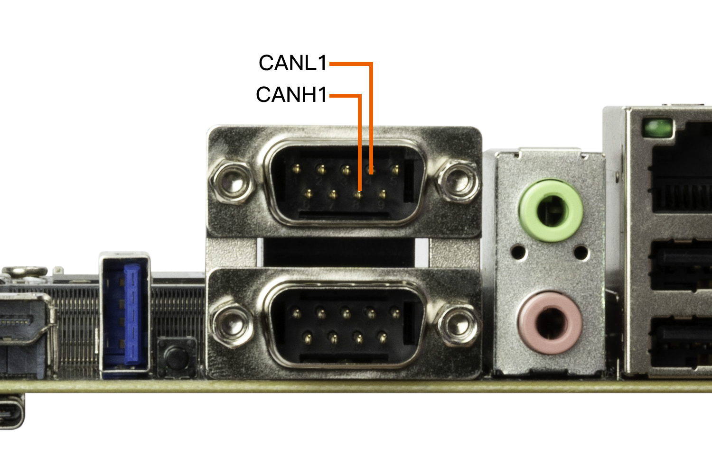

## CAN 使用
### CAN 简介
CAN(Controller Area Network)总线，即控制器局域网总线，是一种有效支持分布式控制或实时控制的串行通信网络。CAN总线是一种在汽车上广泛采用的总线协议，被设计作为汽车环境中的微控制器通讯。
如果想了解更多的内容可以参考[CAN应用报告](https://www.ti.com/lit/an/sloa101b/sloa101b.pdf)
### 硬件连接
CAN模块之间接线：CAN_H接CAN_H，CAN_L接CAN_L。



### DTS 节点配置
* 公共配置 `kernel-5.10/arch/arm64/boot/dts/rockchip/rk3588s.dtsi`

    ```
        can0: can@fea50000 {
                compatible = "rockchip,can-2.0";
                reg = <0x0 0xfea50000 0x0 0x1000>;
                interrupts = <GIC_SPI 341 IRQ_TYPE_LEVEL_HIGH>;
                clocks = <&cru CLK_CAN0>, <&cru PCLK_CAN0>;
                clock-names = "baudclk", "apb_pclk";
                resets = <&cru SRST_CAN0>, <&cru SRST_P_CAN0>;
                reset-names = "can", "can-apb";
                pinctrl-names = "default";
                pinctrl-0 = <&can0m0_pins>;
                tx-fifo-depth = <1>;
                rx-fifo-depth = <6>;
                status = "disabled";
        };

        can1: can@fea60000 {
                compatible = "rockchip,can-2.0";
                reg = <0x0 0xfea60000 0x0 0x1000>;
                interrupts = <GIC_SPI 342 IRQ_TYPE_LEVEL_HIGH>;
                clocks = <&cru CLK_CAN1>, <&cru PCLK_CAN1>;
                clock-names = "baudclk", "apb_pclk";
                resets = <&cru SRST_CAN1>, <&cru SRST_P_CAN1>;
                reset-names = "can", "can-apb";
                pinctrl-names = "default";
                pinctrl-0 = <&can1m0_pins>;
                tx-fifo-depth = <1>;
                rx-fifo-depth = <6>;
                status = "disabled";
        };

        can2: can@fea70000 {
                compatible = "rockchip,can-2.0";
                reg = <0x0 0xfea70000 0x0 0x1000>;
                interrupts = <GIC_SPI 343 IRQ_TYPE_LEVEL_HIGH>;
                clocks = <&cru CLK_CAN2>, <&cru PCLK_CAN2>;
                clock-names = "baudclk", "apb_pclk";
                resets = <&cru SRST_CAN2>, <&cru SRST_P_CAN2>;
                reset-names = "can", "can-apb";
                pinctrl-names = "default";
                pinctrl-0 = <&can2m0_pins>;
                tx-fifo-depth = <1>;
                rx-fifo-depth = <6>;
                status = "disabled";
        };
    ```
* 板级配置 `arch/arm64/boot/dts/rockchip/aio-3588sjd4.dtsi`
```
&can2 {
    status = "okay";
    pinctrl-names = "default";
    pinctrl-0 = <&can2m1_pins>;
};
```


由于系统根据上述dts节点创建的CAN设备只有一个，而第一个创建的设备为CAN0

### 通信测试
#### CAN 通信测试    
使用 candump 和 cansend 工具进行收发报文测试即可，将工具push到/system/bin/目录下执行。工具包含在SDK中,也可以在 [官方](http://www.t-firefly.com/share/index/index/id/3cacb04c663f9fe97bf494ca55763dcd.html) 或者 [github](https://github.com/linux-can/can-utils) 下载。    

```
#在收发端关闭can0设备
ip link set can0 down
#在收发端设置比特率为250Kbps                 
ip link set can0 type can bitrate 250000
#在收发端打开can0设备  	
ip link set can0 up
#在接收端执行candump,阻塞等待报文                        	
candump can0
#在发送端执行cansend，发送报文        	
cansend can0 123#1122334455667788  	
```

### 更多指令
```
1、 ip link set canX down 		//关闭can设备；
2、 ip link set canX up   		//开启can设备；
3、 ip -details link show canX 		//显示can设备详细信息；
4、 candump canX  			//接收can总线发来数据；
5、 ifconfig canX down 			//关闭can设备，以便配置;
6、 ip link set canX up type can bitrate 250000 //设置can波特率
7、 conconfig canX bitrate + 波特率；
8、 canconfig canX start 		//启动can设备；
9、 canconfig canX ctrlmode loopback on //回环测试；
10、canconfig canX restart 		// 重启can设备；
11、canconfig canX stop 		//停止can设备；
12、canecho canX 			//查看can设备总线状态；
13、cansend canX --identifier=ID+数据 	//发送数据；
14、candump canX --filter=ID：mask	//使用滤波器接收ID匹配的数据
```

### FAQS
总结调试过程中遇到的几个问题及解决方法：

#### 报文发送后很久才接收到，或者接收不到。

检查总线 CAN_H 和 CAN_L， 杜邦线是否松动或者接反。
#### CAN时钟频率配置
##### CAN
如果CAN的比特率1M建议修改CAN时钟到300M, 信号更稳定。低于1M比特率的, 时钟设置200M就可以。

