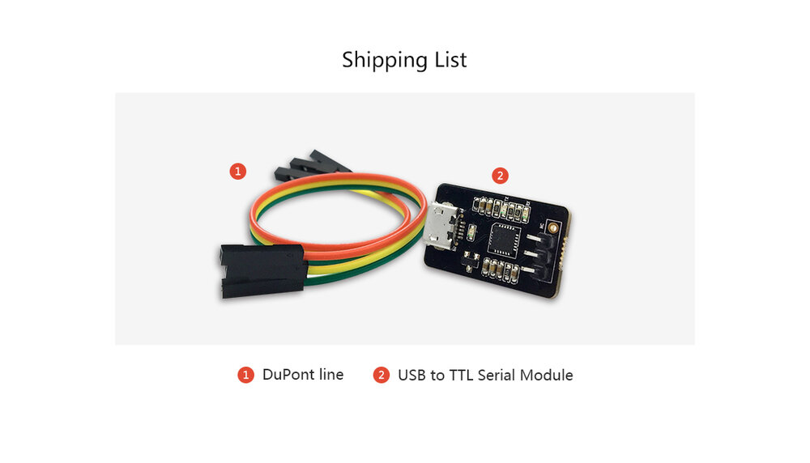
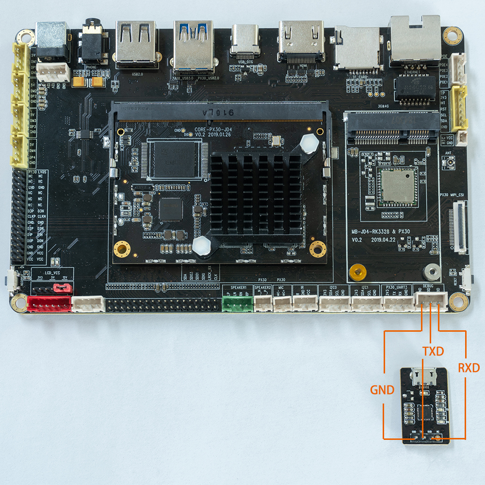
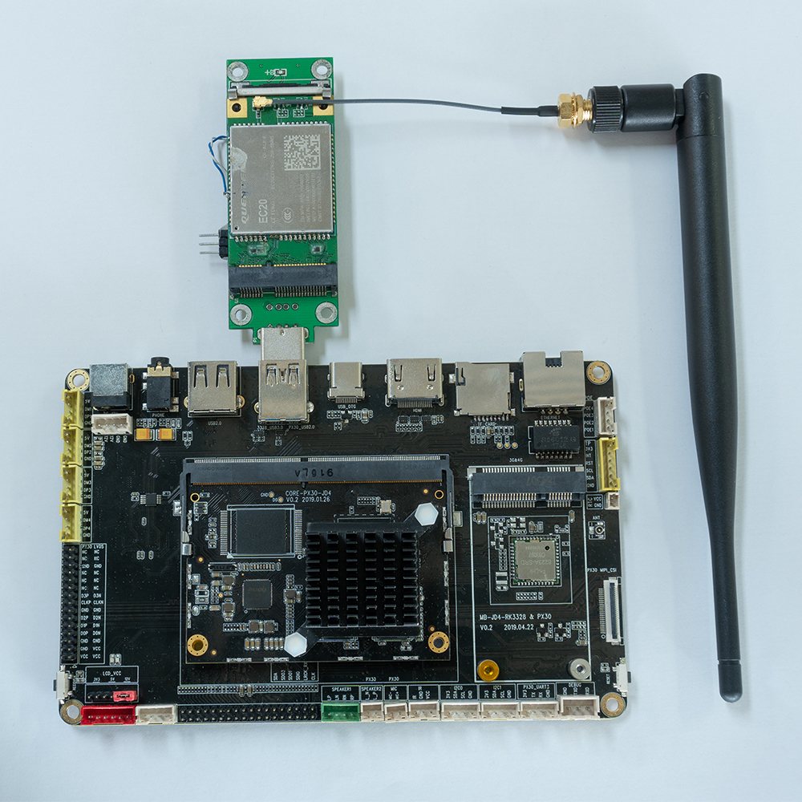
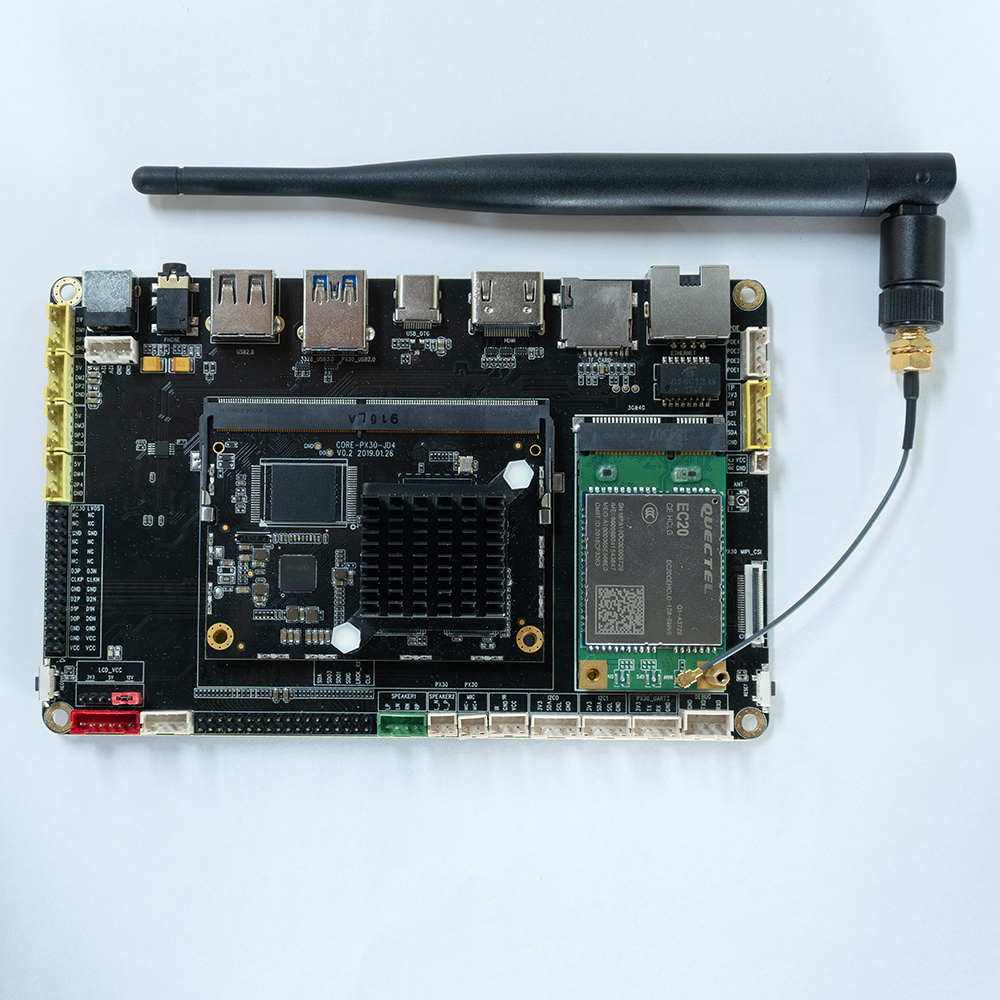
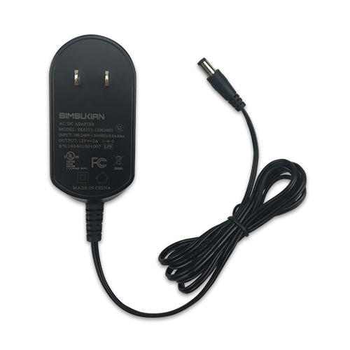
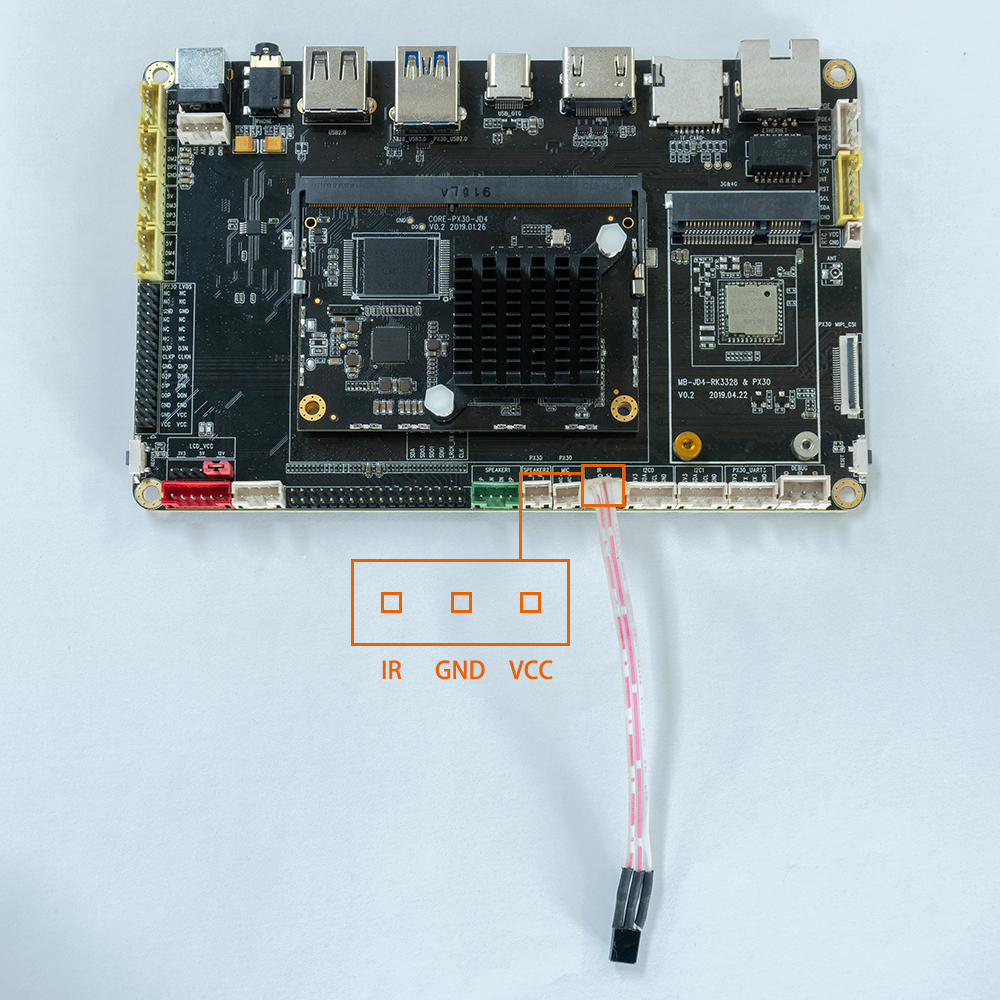
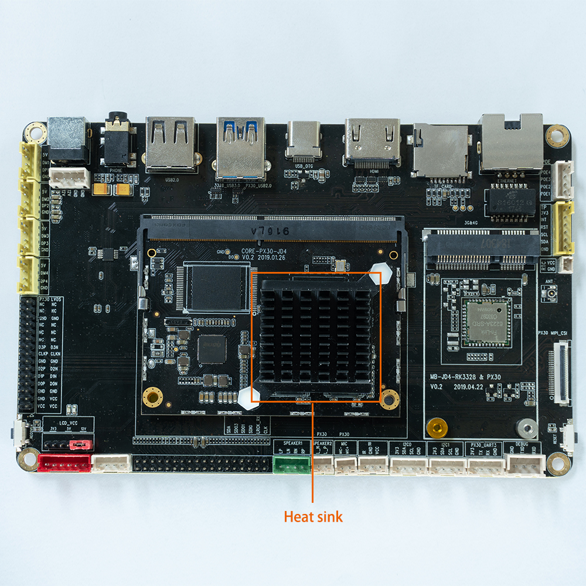
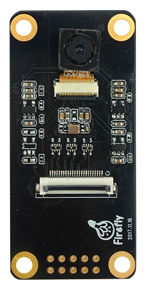
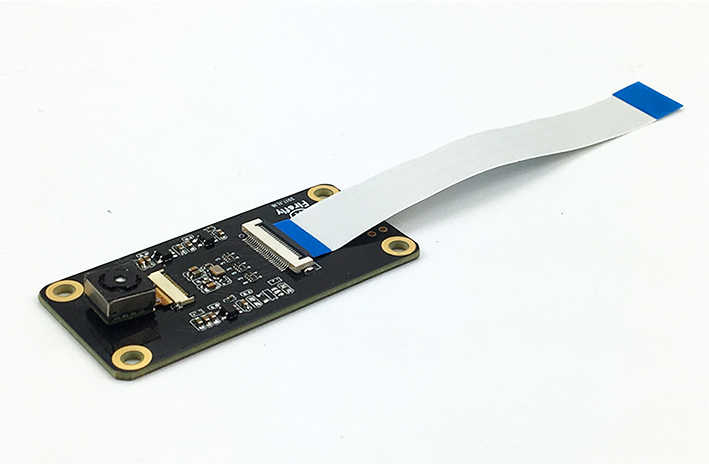
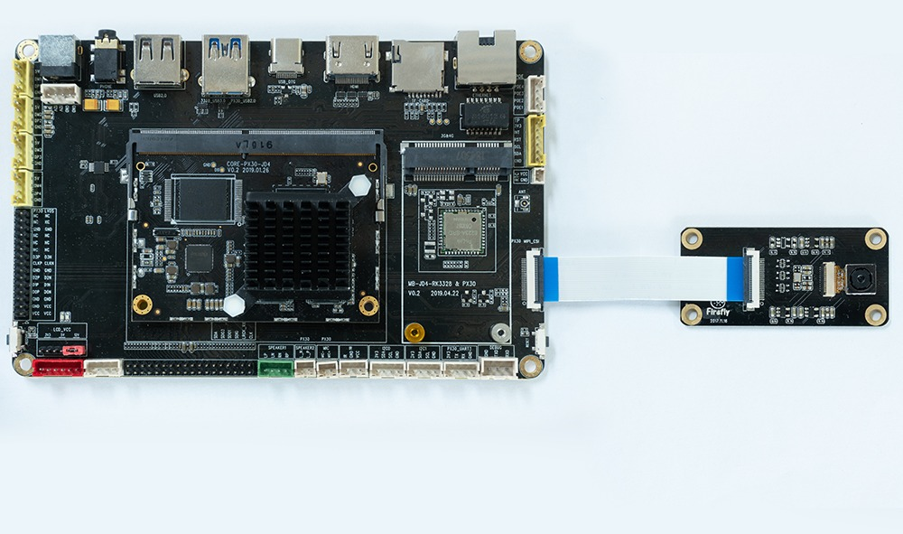

# 配件

## 转换模块
### [USB转TTL串口模块](https://store.t-firefly.com/goods.php?id=24)
#### 产品参数
* 品牌：Firefly
* 尺寸：29mm*19mm

#### 技术资料 
驱动下载：[http://www.prolific.com.tw/US/ShowProduct.aspx?pcid=41](http://www.prolific.com.tw/US/ShowProduct.aspx?pcid=41)
#### 实物图

#### 连接方法



## 无线模块
### [EC20 4G模组套件](https://store.t-firefly.com/goods.php?id=49)
#### 产品参数
* 型号
  * EC20-C R2.0 Mini PCIe-C
* 电源电压
  * 3.3V~ 3.6V, 典型值： 3.3V
* 工作频段
  * TDD-LTE: B38/B39/B40/B41
  * FDD-LTE: B1/B3/B8
  * WCDMA: B1/B8
  * TD-SCDMA: B34/B39
  * GSM: 900/1800
* 数据传输
  * TDD-LTE： Max 130Mbps (DL) Max 35Mbps (UL)
  * FDD-LTE： Max 150Mbps (DL) Max 50Mbps (UL)
  * DC-HSPA+： Max 42Mbps (DL) Max 5.76Mbps (UL)
  * UMTS： Max 384Kbps (DL) Max 384Kbps (UL)
  * TD-SCDMA： Max 4.2Mbps (DL) Max 2.2Mbps (UL)
  * CDMA： Max 3.1Mbps (DL) Max 1.8Mbps (UL)
  * EDGE： Max 236.8Kbps (DL) Max 236.8Kbps (UL)
  * GPRS： Max 85.6Kbps (DL) Max 85.6Kbps (UL)
* 接口连接器
  * USB：USB 2.0 高速接口, 480Mbps
  * 数字语音：1个数字语音接口 (可选)
  * USIM：1.8V/3V
  * 网络指示：×2, NET_STATUS 和 NET_MODE
  * UART：×1 UART
  * 复位：低电平
  * PWRKEY：低电平
  * 天线接口：×3 (主天线, 分集天线和GNSS天线接口)
  * ADC：×2
* 结构尺寸
  * 51.0mm × 30.0mm × 4.9mm
* 重量
  * 约 10.5g
* 认证
  * CCC/ NAL*/ TA

#### 实物图

#### 连接方法
* USB接口连接


* Mini-PCIe接口连接


#### 参考固件
公版固件默认支持EC20 4G模组

## [电源适配器](https://store.t-firefly.com/goods.php?id=4)
#### 产品参数
* 产品：USB电源适配器
* 规格：美规/欧规
* 输入标准：AC110-240V 50/60Hz
* 输出标准：12V-2A

* 注意：AIO-PX30-JD4一体机正常工作需要电源12V/2A，电流低于2A可能会因电流过小而异常重启，为了保证开发板的正常工作，请使用电压为12V，电流为2A~3A的电源，推荐使用Firefly官网电源配件。
#### 实物图



## [红外遥控器](https://store.t-firefly.com/goods.php?id=17)
#### 产品参数
* 产品：12键红外遥控器
* 版本：Firefly定制版
* 电源：两节7号电池
* 适配：AIO-PX30-JD4
* 描述：支持AIO-PX30-JD4开发板的遥控关机功能

#### 实物图

#### 键值码


*  AIO-PX30-JD4的IR接线位置如下图红框所示



## 散热套件

### [铝制散热片](https://store.t-firefly.com/goods.php?id=54)
#### 产品参数
* 适配：AIO-PX30-JD4
* 尺寸：43mm (L)* 39.5mm(W)*11mm(H)

#### 实物图



## 摄像头模组

### [OV13850摄像头模组](https://store.t-firefly.com/goods.php?id=6)
#### 产品参数

* 品牌：Omnivision
* 型号：CMK-OV13850
* 接口：MIPI
* 像素：1320W

#### 参考固件
公版固件默认支持CMK-OV13850摄像头模组
#### 技术资料
[OV13850摄像头DataSheet](http://download.t-firefly.com/product/RK3288/Docs/Peripherals/OV13850%20datasheet/Sensor_OV13850-G04A_OmniVision_SpecificationV1.pdf)
#### 实物图


#### 连接方法

#### 实拍图片


## [10.1寸LVDS屏模组](https://store.t-firefly.com/goods.php?id=80)
### 产品参数
* 型号：HSX101H40C-L28A
* 尺寸：10.1寸
* 分辨率：800x1280
* 显示接口：LVDS
* 可视角度：170°
* 触摸屏：多点电容触摸

###  参考固件

注意：
支持10.1寸屏的官方固件名带有“LVDS”字样，下面是固件的链接：
[固件链接](https://community.t-firefly.com/doc/download/45)


### 编译命令

用官网SDK编译支持的10.1寸屏的固件时使用以下命令：

```
./FFTools/make.sh -j8 -d px30-firefly-aiojd4-lvds -l px30_evb-userdebug
./FFTools/mkupdate/mkupdate.sh -l px30_evb-userdebug
```

### 参考资料

[[屏幕模组Datasheet&转接板原理图]](https://community.t-firefly.com/doc/download/52)

### 实物图

