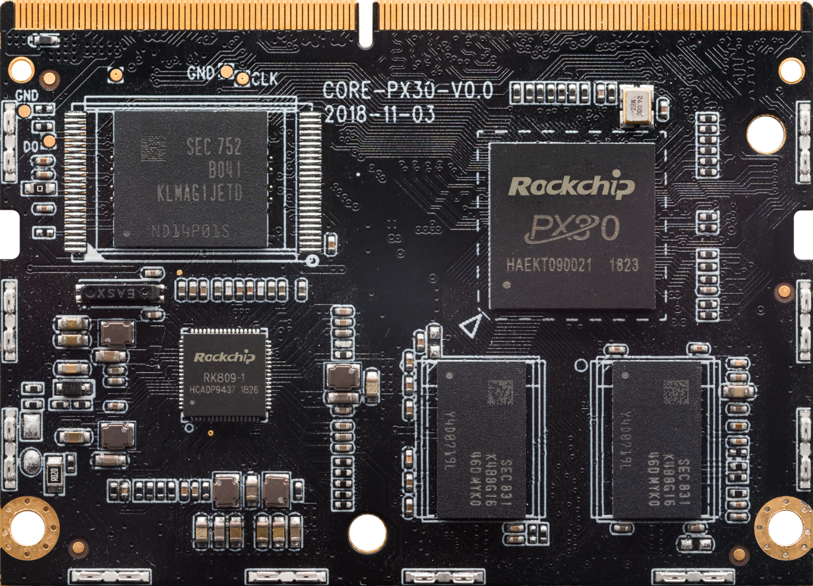
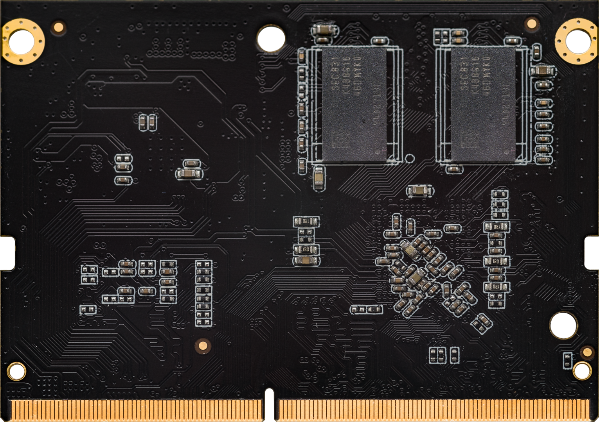
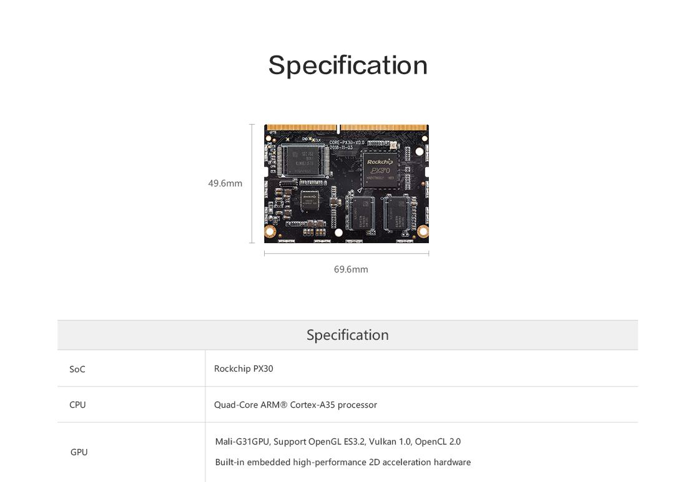
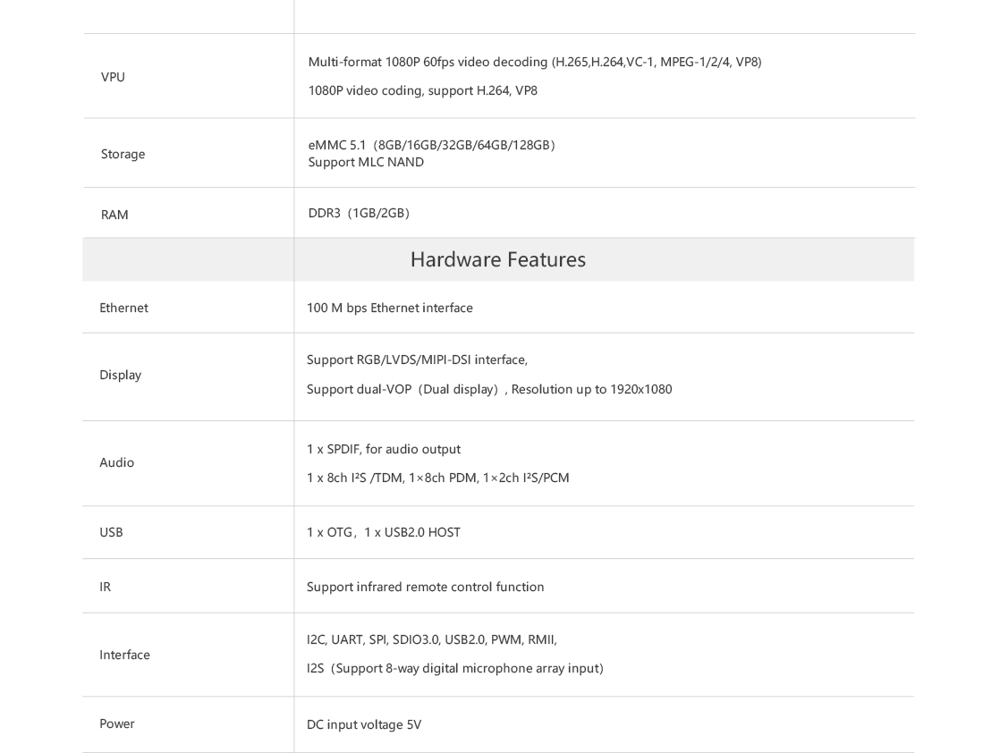
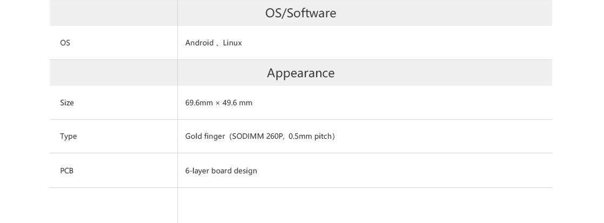

# 产品简介

## 产品概述 

### 四核 64 位工业级核心板
采用PX30工业级64位低功耗处理器，拥有强大的硬解码能力，以及丰富的接口，仅需扩展功能底板即可快速实现项目研产，可适用于AIOT物联网设备、车载中控、游艺/游戏设备、商显一体设备等应用领域

## 产品参数

## 产品资源

* [[Git 链接地址]](http://www.t-firefly.com/doc/download/67.html) Android SDK 源码

* [[技术交流论坛]](http://dev.t-firefly.com/forum.php)超过10万企业客户和用户沟通交流平台

## 产品技术支持
Core-PX30-JD4 核心板可以在多种场景实现客户不同方面的需要，在广告机上已经广泛的使用，品质和性能在行业内已经有非常好的口碑，专业的技术团队为广大客户解决硬件设计和软件功能上
的各种各样问题。专业技术支持和更详细资料请联系商务。

### 联系方式
* 邮箱：sales@t-firefly.com
* 手机：(+86) 186 8811 7175
* 座机：0760-89881218
* 全国服务热线：4001-511-533
* 地址：广东省中山市东区中山四路 57 号宏宇大厦 2101 室