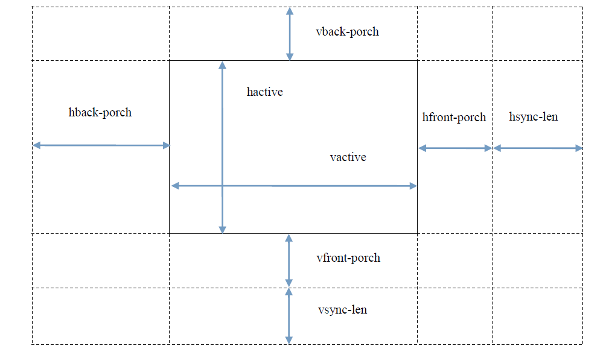
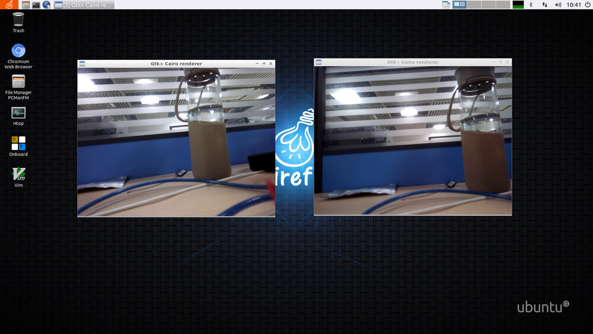
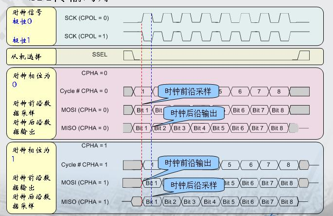
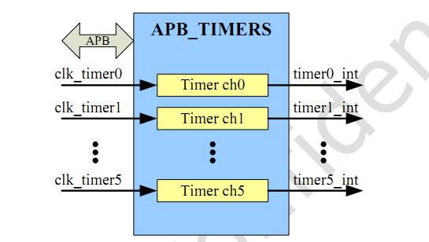
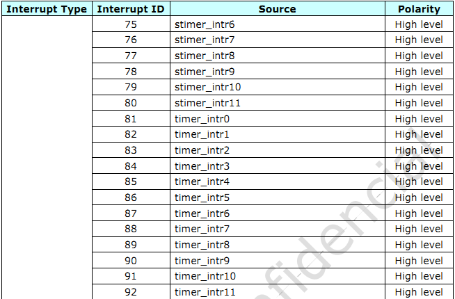
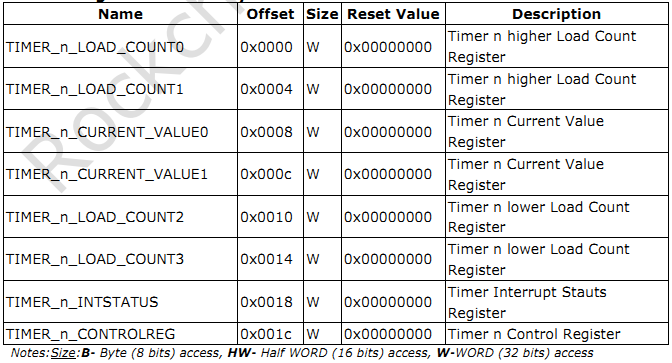

# 驱动开发

## ADC 使用

### 简介

AIO-PX30JD4 开发板上的 AD 接口有两种，分别为：温度传感器 (Temperature Sensor)、逐次逼近ADC (Successive Approximation Register)。其中：

* TS-ADC(Temperature Sensor)：支持两通道，时钟频率必须低于800KHZ

* SAR-ADC(Successive Approximation Register)：支持三通道单端10位的SAR-ADC，时钟频率必须小于13MHZ。

Linux内核采用工业 I/O 子系统(iio子系统)来控制 ADC，该子系统主要为 AD 转换或者 DA 转换而设计。本文以配置SAR-ADC为例，主要介绍 SAR-ADC的基本配置和使用的方法，其相关的数据结构，源码路径以及配置步骤如下：


### 数据结构

#### iio_channel结构体
```
struct iio_channel {
    struct iio_dev *indio_dev;//工业 I/O设备
    const struct iio_chan_spec *channel;//I/O通道
    void *data;
};
```
#### iio_dev结构体

该结构体主要是用于描述IO口所属的设备，其具体定义如下：

```
struct iio_dev {
    int             id;
    int             modes;
    int             currentmode;
    struct device           dev;
    struct iio_event_interface  *event_interface;
    struct iio_buffer       *buffer;
    struct list_head        buffer_list;
    int             scan_bytes;
    struct mutex            mlock;
    const unsigned long     *available_scan_masks;
    unsigned            masklength;
    const unsigned long     *active_scan_mask;
    bool                scan_timestamp;
    unsigned            scan_index_timestamp;
    struct iio_trigger      *trig;
    struct iio_poll_func        *pollfunc;
    struct iio_chan_spec const  *channels;
    int             num_channels;
    struct list_head        channel_attr_list;
    struct attribute_group      chan_attr_group;
    const char          *name;
    const struct iio_info       *info;
    struct mutex            info_exist_lock;
    const struct iio_buffer_setup_ops   *setup_ops;
    struct cdev         chrdev;
    #define IIO_MAX_GROUPS 6
    const struct attribute_group    *groups[IIO_MAX_GROUPS + 1];
    int             groupcounter;
    unsigned long           flags;
    #if defined(CONFIG_DEBUG_FS)
    struct dentry           *debugfs_dentry;
    unsigned            cached_reg_addr;
    #endif
};
```
#### iio_chan_spec结构体

该结构体主要用于描述单个通道的属性，具体定义如下：

```
struct iio_chan_spec {
    enum iio_chan_type  type; //描述通道类型
    int         channel; //通道号
    int         channel2; //通道号
    unsigned long       address; //通道地址
    int         scan_index;
    struct {
        char    sign;
        u8  realbits;
        u8  storagebits;
        u8  shift;
        enum iio_endian endianness;
    } scan_type;
    long            info_mask;
    long            info_mask_separate;
    long            info_mask_shared_by_type;
    long            event_mask;
    const struct iio_chan_spec_ext_info *ext_info;
    const char      *extend_name;
    const char      *datasheet_name;
    unsigned        modified:1;
    unsigned        indexed:1;
    unsigned        output:1;
    unsigned        differential:1;
};
```


### 源码路径

```
* /kernel/drivers/iio/adc/rockchip_saradc.c   此驱动通过解析内核设备树中的saradc资源，申请使用iio子系统来控制saradc。
* kernel/drivers/input/keyboard/adc-keys.c 此驱动通过判断ADC通道的值范围，来判断哪个按键按下了。
```

### 配置步骤

#### 配置DTS节点

第一步：在AIO-PX30JD4的 DTS 文件：kernel/arch/arm64/boot/dts/rockchip/px30.dtsi中，添加saradc资源，应如下：

```
saradc: saradc@ff288000 {                                                                                                                                                                               
        compatible = "rockchip,px30-saradc", "rockchip,rk3399-saradc";
        reg = <0x0 0xff288000 0x0 0x100>;
        interrupts = <GIC_SPI 84 IRQ_TYPE_LEVEL_HIGH>;
        #io-channel-cells = <1>;
        clocks = <&cru SCLK_SARADC>, <&cru PCLK_SARADC>;
        clock-names = "saradc", "apb_pclk";
        resets = <&cru SRST_SARADC_P>;
        reset-names = "saradc-apb";
        status = "disabled";
    };

```

第二步：根据用户的通道需要选择对应的saradc通道，本次例程使用AIO-PX30-JD4上的ADC按键检测，选择通道2，配置如下：

```
    adc-keys {
        compatible = "adc-keys";
        io-channels = <&saradc 2>;
        io-channel-names = "buttons";
        poll-interval = <100>;
        keyup-threshold-microvolt = <1800000>;


        vol-up-key {
            linux,code = <KEY_VOLUMEUP>;
            label = "volume up";
            press-threshold-microvolt = <17000>;
        };
    };

```

* io-channels 属性 为 选择的通道号，这里选择通道2
* io-channel-names 属性 表示 为申请的通道起一个别名。
* keyup-threshold-microvolt 属性 表示按键抬起，saradc通道2的电压（单位微伏）。
* press-threshold-microvolt 属性 表示按键按下，saradc通道2的电压。
* vol-up-key 在硬件连接上，为AIO-PX30-JD4 上的recovery 按键。
* linux,code 属性 为 按键上报的键值，键值对应的动作 为 “音量+” 。

#### 在saradc驱动文件中匹配 saradc 的dts 节点

第一步： 在内核设备树添加saradc资源之后，可以在源码kernel/drivers/iio/adc/rockchip_saradc.c中添加对应的saradc数据结构体

```

static const struct rockchip_saradc_data px30_saradc_data = {
    .num_bits = 10,
    .channels = rockchip_px30_saradc_iio_channels,
    .num_channels = ARRAY_SIZE(rockchip_px30_saradc_iio_channels),
    .clk_rate = 1000000,
};

```

```
static const struct of_device_id rockchip_saradc_match[] = {
    {
        .compatible = "rockchip,saradc",
        .data = &saradc_data,
    },{
        .compatible = "rockchip,px30-saradc",
        .data = &px30_saradc_data,
    },   
    {},
};  

```

第二步： 在rockchip_saradc_match[] 中，添加px30的compatible属性，使得saradc驱动可以匹配到saradc设备。因如下：

```
static const struct of_device_id rockchip_saradc_match[] = {
    
    ......
        
    {
        .compatible = "rockchip,px30-saradc",   //用于匹配px30的saradc设备
        .data = &px30_saradc_data,              //px30的saradc相关属性。
    },
    {},

    ......
};

```

第三步: 填充saradc的platform_driver结构体：

```

static struct platform_driver rockchip_saradc_driver = {
    .probe      = rockchip_saradc_probe,
    .remove     = rockchip_saradc_remove,
    .driver     = {
        .name   = "rockchip-saradc",
        .of_match_table = rockchip_saradc_match,
        .pm = &rockchip_saradc_pm_ops,
    },
};

```

第四步：通过module_platform_driver(rockchip_saradc_driver)宏平进行驱动的注册。


在设备上电的时候，内核会解析内核设备树，当检测到设备树上saradc的compatible属性与saradc驱动的of_device_id中的compatible成员一致的时候，便会调用rockchip_saradc.c中的rockchip_saradc_probe()函数来进行iio系统的adc设备的资源申请以及初始化（此处不再赘述，用户可自行查看源码）。

在进入系统后，会出现一个 /sys/bus/iio/devices/iio:device0的目录，表示创建成功。


#### 在adc-keys.c驱动文件中匹配 adc-keys的dts 节点

第一步: 填充ADC按键驱动的adc_keys_of_match[]中的compatible成员用于匹配设备

```
static const struct of_device_id adc_keys_of_match[] = {
    { .compatible = "adc-keys", },
    { }
};

```

第二步： 填充驱动结构体

```
static struct platform_driver __refdata adc_keys_driver = {                                                                                                                   
    .driver = {
        .name = "adc_keys",
        .of_match_table = of_match_ptr(adc_keys_of_match),
    },
    .probe = adc_keys_probe,
};
```

第三步： 使用module_platform_driver(adc_keys_driver);往内核注册该驱动。


第四步： 设备树 compatible匹配正确，驱动注册成功之后，便会调用ADC按键驱动的adc_keys_probe()函数，进行输入子系统设备的注册（因为是按键驱动，所以使用输入子系统，此部分不在此讲述）与saradc的io通道的申请。

```
static int adc_keys_probe(struct platform_device *pdev)
{

   // 1.Initialize the device, get IO resources, apply for IO channel.
	
    struct device *dev = &pdev->dev;
    struct adc_keys_state *st;
    struct input_polled_dev *poll_dev;
    struct input_dev *input;
    enum iio_chan_type type;
    int i, value;
    int error;

    st = devm_kzalloc(dev, sizeof(*st), GFP_KERNEL);
    if (!st)
        return -ENOMEM;

    st->channel = devm_iio_channel_get(dev, "buttons");
    if (IS_ERR(st->channel))
        return PTR_ERR(st->channel);

    if (!st->channel->indio_dev)
        return -ENXIO;

    error = iio_get_channel_type(st->channel, &type);
    if (error < 0)
        return error;

    if (type != IIO_VOLTAGE) {
        dev_err(dev, "Incompatible channel type %d\n", type);
        return -EINVAL;
    }
   // 2.Get information from the device tree and save the voltage of each key

    if (device_property_read_u32(dev, "keyup-threshold-microvolt",
                     &st->keyup_voltage)) {
        dev_err(dev, "Invalid or missing keyup voltage\n");
        return -EINVAL;
    }

   //3.Input subsystem device registration

	......

   //4.Conduct polling detection of input subsystem devices


	......
}

```

在进入系统后,通过 getevent 命令 :

```
add device 1: /dev/input/event0
  name:     "rk8xx_pwrkey"
add device 2: /dev/input/event3
  name:     "adc-keys"
add device 3: /dev/input/event1
  name:     "gslX680"
add device 4: /dev/input/event2
  name:     "rk_headset"

```

其中我们可以看到：
```
add device 2: /dev/input/event3
  name:     "adc-keys"
```

这样表示我们的设备已经创建成功。


#### 按键检测

adc-keys.c驱动是通过输入子系统的轮询检测函数adc_keys_poll(),来不断地读取saradc通道的值，当不同按键按下的时候，是有不同的电压值的：
```
static void adc_keys_poll(struct input_polled_dev *dev)
{
    struct adc_keys_state *st = dev->private;
    int i, value, ret;
    u32 diff, closest = 0xffffffff;
    int keycode = 0;

    ret = iio_read_channel_processed(st->channel, &value);
    if (unlikely(ret < 0)) {
        /* Forcibly release key if any was pressed */
        value = st->keyup_voltage;
    } else {
        for (i = 0; i < st->num_keys; i++) {
            diff = abs(st->map[i].voltage - value);
            if (diff < closest) {
                closest = diff;
                keycode = st->map[i].keycode;
            }
        }
    }

    if (abs(st->keyup_voltage - value) < closest)
        keycode = 0;

    if (st->last_key && st->last_key != keycode)
        input_report_key(dev->input, st->last_key, 0);

    if (keycode)
        input_report_key(dev->input, keycode, 1);

    input_sync(dev->input);
    st->last_key = keycode;
}
```

所以当recovery按键按下的时候，通过iio_read_channel_processed()函数获取到的电压值如果与设备树配置相符合的话，就会触发按键上报事件，而用户层会收到事件，从屏幕可以看到有 ”音量+“ 的动作。


#### 获取所有ADC值

有个便捷的方法可以在命令行中直接查询到每个SARADC的值：

```
cat /sys/bus/iio/devices/iio\:device0/in_voltage*_raw

```

其中in_voltage0_raw为通道0，in_voltage01_raw为通道1，以此类推。

以上面的例子为例，命令行输入 cat /sys/bus/iio/devices/iio\:device0/in_voltage2_raw  来获取ADC电压转换后的数字量

```
会打印 ： 0；    // 表示recovery 按键按下，对应 0.17V模拟量

当无动作的时候

会打印 ：1020;   //表示按键抬起，对应 1.8V 模拟量
```


### iio操作说明
#### 获取 AD 通道

```
struct iio_channel *chan; //定义 IIO 通道结构体
chan = iio_channel_get(&pdev->dev,xxx); //获取 IIO 通道结构体
```
注：iio_channel_get 通过 probe 函数传进来的参数 pdev 获取 IIO 通道结构体，probe 函数如下：

#### 读取 AD 采集到的原始数据

```
int val,ret;
ret = iio_read_channel_raw(chan, &val);
```
调用 iio_read_channel_raw 函数读取 AD 采集的原始数据并存入 val 中。
#### 计算采集到的电压

使用标准电压将 AD 转换的值转换为用户所需要的电压值。其计算公式如下：

```
Vref / (2^n-1) = Vresult / raw
```

注：

* Vref 为标准电压

* n 为 AD 转换的位数

* Vresult 为用户所需要的采集电压

* raw 为 AD 采集的原始数据

例如，标准电压为 1.8V，AD 采集位数为 10 位，AD 采集到的原始数据为 568，则：

```
Vresult = (1800mv * 568) / 1023;
```

### iio接口说明

```
struct iio_channel *iio_channel_get(struct device *dev, const char *consumer_channel);
```

- 功能：获取 iio 通道描述
- 参数：
     + dev: 使用该通道的设备描述指针
     + consumer_channel: 该设备所使用的 IIO 通道描述指针

```
void iio_channel_release(struct iio_channel *chan);
```

- 功能：释放 iio_channel_get 函数获取到的通道
- 参数：
     + chan：要被释放的通道描述指针

```
int iio_read_channel_raw(struct iio_channel *chan, int *val);
```

- 功能：读取 chan 通道 AD 采集的原始数据。
- 参数：
     + chan：要读取的采集通道指针
     + val：存放读取结果的指针


### FAQs
#### 为何按上面的步骤申请SARADC，会出现申请报错的情况？
驱动需要获取ADC通道来使用时，需要对驱动的加载时间进行控制，必须要在saradc初始化之后。saradc是使用module_platform_driver()进行平台设备驱动注册，最终调用的是module_init()。所以用户的驱动加载函数只需使用比module_init()优先级低的，例如：late_initcall()，就能保证驱动的加载的时间比saradc初始化时间晚，可避免出错。


## GPIO 使用

### 简介

GPIO, 全称 General-Purpose Input/Output（通用输入输出），是一种软件运行期间能够动态配置和控制的通用引脚。 PX30有4组GPIO bank：GPIO0~GPIO3，每组又以 A0~A7, B0~B7, C0~C7, D0~D7 作为编号区分（GPIO0在PD_PMU子系统中，GPIO1/GPIO2/GPIO3在PD_BUS子系统中)。 所有的GPIO在上电后的初始状态都是输入模式，可以通过软件设为上拉或下拉，也可以设置为中断脚，驱动强度都是可编程的。每个 GPIO 口除了通用输入输出功能外，还可能有其它复用功能，例如:

* GPIO0_C2 可复用为 I2C1_SCL端口
* GPIO0_C3 可复用为 I2C1_SDA端口

每个 GPIO 口的驱动电流、上下拉和重置后的初始状态都不尽相同，详细情况请参考《px30 规格书》中的 "Chapter 21 GPIO" 一章。 px30 的 GPIO 驱动是在以下 pinctrl 文件中实现的：

```
kernel/drivers/pinctrl/pinctrl-rockchip.c 
```

其核心是填充 GPIO bank 的方法和参数，并调用 gpiochip_add 注册到内核中。


### 例子

#### DTS配置

本文以px30的gslx680外设(基于i2c通信的触摸屏)为例，讲述 gpio的输入输出，中断，复用功能的使用，该驱动源码在SDK的路径为：

```
kernel/drivers/input/touchscreen/gslx680_firefly.c
```

以下就以该驱动为例介绍GPIO的操作。

本例子所需添加的DTS资源如下所示：

```
kernel/arch/arm64/boot/dts/rockchip/px30-firefly-demo.dtsi

  gslx680: gslx680@41 {
        compatible = "gslX680";
        reg = <0x41>;
        screen_max_x = <800>;
        screen_max_y = <1280>;
        touch-gpio = <&gpio0 5 IRQ_TYPE_LEVEL_LOW>;    
        reset-gpio = <&gpio0 12 GPIO_ACTIVE_HIGH>;      
        flip-x = <1>;
        flip-y = <0>;
        swap-xy = <0>;
        gsl,fw = <1>;
    };

```

```
kernel/arch/arm64/boot/dts/rockchip/px30.dtsi 

i2c1: i2c@ff190000 {                                                                                                              
        compatible = "rockchip,rk3399-i2c";
        reg = <0x0 0xff190000 0x0 0x1000>;
        clocks = <&cru SCLK_I2C1>, <&cru PCLK_I2C1>;
        clock-names = "i2c", "pclk";
        interrupts = <GIC_SPI 8 IRQ_TYPE_LEVEL_HIGH>;
        pinctrl-names = "default", "gpio"(此gpio字段源码未添加);
        pinctrl-0 = <&i2c1_xfer>;
        pinctrl-1 = <&i2c1_gpio>;   //此处源码未添加 
        #address-cells = <1>;
        #size-cells = <0>;
        status = "disabled";
    };

```


#### 输入输出引脚配置

这里使用的是gslx680外设的reset（复位）引脚来讲述GPIO的输入输出操作。
在DTS配置如下资源：

```
 reset-gpio = <&gpio0 12 GPIO_ACTIVE_HIGH>;
```

AIO-PX30JD4的dts对引脚的描述与Firefly-RK3288有所区别，GPIO0_B4被描述为：<&gpio0 12 GPIO_ACTIVE_HIGH>，这里的12来源于：8+4=12，其中8是因为GPIO0_B4是属于GPIO0的B组，如果是A组的话则为0，如果是C组则为16，如果是D组则为24，以此递推，而4是因为B4后面的4。GPIO_ACTIVE_HIGH表示高电平有效，如果想要低电平有效，可以改为：GPIO_ACTIVE_LOW，这个属性将被驱动所读取。


#### 中断引脚配置

这里使用的是gslx680外设的irq（中断) 引脚来讲述GPIO的中断功能
在DTS中配置如下资源：

```
 touch-gpio = <&gpio0 5 IRQ_TYPE_LEVEL_LOW>;

```

其中 gpio0 5 的意思是使用gpio0_A5 为中断引脚，IRQ_TYPE_LEVEL_LOW意思是该引脚低电平（下降沿)的时候触发中断,跳到中断函数执行，中断的触发类型还可以配置如下：

```

IRQ_TYPE_NONE         //默认值，无定义中断触发类型
IRQ_TYPE_EDGE_RISING  //上升沿触发                                                                                                                                  
IRQ_TYPE_EDGE_FALLING //下降沿触发
IRQ_TYPE_EDGE_BOTH    //上升沿和下降沿都触发
IRQ_TYPE_LEVEL_HIGH   //高电平触发
IRQ_TYPE_LEVEL_LOW    //低电平触发

```


#### 复用功能引脚配置

查看芯片的数据手册，可以知道：

```
Pad# 	                func0 	        func1
I2C1_SDA/GPIO0_C2 	gpio0c2 	i2c1_scl
I2C1_SCL/GPIO0_C3 	gpio0c3 	i2c1_sda
```

在上面i2c1的dts的配置中，主要有以下关键的描述


* pinctrl-names 定义了状态名称列表： default (i2c 功能) 和 gpio 两种状态。
* pinctrl-0 定义了状态 0 (即 default）时需要设置的 pinctrl: &i2c4_xfer
* pinctrl-1 定义了状态 1 (即 gpio)时需要设置的 pinctrl: &i2c4_gpio


由于在i2c1的dts上gpio的字段属性没有添加，所以默认该两个引脚设置为i2c复用功能，其中pinctrl的描述可以在kernel/arch/arm64/boot/dts/rockchip/px30.dtsi 找到 ：

```

  pinctrl: pinctrl {
        compatible = "rockchip,px30-pinctrl";
        rockchip,grf = <&grf>;
        rockchip,pmu = <&pmugrf>;
        #address-cells = <2>;
        #size-cells = <2>;
        ranges;
        ......
        ......

          i2c1 {
            i2c1_xfer: i2c1-xfer {
                rockchip,pins =
                    <0 RK_PC2 RK_FUNC_1 &pcfg_pull_none_smt>,
                    <0 RK_PC3 RK_FUNC_1 &pcfg_pull_none_smt>;
            };               
            /*此段源码未添加   
            i2c1-gpio:i2c1-gpio { 
                rockchip,pins = 
                        <0 RK_PC2 RK_FUNC_GPIO &pcfg_pull_none>, 
                        <0 RK_PC3 RK_FUNC_GPIO &pcfg_pull_none>;
            }; */
         };
        ......
   }

```

其中 0 RK_PC2 表示的是GPIO0_C2引脚，0 RK_PC3 表示的是 GPIO0_C3引脚


RK_FUNC_1,RK_FUNC_GPIO的定义在 kernel/include/dt-bindings/pinctrl/rockchip.h 中可以找到：

```
#define RK_FUNC_GPIO    0
#define RK_FUNC_1   1
#define RK_FUNC_2   2
#define RK_FUNC_3   3
#define RK_FUNC_4   4
#define RK_FUNC_5   5
#define RK_FUNC_6   6
#define RK_FUNC_7   7

```

在复用时，如果选择了 “default” （即 i2c 功能),系统会应用 i2c1_xfer 这个 pinctrl，最终将 GPIO0_C2 和 GPIO0_C3 两个针脚切换成对应的 i2c 功能；而如果选择了 “gpio” ，系统会应用 i2c1_gpio 这个 pinctrl，将 GPIO0_C2 和 GPIO0_C3 两个针脚还原为 GPIO 功能。

由于px30的i2c都是默认复用的，所以在源SDK的px30.dtsi中并没有加上gpio的选择，所以，在i2c总线驱动中：kernel/drivers/i2c/busses/i2c-rk3x.c，并没有加上切换复用功能的源码

如需了解i2c总线驱动是如何切换复用功能的，可以参考源码SDK中的rockchip的官方例子:kernel/drivers/i2c/busses/i2c-rockchip.c  中的rockchip_i2c_probe()函数。

```
static int rockchip_i2c_probe(struct platform_device *pdev){
    struct rockchip_i2c *i2c = NULL;
    struct resource *res;
    struct device_node *np = pdev->dev.of_node;
    int ret;
    // ...
    i2c->sda_gpio = of_get_gpio(np, 0);
    if (!gpio_is_valid(i2c->sda_gpio)) {
        dev_err(&pdev->dev, "sda gpio is invalid\n");
        return -EINVAL;
    }
    ret = devm_gpio_request(&pdev->dev, i2c->sda_gpio, dev_name(&i2c->adap.dev));
    if (ret) {
        dev_err(&pdev->dev, "failed to request sda gpio\n");
        return ret;
    }
    i2c->scl_gpio = of_get_gpio(np, 1);
    if (!gpio_is_valid(i2c->scl_gpio)) {
        dev_err(&pdev->dev, "scl gpio is invalid\n");
        return -EINVAL;
    }
    ret = devm_gpio_request(&pdev->dev, i2c->scl_gpio, dev_name(&i2c->adap.dev));
    if (ret) {
        dev_err(&pdev->dev, "failed to request scl gpio\n");
        return ret;
    }
    i2c->gpio_state = pinctrl_lookup_state(i2c->dev->pins->p, "gpio");
    if (IS_ERR(i2c->gpio_state)) {
        dev_err(&pdev->dev, "no gpio pinctrl state\n");
        return PTR_ERR(i2c->gpio_state);
    }
    pinctrl_select_state(i2c->dev->pins->p, i2c->gpio_state);
    gpio_direction_input(i2c->sda_gpio);
    gpio_direction_input(i2c->scl_gpio);
    pinctrl_select_state(i2c->dev->pins->p, i2c->dev->pins->default_state);
    // ...
}

```

首先是调用 of_get_gpio 取出设备树中 i2c1 结点的 gpios 属于所定义的两个 gpio:

```

gpios = <&gpio0 GPIO_C2 GPIO_ACTIVE_LOW>, <&gpio0 GPIO_C3 GPIO_ACTIVE_LOW>;

```

然后是调用 devm_gpio_request 来申请 gpio，接着是调用 pinctrl_lookup_state 来查找 “gpio” 状态，而默认状态 “default” 已经由框架保存到 i2c->dev-pins->default_state 中了。最后调用 pinctrl_select_state 来选择是 “default” 还是 “gpio” 功能。 


下面是常用的GPIO复用 API的定义：

```
#include <linux/pinctrl/consumer.h> 
struct device {
    //...
    #ifdef CONFIG_PINCTRL
    struct dev_pin_info	*pins;
    #endif
    //...
}; 
struct dev_pin_info {
    struct pinctrl *p;
    struct pinctrl_state *default_state;
    #ifdef CONFIG_PM
    struct pinctrl_state *sleep_state;
    struct pinctrl_state *idle_state;
    #endif
}; 
struct pinctrl_state * pinctrl_lookup_state(struct pinctrl *p, const char *name); 
int pinctrl_select_state(struct pinctrl *p, struct pinctrl_state *s);

```

#### gslx680  驱动解析之输入输出，中断

以下是对px30源SDK中gslx680外设驱动中gsl_ts_probe()函数,gslX680_init()函数，static irqreturn_t gsl_ts_irq()进行部分的解析,用户可以从中了解gpio的输入输出，中断功能的使用，而用于复用功能的i2c通信，则在下一章i2c进行讲解。

```
static int  gsl_ts_probe(struct i2c_client *client，const struct i2c_device_id *id)  

{ 
    ......
    struct gsl_ts *ts;
    struct device_node *np = client->dev.of_node;                                               //设备节点结构体
    enum of_gpio_flags wake_flags;                                                              
    unsigned long irq_flags;
    
    ......
    ts->irq_pin=of_get_named_gpio_flags(np, "touch-gpio", 0, (enum of_gpio_flags *)&irq_flags); //读取设备树
    ts->wake_pin=of_get_named_gpio_flags(np, "reset-gpio", 0, &wake_flags);                     //读取设备树
    
    /*申请gpio资源*/
    if (gpio_is_valid(ts->wake_pin)) {
        rc = devm_gpio_request_one(&client->dev, ts->wake_pin, (wake_flags & OF_GPIO_ACTIVE_LOW) ? GPIOF_OUT_INIT_LOW : GPIOF_OUT_INIT_HIGH, "gslX680 wake pin");
        if (rc != 0) {
            dev_err(&client->dev, "gslX680 wake pin error\n");
            return -EIO;
        }
        g_wake_pin = ts->wake_pin;
    } else {
        dev_info(&client->dev, "wake pin invalid\n");
    }
    /*申请gpio资源*/
    if (gpio_is_valid(ts->irq_pin)) {
        rc = devm_gpio_request_one(&client->dev, ts->irq_pin, (irq_flags & OF_GPIO_ACTIVE_LOW) ? GPIOF_OUT_INIT_LOW : GPIOF_OUT_INIT_HIGH, "gslX680 irq pin");
        if (rc != 0) {
            dev_err(&client->dev, "gslX680 irq pin error\n");
            return -EIO;
        }
        g_irq_pin = ts->irq_pin;
    } 

    ......  

     gslX680_init();          //对复位引脚与中断引脚进行初始化操作

    ......
    /*申请中断IRQ号，绑定中断函数*/
    ts->irq=gpio_to_irq(ts->irq_pin);       
    if (ts->irq)
    {
        printk("zjy: ts->irq %d \r\n", ts->irq);
        rc = devm_request_threaded_irq(&client->dev, ts->irq, NULL, gsl_ts_irq, irq_flags | IRQF_ONESHOT, client->name, ts);
        if (rc != 0) {
            printk("zjy :Cannot allocate ts INT!ERRNO:%d\n", rc);
            goto error_req_irq_fail;
        }
        disable_irq(ts->irq);
    }
    else
    {
        printk("gsl x680 irq req fail\n");
        goto error_req_irq_fail;
    }

    ......
}

```

* of_get_named_gpio_flags 从设备树中读取 "reset-gpio" 和 "touch-gpio" 的 GPIO 配置编号和标志，gpio_is_valid 判断该 GPIO 编号是否有效，devm_gpio_request_one则申请占用该 GPIO。如果初始化过程出错，会跳到dev_err()函数进行报错与gpio资源释放处理。 
* 调用gpio_to_irq把GPIO的PIN值转换为相应的IRQ值，调用devm_request_threaded_irq申请中断，如果失败会goto到标签error_req_irq_fail进行错误处理，gpio资源的释放，该函数中ts->irq是要申请的硬件中断号，gsl_ts_irq是中断函数，irq_flags | IRQF_ONESHOT是中断标志位， client->name是设备驱动程序名称，ts是该设备的device结构体，在注册共享中断时会用到。

在gsl_ts_probe()中，会在上电的时候，对复位引脚以及中断引脚进行初始化操作：

```
static int gslX680_init(void)
{
    gpio_direction_output(g_wake_pin, 0); //设置该引脚为输出模式，输出0
    msleep(20);             
    gpio_set_value(g_wake_pin,1);         //设置引脚的输出值为1；                                                                                                                                                                           
    msleep(20);
    gpio_set_value(g_irq_pin,1);          //设置中断引脚的初始值为 1
    msleep(20);
    return 0;
}


```

由上面的步骤可知晓，在设备上电的时候，可以用示波器测试出，该reset引脚会出现一个复位的操作。

而对于中断而言，在用户在进入系统之后，点击触摸屏，会把中断引脚拉低，由上面的devm_request_threaded_irq()函数可知，该中断在触发的时候，会跳到static irqreturn_t gsl_ts_irq()中断函数中去执行：

```

static irqreturn_t gsl_ts_irq(int irq, void *dev_id)
{   
    struct gsl_ts *ts = dev_id;
                 
    disable_irq_nosync(ts->irq);                                                                                                                                                                            

    if (!work_pending(&ts->work))
    {
        queue_work(ts->wq, &ts->work);
    }
    printk("Enter firefly gpio irq test program!\n"); //在进入中断函数后，会打印这一句话，但源码未添加，用户可以自行添加来验证。
    return IRQ_HANDLED;

}


```

上面这个中断函数主要是做了一些键值的上报，由于本文未涉及input输入子系统，所以不在此处讲述。

下面是常用的 GPIO 输入输出的API 定义：

```

#include <linux/gpio.h>
#include <linux/of_gpio.h>  

enum of_gpio_flags {
     OF_GPIO_ACTIVE_LOW = 0x1,
};  
int of_get_named_gpio_flags(struct device_node *np, const char *propname,   
int index, enum of_gpio_flags *flags);  
int gpio_is_valid(int gpio);  
int gpio_request(unsigned gpio, const char *label);  
void gpio_free(unsigned gpio);  
int gpio_direction_input(int gpio);  
int gpio_direction_output(int gpio, int v);


```


### 调试方法
#### IO指令

GPIO调试有一个很好用的工具，那就是IO指令，Android系统默认已经内置了IO指令，使用IO指令可以实时读取或写入每个IO口的状态，这里简单介绍IO指令的使用。 首先查看 io 指令的帮助：
```
#io --help
Unknown option: ?
Raw memory i/o utility - $Revision: 1.5 $

io -v -1|2|4 -r|w [-l <len>] [-f <file>] <addr> [<value>]

   -v         Verbose, asks for confirmation
   -1|2|4     Sets memory access size in bytes (default byte)
   -l <len>   Length in bytes of area to access (defaults to
              one access, or whole file length)
   -r|w       Read from or Write to memory (default read)
   -f <file>  File to write on memory read, or
              to read on memory write
   <addr>     The memory address to access
   <val>      The value to write (implies -w)

Examples:
   io 0x1000                  Reads one byte from 0x1000
   io 0x1000 0x12             Writes 0x12 to location 0x1000
   io -2 -l 8 0x1000          Reads 8 words from 0x1000
   io -r -f dmp -l 100 200    Reads 100 bytes from addr 200 to file
   io -w -f img 0x10000       Writes the whole of file to memory

Note access size (-1|2|4) does not apply to file based accesses.
```
从帮助上可以看出，如果要读或者写一个寄存器，可以用：
```
io -4 -r 0x1000 //读从0x1000起的4位寄存器的值
io -4 -w 0x1000 //写从0x1000起的4位寄存器的值
```
使用示例：

*    查看GPIO0当前各引脚值的情况

*  从主控的datasheet查到GPIO0_IOMUX对应寄存器基地址为：FF040000


```
# io -4 -r 0xff040000
ff040000:  00003807

```

*  如果想改变GPIO的配置值,可以使用以下指令设置：
```
# io -4 -w 0xff040000 0xxxxxxxxx(你想要设置的值，例如0x00001101)
```

#### GPIO调试接口

Debugfs文件系统目的是为开发人员提供更多内核数据，方便调试。 这里GPIO的调试也可以用Debugfs文件系统，获得更多的内核信息。 GPIO在Debugfs文件系统中的接口为 /sys/kernel/debug/gpio，可以这样读取该接口的信息：
```
px30_evb:/ # cat /sys/kernel/debug/gpio                                        
GPIOs 0-31, platform/pinctrl, gpio0:
 gpio-0   (                    |speak_gpio          ) out hi    
 gpio-1   (                    |bt_default_wake_host) in  hi    
 gpio-2   (                    |reset               ) out hi    
 gpio-5   (                    |gslX680 irq pin     ) in  hi    
 gpio-11  (                    |bt_default_wake     ) in  hi    
 gpio-12  (                    |gslX680 wake pin    ) out hi    
 gpio-13  (                    |enable              ) out hi    

GPIOs 32-63, platform/pinctrl, gpio1:
 gpio-40  (                    |headset_gpio        ) in  lo    
 gpio-44  (                    |?                   ) out lo    
 gpio-45  (                    |?                   ) out hi    
 gpio-47  (                    |camsys_gpio         ) out hi    
 gpio-51  (                    |bt_default_rts      ) in  lo    

GPIOs 64-95, platform/pinctrl, gpio2:
 gpio-72  (                    |bt_default_reset    ) out lo    
 gpio-77  (                    |mdio-reset          ) out hi    

GPIOs 96-127, platform/pinctrl, gpio3:

GPIOs 511-511, platform/rk805-pinctrl, rk817-gpio, can sleep:

```
从读取到的信息中可以知道，内核把GPIO当前的状态都列出来了，以GPIO0组为例，gpio-5(GPIO0_A5)作为gslX680 模块的中断引脚，设置输入，输出高电平。

### FAQs
#### Q1: 如何将PIN的MUX值切换为一般的GPIO？

A1: 当使用GPIO request时候，会将该PIN的MUX值强制切换为GPIO，所以使用该pin脚为GPIO功能的时候确保该pin脚没有被其他模块所使用。

#### Q2: 为什么我用IO指令读出来的值都是0x00000000？

A2: 如果用IO命令读某个GPIO的寄存器，读出来的值异常,如 0x00000000或0xffffffff等，请确认该GPIO的CLK是不是被关了，GPIO的CLK是由CRU控制，可以通过读取datasheet下面CRU_CLKGATE_CON* 寄存器来查到CLK是否开启，如果没有开启可以用io命令设置对应的寄存器，从而打开对应的CLK，打开CLK之后应该就可以读到正确的寄存器值了。

#### Q3: 测量到PIN脚的电压不对应该怎么查？

A3: 测量该PIN脚的电压不对时，如果排除了外部因素，可以确认下该pin所在的io电压源是否正确，以及IO-Domain配置是否正确。
#### Q4: gpio_set_value()与gpio_direction_output()有什么区别？

A4: 如果使用该GPIO时，不会动态的切换输入输出，建议在开始时就设置好GPIO 输出方向，后面拉高拉低时使用gpio_set_value()接口，而不建议使用gpio_direction_output(), 因为gpio_direction_output接口里面有mutex锁，对中断上下文调用会有错误异常，且相比 gpio_set_value，gpio_direction_output 所做事情更多，浪费。


## I2C 使用

### 简介

AIO-PX30-JD4 开发板上有 4 个片上 I2C 控制器，各个 I2C 的使用情况如下表：

```
Port        Pin name            Device 

I2C0    GPIO0_B0/I2C_SCL	RK809
	GPIO0_B1/I2C_SDA   
	
I2C1	GPIO0_C2/I2C_SCL 	GS_MC3230
	CPIO0_C3/I2C_SDA


I2C2	GPIO2_B7/I2C_SCL	GSLX680
	GPIO2_C0/I2C_SDA

I2C3	GPIO1_B4/I2C_SDA	复用为其他功能
	GPIO1_B5/I2C_SCL

```

本文主要描述如何在该开发板上配置 I2C。

配置 I2C 可分为两大步骤：

*    定义和注册 I2C 设备

*    定义和注册 I2C 驱动

下面以配置 GSL3680 (触摸屏）为例。


### 定义和注册 I2C 设备

在注册I2C设备时，需要结构体 i2c_client 来描述 I2C 设备。然而在标准Linux中，用户只需要提供相应的 I2C 设备信息，Linux就会根据所提供的信息构造 i2c_client 结构体。

用户所提供的 I2C 设备信息以节点的形式写到 dts 文件中，路径为 kernel/arch/arm64/boot/dts/rockchip/px30-firefly-aiojd4-lvds.dts ，如下所示：

```
&i2c2{
	status = "okay";
	......

    gslx680: gslx680@41 {
        compatible = "gslX680";
        reg = <0x41>;
        screen_max_x = <800>;
        screen_max_y = <1280>;
        touch-gpio = <&gpio0 5 IRQ_TYPE_LEVEL_LOW>;
        reset-gpio = <&gpio0 12 GPIO_ACTIVE_HIGH>;
        flip-x = <1>;
        flip-y = <0>;
        swap-xy = <0>;
        gsl,fw = <1>;
    };
	......
};
```

### 定义和注册 I2C 驱动

该驱动的路径为：kernel/drivers/input/touchscreen/gslx680_firefly.c

#### 定义 I2C 驱动


在定义 I2C 驱动之前，用户首先要定义变量 of_device_id 和 i2c_device_id 。

of_device_id 用于在驱动中调用dts文件中定义的设备信息，其定义如下所示：

```
static struct of_device_id gsl_ts_ids[] = {
    {.compatible = "gslX680"},
    {}   
};
```

定义变量 i2c_device_id：
```
static const struct i2c_device_id gsl_ts_id[] = { 
    {GSLX680_I2C_NAME, 0}, 
    {}   
};
 MODULE_DEVICE_TABLE(i2c, gsl_ts_id);
```
i2c_driver 如下所示：
```
static struct i2c_driver gsl_ts_driver = { 
    .driver = { .name = GSLX680_I2C_NAME, 
    .owner = THIS_MODULE, 
    .of_match_table = of_match_ptr(gsl_ts_ids), 
    },   
 #ifndef CONFIG_HAS_EARLYSUSPEND 
    //.suspend  = gsl_ts_suspend, 
    //.resume   = gsl_ts_resume,
 #endif 
    .probe      = gsl_ts_probe, 
    .remove     = gsl_ts_remove, 
    .id_table   = gsl_ts_id,
};
```
注：变量id_table指示该驱动所支持的设备。

#### 注册 I2C 驱动

使用i2c_add_driver函数注册 I2C 驱动。

```
i2c_add_driver(&gsl_ts_driver);
```

在调用 i2c_add_driver 注册 I2C 驱动时，会遍历 I2C 设备，如果该驱动支持所遍历到的设备（即id_table的值与设备树的compatible属性值相同），则会调用该驱动的 probe 函数。
#### 通过 I2C 收发数据

在注册好 I2C 驱动后，即可进行 I2C 通讯。


在该驱动的gsl_ts_probe()函数中，会对gslx680的IC进行初始化，而在初始化的代码中，会对主从设备的通讯进行一个测试

```
gsl_ts_probe() -> init_chip() ->test_i2c().
```

而在 test_i2c（）这个函数中,会存在gsl_ts_read(),gsl_ts_write()两个gslx680驱动自己封装的主机发送和主机接受函数，其内部真正调用的是Linux内核提供的I2C通讯函数。

*    向从机发送信息：
```
int i2c_master_send(const struct i2c_client *client, const char *buf, int count)
{   
    int ret; 
    struct i2c_adapter *adap = client->adapter; 
    struct i2c_msg msg; 
    msg.addr = client->addr; 
    msg.flags = client->flags & I2C_M_TEN; 
    msg.len = count; 
    msg.buf = (char *)buf; 
    ret = i2c_transfer(adap, &msg, 1);
    /*
    + If everything went ok (i.e. 1 msg transmitted), return #bytes
    + transmitted, else error code.
    */ 
    return (ret == 1) ? count : ret;
}
```

*    向从机读取信息：
```
int i2c_master_recv(const struct i2c_client *client, char *buf, int count)
{ 
    struct i2c_adapter *adap = client->adapter; 
    struct i2c_msg msg; 
    int ret; 
    msg.addr = client->addr; 
    msg.flags = client->flags & I2C_M_TEN; 
    msg.flags |= I2C_M_RD; 
    msg.len = count; 
    msg.buf = buf; 
    ret = i2c_transfer(adap, &msg, 1);  
    /* 
    + If everything went ok (i.e. 1 msg received), return #bytes received,
    + else error code.
    */ 
    return (ret == 1) ? count : ret;
} 
EXPORT_SYMBOL(i2c_master_recv);
```

在使用i2c_master_xxx()函数来进行接受或者发送的时候，也是调用i2c_transfer()这个函数来处理一个消息结构体（i2c_msg）,而对于一些处理信息比较复杂的I2C设备，可以直接调用i2c_transfer()来处理信息，不过要自己构造 i2c_msg 结构体。

```
struct i2c_msg 
{
    __u16 addr;    //IIC从设备地址
    __u16 flags;　　//操作标志位，I2C_M_RD为读(1)，写为0

#define I2C_M_TEN           0x0010    /* this is a ten bit chip address */
#define I2C_M_RD            0x0001    /* read data, from slave to master */
#define I2C_M_NOSTART       0x4000    /* if I2C_FUNC_PROTOCOL_MANGLING */
#define I2C_M_REV_DIR_ADDR  0x2000    /* if I2C_FUNC_PROTOCOL_MANGLING */
#define I2C_M_IGNORE_NAK    0x1000    /* if I2C_FUNC_PROTOCOL_MANGLING */
#define I2C_M_NO_RD_ACK     0x0800    /* if I2C_FUNC_PROTOCOL_MANGLING */
#define I2C_M_RECV_LEN      0x0400    /* length will be first received byte */

    __u16 len;      //传输的数据长度，字节为单位
    __u8 *buf;      //存放read或write的数据的buffer
};
```

### FAQs
#### Q1: 通信失败，出现这种log："timeout, ipd: 0x00, state: 1"该如何调试？

A1: 请检查硬件上拉是否给电。
#### Q2: 调用i2c_transfer返回值为-6？

A2: 返回值为-6表示为NACK错误，即对方设备无应答响应，这种情况一般为外设的问题，常见的有以下几种情况：

* I2C地址错误，解决方法是测量I2C波形，确认是否I2C 设备地址错误；

* I2C slave 设备不处于正常工作状态，比如未给电，错误的上电时序等；

* 时序不符合 I2C slave设备所要求也会产生Nack信号。

#### Q3: 当外设对于读时序要求中间是stop信号不是repeat start信号的时候，该如何处理？

A3: 这时需要调用两次i2c_transfer, I2C read 拆分成两次，修改如下：
```
static int i2c_read_bytes(struct i2c_client *client, u8 cmd, u8 *data, u8 data_len) { 
    struct i2c_msg msgs[2]; 
    int ret; 
    u8 *buffer;  
    buffer = kzalloc(data_len, GFP_KERNEL); 
    if (!buffer) 
        return -ENOMEM;;  
    msgs[0].addr = client->addr; 
    msgs[0].flags = client->flags; 
    msgs[0].len = 1; 
    msgs[0].buf = &cmd; 
    ret = i2c_transfer(client->adapter, msgs, 1); 
    if (ret < 0) { 
        dev_err(&client->adapter->dev, "i2c read failed\n"); 
        kfree(buffer); 
        return ret; 
    }  
    msgs[1].addr = client->addr; 
    msgs[1].flags = client->flags | I2C_M_RD; 
    msgs[1].len = data_len; 
    msgs[1].buf = buffer;  
    ret = i2c_transfer(client->adapter, &msgs[1], 1); 
    if (ret < 0) 
        dev_err(&client->adapter->dev, "i2c read failed\n"); 
    else 
        memcpy(data, buffer, data_len);  
    kfree(buffer);
    return ret; 
}
```

## IR 使用

### 红外遥控配置

AIO-PX30-JD4 开发板上使用红外收发传感器 IR (麦克风和i2c0之间)实现遥控功能，在IR接口处接上红外接收器。本文主要描述在开发板上如何配置红外遥控器。

其配置步骤可分为两个部分：

* 修改内核驱动：内核空间修改，Linux 和 Android 都要修改这部分的内容。
* 修改键值映射：用户空间修改（仅限 Android 系统）。

### 配置DTS

在PX30的DTS文件 ： kernel/arch/arm64/boot/dts/rockchip/px30-firefly-aiojd4-lvds.dts 中：

```
&pwm3 {
    status = "okay";
    interrupts = <GIC_SPI 24 IRQ_TYPE_LEVEL_HIGH 0>;
    compatible = "rockchip,remotectl-pwm";
    remote_pwm_id = <3>;
    handle_cpu_id = <0>;
    remote_support_psci = <1>;

    ir_key1{
        rockchip,usercode = <0xff00>;
        rockchip,key_table =
            <0xeb   KEY_POWER>,
            <0xec   KEY_MENU>,
            <0xfe   KEY_BACK>,
            <0xb7   KEY_HOME>,
            <0xa3   KEY_WWW>,
            <0xf4   KEY_VOLUMEUP>,
            <0xa7   KEY_VOLUMEDOWN>,
            <0xf8   KEY_REPLY>,
            <0xfc   KEY_UP>,
            <0xfd   KEY_DOWN>,
            <0xf1   KEY_LEFT>,
            <0xe5   KEY_RIGHT>;
    };
};
 
```
注1：第一列为键值，第二列为要响应的按键码。
注2：由于UART3的RX与IR复用了，所以要使用IR功能，就需要在设备树上关闭UART3。
```
&uart3{
	......
	status = "disabled"
	......
};
```
### 内核驱动

在 Linux 内核中，IR 驱动仅支持 NEC 编码格式。以下是在内核中配置红外遥控的方法。

所涉及到的文件
```
drivers/input/remotectl/rockchip_pwm_remotectl.c

```

#### 如何获取用户码和IR 键值

在 remotectl_do_something 函数中获取用户码和键值：
```
case RMC_USERCODE:
{
    //ddata->scanData <<= 1;
    //ddata->count ++;
    if ((RK_PWM_TIME_BIT1_MIN < ddata->period) && (ddata->period < RK_PWM_TIME_BIT1_MAX)){
        ddata->scanData |= (0x01<<ddata->count);
    }
    ddata->count ++;
    if (ddata->count == 0x10){//16 bit user code
        DBG_CODE("GET USERCODE=0x%x\n",((ddata->scanData) & 0xffff));
        if (remotectl_keybdNum_lookup(ddata)){
            ddata->state = RMC_GETDATA;
            ddata->scanData = 0;
            ddata->count = 0;
        }else{                //user code error
            ddata->state = RMC_PRELOAD;
        }
    }
}
```
注：用户可以使用 DBG_CODE() 函数打印用户码。

使用下面命令可以使能DBG_CODE打印：
```
echo 1 > /sys/module/rockchip_pwm_remotectl/parameters/code_print
```

#### 将 IR 驱动编译进内核
将 IR 驱动编译进内核的步骤如下所示：

(1)、向配置文件 drivers/input/remotectl/Kconfig 中添加如下配置：
```
config ROCKCHIP_REMOTECTL_PWM
    bool "rockchip remoctrl pwm capture"
    default n

```
(2)、修改 drivers/input/remotectl 路径下的 Makefile,添加如下编译选项：
```
obj-$(CONFIG_ROCKCHIP_REMOTECTL_PWM)    += rockchip_pwm_remotectl.o
```
(3)、在 kernel 路径下使用 make menuconfig ，按照如下方法将IR驱动选中。
```
Device Drivers
  --->Input device support
  ----->  [*]   rockchip remotectl
  ---------->[*]   rockchip remoctrl pwm capture 
```
保存后，执行 make 命令即可将该驱动编进内核。
### Android 键值映射

文件 /system/usr/keylayout/ff200030_pwm.kl   用于将 Linux 层获取的键值映射到 Android 上对应的键值。用户可以添加或者修改该文件的内容以实现不同的键值映射。

该文件内容如下所示：
```
key 28    ENTER
key 116   POWER
key 158   BACK
key 139   MENU
key 217   SEARCH
key 232   DPAD_CENTER
key 108   DPAD_DOWN
key 103   DPAD_UP
key 102   HOME
key 105   DPAD_LEFT
key 106   DPAD_RIGHT
key 115   VOLUME_UP
key 114   VOLUME_DOWN
key 143   NOTIFICATION
key 113   VOLUME_MUTE
key 388   TV_KEYMOUSE_MODE_SWITCH


```
注：通过 adb 修改该文件重启后即可生效。

### IR 触发

下图是当红外遥控器按钮按下的时候，所产生的波形，主要由head,Control,information,signed free这四部分组成，具体可以参考RC6 Protocol。


### 实物连接图


## LCD使用
### 简介

AIO-PX30-JD4开发板默认外置支持了一个LCD屏接口，为LVDS，另外板子也支持MIPI屏幕，但需要注意的是MIPI和LVDS是复用的，使用LVDS之后不能使用MIPI,接口如下图:


### Config配置

由于AIO-PX30-JD4默认使用的是LVDS屏幕，同时在默认的配置文件kernel/arch/arm64/configs/firefly_defconfig已经把LCD相关的配置设置好了，如果自己做了修改，请注意把以下配置加上：
```
CONFIG_ROCKCHIP_DW_MIPI_DSI=y
......
CONFIG_ROCKCHIP_LVDS=y  
```


### DTS配置
#### DSI_PHY配置

AIO-PX30-JD4中关于LVDS(MIPI) DSI_PHY的DTS配置在：kernel/arch/arm64/boot/dts/rockchip/px30.dtsi中，从该文件我们可以看到：

```
	......

    display_subsystem: display-subsystem {
        compatible = "rockchip,display-subsystem";
        ports = <&vopb_out>, <&vopl_out>;
        status = "disabled";
    };
	......

    lvds: lvds@ff2e0000 {
        compatible = "rockchip,px30-lvds";
        reg = <0x0 0xff2e0000 0x0 0x10000>, <0x0 0xff450000 0x0 0x10000>;
        clocks = <&cru PCLK_MIPIDSIPHY>, <&cru PCLK_MIPI_DSI>;
        clock-names = "pclk_lvds", "pclk_lvds_ctl";
        power-domains = <&power PX30_PD_VO>;
        rockchip,grf = <&grf>;
        status = "disabled";

        ports {
            #address-cells = <1>;
            #size-cells = <0>;

            port@0 {
                reg = <0>;
                #address-cells = <1>;
                #size-cells = <0>;

                lvds_in_vopb: endpoint@0 {
                    reg = <0>;
                    remote-endpoint = <&vopb_out_lvds>;
                };

                lvds_in_vopl: endpoint@1 {
                    reg = <1>;
                    remote-endpoint = <&vopl_out_lvds>;
                };
            };
        };
    }; 

	......
```

而在kernel/arch/arm64/boot/dts/rockchip/px30-firefly-aiojd4-lvds.dts 也存在对以上dts进行引用配置

```
&display_subsystem {
    status = "okay"; 	//Turn on the display subsystem
};


&lvds {
    status = "okay";	//open lvds function

    ports {
        port@1 {
            reg = <1>;
    lvds_out_panel: endpoint {
                    remote-endpoint = <&panel_in_lvds>;
                    };
        };
    };
};

&lvds_in_vopl {
    status = "disabled";
};

&lvds_in_vopb {
    status = "okay";
};

&route_lvds {
    status = "okay";
};

```
#### Backlight配置

AIO-PX30-JD4开发板外置了一个背光接口用来控制屏幕背光，如下图所示：


主要有背光电源引脚以及控制亮度引脚，DTS：kernel/arch/arm64/boot/dts/rockchip/px30-firefly-aiojd4-lvds.dts配置如下
```
	......

    backlight: backlight {
        status = "okay";
        compatible = "pwm-backlight";
        enable-gpios = <&gpio0 13 GPIO_ACTIVE_HIGH>;
        pwms = <&pwm0 0 50000 0>;
        brightness-levels = <
              /*255 254  253  252  251  250  249  248
              247 246  245  244  243  242  241  240
              239 238  237  236  235  234  233  232
              231 230  229  228  227  226  225  224
              223 222  221  220  219  218  217  216
              215 214  213  212  211  210  209  208
              207 206  205  204  203  202  201  200*/
              199 198  197  196  195  194  193  192
              191 190  189  188  187  186  185  184
              183 182  181  180  179  178  177  176
              175 174  173  172  171  170  169  168
              167 166  165  164  163  162  161  160
              159 158  157  156  155  154  153  152
              151 150  149  148  147  146  145  144
              143 142  141  140  139  138  137  136
              135 134  133  132  131  130  129  128
              127 126 125 124 123 122 121 120
              119 118 117 116 115 114 113 112
              111 110 109 108 107 106 105 104
              103 102 101 100 99  98  97  96
              95  94  93   92 91  90  89  88
              87 86 85 84 83 82 81 80
              79 78 77 76 75 74 73 72
              71 70 69 68 67 66 65 64
              63 62 61 60  59 58 57 56
              55 54 53 52 51 50 49 48
              47 46 45 44 43 42 41 40
              39 38 37 36 35 34 33 32
              31 30 29 28 27 26 25 24
              23 22 21 20 19 18 17 16
              15 14 13 12 11 10 9 8
              7  6  5 4 3 2 1 0>;
        default-brightness-level = <200>;
    };
	......
```
* enable-gpios 属性为背光的电源控制引脚。
* pwms属性：配置PWM，可用来改变输出占空比（范例里面默认使用pwm0，50000ns是周期(20 KHz)。
* brightness-levels属性：配置背光亮度数组，最大值为255，配置暗区和亮区，并把亮区数组做255的比例调节。比如范例中暗区是255-221，亮区是220-0。
			 由于PX30使用200以上的level屏幕就会过暗，所以默认最大值为200。
* default-brightness-level属性：开机时默认背光亮度，范围为0-255。

具体请参考kernel中的说明文档：kernel/Documentation/devicetree/bindings/leds/backlight/pwm-backlight.txt

#### 显示时序配置


在kernel/arch/arm64/boot/dts/rockchip/px30-firefly-aiojd4-lvds.dts中可以看到以下语句：

```
	......

 display-timings {
            native-mode = <&timing0>;

            timing0: timing0 {
                clock-frequency = <65000000>;
                hactive = <800>;
                vactive = <1280>;
                hfront-porch = <32>;
                hsync-len = <8>;
                hback-porch = <8>;
                vfront-porch = <17>;
                vsync-len = <4>;
                vback-porch = <11>;
                hsync-active = <0>;
                vsync-active = <0>;
                de-active = <0>;
                pixelclk-active = <0>;
            };
        };
	......

```

时序属性参考下图：



lvds屏上完电后需要完成一些初始化的工作才可以工作。

* kernel 部分 -> kernel/drivers/gpu/drm/panel/panel-simple.c

```
static int panel_simple_enable(struct drm_panel *panel)                                                                                                                       
{
    struct panel_simple *p = to_panel_simple(panel);
    int err = 0;

    if (p->enabled)
        return 0;

    if (p->cmd_type == CMD_TYPE_MCU) {
        err = panel_simple_mcu_send_cmds(p, p->on_cmds);
        if (err)
            dev_err(p->dev, "failed to send mcu on cmds\n");
    }
    if (p->desc && p->desc->delay.enable)
        panel_simple_sleep(p->desc->delay.enable);

    backlight_enable(p->backlight);

    p->enabled = true;

    return 0;
}
````

u-boot 部分 ->u-boot/drivers/video/drm/rockchip-dw-mipi-dsi.c

```
static void dw_mipi_dsi_enable(struct dw_mipi_dsi *dsi)
{
    const struct drm_display_mode *mode = dsi->mode;

    dsi_update_bits(dsi, DSI_LPCLK_CTRL,
            PHY_TXREQUESTCLKHS, PHY_TXREQUESTCLKHS);

    dsi_write(dsi, DSI_PWR_UP, RESET);

    if (dsi->mode_flags & MIPI_DSI_MODE_VIDEO) {
        dsi_update_bits(dsi, DSI_MODE_CFG, CMD_VIDEO_MODE, VIDEO_MODE);
    } else {
        dsi_write(dsi, DSI_DBI_VCID, DBI_VCID(dsi->channel));
        dsi_update_bits(dsi, DSI_CMD_MODE_CFG, DCS_LW_TX, 0);
        dsi_write(dsi, DSI_EDPI_CMD_SIZE, mode->hdisplay);
        dsi_update_bits(dsi, DSI_MODE_CFG,
                CMD_VIDEO_MODE, COMMAND_MODE);
    }

    dsi_write(dsi, DSI_PWR_UP, POWERUP);

    if (dsi->slave)
        dw_mipi_dsi_enable(dsi->slave);
}

```
详细流程说明可参考以下附件：
[Rockchip DRM Panel Porting Guide.pdf](http://www.t-firefly.com/ueditor/php/upload/file/20171213/1513128959299913.pdf)
 
## LED 使用

### 前言

AIO-PX30-JD4 开发板上有 2 个 LED 灯，如下表所示：

```
LED		GPIO ref.	GPIO number
	
Blue		GPIO1_B5	45

Yellow		GPIO1_B4	44
```

以设备的方式控制 LED可通过使用 LED 设备子系统或者直接操作 GPIO 控制该 LED。

标准的 Linux 专门为 LED 设备定义了 LED 子系统。 在 AIO-PX30-JD4 开发板中的两个 LED 均以设备的形式被定义。

用户可以通过 /sys/class/leds/ 目录控制这两个 LED。

开发板上的 LED 的默认状态为：

 * Blue: 系统上电时打开

 * Yellow：用户自定义

用户可以通过 echo 向其 brightness属性输入命令控制每一个 LED：
```
px30_evb:/ # echo 0 >/sys/class/leds/firefly:blue:power/brightness  //蓝灯灭
px30_evb:/ # echo 1 >/sys/class/leds/firefly:blue:power/brightness  //蓝灯亮
```
### 使用trigger 方式控制 LED

Trigger 包含多种方式可以控制LED,这里就用两个例子来说明

* Simple trigger LED

* Complex trigger LED

更详细的说明请参考 kernel/Documentation/leds/leds-class.txt ，有内核对LED相关功能的支持的描述。

首先我们需要知道定义多少个LED,同时对应的LED的属性是什么。

在 kernel/arch/arm64/boot/dts/rockchip/px30-firefly-aiojd4-lvds.dts 文件中定义LED节点，具体定义如下：
```
    leds {
       compatible = "gpio-leds";
       power_led: :power {
           label = "firefly:blue:power";
           linux,default-trigger = "ir-power-click";
           default-state = "on";
           gpios = <&gpio1 13 GPIO_ACTIVE_HIGH>;
           pinctrl-names = "default";
           pinctrl-0 = <&led_power>;
       };
       user_led: user {
           label = "firefly:yellow:user";
           linux,default-trigger = "ir-user-click";
           default-state = "off";
           gpios = <&gpio1 12 GPIO_ACTIVE_HIGH>;
           pinctrl-names = "default";
           pinctrl-0 = <&led_user>;
       };
   };  
```
注意：compatible 的值要跟 drivers/leds/leds-gpio.c 中的 .compatible 的值要保持一致。


#### Simple trigger LED

这是使用简单的触发方式控制来LED，如下就默认打开黄灯：

（1）定义 LED 触发器 在kernel/drivers/leds/trigger/led-firefly-demo.c 文件中有如下添加
```
DEFINE_LED_TRIGGER(ledtrig_default_control);
```
（2）注册该触发器
```
led_trigger_register_simple("ir-user-click", &ledtrig_default_control);
```
（3）控制 LED 的亮。
```
led_trigger_event(ledtrig_default_control, LED_FULL);   //yellow led on

enum led_brightness {
     LED_OFF          = 0,//关闭LED
     LED_HALF     = 127,  //LED设置为一半的亮度
     LED_FULL     = 255,  //LED设置为全部的亮度
};

```
（4）打开LED demo

led-firefly-demo默认没有打开，如果需要的话可以使用以下补丁打开demo驱动：
```
--- a/kernel/arch/arm64/boot/dts/rockchip/px30-firefly-demo.dtsi
+++ b/kernel/arch/arm64/boot/dts/rockchip/px30-firefly-demo.dtsi
@@ -52,7 +52,7 @@
            led_demo: led_demo { 
-                status = "disabled";
+                status = "okay"; 
                 compatible = "px30-led-demo"; 
                 };
```


#### Complex trigger LED

如下是trigger方式控制LED复杂一点的例子，timer trigger 就是让LED达到不断亮灭的效果

我们需要在内核把timer trigger配置上

在 kernel 路径下使用 make menuconfig ，按照如下方法将timer trigger驱动选中。
```
Device Drivers
--->LED Support
   --->LED Trigger support 
      --->LED Timer Trigger
```
保存配置并编译内核，把kernel.img 烧到AIO-PX30-JD4板子上 我们可以使用串口输入命令，就可以看到蓝灯不停的间隔闪烁
```
echo "timer" > sys/class/leds/firefly\:blue\:power/trigger
```
用户还可以使用 cat 命令获取 trigger 的可用值：
```
px30_evb:/ # cat sys/class/leds/firefly\:blue\:power/trigger    
none rc-feedback test_ac-online test_battery-charging-or-full test_battery-charging 
test_battery-full test_battery-charging-blink-full-solid test_usb-online mmc0 mmc1 
ir-user-click [timer] heartbeat backlight default-on rfkill0 mmc2 rfkill1 rfkill2
```


## MIPI CSI 使用
### 简介

AIO-PX30-JD4 开发板带有一个MIPI camera，为MIPI_CSI,MIPI最高支持 3264x2448 pixels拍照。

本文以 OV13850 摄像头为例，讲解在该开发板上的配置过程。

### 接口效果图


### DTS配置

kernel/arch/arm64/boot/dts/rockchip/px30.dtsi: 
```
rk_isp: rk_isp@ff4a0000 {
        compatible = "rockchip,px30-isp", "rockchip,isp";
        reg = <0x0 0xff4a0000 0x0 0x8000>;
        interrupts = <GIC_SPI 70 IRQ_TYPE_LEVEL_HIGH>;
        clocks = <&cru ACLK_ISP>, <&cru HCLK_ISP>, <&cru SCLK_ISP>, <&cru SCLK_ISP>,
            <&cru PCLK_ISP>, <&cru SCLK_CIF_OUT>, <&cru SCLK_CIF_OUT>, <&cru PCLK_MIPICSIPHY>;
        clock-names = "aclk_isp", "hclk_isp", "clk_isp", "clk_isp_jpe",
            "pclkin_isp", "clk_cif_pll", "clk_cif_out", "pclk_dphyrx";
        resets = <&cru SRST_ISP>, <&cru SRST_MIPICSIPHY_P>;
        reset-names = "rst_isp", "rst_mipicsiphy";
        power-domains = <&power PX30_PD_VI>;
        pinctrl-names = "default", "isp_dvp8bit2", "isp_dvp10bit", "isp_dvp12bit";
        pinctrl-0 = <&cif_clkout_m0>;
        pinctrl-1 = <&dvp_d2d9_m0>;
        pinctrl-2 = <&dvp_d2d9_m0 &dvp_d10d11_m0>;
        pinctrl-3 = <&dvp_d0d1_m0 &dvp_d2d9_m0 &dvp_d10d11_m0>;
        rockchip,isp,mipiphy = <1>;
        rockchip,isp,csiphy,reg = <0xff2f0000 0x4000>;
        rockchip,grf = <&grf>;
        rockchip,cru = <&cru>;
        rockchip,isp,iommu-enable = <1>;
        iommus = <&isp_mmu>;
        status = "disabled";
    };

```
### 驱动说明
与摄像头相关的代码目录如下：
```
Android：
 `- hardware/rockchip/camera/
    |- CameraHal             // 摄像头的 HAL 源码
    `- SiliconImage          // ISP 库，包括所有支持模组的驱动源码
       `- isi/drv/OV13850    // OV13850 模组的驱动源码
          `- calib/OV13850.xml // OV13850 模组的调校参数
 `- hardware/rockchip/camera/Config/   
    |- cam_board_rk3326.xml   // 摄像头的参数设置
 

 Kernel：
 |- kernel/drivers/media/video/rk_camsys  // CamSys 驱动源码
 `- kernel/include/media/camsys_head.h
```

### 配置原理

设置摄像头相关的引脚和时钟，即可完成配置过程。

从以下摄像头接口原理图可知，需要配置的引脚有：CIF_PWR、DVP_PWR和MIPI_RST。

* mipi接口


* DVP_PWR 对应 PX30 的 GPIO1_B7;
* CIF_PWR 对应 PX30 的 GPIO1_B6;
* MIPI_RST对应 PX30 的 GPIO2_B3;

在开发板中，这三个引脚都是在 cam_board_rk3326.xml 中设置。

### 配置步骤
#### 配置 Android
修改hardware/rockchip/camera/Config/cam_board_rk3326.xml 来注册摄像头：

```
<BoardFile>
<BoardXmlVersion version="v0.0xf.0">
</BoardXmlVersion>
<CamDevie>
	<HardWareInfo>
		<Sensor>
			<SensorName name="OV13850" ></SensorName>
    <SensorLens name="50013A1"></SensorLens>
			<SensorDevID IDname="CAMSYS_DEVID_SENSOR_1B"></SensorDevID>
			<SensorHostDevID busnum="CAMSYS_DEVID_MARVIN" ></SensorHostDevID>
			<SensorI2cBusNum busnum="2"></SensorI2cBusNum>
			<SensorI2cAddrByte byte="2"></SensorI2cAddrByte>
			<SensorI2cRate rate="100000"></SensorI2cRate>
			<SensorAvdd name="NC" min="0" max="0" delay="0"></SensorAvdd>
			<SensorDvdd name="NC" min="0" max="0" delay="0"></SensorDvdd>
			<SensorDovdd name="NC" min="18000000" max="18000000" delay="5000"></SensorDovdd>
			<SensorMclk mclk="24000000" delay="1000"></SensorMclk>
			<SensorGpioPwen ioname="RK30_PIN1_PB6" active="1" delay="1000"></SensorGpioPwen>
			<SensorGpioRst ioname="RK30_PIN2_PB3" active="0" delay="1000"></SensorGpioRst>
			<SensorGpioPwdn ioname="NC" active="0" delay="2000"></SensorGpioPwdn>
			<SensorFacing facing="back"></SensorFacing>
			<SensorInterface interface="MIPI"></SensorInterface>
			<SensorMirrorFlip mirror="0"></SensorMirrorFlip>
			<SensorOrientation orientation="90"></SensorOrientation>
			<SensorPowerupSequence seq="1234"></SensorPowerupSequence>					
			<SensorFovParemeter h="60.0" v="60.0"></SensorFovParemeter>
			<SensorAWB_Frame_Skip fps="15"></SensorAWB_Frame_Skip>					
			<SensorPhy phyMode="CamSys_Phy_Mipi" lane="2"  phyIndex="0" sensorFmt="CamSys_Fmt_Raw_10b"></SensorPhy>
		</Sensor>
		<VCM>
			<VCMDrvName name="DW9714"></VCMDrvName>
			<VCMName name="HuaYong6505"></VCMName>
			<VCMI2cBusNum busnum="2"></VCMI2cBusNum>
			<VCMI2cAddrByte byte="0"></VCMI2cAddrByte>
			<VCMI2cRate rate="0"></VCMI2cRate>
			<VCMVdd name="NC" min="0" max="0" delay="0"></VCMVdd>
			<VCMGpioPower ioname="NC" active="0" delay="1000"></VCMGpioPower>
			<VCMGpioPwdn ioname="NC" active="0" delay="0"></VCMGpioPwdn>
			<VCMCurrent start="20" rated="80" vcmmax="100" stepmode="13"  drivermax="100"></VCMCurrent>
		</VCM>
		<Flash>
			<FlashName name="Internal"></FlashName>
			<FlashI2cBusNum busnum="0"></FlashI2cBusNum>
			<FlashI2cAddrByte byte="0"></FlashI2cAddrByte>
			<FlashI2cRate rate="0"></FlashI2cRate>
			<FlashTrigger ioname="NC" active="0"></FlashTrigger>
			<FlashEn ioname="NC" active="0"></FlashEn>
			<FlashModeType mode="1"></FlashModeType>
			<FlashLuminance luminance="0"></FlashLuminance>
			<FlashColorTemp colortemp="0"></FlashColorTemp>
		</Flash>
	</HardWareInfo>
	<SoftWareInfo>
		<AWB>
			<AWB_Auto support="1"></AWB_Auto>
			<AWB_Incandescent support="1"></AWB_Incandescent>
			<AWB_Fluorescent support="1"></AWB_Fluorescent>
			<AWB_Warm_Fluorescent support="1"></AWB_Warm_Fluorescent>
			<AWB_Daylight support="1"></AWB_Daylight>
			<AWB_Cloudy_Daylight support="1"></AWB_Cloudy_Daylight>
			<AWB_Twilight support="1"></AWB_Twilight>
			<AWB_Shade support="1"></AWB_Shade>
		</AWB>
		<Sence>
			<Sence_Mode_Auto support="1"></Sence_Mode_Auto>
			<Sence_Mode_Action support="1"></Sence_Mode_Action>
			<Sence_Mode_Portrait support="1"></Sence_Mode_Portrait>
			<Sence_Mode_Landscape support="1"></Sence_Mode_Landscape>
			<Sence_Mode_Night support="1"></Sence_Mode_Night>
			<Sence_Mode_Night_Portrait support="1"></Sence_Mode_Night_Portrait>
			<Sence_Mode_Theatre support="1"></Sence_Mode_Theatre>
			<Sence_Mode_Beach support="1"></Sence_Mode_Beach>
			<Sence_Mode_Snow support="1"></Sence_Mode_Snow>
			<Sence_Mode_Sunset support="1"></Sence_Mode_Sunset>
			<Sence_Mode_Steayphoto support="1"></Sence_Mode_Steayphoto>
			<Sence_Mode_Pireworks support="1"></Sence_Mode_Pireworks>
			<Sence_Mode_Sports support="1"></Sence_Mode_Sports>
			<Sence_Mode_Party support="1"></Sence_Mode_Party>
			<Sence_Mode_Candlelight support="1"></Sence_Mode_Candlelight>
			<Sence_Mode_Barcode support="1"></Sence_Mode_Barcode>
			<Sence_Mode_HDR support="1"></Sence_Mode_HDR>
		</Sence>
		<Effect>
			<Effect_None support="1"></Effect_None>
			<Effect_Mono support="1"></Effect_Mono>
			<Effect_Solarize support="1"></Effect_Solarize>
			<Effect_Negative support="1"></Effect_Negative>
			<Effect_Sepia support="1"></Effect_Sepia>
			<Effect_Posterize support="1"></Effect_Posterize>
			<Effect_Whiteboard support="1"></Effect_Whiteboard>
			<Effect_Blackboard support="1"></Effect_Blackboard>
			<Effect_Aqua support="1"></Effect_Aqua>
		</Effect>
		<FocusMode>
			<Focus_Mode_Auto support="1"></Focus_Mode_Auto>
			<Focus_Mode_Infinity support="1"></Focus_Mode_Infinity>
			<Focus_Mode_Marco support="1"></Focus_Mode_Marco>
			<Focus_Mode_Fixed support="1"></Focus_Mode_Fixed>
			<Focus_Mode_Edof support="1"></Focus_Mode_Edof>
			<Focus_Mode_Continuous_Video support="1"></Focus_Mode_Continuous_Video>
			<Focus_Mode_Continuous_Picture support="1"></Focus_Mode_Continuous_Picture>
		</FocusMode>
		<FlashMode>
			<Flash_Mode_Off support="1"></Flash_Mode_Off>
			<Flash_Mode_On support="1"></Flash_Mode_On>
			<Flash_Mode_Torch support="1"></Flash_Mode_Torch>
			<Flash_Mode_Auto support="1"></Flash_Mode_Auto>
			<Flash_Mode_Red_Eye support="1"></Flash_Mode_Red_Eye>
		</FlashMode>
		<AntiBanding>
			<Anti_Banding_Auto support="1"></Anti_Banding_Auto>
			<Anti_Banding_50HZ support="1"></Anti_Banding_50HZ>
			<Anti_Banding_60HZ support="1"></Anti_Banding_60HZ>
			<Anti_Banding_Off support="1"></Anti_Banding_Off>
		</AntiBanding>
		<HDR support="1"></HDR>
		<ZSL support="1"></ZSL>
		<DigitalZoom support="1"></DigitalZoom>
		<Continue_SnapShot support="1"></Continue_SnapShot>
		<InterpolationRes resolution="0"></InterpolationRes>
		<PreviewSize width="1920" height="1080"></PreviewSize>
		<Preview_Minimum_FrameRate framerate="0"></Preview_Minimum_FrameRate>
		<FaceDetect support="0" MaxNum="0"></FaceDetect>
		<DV>
			<DV_QCIF name="qcif" width="176" height="144" fps="10" support="1"></DV_QCIF>
			<DV_QVGA name="qvga" width="320" height="240" fps="10" support="1"></DV_QVGA>
			<DV_CIF name="cif" width="352" height="288" fps="10" support="1"></DV_CIF>
			<DV_VGA name="480p" width="640" height="480" fps="10" support="0"></DV_VGA>
			<DV_480P name="480p" width="720" height="480" fps="10" support="0"></DV_480P>
			<DV_720P name="720p" width="1280" height="720" fps="10" support="1"></DV_720P>
			<DV_1080P name="1080p" width="1920" height="1080" fps="10" support="1"></DV_1080P>
		</DV>
	</SoftWareInfo>
</CamDevie>
</BoardFile>
```

主要修改的内容如下：

   * Sensor 名称
 ```
<SensorName name="OV13850" ></SensorName>
 ```
该名字必须与 Sensor 驱动的名字一致,目前提供的 Sensor 驱动格式如下：
```
libisp_isi_drv_OV13850.so
```

*  Sensor 软件标识
```
<SensorDevID IDname="CAMSYS_DEVID_SENSOR_1B"></SensorDevID>
```
注册标识不一致即可,可填写以下值：
```
CAMSYS_DEVID_SENSOR_1A
CAMSYS_DEVID_SENSOR_1B
CAMSYS_DEVID_SENSOR_2
```
 
*  采集控制器名称
```
<SensorHostDevID busnum="CAMSYS_DEVID_MARVIN" ></SensorHostDevID>
```
目前只支持：
```
CAMSYS_DEVID_MARVIN
```

*  Sensor 所连接的主控 I2C 通道号
```
<SensorI2cBusNum busnum="2"></SensorI2cBusNum>  
```
具体通道号请参考摄像头原理图连接主控的 I2C 通道号。

*  Sensor 寄存器地址长度,单位：字节
```
<SensorI2cAddrByte byte="2"></SensorI2cAddrByte>
```

*   Sensor 的 I2C 频率,单位：Hz，用于设置 I2C 的频率。
```
<SensorI2cRate rate="100000"></SensorI2cRate>
```

*   Sensor 输入时钟频率, 单位：Hz，用于设置摄像头的时钟。
```
<SensorMclk mclk="24000000"></SensorMclk>
```

*  Sensor AVDD 的 PMU LDO 名称。如果不是连接到 PMU，那么只需填写 NC。
```
<SensorAvdd name="NC" min="0" max="0"></SensorAvdd>
```

*   Sensor DOVDD 的 PMU LDO 名称。
```
<SensorDovdd name="NC" min="18000000" max="18000000"></SensorDovdd>
```

如果不是连接到 PMU，那么只需填写 NC。注意 min 以及 max 值必须填写，这决定了 Sensor 的 IO 电压。

*  Sensor DVDD 的 PMU LDO 名称。
```
<SensorDvdd name="NC" min="0" max="0"></SensorDvdd> 
```

如果不是连接到 PMU，那么只需填写 NC。

*  Sensor PowerDown 引脚。
```
<SensorGpioPwdn ioname="NC" active="0"></SensorGpioPwdn>
```

直接填写名称即可，active 填写休眠的有效电平。

  *  Sensor Reset 引脚。
```
<SensorGpioRst ioname="RK30_PIN2_PB3" active="0"></SensorGpioRst>
```

直接填写名称即可，active 填写复位的有效电平。

  *  Sensor Power 引脚。
```
<SensorGpioPwen ioname="RK30_PIN1_PB6" active="1"></SensorGpioPwen>
```

直接填写名称即可, active 填写电源有效电平。

*    选择 Sensor 作为前置还是后置。
```
<SensorFacing facing="back"></SensorFacing>
```

可填写 "front" 或 "back"。

 *  Sensor 的接口方式
```
<SensorInterface mode="MIPI"></SensorInterface>
```

可填写如下值：
```
CCIR601
CCIR656
MIPI
SMIA
```
 
*  Sensor 的镜像方式
```
<SensorMirrorFlip mirror="0"></SensorMirrorFlip>
```
目前暂不支持。

*  Sensor 的角度信息
```
<SensorOrientation orientation="90"></SensorOrientation>
```

*  物理接口设置
      
MIPI
```
<SensorPhy phyMode="CamSys_Phy_Mipi" lane="2" phyIndex="0" sensorFmt="CamSys_Fmt_Raw_10b"></SensorPhy>
```
hyMode：Sensor 接口硬件连接方式，对 MIPI Sensor 来说，该值取 "CamSys_Phy_Mipi"
Lane：Sensor mipi 接口数据通道数
Phyindex：Sensor mipi 连接的主控 mipi phy 编号
sensorFmt：Sensor 输出数据格式,目前仅支持 CamSys_Fmt_Raw_10b


编译内核需将 drivers/media/video/rk_camsys 驱动源码编进内核，其配置方法如下：

在内核源码目录下执行命令：
```
make menuconfig
```
然后将以下配置项打开：
```
Device Drivers  --->
 Multimedia support  --->
        camsys driver
         RockChip camera system driver  --->
                   camsys driver for marvin isp
                   camsys driver for cif
```
最后执行：
```
make  px30-firefly-aiojd4-lvds.img -j4
```
即可完成内核的编译。

### 调试方法

终端下可以直接修改/vendor/etc/cam_board_rk3326.xml调试各参数并重启生效
### FAQs

1.无法打开摄像头，首先确定sensor I2C是否通信。若不通则可检查mclk以及供电是否正常（Power/PowerDown/Reset/Mclk/I2cBus）分别排查
2.支持列表ː
13Mː OV13850/IMX214-0AQH5
8Mː OV8825/OV8820/OV8858-Z(R1A)/OV8858-R2A
5Mː OV5648/OV5640
2Mː OV2680
详细资料可查询SDK/RKDocs


## PWM 使用

### 前言

Core-PX30-JD4 核心板 拥有 8 路 PWM 输出，分别为PWM0-PWM7。
而引出到AIO-PX30-JD4底板的只有2路：

* PWM0 屏背光

* PWM3 红外IR

本章主要描述如何配置 PWM。

Core-PX30-JD4的 PWM 驱动为： kernel/drivers/pwm/pwm-rockchip.c

### DTS配置

配置 PWM 主要有以下三大步骤：配置 PWM DTS 节点、配置 PWM 内核驱动、控制 PWM 设备。
#### 配置 PWM DTS节点

在 DTS 源文件kernel/arch/arm64/boot/dts/rockchip/px30-firefly-demo.dtsi 添加 PWM DTS 配置，如下所示：
```
pwm_demo: pwm_demo {   
   status = "disabled";   
   compatible = "px30-pwm-demo";   
   pwm_id = <1>;   
   min_period = <0>;   
   max_period = <10000>;   
   duty_ns = <5000>;   
};
```

* pwm_id：需要申请的pwm通道数。
* min_period：周期时长最小值。
* max_period：周期时长最大值。
* duty_ns：pwm 的占空比激活的时长，单位 ns。

### 接口说明

用户可在其它驱动文件中使用以上步骤生成的 PWM 节点。具体方法如下：

(1)、在要使用 PWM 控制的设备驱动文件中包含以下头文件：  
```
#include <linux/pwm.h>
```
该头文件主要包含 PWM 的函数接口。

(2)、申请 PWM  
使用
```
struct pwm_device *pwm_request(int pwm_id, const char *label);
```
函数申请 PWM。 例如：
```
struct pwm_device * pwm1 = NULL;pwm0 = pwm_request(1, “firefly-pwm”);
```

(3)、配置 PWM  
使用  
```
int pwm_config(struct pwm_device *pwm, int duty_ns, int period_ns);
```
配置 PWM 的占空比，
例如：
```
pwm_config(pwm0, 500000, 1000000)；
```

(4)、使能PWM   函数  
```
int pwm_enable(struct pwm_device *pwm);
```
用于使能 PWM，例如：  
```
pwm_enable(pwm0);
```

(5)控制 PWM 输出主要使用以下接口函数：  
```
struct pwm_device *pwm_request(int pwm_id, const char *label);
```

* 功能：用于申请 pwm

```
void pwm_free(struct pwm_device *pwm);
```

*  功能：用于释放所申请的 pwm  

```
int pwm_config(struct pwm_device *pwm, int duty_ns, int period_ns);
```

* 功能：用于配置 pwm 的占空比  

```
int pwm_enable(struct pwm_device *pwm);
```

* 功能：使能 pwm  

```
void pwm_disable(struct pwm_device *pwm);
```

* 功能：禁止 pwm  


参考Demo：kernel/drivers/pwm/pwm-firefly-demo.c

### 调试方法

通过内核丰富的debug接口查看pwm注册状态，adb shell或者串口进入android终端
cat  /sys/kernel/debug/pwm  ---注册是否成功，成功则返回接口名和寄存器地址
### FAQs

###### Pwm无法注册成功：
* dts配置文件是否打开对应的pwm。
* pwm所在的io口是否被其他资源占用，可以根据报错的返回值去查看原因。


## SPI 使用

SPI是一种高速的，全双工，同步串行通信接口，用于连接微控制器、传感器、存储设备等。
PX30的SPI外设拥有spi0,spi1两路通信接口，有以下特点：

* 支持全双工与半双工传输。
* 支持主从模式选择。
* 4，8，16 bit 串行数据传输。
* 可配置中断极性。
* 其他详细内容请查看芯片手册 "Chapter 17 Serial Peripheral Interface (SPI)" 部分。

由于 AIO-PX30-JD4 开发板并没有对SPI通信接口进行引出，所以下面只针对SPI外设的相关特性和驱动做一个简单的例子，供用户做参考：

### SPI工作方式

SPI以主从方式工作，这种模式通常有一个主设备和一个或多个从设备，需要至少4根线，分别是：

```
CS		片选信号
SCLK		时钟信号
MOSI		主设备数据输出、从设备数据输入
MISO		主设备数据输入，从设备数据输出
```

Linux内核用CPOL和CPHA的组合来表示当前SPI的四种工作模式：

```
CPOL＝0，CPHA＝0		SPI_MODE_0
CPOL＝0，CPHA＝1		SPI_MODE_1
CPOL＝1，CPHA＝0		SPI_MODE_2
CPOL＝1，CPHA＝1		SPI_MODE_3
```

CPOL：表示时钟信号的初始电平的状态，０为低电平，１为高电平。  
CPHA：表示在哪个时钟沿采样，０为第一个时钟沿采样，１为第二个时钟沿采样。  
SPI的四种工作模式波形图如下：



### 驱动编写

下面以 市面上 常见的 W25Q128FV Flash模块为例简单介绍SPI驱动的编写(注：AIO-PX30-JD4 底板并没有对PX30的SPI通信接口引出，以下例子仅供参考）。

#### 硬件连接
```
W25Q128FV                       AIO-PX30-JD4

/CS                             SPI0_CSN
DO                              SPI0_RXD
GND                             GND
VCC                             VCC
CLK                             SPI0_CLK
DI                              SPI0_TXD
```

### 编写Makefile/Kconfig

可在kernel/drivers/spi/Kconfig中添加对应的驱动文件配置：
```
config SPI_FIREFLY
       tristate "Firefly SPI demo support "
       default y
        help
          Select this option if your Firefly board needs to run SPI demo.
```
在kernel/drivers/spi/Makefile中添加对应的驱动文件名：
```
obj-$(CONFIG_SPI_FIREFLY)              += spi-firefly-demo.o
```
config中选中所添加的驱动文件，如：
```
  │ Symbol: SPI_FIREFLY [=y] 
  │ Type  : tristate
  │ Prompt: Firefly SPI demo support
  │   Location:
  │     -> Device Drivers
  │       -> SPI support (SPI [=y])
  │   Defined at drivers/spi/Kconfig:704
  │   Depends on: SPI [=y] && SPI_MASTER [=y]
```
#### 配置DTS节点

在kernel/arch/arm64/boot/dts/rockchip/px30-firefly-demo.dtsi中添加SPI驱动结点描述，如下所示：
```
&spi0{                         //Select which channel you want to mount on SPI communication interface, choose spi0 here
    spi-demo: spi-demo@00{
        status = "okay";
        compatible = "px30-spi-demo";
        reg = <0x00>;
        spi-max-frequency = <10000000>;
        /*  driver support SPI_CPOL | SPI_CPHA | SPI_CS_HIGH */
        //spi-cpha;     /* SPI mode: CPHA=1 */
        //spi-cpol;     /* SPI mode: CPOL=1 */
        //spi-cs-high;                                                                                                                                                           
    };  
    spidev0: spidev@00 {                                                                                                                                                         
        status = "disabled";
        compatible = "linux,spidev";
        reg = <0x00>;
        spi-max-frequency = <48000000>;
    };

}; 
 
```

* status:如果要启用SPI，则设为okay，如不启用，设为disable。
* spi-demo@00:由于本例子使用CS0，故此处设为00，如果使用CS1，则设为01。
* compatible:这里的属性必须与驱动中的结构体：of_device_id 中的成员compatible 保持一致。
* reg:此处与spi-demo@00保持一致，本例设为：0x00。
* spi-max-frequency：此处设置spi使用的频率为10000000。
* spi-cpha，spi-cpol：SPI的工作模式在此设置，本例所用的模块SPI工作模式为SPI_MODE_0或者SPI_MODE_3，这里我们选用SPI_MODE_0，如果使用SPI_MODE_3，spi_demo中打开spi-cpha和spi-cpol即可。
* spidev0: 由于spi_demo与spidev0使用一样的硬件资源，需要把spidev0关掉才能打开spi_demo

#### 定义SPI驱动

在内核源码目录kernel/drivers/spi/中创建新的驱动文件，如：spi-firefly-demo.c
在定义 SPI 驱动之前，用户首先要定义变量 of_device_id 。 of_device_id 用于在驱动中调用dts文件中定义的设备信息，其定义如下所示：
```
static struct of_device_id firefly_match_table[] = { { .compatible = "px30-spi-demo",},{}, };
```
此处的compatible与DTS文件中的保持一致。

spi_driver定义如下所示：
```
static struct spi_driver firefly_spi_driver = {
    .driver = {
        .name = "px30-spi-demo",
        .owner = THIS_MODULE,
        .of_match_table = firefly_match_table,},
    .probe = firefly_spi_probe,
};
```
#### 注册SPI设备

在初始化函数static int __init spidev_init(void)中向内核注册SPI驱动： spi_register_driver(&firefly_spi_driver);

如果内核启动时匹配成功，则SPI核心会配置SPI的参数（mode、speed等），并调用firefly_spi_probe。
#### 读写 SPI 数据

firefly_spi_probe中使用了两种接口操作读取W25Q128FV的ID:
firefly_spi_read_w25x_id_0接口直接使用了spi_transfer和spi_message来传送数据。
firefly_spi_read_w25x_id_1接口则使用SPI接口spi_write_then_read来读写数据。

成功后会打印：
```
px30_evb:/ # dmesg | grep firefly-spi                                                                                   
[    1.006235] firefly-spi spi0.0: Firefly SPI demo program                                                                            
[    1.006246] firefly-spi spi0.0: firefly_spi_probe: setup mode 0, 8 bits/w, 48000000 Hz max                                          
[    1.006298] firefly-spi spi0.0: firefly_spi_read_w25x_id_0: ID = ef 40 18 00 00                                                     
[    1.006361] firefly-spi spi0.0: firefly_spi_read_w25x_id_1: ID = ef 40 18 00 00
```

#### 常用SPI接口

下面是常用的 SPI API 定义：
```
void spi_message_init(struct spi_message *m); 
void spi_message_add_tail(struct spi_transfer *t, struct spi_message *m); 
int spi_sync(struct spi_device *spi, struct spi_message *message) ; 
int spi_write(struct spi_device *spi, const void *buf, size_t len); 
int spi_read(struct spi_device *spi, void *buf, size_t len); 
ssize_t spi_w8r8(struct spi_device *spi, u8 cmd); 
ssize_t spi_w8r16(struct spi_device *spi, u8 cmd); 
ssize_t spi_w8r16be(struct spi_device *spi, u8 cmd); 
int spi_write_then_read(struct spi_device *spi, const void *txbuf, unsigned n_tx, void *rxbuf, unsigned n_rx);
```
### 接口使用

Linux提供了一个功能有限的SPI用户接口，如果不需要用到IRQ或者其他内核驱动接口，可以考虑使用接口spidev编写用户层程序控制SPI设备。
在 AIO-PX30-JD4 开发板中对应的路径为：
/dev/spidev0.0

spidev对应的驱动代码：
kernel/drivers/spi/spidev.c

内核config需要选上SPI_SPIDEV：
```
 │ Symbol: SPI_SPIDEV [=y]
 │ Type  : tristate
 │ Prompt: User mode SPI device driver support 
 │   Location:
 │     -> Device Drivers
 │       -> SPI support (SPI [=y])
 │   Defined at drivers/spi/Kconfig:684
 │   Depends on: SPI [=y] && SPI_MASTER [=y]
```
DTS配置如下：
```
&spi0 {
  spi-demo: spi-demo@00{
	......
        status = "disabled";
        compatible = "px30-spi-demo";
	......
    };
    spidev0: spidev@00 {
        status = "okay";
        compatible = "linux,spidev";
        reg = <0x00>;
        spi-max-frequency = <48000000>;
    };

};
```
* spidev0: 由于spi_demo与spidev0使用一样的硬件资源，需要把spi_demo关掉才能打开spidev0.

详细使用说明请参考文档 spidev 。
### FAQs
###### Q1: SPI数据传送异常

A1:  确保 SPI 4个引脚的 IOMUX 配置正确， 确认 TX 送数据时，TX 引脚有正常的波形，CLK 频率正确，CS 信号有拉低，mode 与设备匹配。


## TIMER 使用

### 前言

PX30拥有6个 non-secure timers (timer0-timer5)，有2 个secure timers(stimer0~stimer1) ,timer5与stimer0~1采用向上计数方式（从0~自定义的值）触发中断，而timer0~4采用向下计数方式（从自定义的值~0）触发中断，我们主要用到的是 non-secure timers(timer0-timer5)，其时钟频率为24MHZ ，工作（操作）模式有 free-running 和 user-defined count 模式
### 框架图



* non-secure timers : 6通道（6个可编程定时器）
* secure timers : 双通道（2个可编程定时器）

### 定时器的使用流程


*  初始化定时器参数，主要是通过TIMERn_CONTROLREG 寄存器来配置 该定时器的工作模式，中断标志位等。

* 加载预定义值到TIMERn_LOAD_COUNT1和TIMERn_LOAD_COUNT0寄存器中。

*  在 TIMERn_CONTROLREG  寄存器中使能定时器。

  

### 工作模式

user-defined count：

* timer5与stimer0~1 在使用该模式的时候，会先把定时器的计数值设为0，在计数到TIMERn_LOAD_COUNT1和TIMERn_ LOAD_ COUNT0 寄存器中的值的时候，会触发中断，但不会自动重载定时器的计数值，用户需要先关闭定时器，然后再根据使用定时器的流程（1.初始化定时器，2.重新加载预定义值到 TIMERn_LOAD_COUNT1和TIMERn_ LOAD_ COUNT0 寄存器，3.使能定时器）来重新使用定时器。
* timer0~4  在使用该模式的时候，会加载 TIMERn_LOAD_COUNT1和TIMERn_ LOAD_ COUNT0 寄存器中的值作为定时器计数的初始化值，当计数到0的时候，会触发中断，但不会自动重载定时器的计数值，用户需要先关闭定时器，然后再根据使用定时器的流程（1.初始化定时器，2.重新设置预定义值到TIMERn_LOAD_COUNT1和TIMERn_ LOAD_ COUNT0 寄存器，3.使能定时器）来重新使用定时器。

free-running：这个模式与 user-defined count 模式相反，在定时器达到预设定的计数阀值的时候，会自动重载定时器计数值，此时 timer5与stimer0~1 重载的计数值为 TIMERn_LOAD_COUNT1和TIMERn_ LOAD_ COUNT0 寄存器中的值，timer0~4 则 为 0 ；


### 软件配置

1.在 dts 文件中定义 Timer 的相关配置 kernel/arch/arm64/boot/dts/rockchip/px30.dtsi

```
    rktimer: rktimer@ff210000 {                                                                                                                                                                             
        compatible = "rockchip,rk3288-timer";
        reg = <0x0 0xff210000 0x0 0x1000>;
        interrupts = <GIC_SPI 30 IRQ_TYPE_LEVEL_HIGH>;
        clocks = <&cru PCLK_TIMER>, <&cru SCLK_TIMER0>;
        clock-names = "pclk", "timer";
    };
 
```
其中定义的Timer0 的寄存器和中断号和时钟等

其他Timer 对应的中断号可看如下图片



2.对应的驱动文件Kernel/drivers/clocksource/rockchip_timer.c

### 对应寄存器和使用

1.寄存器如下图片



2.使用方式 查看对应寄存器

```
px30_evb:/ # io -4 0xff210010  //查看当前控制寄存器的状态         
ff210010:  00000007                          
 
px30_evb:/ # io -4 0xff210000    //查看加载计数寄存器的值                                                                                                                    
ff210000:  0001230c                     
```
控制对应寄存器
```
px30_evb:/ # io -4 -w 0xff210010 0x03  //开启时间计数功能，并设置为user-defined count模式
```

## UART 使用


### 简介

px30芯片的uart支持6个独立的uart控制（uart0-uart5），拥有2个64字节的FIFO缓冲区，用于数据的接收和发送，其中：


* 支持自动流控。

* 支持的位速率为115.2Kbps，460.8Kbps,921.6Kbps,1.5Mbps,3Mbps,4Mbps。

* 支持可编程波特率。

* 支持基于中断或基于dma模式。

* 具备子串口接收FIFO超时中断。

* 支持起始位错误检测。

* 支持5-8位宽度传输。 

在AIO-PX30-JD4开发板上，只引出uart2作为Debug调试串口（默认波特率1500000）与uart3作为用户使用串口（默认波特率为9600），由于uart3的rx引脚与pwm3复用，所以使用uart3功能的时候，需要在设备树上关闭pwm3的功能。

AIO-PX30-JD4开发板的串口接口图如下：


### DTS配置

文件kernel/arch/arm64/boot/dts/rockchip/px30.dtsi 有uart3相关节点的定义：
```
    uart3: serial@ff168000 {
        compatible = "rockchip,px30-uart", "snps,dw-apb-uart";
        reg = <0x0 0xff168000 0x0 0x100>;
        interrupts = <GIC_SPI 18 IRQ_TYPE_LEVEL_HIGH>;
        clocks = <&cru SCLK_UART3>, <&cru PCLK_UART3>;
        clock-names = "baudclk", "apb_pclk";
        reg-shift = <2>;
        reg-io-width = <4>;
        dmas = <&dmac 6>, <&dmac 7>;
        #dma-cells = <2>;
        pinctrl-names = "default";
        pinctrl-0 = <&uart3m0_xfer &uart3m0_cts &uart3m0_rts>;
        status = "disabled";
    };

```
可以看到，在kernel/arch/arm64/boot/dts/rockchip/px30-firefly-aiojd4-lvds.dts文件中使能该节点即可使用。另外，由于uart3的rx与pwm3存在复用，所以还需设备树上关闭pwm3的使用，应如下：
```
&uart3 {
        status = "okay";
        pinctrl-0 = <&uart3m0_xfer>; //Uart3 has no flow control
};

&pwm3 {
    status = "disabled";
   	......
};
```
### 调试方法

配置好串口后，硬件接口对应软件上的节点分别为：
```
UART2(debug)：/dev/ttyFIQ0
UART3：/dev/ttyS3
```

(1) 连接硬件

将开发板uart3 的rx、tx 引脚分别和主机串口转USB适配器的 tx,rx 引脚相连。

(2) 打开主机的串口终端

在终端打开kermit,并设置波特率：
```
$ sudo kermit
C-Kermit> set line /dev/ttyUSB0
C-Kermit> set speed 9600
C-Kermit> set flow-control none
C-Kermit> connect
```

*  /dev/ttyUSB0 为 USB 转串口适配器的设备文件

(3) 发送数据

uart3 的设备文件为 /dev/ttyS3。在设备上运行下列命令：
```
echo "firefly UART3 test" > /dev/ttyS3
```
主机中的串口终端即可接收到字符串“firefly UART3 test”

(4) 接收数据

首先在设备上运行下列命令：
```
cat /dev/ttyS3
```
然后在主机的串口终端输入字符串 “Firefly UART3 test”，设备端即可见到相同的字符串。