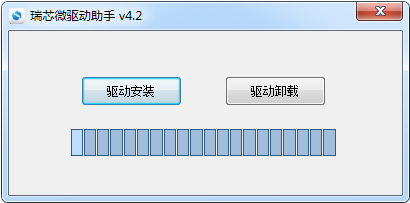
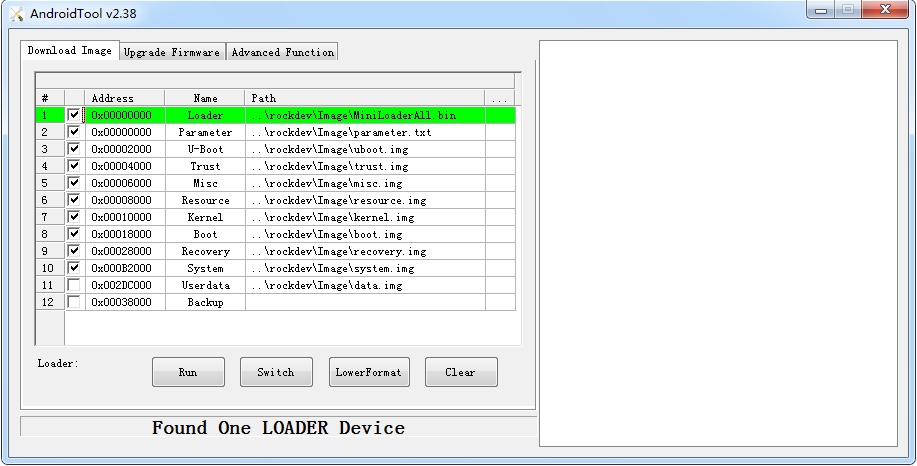
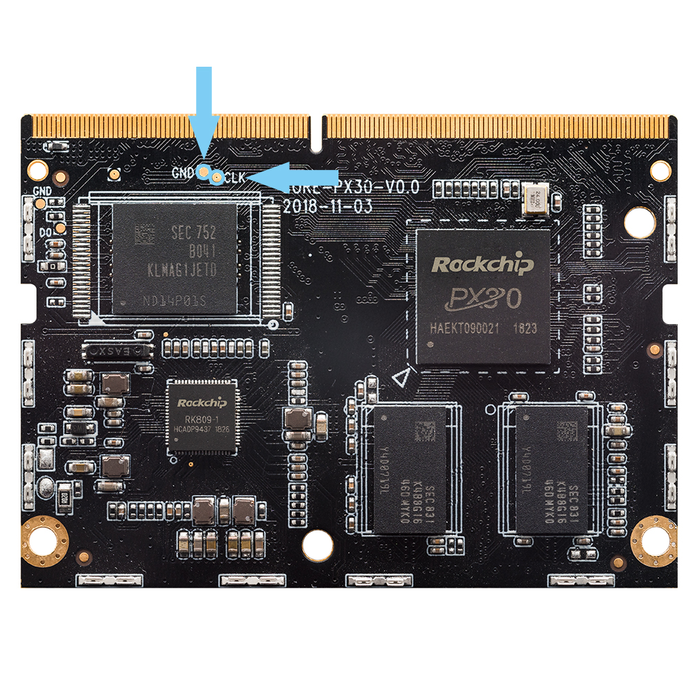
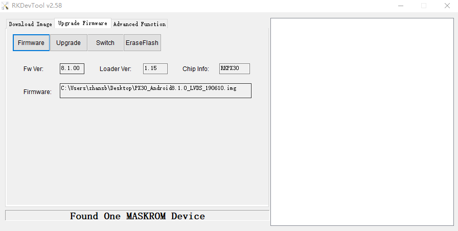

# 烧写固件

## 启动模式说明

### 前言

AIO-PX30-JD4 有灵活的启动方式。一般情况下，除非硬件损坏，AIO-PX30-JD4 开发板是不会变砖的。

如果在升级过程中出现意外，bootloader 损坏，导致无法重新升级，此时仍可以进入 `MaskRom` 模式来修复。

### 加载方式

AIO-PX30-JD4 有 32KB 的 BootRom , 16KB 的内部 SYSTEM_SRA以及8KB的PMU_SRAM,支持从以下设备加载系统：

* eMMC 接口
* SDMMC 接口
* 串行nand flash或 nor flash

另外 AIO-PX30-JD4 支持从 USB OTG 接口下载系统代码。

### 启动次序

启动的次序是这样的：

1. 主控上电初始化
2. BootRom 代码在 SRAM 上运行，校验存储设备里的 bootloader
3. 校验通过，加载并运行 bootloader 引导代码
4. bootloader 引导代码负责初始化 DDR 内存，加载 bootloader 完整代码到 DDR 内存中并运行
5. bootloader 加载存储设备上的 Linux 内核，并将执行权交给 Linux 内核

### 启动模式

AIO-PX30-JD4 有三种启动模式：

* Normal 模式
* Loader 模式
* MaskRom 模式

#### Normal 模式

Normal 模式就是正常的启动过程，各个组件依次加载，正常进入系统。

#### Loader 模式

在 Loader 模式下，bootloader 会进入升级状态，等待主机命令，用于固件升级等。   
要进入 Loader 模式，必须让 bootloader 在启动时检测到 `RECOVERY`（恢复）键按下，且 USB 处于连接状态。使设备进入升级模式方法如下:

断开电源适配器

* Type-C数据线连接好设备和主机。
* 按住设备上的 RECOVERY （恢复）键并保持。
* 插上电源。
* 大约两秒钟后，松开 RECOVERY 键。

#### MaskRom 模式

MaskRom 模式用于 bootloader 损坏时的系统修复。

一般情况下是不用进入 MaskRom 模式的，只有在 bootloader 校验失败（读取不了 IDB 块，或 bootloader 损坏） 的情况下，BootRom 代码 就会进入 MaskRom 模式。此时 BootRom 代码等待主机通过 USB 接口传送 bootloader 代码，加载并运行之。   

***要强行进入 MaskRom 模式，请参阅[《MaskRom》](programming_firmware.html#id3)一章。***


## 升级固件

### 前言

本文介绍了如何将主机上的固件文件，通过Type-C数据线，烧录到开发板的闪存中。   
升级时，需要根据主机操作系统和固件类型来选择合适的升级方式。

### 准备工作

* AIO-PX30-JD4 开发板
* 固件
* 主机
* Type-C数据线

固件文件一般有两种：

* 单个统一固件 update.img, 将启动加载器、参数和所有分区镜像都打包到一起，用于固件发布。
* 多个分区镜像,如 kernel.img, rootfs.img, recovery.img 等，在开发阶段生成。
* 可以在这里找到已编译好的统一[AIO-PX30-JD4固件](https://community.t-firefly.com/doc/download/67)，下载后解压。也可以参考编译固件的说明自行编译。

主机操作系统支持：
> * Windows XP （32/64位）
> * Windows 7 (32/64位)
> * Windows 8 (32/64位)
> * Linux (32/64位)

### Windows

#### 安装 RK USB 驱动

下载 [ Release_DriverAssistant.zip](https://community.t-firefly.com/doc/download/67) ，解压，然后运行里面的 DriverInstall.exe 。   
为了所有设备都使用更新的驱动，请先选择"驱动卸载"，然后再选择"驱动安装"。   



#### 连接设备

按照以下方式可以使设备进入升级模式

* 先断开电源适配器连接：
   * Type-C数据线一端连接主机，一端连接开发板
   * 按住设备上的 RECOVERY （恢复）键并保持。
   * 接上电源
   * 大约两秒钟后，松开 RECOVERY 键。

主机应该会提示发现新硬件并配置驱动。打开设备管理器，会见到新设备"Rockusb Device" 出现，如下图。如果没有，则需要返回上一步重新安装驱动。   


### 烧写固件

下载 [AndroidTool](https://community.t-firefly.com/doc/download/67)，解压，运行 AndroidTool_Release_xx 目录里面的 AndroidTool.exe（注意，如果是 Windows 7/8,需要按鼠标右键，选择以管理员身份运行），如下图：   


####  烧写统一固件 update.img

烧写统一固件 update.img 的步骤如下:

1. 切换至"升级固件"页。
2. 按"固件"按钮，打开要升级的固件文件。升级工具会显示详细的固件信息。
3. 按"升级"按钮开始升级。
4. 如果升级失败，可以尝试先按"擦除Flash"按钮来擦除 Flash，然后再升级。

**注意：如果你烧写的固件laoder版本与原来的机器的不一致，请在升级固件前先执行"擦除Flash"。** 


#### 烧写分区映像

每个固件的分区可能不相同,请注意以下两点:
1. 使用`Androidtool_2.58`烧写`Android8.1`使用默认配置即可.
   

烧写分区映像的步骤如下：

1. 切换至"下载镜像"页。
2. 勾选需要烧录的分区，可以多选。
3. 确保映像文件的路径正确，需要的话，点路径右边的空白表格单元格来重新选择。
4. 点击"执行"按钮开始升级，升级结束后设备会自动重启。


### Linux

 Linux 下无须安装设备驱动，参照 Windows 章节连接设备则可。


### upgrade_tool

下载 [Linux_Upgrade_Tool](https://community.t-firefly.com/doc/download/67), 并按以下方法安装到系统中，方便调用：   
```
unzip Linux_Upgrade_Tool_xxxx.zip
cd Linux_UpgradeTool_xxxx
sudo mv upgrade_tool /usr/local/bin
sudo chown root:root /usr/local/bin/upgrade_tool
sudo chmod a+x /usr/local/bin/upgrade_tool
```

烧写统一固件 update.img：   
```
sudo upgrade_tool uf update.img
```


如果升级失败，可以尝试先擦除后再升级。
```
# 擦除flash 使用ef参数需要指定loader文件或者对应的update.img
sudo upgrade_tool ef update.img #update.img :你需要烧写的ubuntu固件
# 重新烧写
sudo upgrade_tool uf update.img 
```

烧写分区镜像：   
Ubuntu(MBR)、Android8.1,使用以下方式:
```
sudo upgrade_tool di -b /path/to/boot.img
sudo upgrade_tool di -k /path/to/kernel.img
sudo upgrade_tool di -s /path/to/system.img
sudo upgrade_tool di -r /path/to/recovery.img
sudo upgrade_tool di -m /path/to/misc.img
sudo upgrade_tool di resource /path/to/resource.img
sudo upgrade_tool di -p paramater   #烧写 parameter
sudo upgrade_tool ul bootloader.bin # 烧写 bootloader
```

Ubuntu(GPT),使用以下方式
```
sudo upgrade_tool ul $LOADER
sudo upgrade_tool di -p $PARAMETER
sudo upgrade_tool di -uboot $UBOOT
sudo upgrade_tool di -trust $TRUST
sudo upgrade_tool di -b $BOOT
sudo upgrade_tool di -r $RECOVERY
sudo upgrade_tool di -m $MISC
sudo upgrade_tool di -oem $OEM
sudo upgrade_tool di -userdata $USERDATA
sudo upgrade_tool di -rootfs $ROOTFS
```


如果因 flash 问题导致升级时出错，可以尝试低级格式化、擦除 nand flash：   
```
sudo upgrade_tool lf update.img	# 低级格式化
sudo upgrade_tool ef update.img	# 擦除
```
### 常见问题

#### 如何强行进入 MaskRom 模式

如果板子进入不了 Loader 模式，此时可以尝试强行进入 MaskRom 模式。操作方法见[《如何进入 MaskRom 模式》](programming_firmware.html#id3)。

## MaskRom模式

***有关启动模式的介绍，请参阅[《启动模式》](programming_firmware.html#qi-dong-mo-shi-shuo-ming)一章***   

`MaskRom` 模式是设备变砖的最后一条防线。强行进入 `MaskRom` 涉及硬件操作，有一定风险，因此仅在设备进入不了 `Loader` 模式的情况下，方可尝试 `MaskRom` 模式。   

请小心阅读，并谨慎操作！ 
操作步骤如下：   

1. 设备断开所有电源。
2. 拔出 SD 卡。
3. 用Type-C线连接好设备和主机。
4. 用金属镊子接通核心板上的如下图所示的两个测试点，并保持。


5. 设备插入电源。
6. 稍候片刻，之后松开镊子。

这时，设备应该就会进入 MaskRom 模式。   


