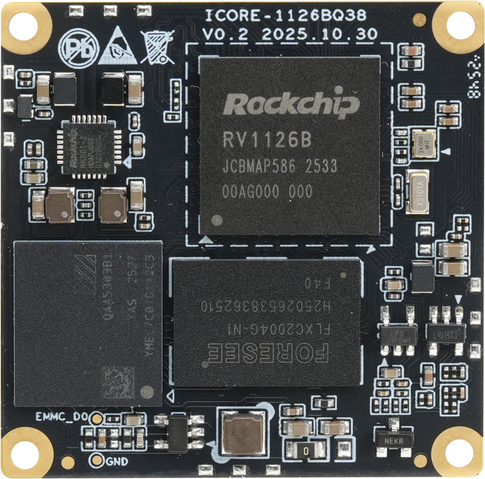
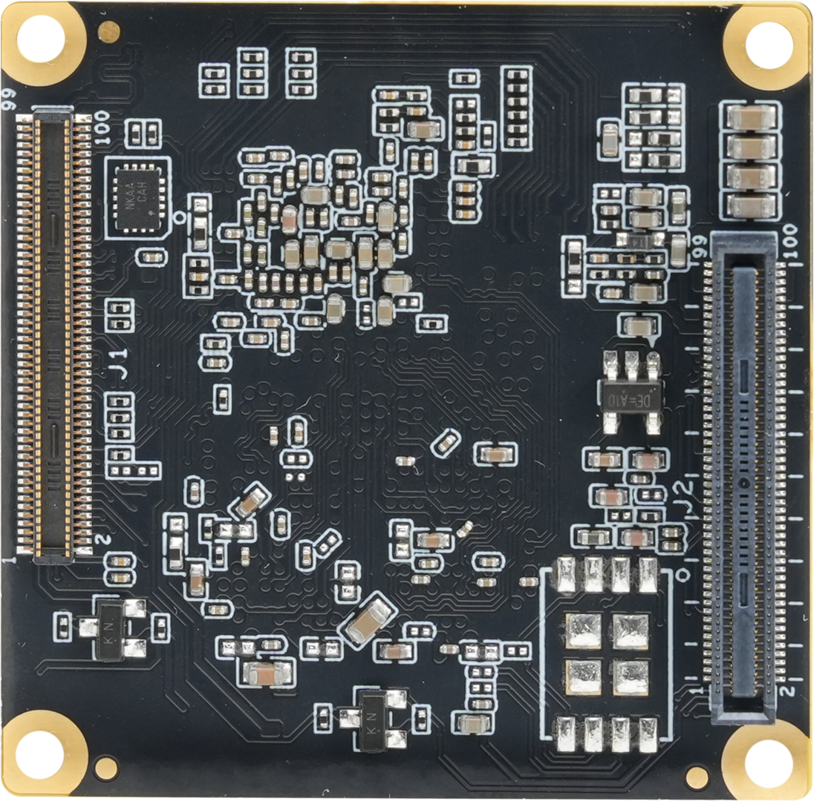
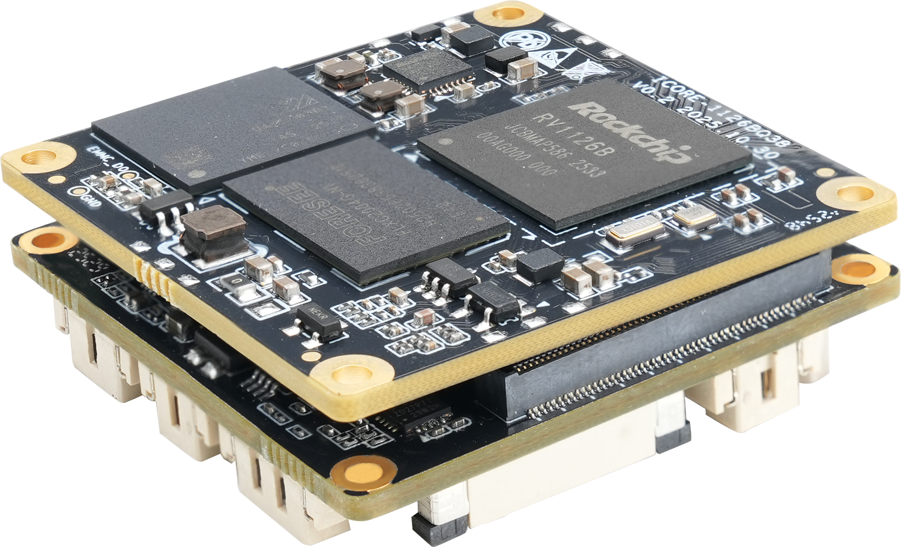
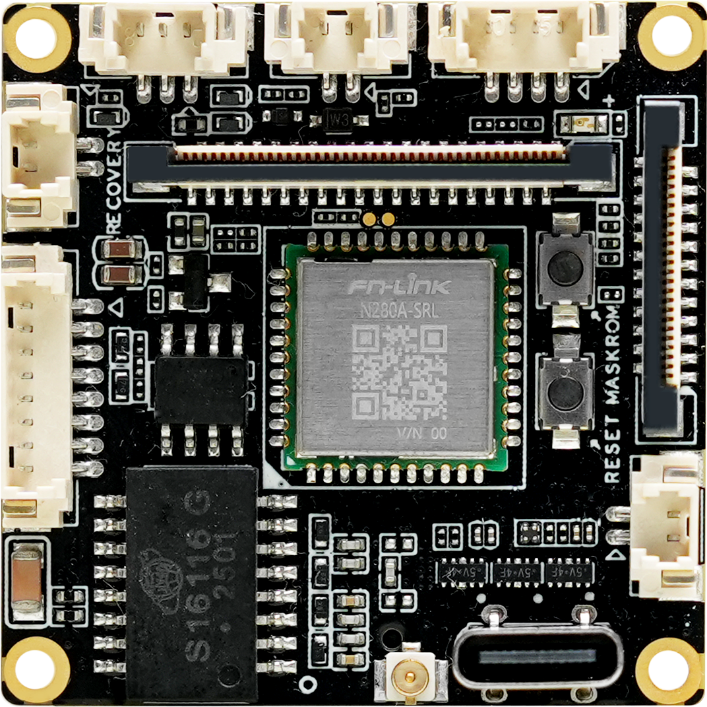
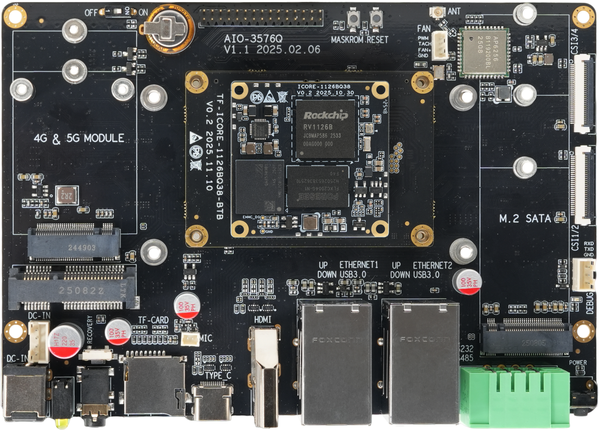
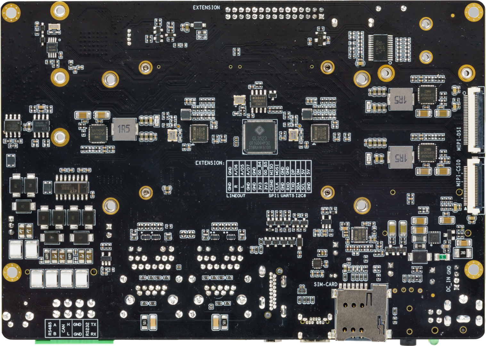

# 产品介绍
## 介绍

**ICORE-1126BQ38** 采用 Rockchip 四核 AI 视觉处理器 RV1126B，集成 3 TOPS NPU，支持 2B 多模态大模型和深度学习框架。支持 12M 视频编码，4K 视频解码。内置 12M ISP / 8MP AI-ISP，功耗低。硬件 AI Remosaic, 白天超高清，夜晚超低照，支持多目 AI 动态拼接、流畅自然无割裂感，AI 视频 6 轴数字防抖、多光源融合（RGB 与红外热成像融合、可见光与结构光、ToF 融合），支持 AOA 低功耗声音事件检测，内置更安全的国密级 SM2/SM3/SM4 加密算法。尺寸仅 38mm × 38mm，广泛适用于人脸识别、闸机门禁、智能安防、智能网络摄像头等行业领域。

**ICORE-1126BQ38** 可搭配不同的底板组合成不同形态的产品。分别可以组成 CAM-1126BQ38 套板和 AIO-1126BQ38 套板。

**ICORE-1126BQ38** 正面：

  

**ICORE-1126BQ38** 背面：

  

### CAM-1126BQ38

本维基介绍 CAM-1126BQ38 套板的使用。

CAM-1126BQ38 正面：

  

CAM-1126BQ38 背面：

### AIO-1126BQ38

AIO-1126BQ38 开发板由核心板 ICORE-1126BQ38 + BTB 转接板 + 底板 MB-Q-RK3576 组成。

点击跳转 AIO-1126BQ38 套板的维基教程：[AIO-1126BQ38 维基教程](https://wiki.t-firefly.com/zh_CN/AIO-1126BQ38/started.html)

AIO-1126BQ38 正面：

  

AIO-1126BQ38 背面：

 