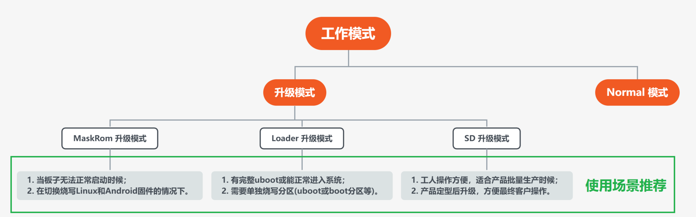

# 更新固件介绍

## 前言

AIO-3562JQ 有 2 种工作模式。一般情况下，开机直接进入`Normal 模式`正常启动系统。如需对板子系统进行升级，可以根据情况选择合适的`升级模式`进行固件升级。

## Normal 模式

| 工作模式  | Normal 模式 | 升级模式 |
| :--------: | :-------: | :------- |
| 启动介质 | eMMC 接口/SDMMC 接口| | √ |
| 描述 | Normal 模式就是正常的启动过程， 各个组件依次加载，正常进入系统。 | 目前支持3种升级模式，各有优缺点： 1. [MaskRom 升级模式](04-maskrom_mode.html) 2. [Loader 升级模式](loader_mode.html) 3. [SD 升级模式](05-upgrade_firmware_sd.html)|

## 升级模式

**其中升级模式中，不同升级模式之间的对比：**

| 升级模式  | [MaskRom 升级模式](04-maskrom_mode.html) | [Loader 升级模式](loader_mode.html) | [SD 升级模式](05-upgrade_firmware_sd.html) |
| :--------: | :------- | :------- | :------- |
| 简单描述 | 1. 使用USB线将主板连接到电脑上； 2. 硬件操作使板子进入升级模式； 3. 在PC上使用USB升级单板固件。  |  1. 使用USB线将主板连接到电脑上； 2. 软件或按键操作使板子进入升级模式； 3. 在PC上使用USB升级单板固件。 | 1.通过升级卡制作工具，将MicroSD卡制作为升级卡； 2. 将升级卡插入主板，上电开机，机器自动执行升级。|
| 连接方式 | USB | USB | TF卡（少数为SD卡槽） |
| 进入方法 | 需要硬件或串口操作 |  按键或软件进入| 上电直接进入|
| 使用条件 | 硬件或串口操作进入 |  能正常使用uboot| 无|
| 使用场景推荐 | 1. 当板子无法正常启动时候； 2. loader 模式无法使用的时候 |  1. 有完整uboot或能正常进入系统； 2. 需要单独烧写分区(uboot或boot分区等)。| 1. 工人操作方便，适合产品批量生产时候； 2. 产品定型后升级，方便最终客户操作。|
| 优点 | 1. 最底层的烧写方式； 2. 非固件或硬件问题，一般都能成功烧写； 3. 不需要uboot支持，拯救变砖的单板。| 1. 最常用的烧写方式； 2. 能单独烧写分区； 3. 进入loader模式方便。 | 1. 操作方便，只需插卡启动； 2.集合了MaskRom 升级模式的优点。 |
| 缺点 | 1. 进入方式麻烦，不适难拆除外壳的产品； 2. 烧写分区表麻烦，较难单独烧写分区； 3. 操作复杂，不慎可能导致无法启动。| 1. 需要完整的loader(通常指uboot)。| 1. 需要另外准备 tf/sd 卡。 |

#### MaskRom 升级模式

一般情况下是不用进入 `MaskRom 升级模式`的，只有在板子无法正常启动，且尝试进入`loader 模式`失败，或者`loader 模式`无法升级的情况下才考虑`Maskrom 模式`。该模式 BootRom 代码会等待主机通过 USB 接口传送 bootloader 代码，加载并运行之。在 bootloader 校验失败（读取不了 IDB 块，或 bootloader 损坏） 的情况下会自动进入`Maskrom 模式`，也可以手动进入`MaskRom 升级模式`。

***要进入 `MaskRom 升级模式`，请参阅[《MaskRom 升级模式》](04-maskrom_mode.md)一章。***

#### Loader 升级模式

推荐的升级模式。在 `Loader 升级模式`下，bootloader 会进入升级状态，等待主机命令，用于固件升级等。要进入此模式，必须让 bootloader 在启动时检测到 `RECOVERY`（恢复）键按下，且 USB 处于连接状态。

***要进入 `Loader 升级模式`，请参阅[《Loader 升级模式》](loader_mode.md)一章。***

#### SD 升级模式

使用 SD 升级，本质上是制作一个可启动的 SD 卡并装有升级固件，让板子 SD 启动，擦除和烧写 EMMC。

***要进入 `SD 升级模式`，请参阅[《使用SD卡更新固件》](05-upgrade_firmware_sd.md)一章。***
