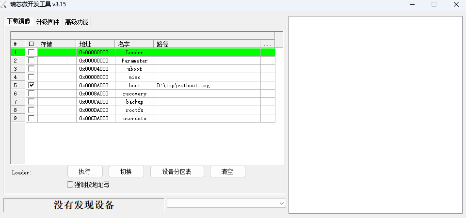
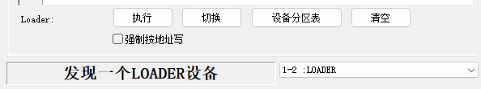

# 使用USB线缆升级固件

## 前言

本文介绍了如何将主机上的固件，通过双公头 USB 数据线烧录到 iCore-3562JQ 开发板的存储器中。升级时，需要根据主机操作系统和固件类型来选择合适的升级方式。

## 准备工具
* AIO-3562JQ 开发板
* 处理器架构为 X86_64 的电脑
* 良好的双公头 USB 数据线

## 准备固件
固件可以通过编译SDK获得，也可以通过[资源下载](https://www.t-firefly.com/doc/download/247.html)处下载公版固件（统一固件）。

* 统一固件

    统一固件是由分区表、bootloader、uboot、kernel、system等所有文件打包合并成的单个文件。Firefly正式发布的固件都是采用统一固件格式，升级统一固件将会更新主板上所有分区的数据和分区表，并且擦除主板上所有数据。

SDK 可编译出分区镜像

* 分区镜像

    即各个功能独立的文件，如分区表、bootloader、kernel等，在开发阶段生成。独立分区镜像可以只更新指定的分区，而保持其它分区数据不被破坏，在开发过程中会很方便调试。

>    通过统一固件解包/打包工具，可以把统一固件解包为多个分区镜像，也可以将多个分区镜像合并为一个统一固件。

通常固件压缩包中会放有烧录工具，建议使用固件附带的工具进行操作。

## 安装烧写工具
### Windows操作系统
* 安装RK USB驱动

下载 [Release_DriverAssistant.zip](https://www.t-firefly.com/doc/download/247.html#other_779)，解压，然后运行里面的 DriverInstall.exe 。为了所有设备都使用更新的驱动，请先选择`驱动卸载`，然后再选择`驱动安装`。
<center>


</center>


* 运行 RKDevTool.exe

为避免由下载工具版本引起的烧写问题，推荐使用公版固件压缩包内部打包好的工具进行烧写。

也可以单独下载 [RKDevTool](https://www.t-firefly.com/doc/download/247.html#other_777)，解压，运行 `RKDevTool_Release_v2.xx` 目录里面的 `RKDevTool.exe`（注意，如果是 Windows 7/8,需要按鼠标右键，选择以管理员身份运行），如下图：



### Linux操作系统
Linux 下无须安装设备驱动
* [Linux_Upgrade_Tool](https://www.t-firefly.com/doc/download/247.html#other_776)工具

下载 [Linux_Upgrade_Tool](https://www.t-firefly.com/doc/download/247.html#other_776), 并按以下方法安装到系统中，方便调用：

```
unzip Linux_Upgrade_Tool_xxxx.zip
cd Linux_UpgradeTool_xxxx
sudo mv upgrade_tool /usr/local/bin
sudo chown root:root /usr/local/bin/upgrade_tool
sudo chmod a+x /usr/local/bin/upgrade_tool
```

## 进入升级模式
通常我们升级固件的模式有两种，分别是Loader模式和MaskRom模式。烧写固件前，我们需要连接好设备，并让板子进入到可升级模式。

使用双公头 USB 数据线连接板子 OTG 口和电脑。

### Loader模式
#### 硬件方式进入Loader模式
连接设备并通过**RECOVERY**按键进入Loader升级模式步骤如下：

* 断开电源
* 按住设备上的 RECOVERY （恢复）键并保持。
* 连接电源
* 大约两秒钟后，松开 RECOVERY 键。
#### 软件方式进入Loader模式
双公头 USB 数据线接好后在串口调试终端或adb shell给板子运行以下命令

```shell
reboot loader
```

#### 查看Loader模式
如何确定板子是否进入Loader模式，我们可以通过工具去查看

**Windows操作系统**

通过 RKDevTool 工具可以看到下方提示`发现一个LOADER设备`


如果有进行"进入Loader模式"的操作，仍旧没有看到烧写工具提示LOADER，此时可以可以看一下Windows主机是否有提示发现新硬件并配置驱动。打开设备管理器，会见到新设备 `Rockusb Device` 出现，如下图。如果没有，可返回上一步重新[安装驱动](03-upgrade_firmware.html#windows-cao-zuo-xi-tong)。


**Linux操作系统**

运行upgrade_tool后可以看到连接设备中有个`Loader`的提示

```shell
firefly@T-chip:~/severdir/down_firmware$ sudo upgrade_tool
List of rockusb connected
DevNo=1 Vid=0x2207,Pid=0x330c,LocationID=106    Loader
Found 1 rockusb,Select input DevNo,Rescan press <R>,Quit press <Q>:q
```

### MaskRom模式
进入MaskRom模式的方法，请参考[《MaskRom模式》](04-maskrom_mode.md)

## 烧写固件

### windows操作系统

#### 烧写统一固件 update.img

烧写统一固件 update.img 的步骤如下:

1. 切换至`升级固件`页。
2. 按`固件`按钮，打开要升级的固件文件。升级工具会显示详细的固件信息。
3. 按`升级`按钮开始升级。

#### 烧写分区映像
烧写分区映像的步骤如下：

1. 切换至`下载镜像`页。
2. 点击`设备分区表`按钮。
3. 勾选需要烧录的分区，可以多选。
4. 确保映像文件的路径正确，需要的话，点路径右边的空白表格单元格来重新选择。
5. 点击`执行`按钮开始升级，升级结束后设备会自动重启。


### Linux操作系统

#### 烧写统一固件 update.img

```
sudo upgrade_tool uf update.img
```

#### 烧写分区镜像

```
sudo upgrade_tool di -b /path/to/extboot.img
sudo upgrade_tool di -r /path/to/recovery.img
sudo upgrade_tool di -m /path/to/misc.img
sudo upgrade_tool di -u /path/to/uboot.img
sudo upgrade_tool di -p paramater   #烧写 parameter
sudo upgrade_tool ul bootloader.bin # 烧写 bootloader
```

## 常见问题
### 1. 如何强行进入 MaskRom 模式

如果板子进入不了 Loader 模式，此时可以尝试强行进入 MaskRom 模式。操作方法见[《MaskRom模式》](04-maskrom_mode.md)。


### 2. 烧写失败分析

如果烧写过程中出现Download Boot Fail, 或者烧写过程中出错，如下图所示，通常是由于使用的USB线连接不良、劣质线材，或者电脑USB口驱动能力不足导致的，请更换USB线或者电脑USB端口排查。

