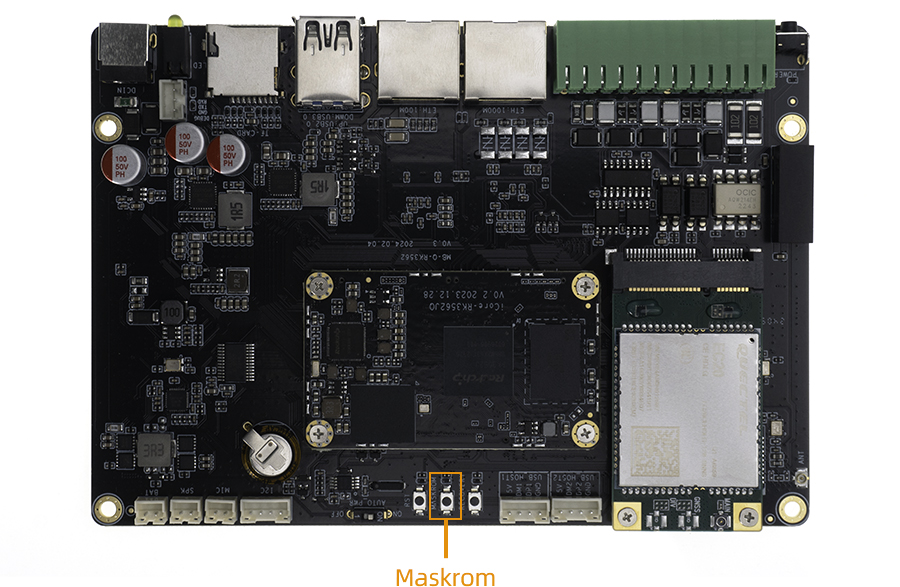

# MaskRom模式

***有关启动模式的介绍，请参阅[《升级固件介绍》](01-bootmode.md)一章***

## 简介

`MaskRom` 模式是设备变砖的最后一条防线。强行进入 `MaskRom` 涉及硬件操作，有一定风险，因此仅在设备进入不了 `Loader` 模式的情况下，方可尝试 `MaskRom` 模式。进入 `MaskRom` 的原理是人为的把 EMMC 的数据脚与地线短接，系统会认为 EMMC 数据出错，从而清除 EMMC 数据。

**请小心阅读，并谨慎操作！**

操作步骤如下：

* 设备断开电源
* 使用双公头 USB 数据线连接板子的 otg 口和电脑
* 按住设备上的 Maskrom 按键
* 设备插入电源
* 稍候几秒，之后松开按键

此时设备就会进入 MaskRom 模式。

