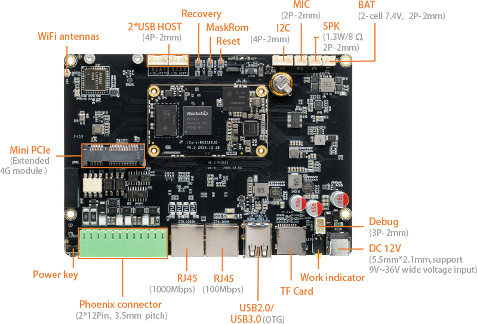
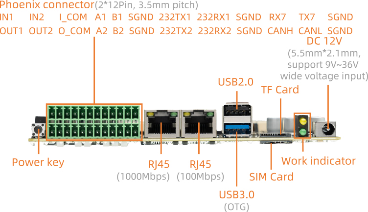
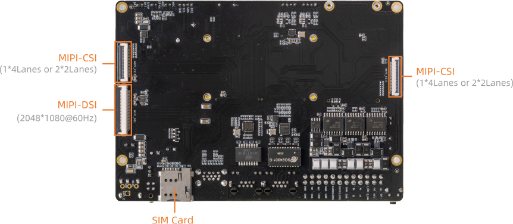

# 接口定义

## 整机接口定义

AIO-3562JQ 提供了丰富的接口，主要包括：

* 电源接口
* 1 x USB3.0（host/otg）
* 3 x USB2.0（接口×1，座子×2）
* MIPI-DSI 屏幕接口
* 1000M 以太网口
* 100M 以太网口
* WiFi、蓝牙二合一天线
* MIC 接口
* 喇叭接口
* TF 卡槽
* SIM 卡槽
* Power 按键
* Reset 按键
* Recovery 按键
* Maskrom 按键
* 调试串口
* 工业级串口 (RS485, RS232, UART)
* 光耦隔离 IO (输入x2，输出x2)
* CAN/CANFD
* 2x MIPI 摄像头接口
* MINI-PCIE 座 (USB2.0)
* I2C
* 电池接口

具体如下图：

