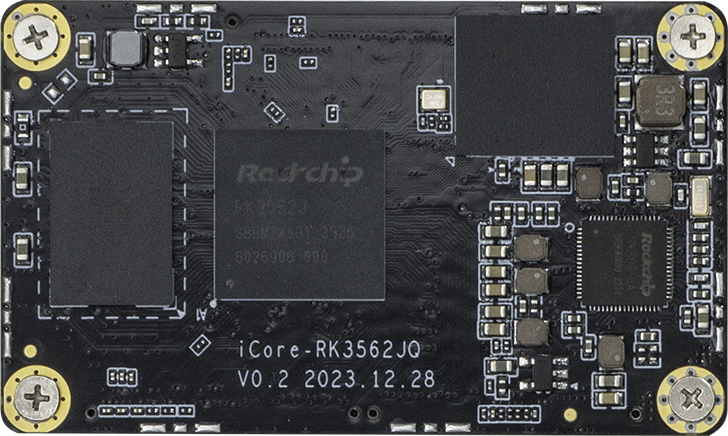

# 介绍
[iCore-3562JQ](https://item.taobao.com/item.htm?ft=t&id=788581640837&sku_properties=-2:-2&spm=a21dvs.23580594.0.0.4fee645e3Zhx3J)采用 RK3562J 四核 64 位 Cortex-A53 处理器，主频最高 1.2GHz，集成 GPU 支持 OpenGL ES 1.1/2.0/3.2、OpenCL 2.0 和 Vulkan 1.1；最大支持8G大内存。拥有 13M ISP 图像信号处理器，支持宽温度 -40℃~85℃ 长时间稳定运行，满足各种工业级应用场景需求。

[AIO-3562JQ](https://item.taobao.com/item.htm?ft=t&id=788441419638&sku_properties=-2:-2&spm=a21dvs.23580594.0.0.4fee645e3Zhx3J)开发板由核心板 iCore-3562JQ + 底板 MB-Q-RK3562 组成。采用 BTB 结构，传输能力更强，拥有工业级的稳定性。在 -40℃ 至 85℃ 工作温度下可长时间运行。拥有丰富的接口，支持多种视频输出接口、支持多摄像头、千兆网、WiFi、4GLTE 扩展。支持多种操作系统，广泛适用于智慧商显、工业控制、工业 PLC、能源电力/集中器、智慧医疗、自助终端等领域。

## AIO-3562JQ 标准套装包含以下配件(仅供参考)：
* iCore-3562JQ 核心板一块
* 12V-2A 电源适配器一个
* MB-Q-RK3562 底板一块
* 铜管天线 x 1
* 双公头 USB 线一条

另外可以选购的配件有：

* Firefly 串口模块

另外，在使用过程中，你可能需要以下配件：

*    显示设备
     *   DM-M10R800 V2 MIPI 屏幕
*    网络
     *   100M/1000M 以太网线缆，及有线路由器
     *   WiFi 路由器
*    输入设备
     *   USB 无线/有线的鼠标/键盘
*    升级固件，调试
     *   串口转 USB 适配器
 