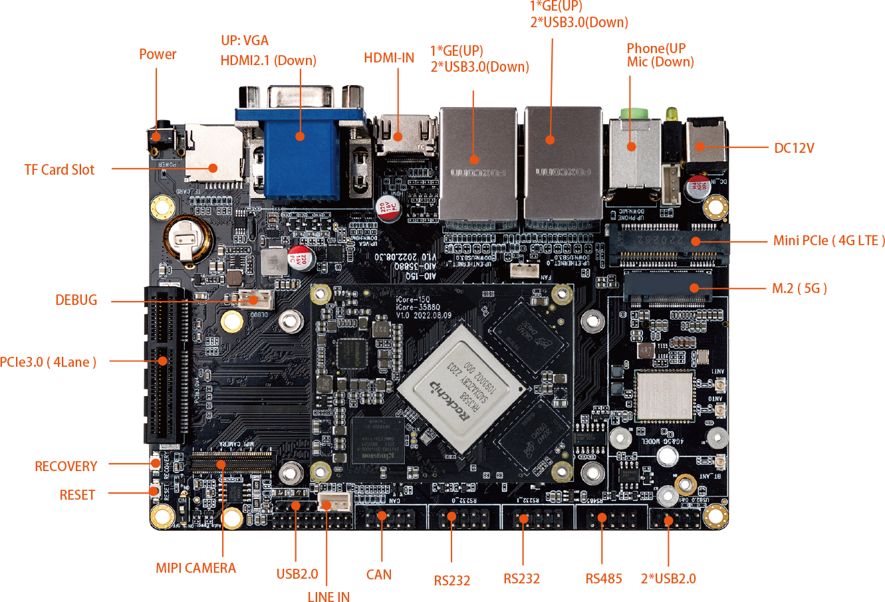
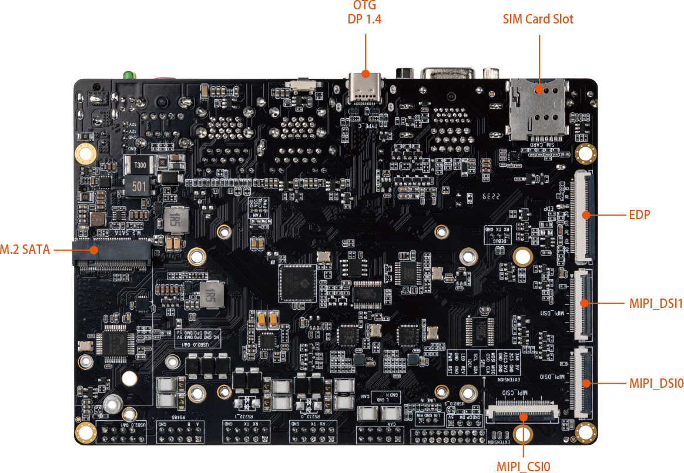

# 接口定义

## 整机接口定义

**AIO-3588JQ  V1.0** 提供了丰富的接口，主要包括：

* 1 x HDMI2.1（最大支持 8K@60Hz 输出）
* 1 x HDMI2.0
* 1 x Display Port1.4（最大支持 8K@30Hz 输出）
* 1 x USB3.0 OTG(Type-C)
* 1 x VGA
* 2 x MIPI-DSI
* 1 x MIPI-CSI
* 1 x EDP
* 1 x M.2(SATA3.0)
* 1 x PCIe3.0x4
* 1 x TF Card
* 1 x 4G LTE
* 1 x 5G 移动网络
* 1 x SIM 卡槽
* 4 x USB3.0
* 3 x USB2.0
* 1 x WIFI（支持 wifi6）
* 1 x Bluetooth
* 1 x FAN
* 2 x RJ45（支持 1Gbps）
* 1 x Line-In
* 1 x RS485
* 2 x RS232
* 1 x CAN

具体如下图：

