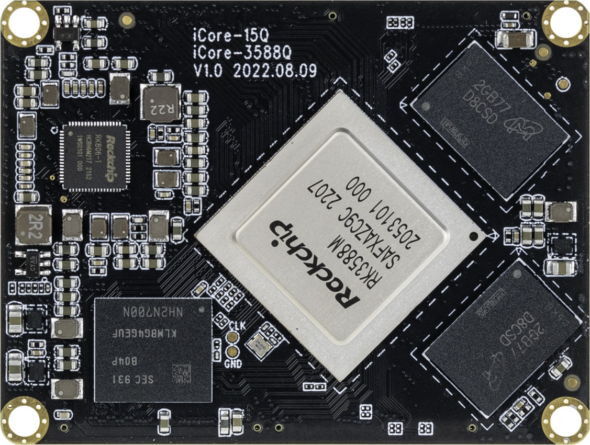
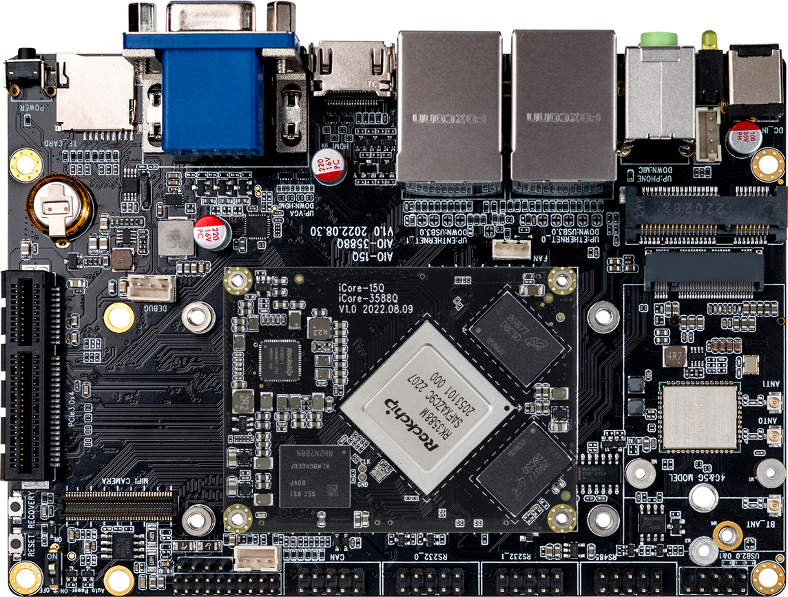

## 介绍

**3588Q**系列的核心板有**iCore-3588Q**、**iCore-3588MQ**及**iCore-3588JQ** ，底板**MB-Q-RK3588**可支持这三种不同的核心板。

**iCore-3588MQ**采用Rockchip RK3588M新一代八核64位处理器；采用8nm先进架构 , 最大可配32GB大内存

支持8K视频编解码；采用了BTB接口，传输能力更强；拥有丰富的接口，支持多硬盘、千兆网、WiFi6、5G/4G扩展和多种视频输入输出；支持多种操作系统；主要应用于智能汽车领域的智能座舱及 ADAS、ARM PC、边缘计算、云服务器等产品领域。

 

[AIO-3588MQ](https://item.taobao.com/item.htm?spm=a1z10.5-c-s.w4002-24620095837.11.489872a2Hwyz1u&id=690232162499) 开发板由核心板 iCore-3588MQ + 底板 MB-Q-RK3588 组成,。AIO-3588MQ 拥有 RGMII、CAN、PCIE3.0、USB3.0、I2C、SPI、UART、GPIO、MIPI-DSI 以及 MIPI-CSI 等丰富接口。可直接应用到各种智能产品中，加速产品落地，详细内容可参考[接口定义](interface_definition.md)。
  

  
### AIO-3588MQ 标准套装包含以下配件(仅供参考)：
* iCore-3588MQ 核心板 x 1
*  12V/2A 电源适配器 x 1
* MB-Q-RK3588 底板 x 1
* 铜管天线 x 3
* Type-C 数据线 x 1

另外可以选购的配件有：

* Firefly 串口模块

另外，在使用过程中，你可能需要以下配件：

*    显示设备
     * 带 HDMI 接口的显示器或电视，及 HDMI 连接线
*    网络
     *   100M/1000M 以太网线缆，及有线路由器
     *   WiFi 路由器
*    输入设备
     *   USB 无线/有线的鼠标/键盘
*    升级固件，调试
     *   Type-C 数据线
     *   串口转 USB 适配器
 