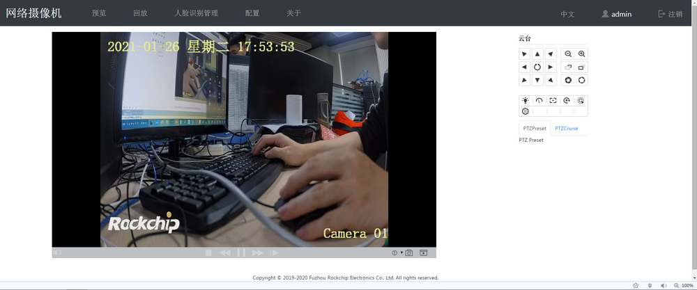
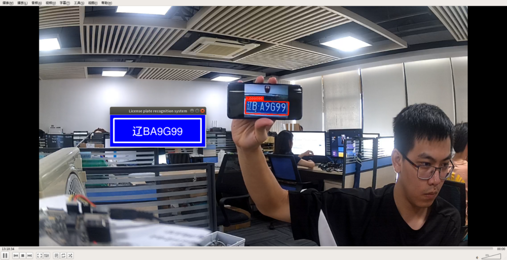
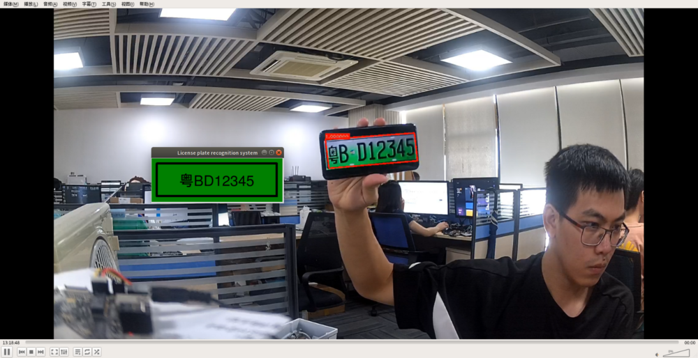

# 技术案例

`C40PL` 硬件基于 `CORE-1126-JD4` ，搭配了 400W 摄像头、IRCUT、POE 电源以及光感器件，可以应用于多种场景。

## 人脸识别网络摄像头

在设备上可以实现人脸识别和 RTSP 推流，在 WEB 端或者 RTSP 播放器就可以预览画面。

## 车牌识别网络摄像头

在设备上可以实现车牌或车辆识别和 RTSP 推流，识别结果可以通过网络发送到服务端记录数据库。

