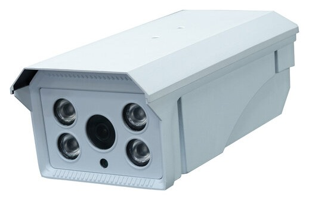
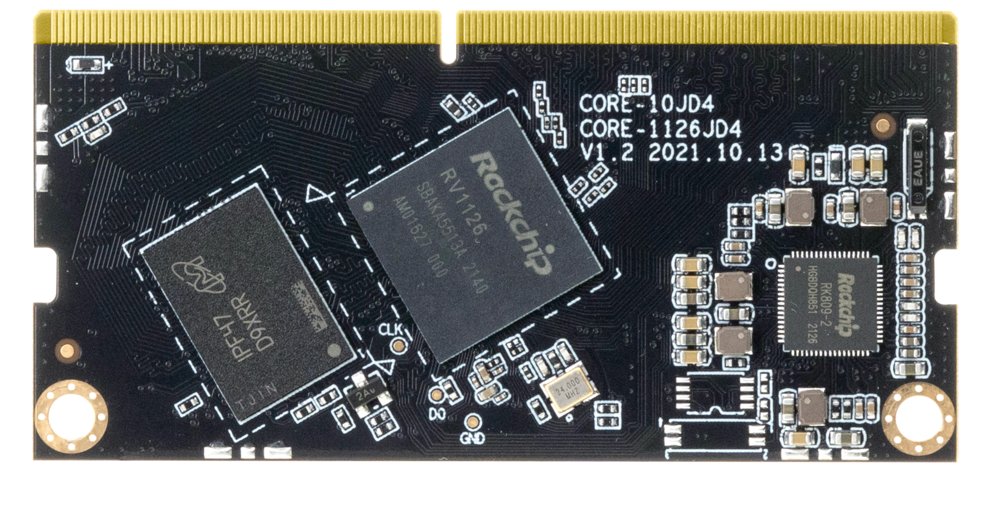
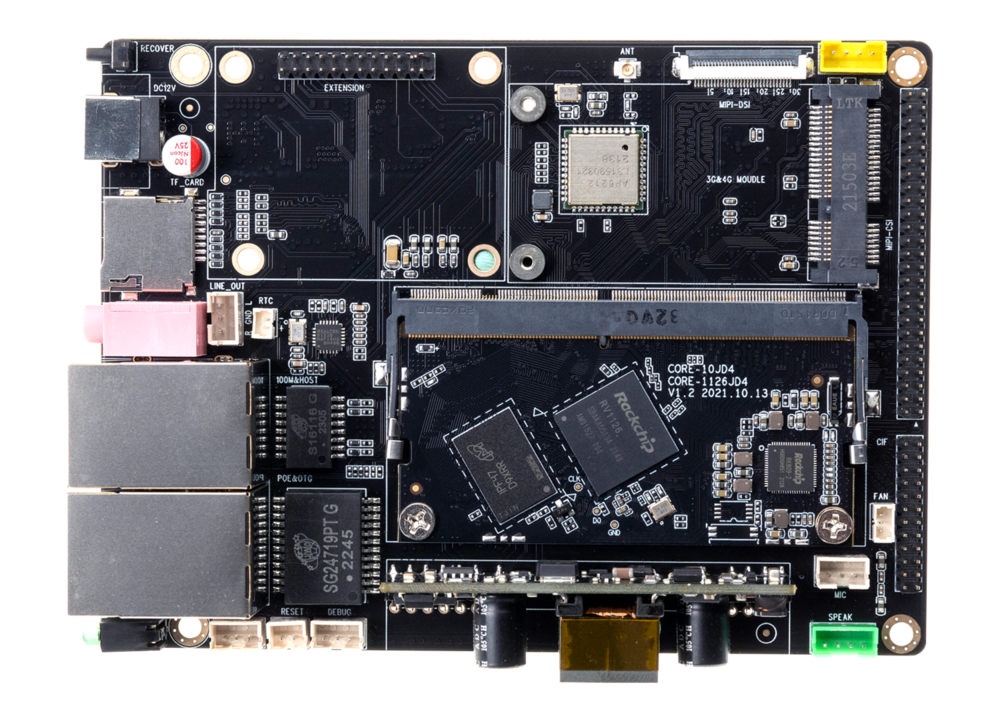

## 介绍

**C40PL**配置四核高性能AI智能视觉处理器，算力高达2.0Tops，支持4K视频编解码，多种AI框架以及活体检测，识别准确率高，配备 400W HDR 高动态红外增强广角摄像头。适用于人脸识别、车牌识别等场景。

**Core-1126-JD4**采用瑞芯微RV1126系列处理器，内置AI神经网络加速NPU算力高达2.0Tops，支持4K H.265/H.264 多路编解码，内置1400万 ISP 2.0 ，具备多级降噪、3帧HDR等技术，支持 3 个摄像头同时输入，满足安防产品和AIoT的行业需求，广泛应用于：人脸识别、IPC智能网络摄像头、闸机门禁、智能安防、智慧金融/工地、智慧出行等行业。

      

AIO-1126JD4 开发板由核心板 Core-1126-JD4 + 底板 MB-JD4-RV11091126 组成,。AIO-1126JD4 拥有 RGMII、USB2.0、I2C、UART、GPIO、MIPI-DSI 以及 MIPI-CSI 等丰富接口，可直接应用到各种智能产品中，加速产品落地，详细内容可参考[接口定义](interface_definition.md)。

 