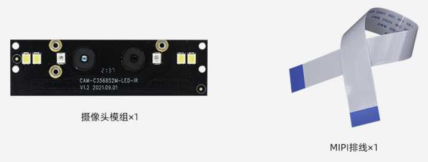
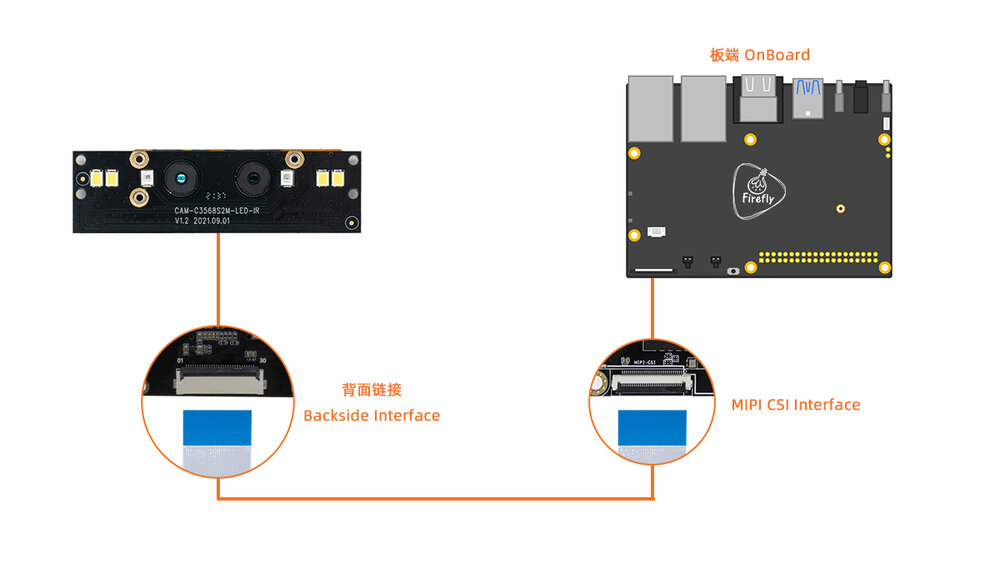

# 一、产品介绍
## 产品简介
CAM-2MS2MF 是一款双 MIPI 双目宽动态+近红外模组，可见光采用 2M宽动态传感器，优质的宽动态效果将适应更多恶劣场景，减少复杂光线环境对识别算法产生的不良影响，采用标准 MIPI 接口输出高质量视频流；近红外部分采用2M 低照度传感器，配合优质的红外效果及窄带滤光片，减少环境光线对红外成像的影响，产品主要应用于人脸识别门禁、考勤、闸机、人证机等场景。

## 发货清单

## 详细参数

| 模组 | 参数 |
| ---- | ---- |
| 品牌 | SV |
| Sensor | gc2053(IR)/gc2093(RGB) |
| 接口 | MIPI |
| 像素 | 200W |
| 尺寸 | 20mm x 68mm |
| 补光灯 | 支持红外灯(IR),白色补光灯|
| 摄像头中心距 | 17mm |
| 供电方式 | 2.8V-2.8V-1.8V-1.2V-1.2V 五路供电 |
| 模组接线方式 | 30pin 0.5mm FPC连接器 |
| 工作温度 | -10℃ ~ +55℃(Humidity:10%RH ~ 75%RH) |
| 储藏温度 | -20℃ ~ +65℃(Humidity:10%RH ~ 75%RH) | 

 

| 摄像头 | GC2093 | GC2053 |
| ---- | ---- | ---- |
| Sensor | 1/2.9 sensor/RGB | 1/2.9 sensor/IR |
| 最大分辨率 | 1920(H)x1080(V) (16:9 mode) | 1920(H)x1080(V) (16:9 mode) |
| 像素尺寸 | 2.8umx2.8um | 2.8umx2.8um |
| 低照度 | 0.15Lux/F2.0 | 0.15Lux/F2.0 |
| 最大传输速率 | 1920x1080P/60fps | 1920x1080P/30fps |
| 信噪比 | 38dB | TBD |
| 动态范围 | 105DB | TBD |
| 无畸形镜头 | M8x0.25镜头/650NM滤光片 | M8x0.25镜头/850NM窄带滤光片 |
| FOV视场角 | H:61度；V:35度 | H:61度；V:35度 |
| 光圈 | F2.0 | F2.0 |
| 镜头焦距 | 4.3mm | 4.3mm |
| 对焦类型 | 定焦,调焦距离70cm | 定焦,调焦距离70cm |
| 畸变 | TV Distortion<0.5% | TV Distortion<0.5% |
| 镜头CRA| <18° | <18° |
| 镜头温度范围 | -20°/+65° | -20°/+65° |
| 镜头结构 | 4P | 4P |
| 视频输出格式 | RAW | RAW |
| 电源功耗 | 2.8V/16mA;1.8V/3mA;1.2V/40mA/±5% | 2.8V/18mA;1.8V/3mA;1.2V/34mA/±5% |

<!--
## 接口定义
## 产品选型
-->

# 二、使用方法

<!--
## 使用说明
-->

## 硬件连接

Firefly的开发板有两种MIPI CSI接口，分别是30pin和24pin接口，连接时需注意区分方向，且只能连接对应Pin口数的CSI接口，`CAM-2MS2MF`支持30pin接口，以下是***统一接口示意图***：

### 30pin MIPI CSI接口连接

注意：不要接到带有`MIPI DSI`字样的接口，这可能会导致烧坏模组或者开发板。

<!--
| 主控 | 板卡型号 | 
| ---- | ---- | 
| RK3128 | [Firefly-RK3128](_images/), [AIO-3128C](_images/) | 
| RK3288 | [Firefly-RK3288](_images/), [AIO-3288C](_images/), [AIO-3288J](_images/) | 
| RK3308 | [ROC-RK3308B-CC-PLUS](_images/) |
| RK3328 | [ROC-RK3328-CC](_images/) | 
| RK3399 | [AIO-3399C](_images/), [AIO-3399J](_images/), [AIO-3399JD4](_images/), [ROC-RK3399-PC-PLUS](_images/), [ROC-RK3399-PC](_images/), [ROC-RK3399-PC-Pro](_images/), [Firefly-RK3399](_images/) | 
| RK3399Pro | [AIO-3399ProC](_images/), [AIO-3399Pro-JD4](_images/) | 
| RK3566 | [AIO-3566JD4](_images/cam-2ms2mf_AIO-3566JD4.png), [ROC-RK3566-PC](_images/cam-2ms2mf_ROC-RK3566-PC.png) | 
| RK3568 | [AIO-3568J](_images/cam-2ms2mf_AIO-3568J.png), [ROC-RK3568-PC](_images/cam-2ms2mf_ROC-RK3568-PC.png) | 
-->

| 主控 | 板卡型号 | 
| ---- | ---- | 
| RK3566 | [AIO-3566JD4](../../../modules_img/CAM-2MS2MF/cam-2ms2mf_AIO-3566JD4.png), [ROC-RK3566-PC](../../../modules_img/CAM-2MS2MF/cam-2ms2mf_ROC-RK3566-PC.png) | 
| RK3568 | [AIO-3568J](../../../modules_img/CAM-2MS2MF/cam-2ms2mf_AIO-3568J.png), [ROC-RK3568-PC](../../../modules_img/CAM-2MS2MF/cam-2ms2mf_ROC-RK3568-PC.png), [ROC-RK3568-PC SE](../../../modules_img/CAM-2MS2MF/cam-2ms2mf_ROC-RK3568-PC-SE.png) | 
| RK3588 | [ITX-3588J](../../../modules_img/CAM-2MS2MF/cam-2ms2mf_ITX-3588J.png), [AIO-3588Q](../../../modules_img/CAM-2MS2MF/cam-2ms2mf_AIO-3588Q.png),[AIO-3588JQ](../../../modules_img/CAM-2MS2MF/cam-2ms2mf_AIO-3588Q.png),[AIO-3588MQ](../../../modules_img/CAM-2MS2MF/cam-2ms2mf_AIO-3588Q.png) |
| RK3588S | [AIO-3588SJD4](../../../modules_img/CAM-2MS2MF/cam-2ms2mf_AIO-3588SJD4.png), [ROC-RK3588S-PC](../../../modules_img/CAM-2MS2MF/cam-2ms2mf_ROC-RK3588S-PC.png) |

# 三、资料与固件下载
相关文档和固件下载，见官网的[资料下载](https://community.t-firefly.com/doc/download/130)。

<!--
## 文档下载
## 配件图纸
## 软件工具
## 固件下载
-->

# 四、入门教程
## 固件烧写

<!--
| 主控 | USB 线刷 | SD 卡升级 |
| ---- | ---- | ---- |
| RK3128 | [Firefly-RK3128](../../主板/Firefly-RK3128/upgrade_firmware.md), [AIO-3128C](../../主板/AIO-3128C/upgrade_firmware.md)  |  |
| RK3288 | [Firefly-RK3288](../../主板/Firefly-RK3288/upgrade_firmware.md), [AIO-3288J](../../主板/AIO-3288J/upgrade_firmware.md),  [AIO-3288C](../../主板/AIO-3288C/upgrade_firmware.md) | [Firefly-RK3288](../../主板/Firefly-RK3288/upgrade_firmware_sd.md), [AIO-3288J](../../主板/AIO-3288J/upgrade_firmware_sd.md), [AIO-3288C](../../主板/AIO-3288C/upgrade_firmware_sd.md) |
|RK3308| [ROC-RK3308-CC](../../主板/ROC-RK3308-CC/burning_firmware.md), [ROC-RK3308B-CC-PLUS](../../主板/ROC-RK3308B-CC-PLUS/burning_firmware.md) ||
| RK3328 | [ROC-RK3328-CC](../../主板/ROC-RK3328-CC/flash_emmc.md), [ROC-RK3328-PC](../../主板/ROC-RK3328-PC/upgrade_firmware.md)  | [ROC-RK3328-CC](../../主板/ROC-RK3328-CC/flash_sd.md) |
|RK3399|[Firefly-RK3399](../../主板/Firefly-RK3399/02-upgrade_table.md), [ROC-RK3399-PC](../../主板/ROC-RK3399-PC/03-upgrade_firmware.md)   [ROC-RK3399-PC-PLUS](../../主板/ROC-RK3399-PC-PLUS/03-upgrade_firmware.md), [AIO-3399JD4](../../主板/AIO-3399JD4/03-upgrade_firmware.md)  [AIO-3399J](../../主板/AIO-3399J/03-upgrade_firmware.md), [AIO-3399C](../../主板/AIO-3399C/03-upgrade_firmware.md)  [ROC-RK3399-PC-Pro](../../主板/ROC-RK3399-PC-Pro/03-upgrade_firmware.md)| [Firefly-RK3399](../../主板/Firefly-RK3399/05-upgrade_firmware_sd.md), [ROC-RK3399-PC](../../主板/ROC-RK3399-PC/05-upgrade_firmware_sd.md)   [ROC-RK3399-PC-PLUS](../../主板/ROC-RK3399-PC-PLUS/05-upgrade_firmware_sd.md), [AIO-3399JD4](../../主板/AIO-3399JD4/05-upgrade_firmware_sd.md)  [AIO-3399J](../../主板/AIO-3399J/05-upgrade_firmware_sd.md), [AIO-3399C](../../主板/AIO-3399C/05-upgrade_firmware_sd.md)  [ROC-RK3399-PC-Pro](../../主板/ROC-RK3399-PC-Pro/05-upgrade_firmware_sd.md) | 
|RK3399Pro|[AIO-3399Pro-JD4](../../主板/AIO-3399Pro-JD4/03-upgrade_firmware.md), [AIO-3399ProC](../../主板/AIO-3399ProC/03-upgrade_firmware.md)| [AIO-3399Pro-JD4](../../主板/AIO-3399Pro-JD4/05-upgrade_firmware_sd.md), [AIO-3399ProC](../../主板/AIO-3399ProC/05-upgrade_firmware_sd.md) |
|RK3566|[AIO-3566JD4](../../主板/AIO-3566JD4/03-upgrade_firmware.md), [ROC-RK3566-PC](../../主板/ROC-RK3566-PC/03-upgrade_firmware.md)| [AIO-3566JD4](../../主板/AIO-3566JD4/05-upgrade_firmware_sd.md), [ROC-RK3566-PC](../../主板/ROC-RK3566-PC/05-upgrade_firmware_sd.md) | 
|RK3568|[AIO-3568J](../../主板/AIO-3568J/03-upgrade_firmware.md), [ROC-RK3568-PC](../../主板/ROC-RK3568-PC/03-upgrade_firmware.md) | [AIO-3568J](../../主板/AIO-3568J/05-upgrade_firmware_sd.md), [ROC-RK3568-PC](../../主板/ROC-RK3568-PC/05-upgrade_firmware_sd.md)| 
-->

| 主控 | USB 线刷 | SD 卡升级 |
| ---- | ---- | ---- |
|RK3566|[AIO-3566JD4](../../主板/AIO-3566JD4/03-upgrade_firmware.md), [ROC-RK3566-PC](../../主板/ROC-RK3566-PC/03-upgrade_firmware.md)| [AIO-3566JD4](../../主板/AIO-3566JD4/05-upgrade_firmware_sd.md), [ROC-RK3566-PC](../../主板/ROC-RK3566-PC/05-upgrade_firmware_sd.md) | 
|RK3568|[AIO-3568J](../../主板/AIO-3568J/03-upgrade_firmware.md), [ROC-RK3568-PC](../../主板/ROC-RK3568-PC/03-upgrade_firmware.md), [ROC-RK3568-PC SE](../../主板/ROC-RK3568-PC-SE/03-upgrade_firmware.md) | [AIO-3568J](../../主板/AIO-3568J/05-upgrade_firmware_sd.md), [ROC-RK3568-PC](../../主板/ROC-RK3568-PC/05-upgrade_firmware_sd.md), [ROC-RK3568-PC SE](../../主板/ROC-RK3568-PC-SE/05-upgrade_firmware_sd.md)| 
|RK3588|[ITX-3588J](../../主板/ITX-3588J/upgrade_firmware.md), [AIO-3588Q](../../主板/AIO-3588Q/upgrade_firmware.md), [AIO-3588JQ](../../主板/AIO-3588JQ/upgrade_firmware.md), [AIO-3588MQ](../../主板/AIO-3588MQ/upgrade_firmware.md)|[ITX-3588J](../../主板/ITX-3588J/upgrade_firmware_sd.md), [AIO-3588Q](../../主板/AIO-3588Q/upgrade_firmware_sd.md), [AIO-3588JQ](../../主板/AIO-3588JQ/upgrade_firmware_sd.md), [AIO-3588MQ](../../主板/AIO-3588MQ/upgrade_firmware_sd.md) |
|RK3588S|[AIO-3588SJD4](../../主板/AIO-3588SJD4/upgrade_firmware.md), [ROC-RK3588S-PC](../../主板/ROC-RK3588S-PC/upgrade_firmware.md)| [AIO-3588SJD4](../../主板/AIO-3588SJD4/upgrade_firmware_sd.md), [ROC-RK3588S-PC](../../主板/ROC-RK3588S-PC/upgrade_firmware_sd.md) |

## 固件制作

<!--

### RK3128 系列

| 系统  | 板卡型号 | 
| ---- | ---- | 
| Android5.1 | [Firefly-RK3128](), [AIO-3128C]() | 
| Ubuntu | [Firefly-RK3128]() | 

### RK3288 系列

| 系统 | 板卡型号 | 
| ---- | ---- | 
| Android5.1  | [Firefly-RK3288](), [AIO-3288J](), [AIO-3288C]() | 
| Ubuntu | [Firefly-RK3288](), [AIO-3288J](), [AIO-3288C]() | 
| Buildroot | [Firefly-RK3288](), [AIO-3288J](), [AIO-3288C]() |

### RK3308 系列

| 系统 | 板卡型号 | 
| ---- | ---- | 
| Buildroot | [ROC-RK3308-CC](), [ROC-RK3308B-CC-PLUS]() |

### RK3328 系列

| 系统 | 板卡型号 | 
| ---- | ---- | 
| Android7.1 Industry | [ROC-RK3328-CC]()|
| Android8.1 | [ROC-RK3328-CC]() |
| Android10.0  | [ROC-RK3328-PC]() | 
| Ubuntu | [ROC-RK3328-CC](), [ROC-RK3328-PC]() | 

### RK3399 系列

| 系统 | 板卡型号 | 
| ---- | ---- | 
| Android7.1 Industry | [Firefly-RK3399](), [ROC-RK3399-PC](), [ROC-RK3399-PC-PLUS](), [ROC-RK3399-PC-Pro](), [AIO-3399JD4](), [AIO-3399J](), [AIO-3399C]() | 
| Android10.0 | [ROC-RK3399-PC-PLUS](), [ROC-RK3399-PC-Pro](),[AIO-3399J](), [AIO-3399C]() | 
| Ubuntu | [Firefly-RK3399](), [ROC-RK3399-PC](), [ROC-RK3399-PC-PLUS](), [ROC-RK3399-PC-Pro](), [AIO-3399JD4](), [AIO-3399J](), [AIO-3399C]() | 
| Buildroot | [Firefly-RK3399](), [ROC-RK3399-PC](), [ROC-RK3399-PC-PLUS](), [ROC-RK3399-PC-Pro](), [AIO-3399JD4](), [AIO-3399J](), [AIO-3399C]() | 

### RK3399Pro 系列

| 系统 | 板卡型号 | 
| ---- | ---- | 
| Android9.0 | [AIO-3399Pro-JD4](), [AIO-3399ProC]() | 
| Ubuntu | [AIO-3399Pro-JD4](), [AIO-3399ProC]() | 

-->

### RK3566 系列

| 系统 | 板卡型号 | 
| ---- | ---- | 
| Android11.0 | [AIO-3566JD4](../../主板/AIO-3566JD4/compile_android11.0_firmware.md#shuang-mu-she-xiang-tou-cam-2ms2mf-bian-yi), [ROC-RK3566-PC](../../主板/ROC-RK3566-PC/compile_android11.0_firmware.md#shuang-mu-she-xiang-tou-cam-2ms2mf-bian-yi) | 
| Ubuntu | [AIO-3566JD4](../../主板/AIO-3566JD4/linux_compile_linux5.10.md#bian-yi-ubuntu-gu-jian), [ROC-RK3566-PC](../../主板/ROC-RK3566-PC/linux_compile_linux5.10.md#bian-yi-ubuntu-gu-jian) |
| Buildroot | [AIO-3566JD4](../../主板/AIO-3566JD4/linux_compile_linux5.10.md#bian-yi-buildroot-gu-jian), [ROC-RK3566-PC](../../主板/ROC-RK3566-PC/linux_compile_linux5.10.md#bian-yi-buildroot-gu-jian) |

### RK3568 系列

| 系统 | 板卡型号 | 
| ---- | ---- | 
| Android11.0 | [AIO-3568J](../../主板/AIO-3568J/compile_android11.0_firmware.md#shuang-mu-she-xiang-tou-cam-2ms2mf-bian-yi), [ROC-RK3568-PC](../../主板/ROC-RK3568-PC/compile_android11.0_firmware.md#shuang-mu-she-xiang-tou-cam-2ms2mf-bian-yi), [ROC-RK3568-PC-SE](../../主板/ROC-RK3568-PC-SE/compile_android11.0_firmware.md#shuang-mu-she-xiang-tou-cam-2ms2mf-bian-yi) | 
| Ubuntu | [AIO-3568J](../../主板/AIO-3568J/linux_compile_linux5.10.md#bian-yi-ubuntu-gu-jian), [ROC-RK3568-PC](../../主板/ROC-RK3568-PC/linux_compile_linux5.10.md#bian-yi-ubuntu-gu-jian) |
| Buildroot | [AIO-3568J](../../主板/AIO-3568J/linux_compile_linux5.10.md#bian-yi-buildroot-gu-jian), [ROC-RK3568-PC](../../主板/ROC-RK3568-PC/linux_compile_linux5.10.md#bian-yi-buildroot-gu-jian) |

### RK3588 系列

| 系统 | 板卡型号 |
| ---- | ---- |
| Android12.0 | [ITX-3588J](../../主板/ITX-3588J/android_compile_android12.0_firmware.md#shuang-mu-she-xiang-tou-cam-2ms2mf-bian-yi), [AIO-3588Q](../../主板/AIO-3588Q/android_compile_android12.0_firmware.md#shuang-mu-she-xiang-tou-cam-2ms2mf-bian-yi), [AIO-3588JQ](../../主板/AIO-3588JQ/android_compile_android12.0_firmware.md#shuang-mu-she-xiang-tou-cam-2ms2mf-bian-yi), [AIO-3588MQ](../../主板/AIO-3588MQ/android_compile_android12.0_firmware.md#shuang-mu-she-xiang-tou-cam-2ms2mf-bian-yi) | 

### RK3588S 系列

| 系统 | 板卡型号 |
| ---- | ---- |
| Android12.0 | [AIO-3588SJD4](../../主板/AIO-3588SJD4/android_compile_android12.0_firmware.md#shuang-mu-she-xiang-tou-cam-2ms2mf-bian-yi), [ROC-RK3588S-PC](../../主板/ROC-RK3588S-PC/android_compile_android12.0_firmware.md#shuang-mu-she-xiang-tou-cam-2ms2mf-bian-yi) | 