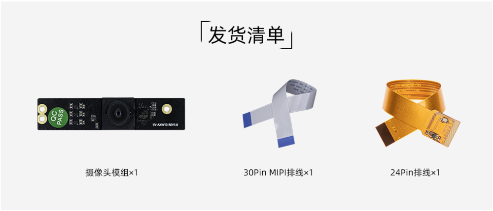

# 一、产品介绍
## 产品简介
CAM-8MS1M 是一款 MIPI 宽动态模组，可见光采用 8M 宽动态传感器，优质的宽动态效果将适应更多恶劣场景，减少复杂光线环境对识别算法产生的不良影响，采用标准MIPI接口输出高质量视频流；产品主要应用于人脸识别门禁、考勤、闸机、人证机等场景。

## 发货清单

## 详细参数

|| 参数 |
| ---- | ---- |
|Sensor型号|SC8238|
|CMOS光感原件|1/2.7 sensor/RGB|
|ISP|自带 XC7160|
|最大分辨率|3840(H) x 2160(V) (16:9)|
|传感器像素尺寸| 1.5um x 1.5um|
|低照度|≤0.3Lux/F2.4|
|图像传输速率|4K/25fps|
|信噪比|36dB|
|动态范围|>100dB|
|无畸变镜头|M8 x 0.25镜头/650NM滤光片|
|FOV视场角|H:84°, V:50°|
|光圈|F2.0|
|镜头焦距|4.3mm|
|对焦类型|定焦，对焦距离70cm|
|畸变|TV Distortion<1%|
|镜头CRA|<19.4°|
|镜头温度范围|-20° ~ +65°|
|镜头结构|5P|
|视频输出格式|YUV/MJPG|
|红外灯(IR)|NC|
|供电方式|5V 供电，纹波不高于 80mV|
|模组接线方式|0.5mm FPC连接器 (**模组端**是30pin，而**板子端**则需要根据实际的硬件接口)|
|电源功耗|5V/270mA±10%|
|工作温度|-10℃ ~ +55℃(Humidity:10%RH ~ 75%RH)|
|储藏温度|-20℃ ~ +65℃(Humidity:10%RH ~ 75%RH)|
|尺寸|12.5mm x 59.5mm|

<!--
## 接口定义
## 产品选型
-->

# 二、使用方法

<!--
## 使用说明
-->

## 硬件连接

Firefly的开发板有两种MIPI CSI接口，分别是30pin和24pin接口，连接时需注意区分方向，且只能连接对应Pin口数的CSI接口，以下是统一接口示意图：

### 30pin MIPI CSI接口连接

### 24pin MIPI CSI接口连接

注意：不要接到带有`MIPI DSI`字样的接口，这可能会导致烧坏模组或者开发板。

详细接口定义参考:

| 主控 | 板卡型号 | 
| ---- | ---- | 
| RK3399 | [AIO-3399J](../../../modules_img/CAM-8MS1M/cam-8ms1m_AIO-3399J.png), [AIO-3399JD4](../../../modules_img/CAM-8MS1M/cam-8ms1m_AIO-3399JD4.png), [ROC-RK3399-PC-PLUS](../../../modules_img/CAM-8MS1M/cam-8ms1m_ROC-RK3399-PC-PLUS.png), [ROC-RK3399-PC-Pro](../../../modules_img/CAM-8MS1M/cam-8ms1m_ROC-RK3399-PC-Pro.png)| 
| RK3399Pro | [AIO-3399ProC](../../../modules_img/CAM-8MS1M/cam-8ms1m_AIO-3399ProC.png), [AIO-3399Pro-JD4](../../../modules_img/CAM-8MS1M/cam-8ms1m_AIO-3399Pro-JD4.png) | 
| RK3566 | [AIO-3566JD4](../../../modules_img/CAM-8MS1M/cam-8ms1m_AIO-3566JD4.png), [ROC-RK3566-PC](../../../modules_img/CAM-8MS1M/cam-8ms1m_ROC-RK3566-PC.png) | 
| RK3568 | [AIO-3568J](../../../modules_img/CAM-8MS1M/cam-8ms1m_AIO-3568J.png), [ROC-RK3568-PC](../../../modules_img/CAM-8MS1M/cam-8ms1m_ROC-RK3568-PC.png), [ROC-RK3568-PC SE](../../../modules_img/CAM-8MS1M/cam-8ms1m_ROC-RK3568-PC-SE.jpg) | 
| RK3588 | [ITX-3588J](../../../modules_img/CAM-8MS1M/cam-8ms1m_ITX-3588J.png),[ROC-RK3588S-PC](../../../modules_img/CAM-8MS1M/cam-8ms1m_ROC-RK3588S-PC.png), AIO-3588SJD4: [DPHY](../../../modules_img/CAM-8MS1M/cam-8ms1m_AIO-3588SJD4.jpg) / [DCPHY](../../../modules_img/CAM-8MS1M/cam-8ms1m_dcphy_AIO-3588SJD4.jpg) ,[AIO-3588Q](../../../modules_img/CAM-8MS1M/cam-8ms1m_AIO-3588Q.jpg)|
| RK3576 | [ROC-RK3576-PC](../../主板/ROC-RK3576-PC/usage_camera.md)，[AIO-3576JD4](../../主板/AIO-3576JD4/usage_camera.md)，[AIO-3576Q](../../主板/AIO-3576Q/usage_camera.md)，[AIO-3576C](../../主板/AIO-3576C/usage_camera.md)|

# 三、固件与资料下载
相关文档和固件下载，见官网的[资料下载](https://community.t-firefly.com/doc/download/114.html)。

<!--
## 文档下载
## 配件图纸
## 软件工具
## 固件下载
-->

# 四、入门教程
## 固件烧写

| 主控 | USB 线刷 | SD 卡升级 |
| ---- | ---- | ---- |
|RK3399|[ROC-RK3399-PC-PLUS](../../主板/ROC-RK3399-PC-PLUS/03-upgrade_firmware.md), [AIO-3399JD4](../../核心板/Core-3399-JD4/03-upgrade_firmware.md)  [AIO-3399J](../../主板/AIO-3399J/03-upgrade_firmware.md), [ROC-RK3399-PC-Pro](../../主板/ROC-RK3399-PC-Pro/03-upgrade_firmware.md)| [ROC-RK3399-PC-PLUS](../../主板/ROC-RK3399-PC-PLUS/05-upgrade_firmware_sd.md), [AIO-3399JD4](../../核心板/Core-3399-JD4/05-upgrade_firmware_sd.md)  [AIO-3399J](../../主板/AIO-3399J/05-upgrade_firmware_sd.md), [ROC-RK3399-PC-Pro](../../主板/ROC-RK3399-PC-Pro/05-upgrade_firmware_sd.md) |
|RK3399Pro|[AIO-3399Pro-JD4](../../主板/AIO-3399Pro-JD4/03-upgrade_firmware.md), [AIO-3399ProC](../../主板/AIO-3399ProC/03-upgrade_firmware.md)| [AIO-3399Pro-JD4](../../主板/AIO-3399Pro-JD4/05-upgrade_firmware_sd.md), [AIO-3399ProC](../../主板/AIO-3399ProC/05-upgrade_firmware_sd.md) |
|RK3566|[AIO-3566JD4](../../主板/AIO-3566JD4/03-upgrade_firmware.md), [ROC-RK3566-PC](../../主板/ROC-RK3566-PC/03-upgrade_firmware.md)| [AIO-3566JD4](../../主板/AIO-3566JD4/05-upgrade_firmware_sd.md), [ROC-RK3566-PC](../../主板/ROC-RK3566-PC/05-upgrade_firmware_sd.md) | 
|RK3568|[AIO-3568J](../../主板/AIO-3568J/03-upgrade_firmware.md), [ROC-RK3568-PC](../../主板/ROC-RK3568-PC/03-upgrade_firmware.md), [ROC-RK3568-PC SE](../../主板/ROC-RK3568-PC-SE/03-upgrade_firmware.md) | [AIO-3568J](../../主板/AIO-3568J/05-upgrade_firmware_sd.md), [ROC-RK3568-PC](../../主板/ROC-RK3568-PC/05-upgrade_firmware_sd.md), [ROC-RK3568-PC SE](../../主板/ROC-RK3568-PC-SE/05-upgrade_firmware_sd.md)| 
|RK3588|[ITX-3588J](../../主板/ITX-3588J/upgrade_firmware.md), [ROC-RK3588S-PC](../../主板/ROC-RK3588S-PC/upgrade_firmware.md), [AIO-3588SJD4](../../主板/AIO-3588SJD4/upgrade_firmware.md),[AIO-3588Q](../../主板/AIO-3588Q/upgrade_firmware.md)|[ITX-3588J](../../主板/ITX-3588J/upgrade_firmware_sd.md), [ROC-RK3588S-PC](../../主板/ROC-RK3588S-PC/upgrade_firmware_sd.md), [AIO-3588SJD4](../../主板/AIO-3588SJD4/upgrade_firmware_sd.md) , [AIO-3588Q](../../主板/AIO-3588Q/upgrade_firmware_sd.md)|
|RK3576|[ROC-RK3576-PC](../../主板/ROC-RK3576-PC/upgrade_firmware.md),[AIO-3576JD4](../../主板/AIO-3576JD4/upgrade_firmware.md),[AIO-3576Q](../../主板/AIO-3576Q/upgrade_firmware.md)|[ROC-RK3576-PC](../../主板/ROC-RK3576-PC/upgrade_firmware_sd.md),[AIO-3576JD4](../../主板/AIO-3576JD4/upgrade_firmware_sd.md),[AIO-3576Q](../../主板/AIO-3576Q/upgrade_firmware_sd.md),[AIO-3576C](../../主板/AIO-3576C/upgrade_firmware_sd.md)|

## 固件制作

<!--
### RK3128 系列

| 系统  | 板卡型号 | 
| ---- | ---- | 
| Android5.1 | [Firefly-RK3128](), [AIO-3128C]() | 
| Ubuntu | [Firefly-RK3128]() | 

### RK3288 系列

| 系统 | 板卡型号 | 
| ---- | ---- | 
| Android5.1  | [Firefly-RK3288](), [AIO-3288J](), [AIO-3288C]() | 
| Ubuntu | [Firefly-RK3288](), [AIO-3288J](), [AIO-3288C]() | 
| Buildroot | [Firefly-RK3288](), [AIO-3288J](), [AIO-3288C]() |

### RK3308 系列

| 系统 | 板卡型号 | 
| ---- | ---- | 
| Buildroot | [ROC-RK3308-CC](), [ROC-RK3308B-CC-PLUS]() |

### RK3328 系列

| 系统 | 板卡型号 | 
| ---- | ---- | 
| Android7.1 Industry | [ROC-RK3328-CC]()|
| Android8.1 | [ROC-RK3328-CC]() |
| Android10.0  | [ROC-RK3328-PC]() | 
| Ubuntu | [ROC-RK3328-CC](), [ROC-RK3328-PC]() | 

-->

### RK3399 系列

<!--
| 系统 | 板卡型号 | 
| ---- | ---- | 
| Android7.1 Industry | [Firefly-RK3399](), [ROC-RK3399-PC](), [ROC-RK3399-PC-PLUS](), [ROC-RK3399-PC-Pro](), [AIO-3399JD4](), [AIO-3399J](), [AIO-3399C]() | 
| Android10.0 | [ROC-RK3399-PC-PLUS](), [ROC-RK3399-PC-Pro](),[AIO-3399J](), [AIO-3399C]() | 
| Ubuntu | [Firefly-RK3399](), [ROC-RK3399-PC](), [ROC-RK3399-PC-PLUS](), [ROC-RK3399-PC-Pro](), [AIO-3399JD4](), [AIO-3399J](), [AIO-3399C]() | 
| Buildroot | [Firefly-RK3399](), [ROC-RK3399-PC](), [ROC-RK3399-PC-PLUS](), [ROC-RK3399-PC-Pro](), [AIO-3399JD4](), [AIO-3399J](), [AIO-3399C]() | 
-->

| 系统 | 板卡型号 | 
| ---- | ---- | 
| Android7.1 Industry | [ROC-RK3399-PC-PLUS](../../主板/ROC-RK3399-PC-PLUS/compile_android7.1_industry_firmware.md#gong-ban-bian-yi), [ROC-RK3399-PC-Pro](../../主板/ROC-RK3399-PC-Pro/compile_android7.1_industry_firmware.md#gong-ban-bian-yi), [AIO-3399JD4](../../核心板/Core-3399-JD4/compile_android7.1_industry_firmware.md#gong-ban-bian-yi), [AIO-3399J](../../主板/AIO-3399J/compile_android7.1_industry_firmware.md#gong-ban-bian-yi) |
| Android10.0 | [ROC-RK3399-PC-PLUS](../../主板/ROC-RK3399-PC-PLUS/compile_android10.0_firmware.md#gong-ban-bian-yi), [ROC-RK3399-PC-Pro](../../主板/ROC-RK3399-PC-Pro/compile_android10.0_firmware.md#gong-ban-bian-yi),[AIO-3399J](../../主板/AIO-3399J/compile_android10.0_firmware.md#gong-ban-bian-yi) | 
| Ubuntu | [ROC-RK3399-PC-PLUS](../../主板/ROC-RK3399-PC-PLUS/linux_compile_gpt.md), [ROC-RK3399-PC-Pro](../../主板/ROC-RK3399-PC-Pro/linux_compile_gpt.md), [AIO-3399JD4](../../核心板/Core-3399-JD4/linux_compile_gpt.md), [AIO-3399J](../../主板/AIO-3399J/linux_compile_gpt.md) |

### RK3399Pro 系列

| 系统 | 板卡型号 | 
| ---- | ---- | 
| Android9.0 | [AIO-3399Pro-JD4](../../主板/AIO-3399Pro-JD4/compile_android9.0_firmware.md#shuang-mu-she-xiang-tou-sv-taysh-tq-bian-yi), [AIO-3399ProC](../../主板/AIO-3399ProC/compile_android9.0_firmware.md#shuang-mu-she-xiang-tou-sv-taysh-tq-bian-yi) | 
| Ubuntu | [AIO-3399Pro-JD4](../../主板/AIO-3399Pro-JD4/linux_compile_gpt.md), [AIO-3399ProC](../../主板/AIO-3399ProC/linux_compile_gpt.md) | 

### RK3566 系列

| 系统 | 板卡型号 | 
| ---- | ---- | 
| Android11.0 | [AIO-3566JD4](../../主板/AIO-3566JD4/compile_android11.0_firmware.md#gong-ban-bian-yi), [ROC-RK3566-PC](../../主板/ROC-RK3566-PC/compile_android11.0_firmware.md#gong-ban-bian-yi) | 
| Ubuntu | [AIO-3566JD4](../../主板/AIO-3566JD4/linux_compile_linux5.10.md#bian-yi-ubuntu-gu-jian), [ROC-RK3566-PC](../../主板/ROC-RK3566-PC/linux_compile_linux5.10.md#bian-yi-ubuntu-gu-jian) |
| Buildroot | [AIO-3566JD4](../../主板/AIO-3566JD4/linux_compile_linux5.10.md#bian-yi-buildroot-gu-jian), [ROC-RK3566-PC](../../主板/ROC-RK3566-PC/linux_compile_linux5.10.md#bian-yi-buildroot-gu-jian) |

### RK3568 系列

| 系统 | 板卡型号 | 
| ---- | ---- | 
| Android11.0 | [AIO-3568J](../../主板/AIO-3568J/compile_android11.0_firmware.md#gong-ban-bian-yi), [ROC-RK3568-PC](../../主板/ROC-RK3568-PC/compile_android11.0_firmware.md#gong-ban-bian-yi), [ROC-RK3568-PC SE](../../主板/ROC-RK3568-PC-SE/compile_android11.0_firmware.md#gong-ban-bian-yi) | 
| Ubuntu | [AIO-3568J](../../主板/AIO-3568J/linux_compile_linux5.10.md#bian-yi-ubuntu-gu-jian), [ROC-RK3568-PC](../../主板/ROC-RK3568-PC/linux_compile_linux5.10.md#bian-yi-ubuntu-gu-jian) |
| Buildroot | [AIO-3568J](../../主板/AIO-3568J/linux_compile_linux5.10.md#bian-yi-buildroot-gu-jian), [ROC-RK3568-PC](../../主板/ROC-RK3568-PC/linux_compile_linux5.10.md#bian-yi-buildroot-gu-jian) |

### RK3588 系列

| 系统 | 板卡型号 | 
| ---- | ---- | 
| Android12.0 | [ITX-3588J](../../主板/ITX-3588J/android_compile_android12.0_firmware.md),[ROC-RK3588S-PC](../../主板/ROC-RK3588S-PC/android_compile_android12.0_firmware.md),[AIO-3588SJD4](../../主板/AIO-3588SJD4/android_compile_android12.0_firmware.md),[AIO-3588Q](../../主板/AIO-3588Q/android_compile_android12.0_firmware.md)|
| Buildroot | [ITX-3588J](../../主板/ITX-3588J/linux_compile.md#bian-yi-buildroot-gu-jian),[ROC-RK3588S-PC](../../主板/ROC-RK3588S-PC/linux_compile.md#bian-yi-buildroot-gu-jian),[AIO-3588SJD4](../../主板/AIO-3588SJD4/linux_compile.md#bian-yi-buildroot-gu-jian),[AIO-3588Q](../../主板/AIO-3588Q/linux_compile.md#bian-yi-buildroot-gu-jian),[AIO-3588MQ](../../主板/AIO-3588MQ/linux_compile.md#bian-yi-buildroot-gu-jian),[AIO-3588JQ](../../主板/AIO-3588JQ/linux_compile.md#bian-yi-buildroot-gu-jian)|
| Ubuntu20.04 | [ITX-3588J](../../主板/ITX-3588J/linux_compile.md#bian-yi-ubuntu-gu-jian),[ROC-RK3588S-PC](../../主板/ROC-RK3588S-PC/linux_compile.md#bian-yi-ubuntu-gu-jian),[AIO-3588SJD4](../../主板/AIO-3588SJD4/linux_compile.md#bian-yi-ubuntu-gu-jian),[AIO-3588Q](../../主板/AIO-3588Q/linux_compile.md#bian-yi-ubuntu-gu-jian),[AIO-3588MQ](../../主板/AIO-3588MQ/linux_compile.md#bian-yi-ubuntu-gu-jian),[AIO-3588JQ](../../主板/AIO-3588JQ/linux_compile.md#bian-yi-ubuntu-gu-jian)|
| Debian11 | [ITX-3588J](../../主板/ITX-3588J/linux_compile.md#bian-yi-debian-gu-jian),[ROC-RK3588S-PC](../../主板/ROC-RK3588S-PC/linux_compile.md#bian-yi-debian-gu-jian),[AIO-3588SJD4](../../主板/AIO-3588SJD4/linux_compile.md#bian-yi-debian-gu-jian),[AIO-3588Q](../../主板/AIO-3588Q/linux_compile.md#bian-yi-debian-gu-jian),[AIO-3588MQ](../../主板/AIO-3588MQ/linux_compile.md#bian-yi-debian-gu-jian),[AIO-3588JQ](../../主板/AIO-3588JQ/linux_compile.md#bian-yi-debian-gu-jian)|

### RK3576 系列

| 系统 | 板卡型号 | 
| ---- | ---- | 
| Android14.0 | [ROC-RK3576-PC](../../主板/ROC-RK3576-PC/android_compile_android14.0_firmware.md)，[AIO-3576JD4](../../主板/AIO-3576JD4/android_compile_android14.0_firmware.md)，[AIO-3576Q](../../主板/AIO-3576Q/android_compile_android14.0_firmware.md)，[AIO-3576C](../../主板/AIO-3576C/android_compile_android14.0_firmware.md)|
| Linux | [ROC-RK3576-PC](../../主板/ROC-RK3576-PC/linux_compile.md)，[AIO-3576JD4](../../主板/AIO-3576JD4/linux_compile.md)，[AIO-3576Q](../../主板/AIO-3576Q/linux_compile.md)，[AIO-3576C](../../主板/AIO-3576C/linux_compile.md)|