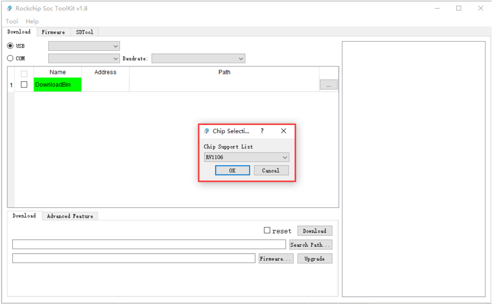
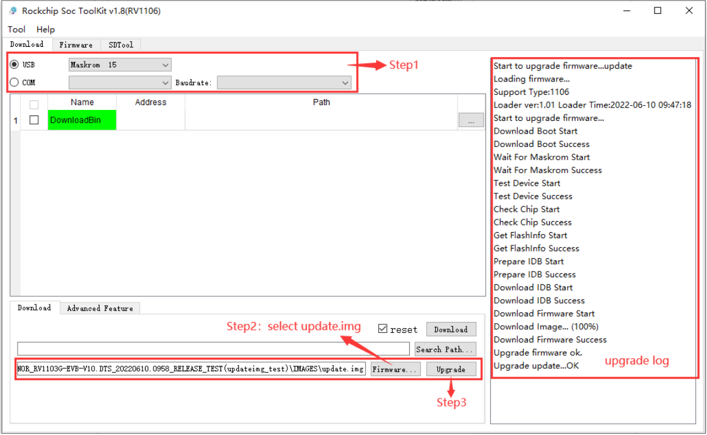
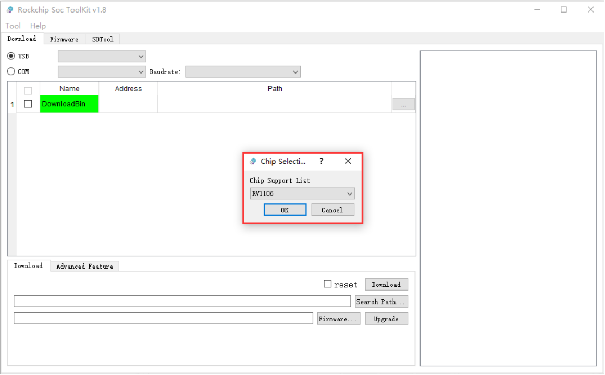
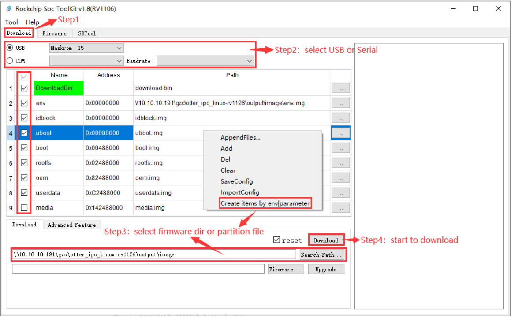

# 使用USB线缆升级固件

## 前言

本文介绍了如何将主机上的固件，通过USB 数据线烧录到 CT36L/CT36B 开发板的存储器中。升级时，需要根据主机操作系统和固件类型来选择合适的升级方式。

## 准备工具
* CT36L/CT36B
* [固件](https://community.t-firefly.com/doc/download/214.html)
* 主机
* 良好的 USB 数据线

## 准备固件
固件可以通过编译SDK获得，也可以通过[资源下载](https://community.t-firefly.com/doc/download/214.html)处下载公版固件（统一固件）。固件文件一般有两种：

* 单个统一固件

    统一固件是由分区表、bootloader、uboot、kernel、system 等所有文件打包合并成的单个文件。Firefly正式发布的固件都是采用统一固件格式，升级统一固件将会更新主板上所有分区的数据和分区表，并且擦除主板上所有数据。

* 多个分区镜像

    即各个功能独立的文件，如分区表、bootloader、kernel 等，在开发阶段生成。独立分区镜像可以只更新指定的分区，而保持其它分区数据不被破坏，在开发过程中会很方便调试。

>    通过统一固件解包/打包工具，可以把统一固件解包为多个分区镜像，也可以将多个分区镜像合并为一个统一固件。


## 安装烧写工具
### Windows操作系统
* 安装RK USB驱动

下载 [Release_DriverAssistant.zip](https://community.t-firefly.com/doc/download/214.html)，解压，然后运行里面的 DriverInstall.exe 。为了所有设备都使用更新的驱动，请先选择`驱动卸载`，然后再选择`驱动安装`。


* 运行 SocToolKit 的 SocToolKit.exe




### Linux操作系统
Linux 下无须安装设备驱动
* [Linux_Upgrade_Tool](https://community.t-firefly.com/doc/download/214.html)工具

下载 [Linux_Upgrade_Tool](https://community.t-firefly.com/doc/download/214.html), 并按以下方法安装到系统中，方便调用：

```shell
cd Linux_Upgrade_Tool
cp 88-rockusb.rules /etc/udev/rules.d/

# restart udev 的命令:
sudo udevadm control --reload-rules
sudo service udev restart

sudo cp upgrade_tool /usr/local/bin
sudo chown root:root /usr/local/bin/upgrade_tool
sudo chmod a+x /usr/local/bin/upgrade_tool
```

## 进入升级模式
通常我们升级固件的 MaskRom 模式。烧写固件前，我们需要连接好设备，并让板子进入到可升级模式。

### MaskRom模式
进入 MaskRom 模式的方法，请参考[《MaskRom模式》](upgrade_maskrom_mode.md)


## 烧写固件

* **<font color=#ff0000 >注意：烧写固件需要拆开整机外壳</font>**

### windows操作系统

#### 烧写统一固件 update.img
注：需要 1.8 或更高版本的 SocToolKit 工具才能支持 update.img 烧写功能。

烧写统一固件 update.img 的步骤如下:

1. 设备进入 MaskRom 模式。
2. 选择 RV1106 芯片平台。
3. 点击左上角 Download 按钮切换到 Download 页面。
4. 选择烧录方式，支持串口烧录和 USB 烧录。建议使用 USB 烧录。
5. 选择 update.img 统一固件文件。
6. 点击右下角的 `Upgrade` 按钮开始升级。




#### 烧写分区映像
烧写分区映像的步骤如下：

1. 设备进入 MaskRom 模式。
2. 选择 RV1106 芯片平台。
3. 点击左上角 Download 按钮切换到 Download 页面。
4. 选择烧录方式，支持串口烧录和 USB 烧录。建议使用 USB 烧录。
5. 选择对应的分区固件文件。
6. 按右下角的 `Download` 按钮开始升级。




### Linux操作系统

#### 烧写统一固件 update.img

Linux 上没有工具可以烧写统一固件。但是可以通过脚本进行分区镜像烧写，烧写效果和统一固件是一样的。参照下文描述的分区镜像烧写方式进行操作。

#### 烧写分区镜像

使用 Linux_Upgrade_Tool 目录下的 rkdownload.sh 脚本进行分区镜像烧录：

例如分区镜像放置在 output/image 目录，则查看 output/image 编译输出目录下的分区镜像
```shell
ls output/image/
boot.img  download.bin  env.img  idblock.img  oem.img  rootfs.img  sd_update.txt  tftp_update.txt  uboot.img  update.img  userdata.img
```

拷贝 rkdownload.sh 脚本到 /usr/local/bin 目录方便全局调用
```shell
sudo cp rkdownload.sh /usr/local/bin/
```

指定 output/image 目录下的分区镜像进行烧写
```bash
sudo rkdownload.sh -d output/image
```

如果因 flash 问题导致升级时出错，可以尝试低级格式化、擦除操作：
```bash
sudo upgrade_tool ef output/image/download.bin
```
等待格式化、擦除操作完成后，再尝试进行镜像烧写。

## 常见问题

### 如何强行进入 MaskRom 模式

操作方法见[《MaskRom模式》](upgrade_maskrom_mode.md)。

### 烧写失败分析

如果烧写过程中出现Download Boot Fail, 或者烧写过程中出错，通常是由于使用的USB线连接不良、劣质线材，或者电脑USB口驱动能力不足导致的，请更换USB线或者电脑USB端口排查。

[Androidtool_xxx(版本号)]: http://www.t-firefly.com/share/index/index/id/2ea171f2235fe841e89734ca5189da8b.
[AndroidTool]: http://www.t-firefly.com/share/index/index/id/2ea171f2235fe841e89734ca5189da8b.html
[Release_DriverAssistant.zip]: http://www.t-firefly.com/share/index/index/id/1f98ebd663ed09a32e9ebf3fa893dfc0.html
[Linux_Upgrade_Tool]: http://www.t-firefly.com/share/index/index/id/f756718dd2bbf82eb405926549e75ef3.html
[Linux_adb_fastboot]: http://www.t-firefly.com/share/index/index/id/c64b7d743d9368de521a6ced87813dc5.html
