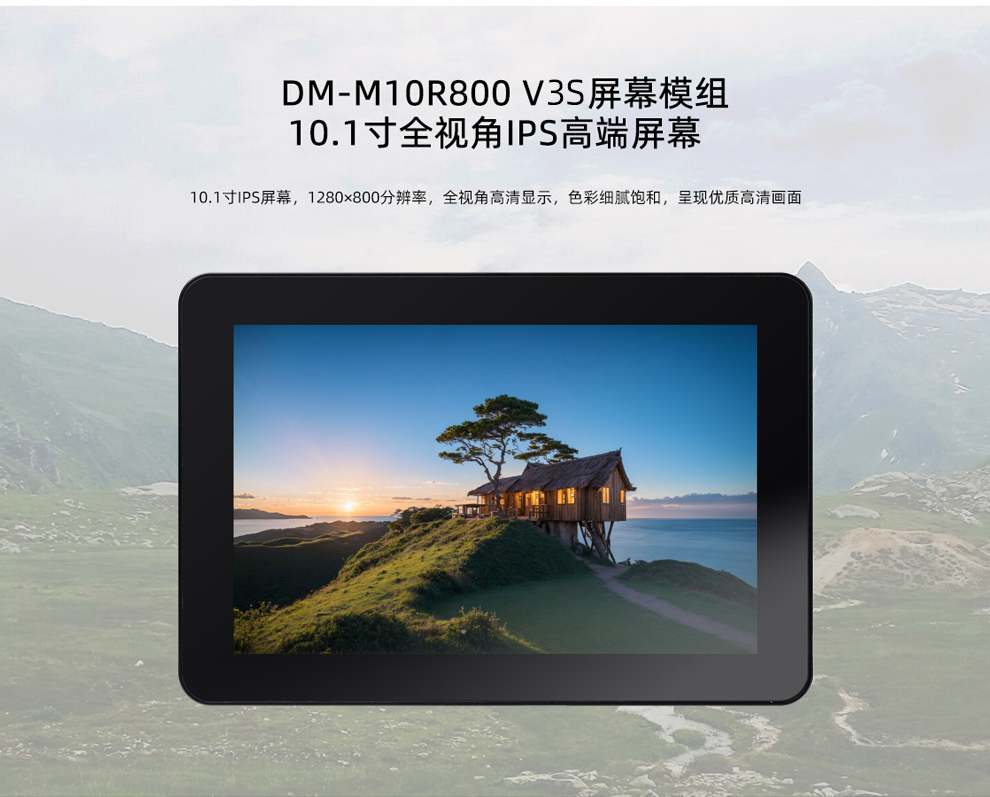
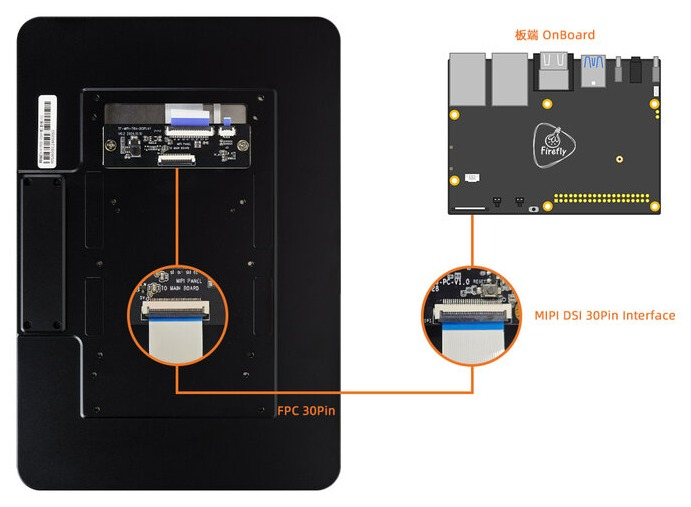
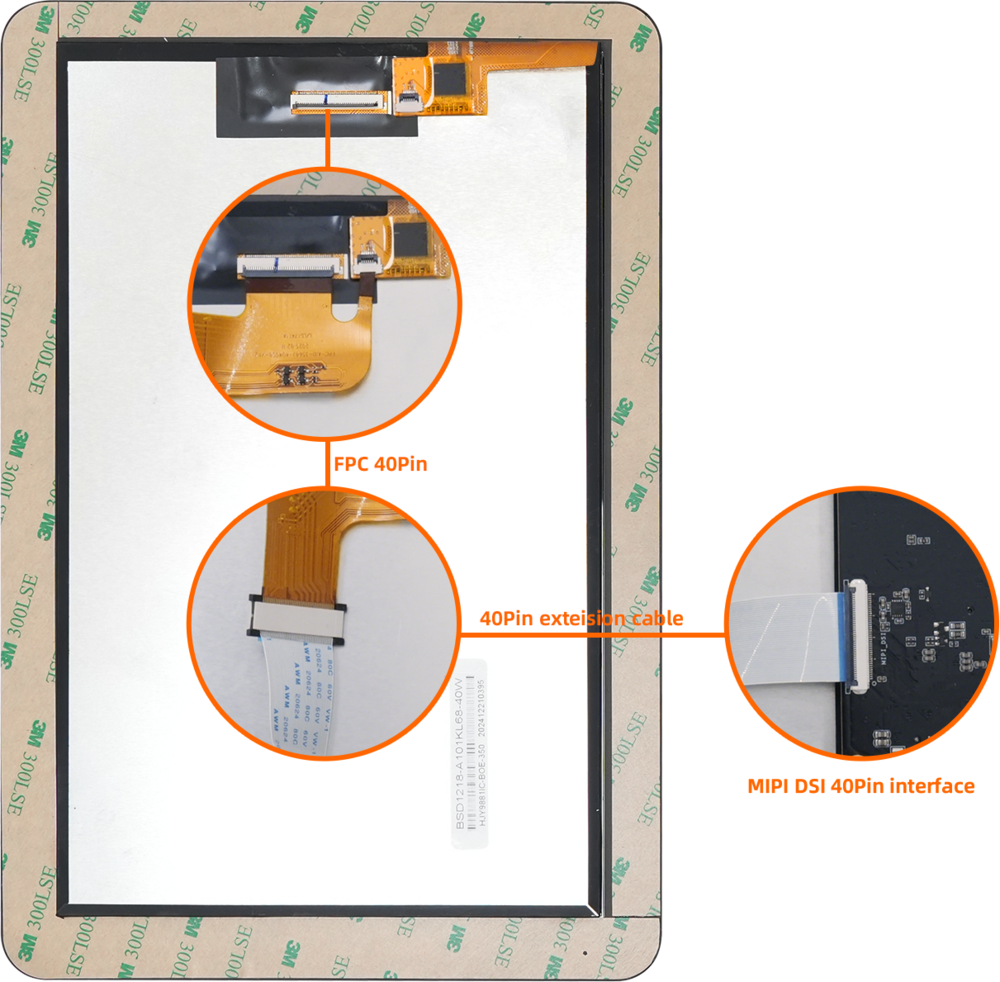

# 一、产品介绍
## 产品简介

<!--
## 发货清单
-->

## 详细参数

||参数|
|----|----|
|型号|BSD1218-A101KL68|
|屏幕|10.1寸 IPS 屏幕|
|分辨率|800x1280像素（10:16）|
|触摸屏|电容式多点触摸屏|
|显示|MIPI 接口|

<!--
## 接口定义
## 产品选型
-->

# 二、使用方法

<!--
## 使用说明
-->

## 硬件连接

### 30pin MIPI DSI接口连接

### 40pin MIPI DSI接口连接

连接说明: 
* 由于不同开发板接口对应的丝印有所不同，比如`MIPI_DSI`、`MIPI-DSI`、`DSI_MIPI`，默认连接带`MIPI DSI`字样丝印的接口；
* 如果开发板存在多个`MIPI DSI`接口，比如`MIPI_DSI0`、`MIPI_DSI1`、`DSI0_MIPI`、`DSI1_MIPI`，默认连接带`MIPI DSI0`字样丝印的接口；
* 使用30pin 同向FPC排线，处于**断电状态**按上图连接到板端对应的`MIPI DSI`接口；

注意：不要接到带有`MIPI CSI`字样的接口，这可能会导致烧坏模组或者开发板。

详细接口定义参考:

| 主控 |  板卡型号 |
| ---- | ---- |
|RK3566|[AIO-3566JD4](../../主板/AIO-3566JD4/interface_definition.md), [ROC-RK3566-PC](../../主板/ROC-RK3566-PC/interface_definition.md)| 
|RK3568|[AIO-3568J](../../主板/AIO-3568J/interface_definition.md), [ROC-RK3568-PC](../../主板/ROC-RK3568-PC/interface_definition.md), [ROC-RK3568-PC SE](../../主板/ROC-RK3568-PC-SE/interface_definition.md), [ITX-3568JQ](../../主板/ITX-3568JQ/interface_definition.md) |
|RK3588|[ITX-3588J](../../主板/ITX-3588J/interface_definition.md), [AIO-3588Q](../../主板/AIO-3588Q/interface_definition.md), [AIO-3588L](../../主板/AIO-3588L/interface_definition.md) |
|RK3588S|[ROC-RK3588S-PC](../../主板/ROC-RK3588S-PC/interface_definition.md),[AIO-3588SJD4](../../主板/AIO-3588SJD4/interface_definition.md),[AIO-3588SG](../../主板/AIO-3588SG/interface_definition.md) |
| RK3576|[ROC-RK3576-PC](../../主板/ROC-RK3576-PC/interface_definition.md),[AIO-3576Q](../../主板/AIO-3576Q/interface_definition.md), [AIO-3576C](../../主板/AIO-3576C/interface_definition.md)|
|RK3399|[AIO-3399C](../../主板/AIO-3399C/interface_definition.md), [ROC-RK3399-PC-PLUS](../../主板/ROC-RK3399-PC-PLUS/started.md)| 

# 三、固件与资料下载
相关文档和固件下载，见官网的[资料下载](https://community.t-firefly.com/doc/download/291)。

<!--
## 文档下载
## 配件图纸
## 软件工具
## 固件下载
-->

# 四、入门教程
## 固件烧写

| 主控 | USB 线刷 | SD 卡升级 |
| ---- | ---- | ---- |
|RK3566|[AIO-3566JD4](../../主板/AIO-3566JD4/03-upgrade_firmware.md), [ROC-RK3566-PC](../../主板/ROC-RK3566-PC/03-upgrade_firmware.md)| [AIO-3566JD4](../../主板/AIO-3566JD4/05-upgrade_firmware_sd.md), [ROC-RK3566-PC](../../主板/ROC-RK3566-PC/05-upgrade_firmware_sd.md) | 
|RK3568|[AIO-3568J](../../主板/AIO-3568J/03-upgrade_firmware.md), [ROC-RK3568-PC](../../主板/ROC-RK3568-PC/03-upgrade_firmware.md), [ROC-RK3568-PC SE](../../主板/ROC-RK3568-PC-SE/03-upgrade_firmware.md), [ITX-3568JQ](../../主板/ITX-3568JQ/03-upgrade_firmware.md) | [AIO-3568J](../../主板/AIO-3568J/05-upgrade_firmware_sd.md), [ROC-RK3568-PC](../../主板/ROC-RK3568-PC/05-upgrade_firmware_sd.md), [ROC-RK3568-PC SE](../../主板/ROC-RK3568-PC-SE/05-upgrade_firmware_sd.md), [ITX-3568JQ](../../主板/ITX-3568JQ/05-upgrade_firmware_sd.md)| 
|RK3588|[ITX-3588J](../../主板/ITX-3588J/upgrade_firmware.md), [AIO-3588Q](../../主板/AIO-3588Q/upgrade_firmware.md), [AIO-3588L](../../主板/AIO-3588L/upgrade_firmware.md) | [ITX-3588J](../../主板/ITX-3588J/upgrade_firmware_sd.md), [AIO-3588Q](../../主板/AIO-3588Q/upgrade_firmware_sd.md), [AIO-3588L](../../主板/AIO-3588L/upgrade_firmware_sd.md) |
|RK3588S|[ROC-RK3588S-PC](../../主板/ROC-RK3588S-PC/upgrade_firmware.md),[AIO-3588SJD4](../../主板/AIO-3588SJD4/upgrade_firmware.md),[AIO-3588SG](../../主板/AIO-3588SG/upgrade_firmware.md) | [ROC-RK3588S-PC](../../主板/ROC-RK3588S-PC/upgrade_firmware_sd.md), [AIO-3588SJD4](../../主板/AIO-3588SJD4/upgrade_firmware_sd.md), [AIO-3588SG](../../主板/AIO-3588SG/upgrade_firmware_sd.md) |
| RK3576|[ROC-RK3576-PC](../../主板/ROC-RK3576-PC/upgrade_firmware.md),[AIO-3576Q](../../主板/AIO-3576Q/upgrade_firmware.md),[AIO-3576C](../../主板/AIO-3576C/upgrade_firmware.md)|[ROC-RK3576-PC](../../主板/ROC-RK3576-PC/upgrade_firmware_sd.md),[AIO-3576Q](../../主板/AIO-3576Q/upgrade_firmware_sd.md),[AIO-3576C](../../主板/AIO-3576C/upgrade_firmware_sd.md)|
| RK3399|[ROC-RK3399-PC-PLUS](../../主板/ROC-RK3399-PC-PLUS/03-upgrade_firmware.md),[AIO-3399C(AI)](../../主板/AIO-3399C/03-upgrade_firmware.md)| [ROC-RK3399-PC-PLUS](../../主板/ROC-RK3399-PC-PLUS/05-upgrade_firmware_sd.md),[AIO-3399C(AI)](../../主板/AIO-3399C/05-upgrade_firmware_sd.md)|

<!--
|RK3399Pro|[AIO-3399Pro-JD4](../../主板/AIO-3399Pro-JD4/03-upgrade_firmware.md), [AIO-3399ProC](../../主板/AIO-3399ProC/03-upgrade_firmware.md)| [AIO-3399Pro-JD4](../../主板/AIO-3399Pro-JD4/05-upgrade_firmware_sd.md), [AIO-3399ProC](../../主板/AIO-3399ProC/05-upgrade_firmware_sd.md) |
| RV1126_RV1109|[AIO-1126-JD4](../../主板/AIO-1126-JD4/upgrade.md), [AIO-1109-JD4](../../主板/AIO-1109-JD4/upgrade.md), [CAM-C1126S2U](../../AI摄像机/CAM-C1126S2U/upgrade.md), [CAM-C1109S2U](../../AI摄像机/CAM-C1109S2U/upgrade.md) | [AIO-1126-JD4](../../主板/AIO-1126-JD4/upgrade.md#shi-yong-sd-ka-sheng-ji-gu-jian), [AIO-1109-JD4](../../主板/AIO-1109-JD4/upgrade.md#shi-yong-sd-ka-sheng-ji-gu-jian)
| RK3588|[ITX-3588J](../../主板/ITX-3588J/upgrade_firmware.md), [ROC-RK3588S-PC](../../主板/ROC-RK3588S-PC/upgrade_firmware.md), [AIO-3588SJD4](../../主板/AIO-3588SJD4/upgrade_firmware.md),[AIO-3588Q](../../主板/AIO-3588Q/upgrade_firmware.md),[AIO-3588L](../../主板/AIO-3588L/upgrade_firmware.md),[AIO-3588SG](../../主板/AIO-3588SG/upgrade_firmware.md)|[ITX-3588J](../../主板/ITX-3588J/upgrade_firmware_sd.md), [ROC-RK3588S-PC](../../主板/ROC-RK3588S-PC/upgrade_firmware_sd.md), [AIO-3588SJD4](../../主板/AIO-3588SJD4/upgrade_firmware_sd.md),[AIO-3588Q](../../主板/AIO-3588Q/upgrade_firmware_sd.md),[AIO-3588L](../../主板/AIO-3588L/upgrade_firmware_sd.md),[AIO-3588SG](../../主板/AIO-3588SG/upgrade_firmware_sd.md)| 
-->

## 固件制作

### RK3566 系列

|  系统   |  板卡型号 |
|  ----  | ----  |
| Android11.0  | [AIO-3566JD4](../../主板/AIO-3566JD4/compile_android11.0_firmware.md#xian-shi-ping-dm-m10r800-v3s-bian-yi), [ROC-RK3566-PC](../../主板/ROC-RK3566-PC/compile_android11.0_firmware.md#xian-shi-ping-dm-m10r800-v3s-bian-yi) | 
| Ubuntu | [AIO-3566JD4](../../主板/AIO-3566JD4/linux_compile_linux5.10.md#bian-yi-ubuntu-gu-jian), [ROC-RK3566-PC](../../主板/ROC-RK3566-PC/linux_compile_linux5.10.md#bian-yi-ubuntu-gu-jian) |
| Buildroot | [AIO-3566JD4](../../主板/AIO-3566JD4/linux_compile_linux5.10.md#bian-yi-buildroot-gu-jian), [ROC-RK3566-PC](../../主板/ROC-RK3566-PC/linux_compile_linux5.10.md#bian-yi-buildroot-gu-jian) |

### RK3568 系列

|  系统   |  板卡型号 |
|  ----  | ----  |
| Android11.0  | [AIO-3568J](../../主板/AIO-3568J/compile_android11.0_firmware.md#xian-shi-ping-dm-m10r800-v3s-bian-yi), [ROC-RK3568-PC](../../主板/ROC-RK3568-PC/compile_android11.0_firmware.md#xian-shi-ping-dm-m10r800-v3s-bian-yi), [ROC-RK3568-PC SE](../../主板/ROC-RK3568-PC-SE/compile_android11.0_firmware.md#xian-shi-ping-dm-m10r800-v3s-bian-yi), [ITX-3568JQ](../../主板/ITX-3568JQ/compile_android11.0_firmware.md#xian-shi-ping-dm-m10r800-v3s-bian-yi) | 
| Ubuntu | [AIO-3568J](../../主板/AIO-3568J/linux_compile_linux5.10.md#bian-yi-ubuntu-gu-jian), [ROC-RK3568-PC](../../主板/ROC-RK3568-PC/linux_compile_linux5.10.md#bian-yi-ubuntu-gu-jian), [ROC-RK3568-PC SE](../../主板/ROC-RK3568-PC-SE/linux_compile_linux5.10.md#bian-yi-ubuntu-gu-jian), [ITX-3568JQ](../../主板/ITX-3568JQ/linux_compile_linux5.10.md#bian-yi-ubuntu-gu-jian) |
| Buildroot | [AIO-3568J](../../主板/AIO-3568J/linux_compile_linux5.10.md#bian-yi-buildroot-gu-jian), [ROC-RK3568-PC](../../主板/ROC-RK3568-PC/linux_compile_linux5.10.md#bian-yi-buildroot-gu-jian), [ROC-RK3568-PC SE](../../主板/ROC-RK3568-PC-SE/linux_compile_linux5.10.md#bian-yi-buildroot-gu-jian),, [ITX-3568JQ](../../主板/ITX-3568JQ/linux_compile_linux5.10.md#bian-yi-buildroot-gu-jian) |

### RK3588 系列

|  系统   |  板卡型号 |
|  ----  | ----  |
| Android14.0  | [ITX-3588J](../../主板/ITX-3588J/android_compile_android14.0_firmware.md#xian-shi-ping-dm-m10r800-v3s-gu-jian-bian-yi), [AIO-3588Q](../../主板/AIO-3588Q/android_compile_android14.0_firmware.md#xian-shi-ping-dm-m10r800-v3s-gu-jian-bian-yi), [AIO-3588L](../../主板/AIO-3588L/android_compile_android14.0_firmware.md#xian-shi-ping-dm-m10r800-v3s-gu-jian-bian-yi) |
| Ubuntu | [ITX-3588J](../../主板/ITX-3588J/linux_compile.md#bian-yi-ubuntu-gu-jian), [AIO-3588Q](../../主板/AIO-3588Q/linux_compile.md#bian-yi-ubuntu-gu-jian), [AIO-3588L](../../主板/AIO-3588L/linux_compile.md#bian-yi-ubuntu-gu-jian)|
| Buildroot | [ITX-3588J](../../主板/ITX-3588J/linux_compile.md#bian-yi-buildroot-gu-jian), [AIO-3588Q](../../主板/AIO-3588Q/linux_compile.md#bian-yi-buildroot-gu-jian), [AIO-3588L](../../主板/AIO-3588L/linux_compile.md#bian-yi-buildroot-gu-jian) |

### RK3588S 系列

|  系统   |  板卡型号 |
|  ----  | ----  |
| Android14.0  | [ROC-RK3588S-PC](../../主板/ROC-RK3588S-PC/android_compile_android14.0_firmware.md#xian-shi-ping-dm-m10r800-v3s-gu-jian-bian-yi), [AIO-3588SJD4](../../主板/AIO-3588SJD4/android_compile_android14.0_firmware.md#xian-shi-ping-dm-m10r800-v3s-gu-jian-bian-yi), [AIO-3588SG](../../主板/AIO-3588SG/android_compile_android14.0_firmware.md#xian-shi-ping-dm-m10r800-v3s-gu-jian-bian-yi)|
| Ubuntu | [ROC-RK3588S-PC](../../主板/ROC-RK3588S-PC/linux_compile.md#bian-yi-ubuntu-gu-jian), [AIO-3588SJD4](../../主板/AIO-3588SJD4/linux_compile.md#bian-yi-ubuntu-gu-jian), [AIO-3588SG](../../主板/AIO-3588SG/linux_compile.md#bian-yi-ubuntu-gu-jian) |
| Buildroot | [ROC-RK3588S-PC](../../主板/ROC-RK3588S-PC/linux_compile.md#bian-yi-buildroot-gu-jian), [AIO-3588SJD4](../../主板/AIO-3588SJD4/linux_compile.md#bian-yi-buildroot-gu-jian), [AIO-3588SG](../../主板/AIO-3588SG/linux_compile.md#bian-yi-buildroot-gu-jian) |

### RK3576 系列

|  系统   |  板卡型号 | 
|  ----  | ----  | 
| Android14.0 | [ROC-RK3576-PC](../../主板/ROC-RK3576-PC/android_compile_android14.0_firmware.md#xian-shi-ping-dm-m10r800-v3s-gu-jian-bian-yi),[AIO-3576Q](../../主板/AIO-3576Q/android_compile_android14.0_firmware.md#xian-shi-ping-dm-m10r800-v3s-gu-jian-bian-yi),[AIO-3576C](../../主板/AIO-3576C/android_compile_android14.0_firmware.md#xian-shi-ping-dm-m10r800-v3s-gu-jian-bian-yi)|

### RK3399 系列

|  系统   |  板卡型号 | 
|  ----  | ----  | 
| Android7.1  | [ROC-RK3399-PC-PLUS](../../主板/ROC-RK3399-PC-PLUS/compile_android7.1_industry_firmware.md#xian-shi-ping-dm-m10r800-v2-bian-yi), [ROC-RK3399-PC-Pro](../../主板/ROC-RK3399-PC-Pro/compile_android7.1_industry_firmware.md#xian-shi-ping-dm-m10r800-v2-bian-yi), [AIO-3399C(AI)](../../主板/AIO-3399C/compile_android7.1_industry_firmware.md#xian-shi-ping-dm-m10r800-v2-bian-yi)| 
| Android10.0  | [ROC-RK3399-PC-PLUS](../../主板/ROC-RK3399-PC-PLUS/compile_android10.0_firmware.md#xian-shi-ping-dm-m10r800-v2-bian-yi), [ROC-RK3399-PC-Pro](../../主板/ROC-RK3399-PC-Pro/compile_android10.0_firmware.md#xian-shi-ping-dm-m10r800-v2-bian-yi), [AIO-3399C(AI)](../../主板/AIO-3399C/compile_android10.0_firmware.md#xian-shi-ping-dm-m10r800-v2-bian-yi) | 
| Ubuntu  | [ROC-RK3399-PC-PLUS](../../主板/ROC-RK3399-PC-PLUS/linux_compile_gpt.md), [ROC-RK3399-PC-Pro](../../主板/ROC-RK3399-PC-Pro/linux_compile_gpt.md), [AIO-3399C(AI)](../../主板/AIO-3399C/linux_compile_gpt.md) |

<!-- ### RK3399Pro 系列

|  系统   |  板卡型号 | 
|  ----  | ----  | 
| Android9.0  | [AIO-3399Pro-JD4](../../主板/AIO-3399Pro-JD4/compile_android9.0_firmware.md#xian-shi-ping-dm-m10r800-v2-mipi-ping-mo-zu-bian-yi), [AIO-3399ProC](../../主板/AIO-3399ProC/compile_android9.0_firmware.md#xian-shi-ping-dm-m10r800-v2-mipi-ping-mo-zu-bian-yi) | 
| Ubuntu  | [AIO-3399Pro-JD4](../../主板/AIO-3399Pro-JD4/linux_compile_gpt.md), [AIO-3399ProC](../../主板/AIO-3399ProC/linux_compile_gpt.md) | -->

<!-- ### RV1126_RV1109 系列

|  系统   |  板卡型号 | 
|  ----  | ----  | 
| Buildroot | [AIO-1126-JD4](../../主板/AIO-1126-JD4/Source_code.md#bian-yi-pei-zhi), [AIO-1109-JD4](../../主板/AIO-1109-JD4/Source_code.md#bian-yi-pei-zhi), [CAM-C1126S2U](../../AI摄像机/CAM-C1126S2U/Source_code.md#bian-yi-pei-zhi), [CAM-C1109S2U](../../AI摄像机/CAM-C1109S2U/Source_code.md#bian-yi-pei-zhi) | -->

<!-- ### RK3588 系列

|  系统   |  板卡型号 | 
|  ----  | ----  | 
| Android12.0  | [ITX-3588J](../../主板/ITX-3588J/android_compile_android12.0_firmware.md#xian-shi-ping-dm-m10r800-v2-gu-jian-bian-yi), [ROC-RK3588S-PC](../../主板/ROC-RK3588S-PC/android_compile_android12.0_firmware.md#xian-shi-ping-dm-m10r800-v2-gu-jian-bian-yi), [AIO-3588SJD4](../../主板/AIO-3588SJD4/android_compile_android12.0_firmware.md#xian-shi-ping-dm-m10r800-v2-gu-jian-bian-yi),[AIO-3588Q](../../主板/AIO-3588Q/android_compile_android12.0_firmware.md#xian-shi-ping-dm-m10r800-v2-gu-jian-bian-yi),[AIO-3588L](../../主板/AIO-3588L/android_compile_android12.0_firmware.md#xian-shi-ping-dm-m10r800-v2-gu-jian-bian-yi),[AIO-3588SG](../../主板/AIO-3588SG/android_compile_android12.0_firmware.md#gong-ban-gu-jian-bian-yi)|
| Buildroot | [ITX-3588J](../../主板/ITX-3588J/linux_compile.md#bian-yi-buildroot-gu-jian),[ROC-RK3588S-PC](../../主板/ROC-RK3588S-PC/linux_compile.md#bian-yi-buildroot-gu-jian),[AIO-3588SJD4](../../主板/AIO-3588SJD4/linux_compile.md#bian-yi-buildroot-gu-jian),[AIO-3588Q](../../主板/AIO-3588Q/linux_compile.md#bian-yi-buildroot-gu-jian),[AIO-3588MQ](../../主板/AIO-3588MQ/linux_compile.md#bian-yi-buildroot-gu-jian),[AIO-3588JQ](../../主板/AIO-3588JQ/linux_compile.md#bian-yi-buildroot-gu-jian),[AIO-3588L](../../主板/AIO-3588L/linux_compile.md#bian-yi-buildroot-gu-jian),[AIO-3588SG](../../主板/AIO-3588SG/linux_compile.md#bian-yi-buildroot-gu-jian)|
| Ubuntu20.04 | [ITX-3588J](../../主板/ITX-3588J/linux_compile.md#bian-yi-ubuntu-gu-jian),[ROC-RK3588S-PC](../../主板/ROC-RK3588S-PC/linux_compile.md#bian-yi-ubuntu-gu-jian),[AIO-3588SJD4](../../主板/AIO-3588SJD4/linux_compile.md#bian-yi-ubuntu-gu-jian),[AIO-3588Q](../../主板/AIO-3588Q/linux_compile.md#bian-yi-ubuntu-gu-jian),[AIO-3588MQ](../../主板/AIO-3588MQ/linux_compile.md#bian-yi-ubuntu-gu-jian),[AIO-3588JQ](../../主板/AIO-3588JQ/linux_compile.md#bian-yi-ubuntu-gu-jian),[AIO-3588L](../../主板/AIO-3588L/linux_compile.md#bian-yi-ubuntu-gu-jian),[AIO-3588SG](../../主板/AIO-3588SG/linux_compile.md#bian-yi-ubuntu-gu-jian)|
| Debian11 | [ITX-3588J](../../主板/ITX-3588J/linux_compile.md#bian-yi-debian-gu-jian),[ROC-RK3588S-PC](../../主板/ROC-RK3588S-PC/linux_compile.md#bian-yi-debian-gu-jian),[AIO-3588SJD4](../../主板/AIO-3588SJD4/linux_compile.md#bian-yi-debian-gu-jian),[AIO-3588Q](../../主板/AIO-3588Q/linux_compile.md#bian-yi-debian-gu-jian),[AIO-3588MQ](../../主板/AIO-3588MQ/linux_compile.md#bian-yi-debian-gu-jian),[AIO-3588JQ](../../主板/AIO-3588JQ/linux_compile.md#bian-yi-debian-gu-jian),[AIO-3588L](../../主板/AIO-3588L/linux_compile.md#bian-yi-debian-gu-jian),[AIO-3588SG](../../主板/AIO-3588SG/linux_compile.md#bian-yi-debian-gu-jian)| -->
