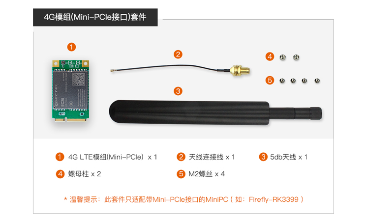
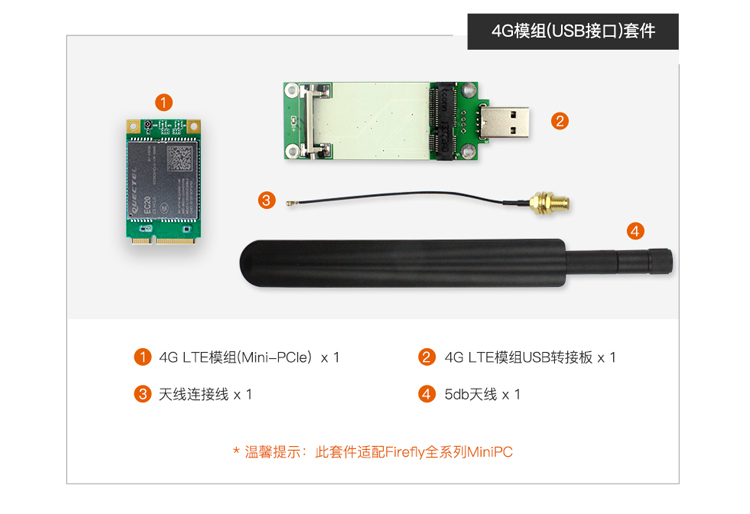

# 一、产品介绍
## 产品简介
### EC20
EC20 是移远通信推出的 LTE Cat 4 无线通信模块，采用 LTE 3GPP Rel.11 技术，支持最大下行速率 150Mbps 和
最大上行速率 50Mbps ；同时在封装上兼容移远通信 UMTS/HSPA+ UC20 模块以及移远通信多网络制式 LTE Cat 3 模
块，实现了 3G 网络与 4G 网络之间的无缝切换。


<br>
<br>
此模块不支持语音通话和短信，如果需要支持，请联系商务 <sales@t-firefly.com>。

<!-- ## 发货清单
### PCIE 接口

### USB 接口
 -->

## 详细参数

|型号| EC20 R2.1 Mini PCIe|
|----|----|
|工作频段| TDD-LTE: B38/B39/B40/B41<br> FDD-LTE: B1/B3/B8 <br> WCDMA: B1/B8<br> TD-SCDMA: B34/B39<br> GSM: 900/1800 MHz|
|数据传输|TDD-LTE： Max 130Mbps (DL) Max 35Mbps (UL)<br>FDD-LTE： Max 150Mbps (DL) Max 50Mbps (UL)<br>DC-HSPA+： Max 42Mbps (DL) Max 5.76Mbps (UL)<br>UMTS： Max 384Kbps (DL) Max 384Kbps (UL)<br>TD-SCDMA： Max 4.2Mbps (DL) Max 2.2Mbps (UL)<br>CDMA： Max 3.1Mbps (DL) Max 1.8Mbps (UL)<br>EDGE： Max 236.8Kbps (DL) Max 236.8Kbps (UL)<br>GPRS： Max 85.6Kbps (DL) Max 85.6Kbps (UL)|
|天线连接| x3 主天线、分集天线、GNSS天线接口|
|结构尺寸|51.0mm x 30.0mm x 4.9mm<br>重量: 约 10.5g |
|认证| NAL/SRRC/CCC |

<!-- |接口连接器|USB: USB 2.0 高速接口, 480Mbps<br>数字语音: 1个数字语音接口（可选）<br>USIM: 1.8/3.3V<br>网络指示: x2, NET_STATUS 和 NET_MODE<br>UART: x1 UART<br>复位: 低电平<br>PWRKEY: 低电平<br>天线接口: x3(主天线，分集天线和GNSS天线接口)<br>ADC: x2| -->

<!--
## 接口定义
## 产品选型
-->

# 二、使用方法

<!--
## 使用说明
-->

## 硬件连接
### 模组连接
#### PCIE 接口的连接

<!-- | 主控 | 板卡型号 | 
| ---- | ---- | 
| PX30 | [AIO-PX30-JD4](../../../modules_img/EC20/ec20_AIO-PX30-JD4.png) |
| RK3128 | [AIO-3128C]() | 
| RK3288 | [AIO-3288C](../../../modules_img/EC20/ec20_AIO-3288C.png), [AIO-3288J](../../../modules_img/EC20/ec20_AIO-3288J.png) | 
| RK3399 | [AIO-3399C](../../../modules_img/EC20/ec20_AIO-3399C.png), [AIO-3399JD4](../../../modules_img/EC20/ec20_AIO-3399JD4.png), [AIO-3399J](_images/ec20_AIO-3399J.png), [Firefly-RK3399](../../../modules_img/EC20/ec20_Firefly-RK3399.png) | 
| RK3399Pro | [AIO-3399Pro-JD4](), [AIO-3399ProC](../../../modules_img/EC20/ec20_AIO-3399ProC.png) | 
| RK3566 | [AIO-3566JD4](../../../modules_img/EC20/ec20_AIO-3566JD4.png)|
| RK3568 | [AIO-3568J](../../../modules_img/EC20/ec20_AIO-3568J.png), [ROC-RK3568-PC SE](../../../modules_img/EC20/ec20_ROC-RK3568-PC-SE.png) |
| RV1126_RV1109 | [AIO-1126-JD4](../../../modules_img/EC20/ec20_AIO-1126-JD4_AIO-1109-JD4.png), [AIO-1109-JD4](../../../modules_img/EC20/ec20_AIO-1126-JD4_AIO-1109-JD4.png) | 
| RK3588 | [ITX-3588J](../../../modules_img/EC20/ec20_ITX-3588J.png), [AIO-3588SJD4](../../../modules_img/EC20/ec20_AIO-3588SJD4.jpg) ,[AIO-3588Q](../../../modules_img/EC20/ec20_AIO-3588Q.jpg)|
| RK3576 | [AIO-3576C](_images/ec20_AIO-3576C.jpg)| -->


#### USB 接口的连接


### SIM 卡的插入


# 三、固件与资料下载
相关文档和固件下载，见官网的[资料下载](https://www.t-firefly.com/doc/download/134.html)。

<!--
## 文档下载
## 配件图纸
## 软件工具
## 固件下载
-->

# 四、入门教程
## 固件烧写

| 主控 | USB 线刷 | SD 卡升级 |
| ---- | ---- | ---- |
| PX30 | [AIO-PX30-JD4](../../核心板/Core-PX30-JD4/programming_firmware.md) | |
| RK3128 | [Firefly-RK3128](../../核心板/Core-3128J/upgrade_firmware.md), [AIO-3128C](../../主板/AIO-3128C/upgrade_firmware.md)  |  |
| RK3288 | [Firefly-RK3288](../../主板/Firefly-RK3288/upgrade_firmware.md), [AIO-3288J](../../主板/AIO-3288J/upgrade_firmware.md),  [AIO-3288C](../../主板/AIO-3288C/upgrade_firmware.md) | [Firefly-RK3288](../../主板/Firefly-RK3288/upgrade_firmware_sd.md), [AIO-3288J](../../主板/AIO-3288J/upgrade_firmware_sd.md), [AIO-3288C](../../主板/AIO-3288C/upgrade_firmware_sd.md) |
|RK3308| [ROC-RK3308-CC](../../主板/ROC-RK3308-CC/burning_firmware.md), [ROC-RK3308B-CC-PLUS](../../主板/ROC-RK3308B-CC-PLUS/03-upgrade_firmware.md) ||
| RK3328 | [ROC-RK3328-CC](../../主板/ROC-RK3328-CC/flash_emmc.md), [ROC-RK3328-PC](../../主板/ROC-RK3328-PC/03-upgrade_firmware.md)  | [ROC-RK3328-CC](../../主板/ROC-RK3328-CC/flash_sd.md) |
|RK3399|[Firefly-RK3399](../../主板/Firefly-RK3399/02-upgrade_table.md), [ROC-RK3399-PC](../../主板/ROC-RK3399-PC/03-upgrade_firmware.md) <br> [ROC-RK3399-PC-PLUS](../../主板/ROC-RK3399-PC-PLUS/03-upgrade_firmware.md), [AIO-3399JD4](../../核心板/Core-3399-JD4/03-upgrade_firmware.md), [AIO-3399J](../../主板/AIO-3399J/03-upgrade_firmware.md) <br> [AIO-3399C](../../主板/AIO-3399C/03-upgrade_firmware.md) | [Firefly-RK3399](../../主板/Firefly-RK3399/05-upgrade_firmware_sd.md), [ROC-RK3399-PC](../../主板/ROC-RK3399-PC/05-upgrade_firmware_sd.md) <br> [ROC-RK3399-PC-PLUS](../../主板/ROC-RK3399-PC-PLUS/05-upgrade_firmware_sd.md), [AIO-3399JD4](../../核心板/Core-3399-JD4/05-upgrade_firmware_sd.md), [AIO-3399J](../../主板/AIO-3399J/05-upgrade_firmware_sd.md) <br> [AIO-3399C](../../主板/AIO-3399C/05-upgrade_firmware_sd.md) |
|RK3399Pro|[AIO-3399Pro-JD4](../../主板/AIO-3399Pro-JD4/03-upgrade_firmware.md), [AIO-3399ProC](../../主板/AIO-3399ProC/03-upgrade_firmware.md)| [AIO-3399Pro-JD4](../../主板/AIO-3399Pro-JD4/05-upgrade_firmware_sd.md), [AIO-3399ProC](../../主板/AIO-3399ProC/05-upgrade_firmware_sd.md) |
|RK3566|[AIO-3566JD4](../../主板/AIO-3566JD4/03-upgrade_firmware.md), [ROC-RK3566-PC](../../主板/ROC-RK3566-PC/03-upgrade_firmware.md)| [AIO-3566JD4](../../主板/AIO-3566JD4/05-upgrade_firmware_sd.md), [ROC-RK3566-PC](../../主板/ROC-RK3566-PC/05-upgrade_firmware_sd.md) | 
|RK3568|[AIO-3568J](../../主板/AIO-3568J/03-upgrade_firmware.md), [ROC-RK3568-PC](../../主板/ROC-RK3568-PC/03-upgrade_firmware.md), [ROC-RK3568-PC SE](../../主板/ROC-RK3568-PC-SE/03-upgrade_firmware.md) | [AIO-3568J](../../主板/AIO-3568J/05-upgrade_firmware_sd.md), [ROC-RK3568-PC](../../主板/ROC-RK3568-PC/05-upgrade_firmware_sd.md), [ROC-RK3568-PC SE](../../主板/ROC-RK3568-PC-SE/05-upgrade_firmware_sd.md)| 
| RV1126_RV1109|[AIO-1126-JD4](../../核心板/Core-1126-JD4/upgrade_firmware.md), [AIO-1109-JD4](../../核心板/Core-1109-JD4/upgrade_firmware.md), [CAM-C1126S2U](../../AI摄像机/CAM-C1126S2U/upgrade_firmware.md), [CAM-C1109S2U](../../AI摄像机/CAM-C1109S2U/upgrade_firmware.md) | [AIO-1126-JD4](../../核心板/Core-1126-JD4/upgrade_firmware_sd.md), [AIO-1109-JD4](../../核心板/Core-1109-JD4/upgrade_firmware_sd.md)
|RK3588|[ITX-3588J](../../主板/ITX-3588J/upgrade_firmware.md), [ROC-RK3588S-PC](../../主板/ROC-RK3588S-PC/upgrade_firmware.md), [AIO-3588SJD4](../../主板/AIO-3588SJD4/upgrade_firmware.md),[AIO-3588Q](../../主板/AIO-3588Q/upgrade_firmware.md)|[ITX-3588J](../../主板/ITX-3588J/upgrade_firmware_sd.md), [ROC-RK3588S-PC](../../主板/ROC-RK3588S-PC/upgrade_firmware_sd.md), [AIO-3588SJD4](../../主板/AIO-3588SJD4/upgrade_firmware_sd.md) ,[AIO-3588Q](../../主板/AIO-3588Q/upgrade_firmware_sd.md)|
|RK3576|[ROC-RK3576-PC](../../主板/ROC-RK3576-PC/upgrade_firmware.md), [AIO-3576Q](../../主板/AIO-3576Q/upgrade_firmware.md), [AIO-3576C](../../主板/AIO-3576C/upgrade_firmware.md)|[ROC-RK3576-PC](../../主板/ROC-RK3576-PC/upgrade_firmware_sd.md), [AIO-3576Q](../../主板/AIO-3576Q/upgrade_firmware_sd.md), [AIO-3576C](../../主板/AIO-3576C/upgrade_firmware_sd.md)|

<!-- ## 固件制作
### PX30 系列

|  系统   |  板卡型号 |
|  ----  | ----  |
| Android8.1 | [AIO-PX30-JD4](../../主板/AIO-PX30-JD4/Android_development.md#bian-yi-android8-1-gu-jian) |
| Ubuntu | [AIO-PX30-JD4](../../主板/AIO-PX30-JD4/linux_compile.md) |
| Buildroot | [AIO-PX30-JD4](../../主板/AIO-PX30-JD4/buildroot_compile.md) |

### RK3128 系列

|  系统   |  板卡型号 | 
|  ----  | ----  | 
| Android5.1  | [Firefly-RK3288](../../主板/Firefly-RK3288/compile_android_firmware.md#gong-ban-bian-yi), [AIO-3288J](../../主板/AIO-3288J/compile_android_firmware.md#gong-ban-bian-yi), [AIO-3288C](../../主板/AIO-3288C/compile_android_firmware.md#gong-ban-bian-yi) | 

### RK3288 系列

|  系统   |  板卡型号 | 
|  ----  | ----  | 
| Android5.1  | [Firefly-RK3288](../../主板/Firefly-RK3288/compile_android_firmware.md#gong-ban-bian-yi), [AIO-3288J](../../主板/AIO-3288J/compile_android_firmware.md#gong-ban-bian-yi), [AIO-3288C](../../主板/AIO-3288C/compile_android_firmware.md#gong-ban-bian-yi) | 
| Ubuntu | [Firefly-RK3288](../../主板/Firefly-RK3288/linux_compile_gpt.md), [AIO-3288J](../../主板/AIO-3288J/linux_compile_gpt.md), [AIO-3288C](../../主板/AIO-3288C/linux_compile_gpt.md) | 
| Buildroot | [Firefly-RK3288](../../主板/Firefly-RK3288/buildroot_compile.md), [AIO-3288J](../../主板/AIO-3288J/buildroot_compile.md), [AIO-3288C](../../主板/AIO-3288C/buildroot_compile.md) |

### RK3308 系列

|  系统   |  板卡型号 | 
|  ----  | ----  | 
| Buildroot | [ROC-RK3308-CC](../../主板/ROC-RK3308-CC/buildroot_development.md), [ROC-RK3308B-CC-PLUS](../../主板/ROC-RK3308B-CC-PLUS/sdkbuilding.md) |

### RK3328 系列

|  系统   |  板卡型号 | 
|  ----  | ----  | 
| Android7.1 | [ROC-RK3328-CC](../../主板/ROC-RK3328-CC/android_compile_android7.md)|
|Android8.1 | [ROC-RK3328-CC](../../主板/ROC-RK3328-CC/android_compile_android8.md) |
| Android10.0  | [ROC-RK3328-PC](../../主板/ROC-RK3328-PC/android_compile_android10.md) | 
| Ubuntu | [ROC-RK3328-CC](../../主板/ROC-RK3328-CC/linux_compile.md), [ROC-RK3328-PC](../../主板/ROC-RK3328-PC/linux_compile.md) |

### RK3399 系列

|  系统   |  板卡型号 | 
|  ----  | ----  | 
| Android7.1 Industry | [Firefly-RK3399](../../主板/Firefly-RK3399/compile_android7.1_industry_firmware.md#gong-ban-bian-yi), [ROC-RK3399-PC](../../主板/ROC-RK3399-PC/compile_android7.1_industry_firmware.md#gong-ban-bian-yi), [ROC-RK3399-PC-PLUS](../../主板/ROC-RK3399-PC-PLUS/compile_android7.1_industry_firmware.md#gong-ban-bian-yi), [ROC-RK3399-PC-Pro](../../主板/ROC-RK3399-PC-Pro/compile_android7.1_industry_firmware.md#gong-ban-bian-yi), [AIO-3399JD4](../../主板/AIO-3399JD4/compile_android7.1_industry_firmware.md#gong-ban-bian-yi), [AIO-3399J](../../主板/AIO-3399J/compile_android7.1_industry_firmware.md#gong-ban-bian-yi), [AIO-3399C](../../主板/AIO-3399C/compile_android7.1_industry_firmware.md#gong-ban-bian-yi), [Face-RK3399](../../主板/Face-RK3399/compile_android_firmware.md#wan-zheng-bian-yi-face-rk3399) | 
| Android10.0 | [ROC-RK3399-PC-PLUS](../../主板/ROC-RK3399-PC-PLUS/compile_android10.0_firmware.md#gong-ban-bian-yi), [ROC-RK3399-PC-Pro](../../主板/ROC-RK3399-PC-Pro/compile_android10.0_firmware.md#gong-ban-bian-yi),[AIO-3399J](../../主板/AIO-3399J/compile_android10.0_firmware.md#gong-ban-bian-yi), [AIO-3399C](../../主板/AIO-3399C/compile_android10.0_firmware.md#gong-ban-bian-yi) | 
| Ubuntu | [Firefly-RK3399](../../主板/Firefly-RK3399/linux_compile_gpt.md), [ROC-RK3399-PC](../../主板/ROC-RK3399-PC/linux_compile_gpt.md), [ROC-RK3399-PC-PLUS](../../主板/ROC-RK3399-PC-PLUS/linux_compile_gpt.md), [AIO-3399JD4](../../主板/AIO-3399JD4/linux_compile_gpt.md), [AIO-3399J](../../主板/AIO-3399J/linux_compile_gpt.md), [AIO-3399C](../../主板/AIO-3399C/linux_compile_gpt.md) | 
| Buildroot | [Firefly-RK3399](../../主板/Firefly-RK3399/buildroot_compile.md), [ROC-RK3399-PC](../../主板/ROC-RK3399-PC/buildroot_compile.md), [ROC-RK3399-PC-PLUS](../../主板/ROC-RK3399-PC-PLUS/buildroot_compile.md), [AIO-3399JD4](../../主板/AIO-3399JD4/buildroot_compile.md), [AIO-3399J](../../主板/AIO-3399J/buildroot_compile.md), [AIO-3399C](../../主板/AIO-3399C/buildroot_compile.md) | 

### RK3399Pro 系列

|  系统   |  板卡型号 | 
|  ----  | ----  | 
| Android9.0 | [AIO-3399Pro-JD4](../../主板/AIO-3399Pro-JD4/compile_android9.0_firmware.md#gong-ban-bian-yi), [AIO-3399ProC](../../主板/AIO-3399ProC/compile_android9.0_firmware.md#gong-ban-bian-yi) | 
| Ubuntu | [AIO-3399Pro-JD4](../../主板/AIO-3399Pro-JD4/linux_compile_gpt.md), [AIO-3399ProC](../../主板/AIO-3399ProC/linux_compile_gpt.md) | 

### RK3566 系列

|  系统   |  板卡型号 | 
|  ----  | ----  | 
| Android11.0 | [AIO-3566JD4](../../主板/AIO-3566JD4/compile_android11.0_firmware.md#gong-ban-bian-yi), [ROC-RK3566-PC](../../主板/ROC-RK3566-PC/compile_android11.0_firmware.md#gong-ban-bian-yi) | 
| Ubuntu | [AIO-3566JD4](../../主板/AIO-3566JD4/linux_compile_gpt.md), [ROC-RK3566-PC](../../主板/ROC-RK3566-PC/linux_compile_gpt.md) | 
| Buildroot | [AIO-3566JD4](../../主板/AIO-3566JD4/buildroot_compile.md), [ROC-RK3566-PC](../../主板/ROC-RK3566-PC/buildroot_compile.md) |

### RK3568 系列

|  系统   |  板卡型号 | 
|  ----  | ----  | 
| Android11.0 | [AIO-3568J](../../主板/AIO-3568J/compile_android11.0_firmware.md#gong-ban-bian-yi), [ROC-RK3568-PC](../../主板/ROC-RK3568-PC/compile_android11.0_firmware.md#gong-ban-bian-yi), [ROC-RK3568-PC SE](../../主板/ROC-RK3568-PC-SE/compile_android11.0_firmware.md#gong-ban-bian-yi) | 
| Ubuntu | [AIO-3568J](../../主板/AIO-3568J/linux_compile_gpt.md), [ROC-RK3568-PC](../../主板/ROC-RK3568-PC/linux_compile_gpt.md) | 
| Buildroot | [AIO-3568J](../../主板/AIO-3568J/buildroot_compile.md), [ROC-RK3568-PC](../../主板/ROC-RK3568-PC/buildroot_compile.md) |

### RV1126_RV1109 系列

|  系统   |  板卡型号 | 
|  ----  | ----  | 
| Buildroot | [AIO-1126-JD4](../../主板/AIO-1126-JD4/Source_code.md#bian-yi-pei-zhi), [AIO-1109-JD4](../../主板/AIO-1109-JD4/Source_code.md#bian-yi-pei-zhi), [CAM-C1126S2U](../../AI摄像机/CAM-C1126S2U/Source_code.md#bian-yi-pei-zhi), [CAM-C1109S2U](../../AI摄像机/CAM-C1109S2U/Source_code.md#bian-yi-pei-zhi) |

### RK3588 系列

|  系统   |  板卡型号 | 
|  ----  | ----  | 
| Android12.0 | [ITX-3588J](../../主板/ITX-3588J/android_compile_android12.0_firmware.md),[ROC-RK3588S-PC](../../主板/ROC-RK3588S-PC/android_compile_android12.0_firmware.md),[AIO-3588SJD4](../../主板/AIO-3588SJD4/android_compile_android12.0_firmware.md),[AIO-3588Q](../../主板/AIO-3588Q/android_compile_android12.0_firmware.md)| 
| Buildroot | [ITX-3588J](../../主板/ITX-3588J/linux_compile_buildroot.md),[ROC-RK3588S-PC](../../主板/ROC-RK3588S-PC/linux_compile_buildroot.md),[AIO-3588SJD4](../../主板/AIO-3588SJD4/linux_compile_buildroot.md),[AIO-3588Q](../../主板/AIO-3588Q/linux_compile_buildroot.md),[AIO-3588MQ](../../主板/AIO-3588MQ/linux_compile_buildroot.md),[AIO-3588JQ](../../主板/AIO-3588JQ/linux_compile_buildroot.md)|
| Ubuntu20.04 | [ITX-3588J](../../主板/ITX-3588J/linux_compile_ubuntu.md),[ROC-RK3588S-PC](../../主板/ROC-RK3588S-PC/linux_compile_ubuntu.md),[AIO-3588SJD4](../../主板/AIO-3588SJD4/linux_compile_ubuntu.md),[AIO-3588Q](../../主板/AIO-3588Q/linux_compile_ubuntu.md),[AIO-3588MQ](../../主板/AIO-3588MQ/linux_compile_ubuntu.md),[AIO-3588JQ](../../主板/AIO-3588JQ/linux_compile_ubuntu.md)|
| Debian11 | [ITX-3588J](../../主板/ITX-3588J/linux_compile_debian.md),[ROC-RK3588S-PC](../../主板/ROC-RK3588S-PC/linux_compile_debian.md),[AIO-3588SJD4](../../主板/AIO-3588SJD4/linux_compile_debian.md),[AIO-3588Q](../../主板/AIO-3588Q/linux_compile_debian.md),[AIO-3588MQ](../../主板/AIO-3588MQ/linux_compile_debian.md),[AIO-3588JQ](../../主板/AIO-3588JQ/linux_compile_debian.md)|

### RK3576 系列

|  系统   |  板卡型号 |
|  ----  | ----  |
| Android14.0 | [ROC-RK3576-PC](../../主板/ROC-RK3576-PC/android_compile_android14.0_firmware.md),[AIO-3576Q](../../主板/AIO-3576Q/android_compile_android14.0_firmware.md), [AIO-3576C](../../主板/AIO-3576C/android_compile_android14.0_firmware.md)|
| Ubuntu20.04 | [ROC-RK3576-PC](../../主板/ROC-RK3576-PC/linux_compile_ubuntu.md),[AIO-3576Q](../../主板/AIO-3576Q/linux_compile_ubuntu.md),[AIO-3576C](../../主板/AIO-3576C/linux_compile_ubuntu.md)| -->

## GNSS(可选功能)
EC20 模组支持无线网络数据通讯，其中还分带 GNSS 和不带 GNSS 两种:
* 后缀为 `SNNS`: 不支持 GNSS
* 后缀为 `SGNS`: 支持 GNSS

公版固件支持 GNSS 功能，但是默认关闭。

### 基本参数
支持 GPS、GLONASS、GALILEO、BEIDOU，兼容标准 NMEA 0183 协议，可通过 USB NMEA 接口输出 1Hz 频率的 NMEA 信息，默认输出串口为 `/dev/ttyUSB1`，波特率 `115200` bit/s。

#### 天线要求
* 频率范围:1559MHz~1609MHz
* 极化:RHCP 或 Linear
* VSWR:< 2(典型值)
* 有源天线噪声系数:< 1.5dB
* 有源天线增益:> 0dB
* 有源天线内嵌 LNA 增益:< 17dB

*注意: GPS 天线需要使用**有源天线***

### 如何使能 GPS 和修改串口配置
#### Android 临时修改
* 使能 ADB: 如何使能 ADB, 参考各个产品的 Wiki 教程《ADB 的使用》的章节。
* 设置系统可读可写

    ```
    adb shell setprop persist.sys.root_access 3
    adb root && adb remount
    ````
* 修改参数
    * 使能 GPS：将板卡 `/vendor/build.prop` 里面的 `ro.factory.hasGPS` 修改为 `true`
    * 修改串口配置：将板卡 `/system/etc/u-blox.conf` 里面的 `SERIAL_DEVICE` 修改为`/dev/ttyUSB1`, `SERIAL_BAUD_RATE` 修改为 `115200`。
* 软重启板卡

#### Android 代码修改
* 使能 GPS
    * 将 SDK 目录下 `device/rockchip/{CPU}/{PRODUCT}/{PRODUCT}.mk` 里面 `BOARD_HAS_GPS` 修改为`true`
* 修改串口配置
    * 将 SDK 目录下`device/rockchip/{CPU}/{PRODUCT}/gps/u-blox.conf` 里面 `SERIAL_DEVICE` 修改为`/dev/ttyUSB1`, `SERIAL_BAUD_RATE` 修改为 `115200`。
* 重新编译 SDK 并烧录固件