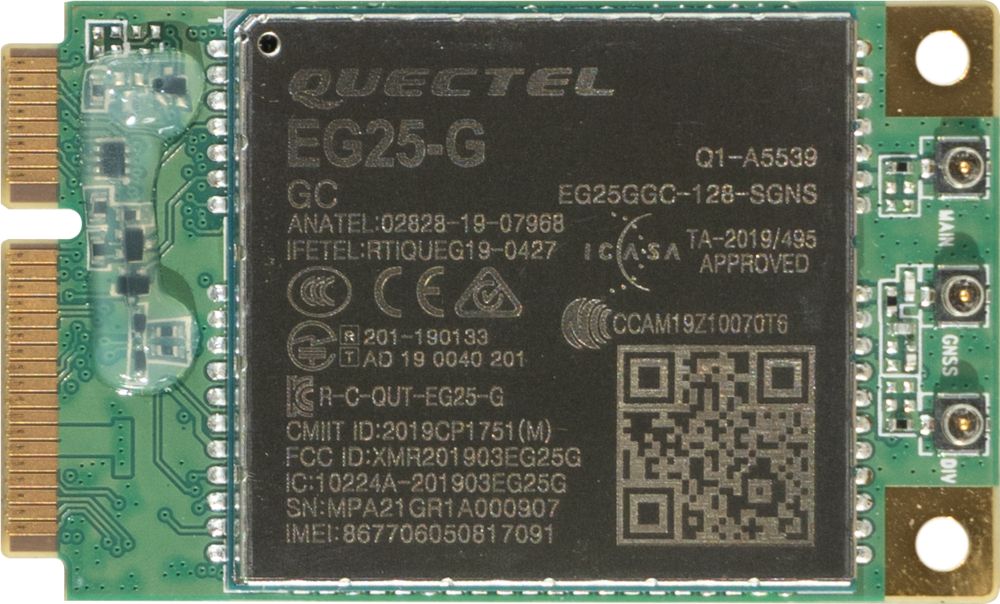
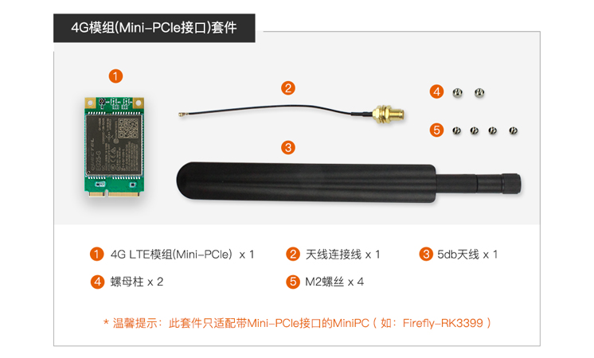
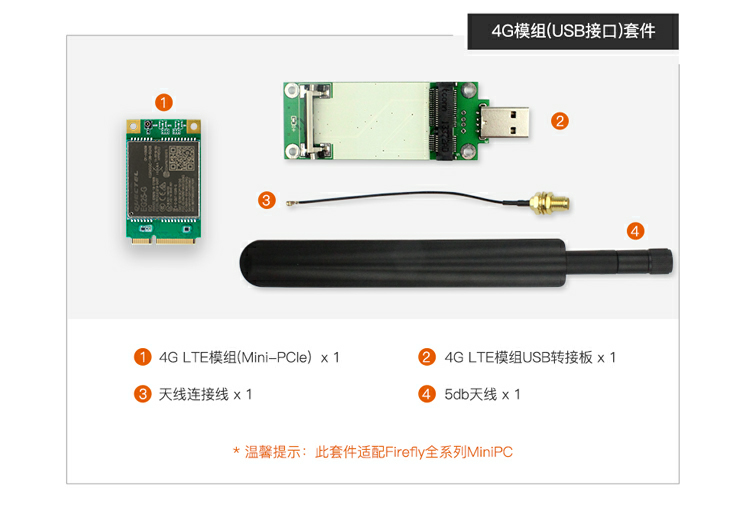
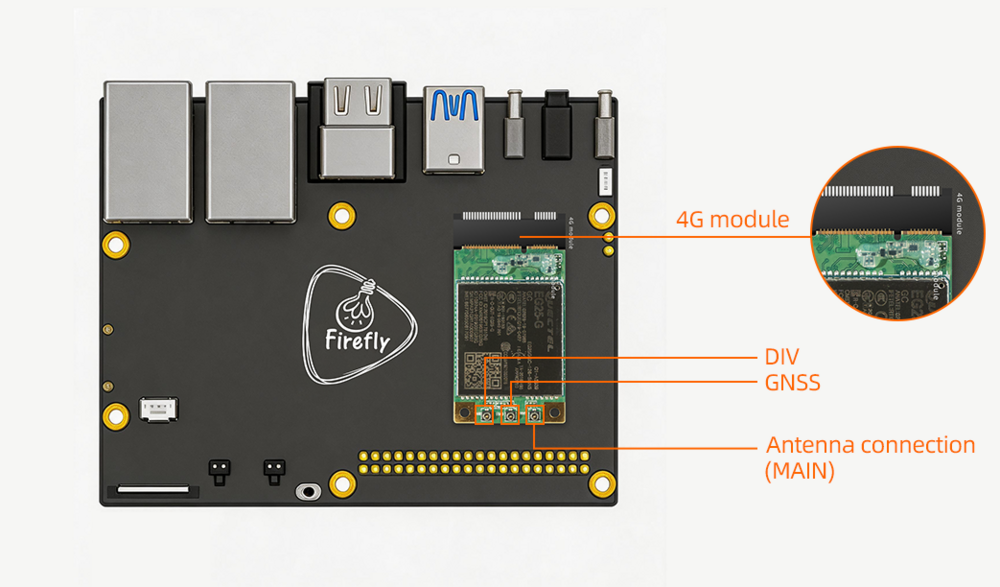
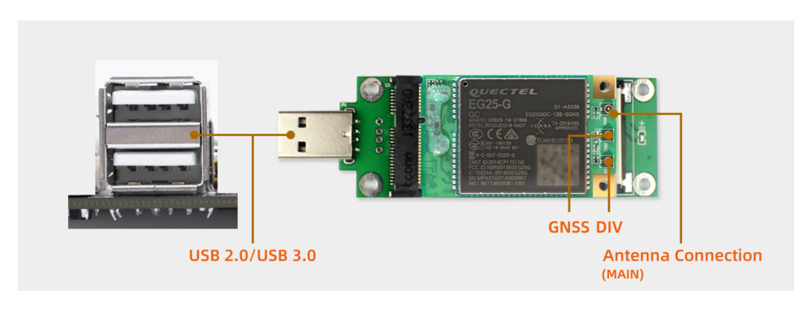
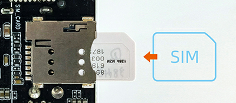

# 一、产品介绍
## 产品简介
### EG25-G
EG25-G 是移远通信专为 M2M 和 IoT 领域而设计的 LTE Cat 4 无线通信模块，采用 3GPP Rel.11 LTE 技术，支持最大下
行速率 150 Mbps 和最大上行速率 50 Mbps。同时，EG25-G 在封装上兼容移远通信 UMTS/HSPA+ UC200T 系列模块、
多模 LTE Standard EC2x 系列（EC25 系列、EC21 系列和 EC20-CE）/EC200A 系列/EG21-G 模块，在设计和使用中可以灵
活切换。


<br>
<br>
此模块不支持语音通话和短信，如果需要支持，请联系商务 <sales@t-firefly.com>。

<!--
## 发货清单
### PCIE 接口

### USB 接口

-->

## 详细参数

|型号| EG25-G Mini PCIe|
|----|----|
|工作频段| LTE-FDD: B1/B2/B3/B4/B5/B7/B8/B12/B13/B18/B19/B20/B25/B26/B28 <br> LTE-TDD: B38/B39/B40/B41 <br> UMTS: B1/B2/B4/B5/B6/B8/B19<br> GSM: B2/B3/B5/B8 |
|数据传输|LTE-FDD: Max 150 Mbps(DL) Max 50Mbps(UL)<br>LTE-TDD: Max 130 Mbps(DL) Max30 Mbps(UL)<br>DC-HSDPA: Max 42 Mbps(DL) (UL)<br>HSUPA: Max 5.76 Mbps(UL) <br>WCDMA: Max 384 kbps(DL) Max 384 kbps(UL)<br>EDGE: Max 296 kbps(DL) Max236.8 kbps(UL)<br>GPRS: Max107 kbps(DL) Max 85.6 kbps(UL)<br>|
|结构尺寸|29.0 mm × 32.0 mm × 2.4 mm <br>重量: 约4.9 g<br> |
|认证|Deutsche Telekom<br> Verizon/AT&T/Sprint/U.S. Cellular/T-Mobile<br> Telus/Rogers* <br> SRRC/CCC/NAL <br> GCF <br> CE <br> UKCA <br>PTCRB <br>FCC <br> IC <br> Anatel <br> IFETEL <br> KC <br> NCC <br> JATE/TELEC <br> RCM <br> NBTC <br> IMDA <br> ICASA <br>  RoHS <br> WHQL <br>|
|天线接口|x3 主天线、分集天线、GNSS|

<!--
## 接口定义
## 产品选型
-->

# 二、使用方法


## 硬件连接
### 模组连接
#### PCIE 接口的连接

<!--
| PX30 | [AIO-PX30-JD4](../../../modules_img/EG25/EG25_AIO-PX30-JD4.png) |
| RK3128 | [AIO-3128C]() | 
| RK3288 | [AIO-3288C](../../../modules_img/EG25/EG25_AIO-3288C.png), [AIO-3288J](../../../modules_img/EG25/EG25_AIO-3288J.png) | 
| RK3399 | [AIO-3399C](../../../modules_img/EG25/EG25_AIO-3399C.png), [AIO-3399JD4](../../../modules_img/EG25/EG25_AIO-3399JD4.png), [AIO-3399J](_images/EG25_AIO-3399J.png), [Firefly-RK3399](../../../modules_img/EG25/EG25_Firefly-RK3399.png) | 
| RK3399Pro | [AIO-3399Pro-JD4](), [AIO-3399ProC](../../../modules_img/EG25/EG25_AIO-3399ProC.png) | 
-->
<!-- 
| 主控 | 板卡型号 | 
| ---- | ---- | 
| RK3566 | [AIO-3566JD4](../../../modules_img/EG25/EG25_AIO-3566JD4.png)|
| RK3568 | [AIO-3568J](../../../modules_img/EG25/EG25_AIO-3568J.png),[ROC-RK3568-PC-SE](_images/EG25_ROC-3568-PCSE.jpg)| 
| RK3588 | [ITX-3588J](../../../modules_img/EG25/EG25_ITX-3588J.png), [AIO-3588SJD4](../../../modules_img/EG25/EG25_AIO-3588SJD4.jpg) ,[AIO-3588Q](../../../modules_img/EG25/EG25_AIO-3588Q.jpg)| 
-->



#### USB 接口的连接


### SIM 卡的插入



# 三、固件与资料下载
相关文档和固件下载，见官网的[资料下载](https://www.t-firefly.com/doc/download/171.html)。


<!--
## 文档下载
## 配件图纸
## 软件工具
## 固件下载
-->

# 四、入门教程
## 固件烧写

<!--
| PX30 | [AIO-PX30-JD4](../../主板/AIO-PX30-JD4/programming_firmware.md) | |
| RK3128 | [Firefly-RK3128](../../主板/Firefly-RK3128/upgrade_firmware.md), [AIO-3128C](../../主板/AIO-3128C/upgrade_firmware.md)  |  |
| RK3288 | [Firefly-RK3288](../../主板/Firefly-RK3288/upgrade_firmware.md), [AIO-3288J](../../主板/AIO-3288J/upgrade_firmware.md),  [AIO-3288C](../../主板/AIO-3288C/upgrade_firmware.md) | [Firefly-RK3288](../../主板/Firefly-RK3288/upgrade_firmware_sd.md), [AIO-3288J](../../主板/AIO-3288J/upgrade_firmware_sd.md), [AIO-3288C](../../主板/AIO-3288C/upgrade_firmware_sd.md) |
|RK3308| [ROC-RK3308-CC](../../主板/ROC-RK3308-CC/burning_firmware.md), [ROC-RK3308B-CC-PLUS](../../主板/ROC-RK3308B-CC-PLUS/burning_firmware.md) ||
| RK3328 | [ROC-RK3328-CC](../../主板/ROC-RK3328-CC/flash_emmc.md), [ROC-RK3328-PC](../../主板/ROC-RK3328-PC/upgrade_firmware.md)  | [ROC-RK3328-CC](../../主板/ROC-RK3328-CC/flash_sd.md) |
|RK3399|[Firefly-RK3399](../../主板/Firefly-RK3399/02-upgrade_table.md), [ROC-RK3399-PC](../../主板/ROC-RK3399-PC/03-upgrade_firmware.md) <br> [ROC-RK3399-PC-PLUS](../../主板/ROC-RK3399-PC-PLUS/03-upgrade_firmware.md), [AIO-3399JD4](../../主板/AIO-3399JD4/03-upgrade_firmware.md), [AIO-3399J](../../主板/AIO-3399J/03-upgrade_firmware.md) <br> [AIO-3399C](../../主板/AIO-3399C/03-upgrade_firmware.md) | [Firefly-RK3399](../../主板/Firefly-RK3399/05-upgrade_firmware_sd.md), [ROC-RK3399-PC](../../主板/ROC-RK3399-PC/05-upgrade_firmware_sd.md) <br> [ROC-RK3399-PC-PLUS](../../主板/ROC-RK3399-PC-PLUS/05-upgrade_firmware_sd.md), [AIO-3399JD4](../../主板/AIO-3399JD4/05-upgrade_firmware_sd.md), [AIO-3399J](../../主板/AIO-3399J/05-upgrade_firmware_sd.md) <br> [AIO-3399C](../../主板/AIO-3399C/05-upgrade_firmware_sd.md) | 
|RK3399Pro|[AIO-3399Pro-JD4](../../主板/AIO-3399Pro-JD4/03-upgrade_firmware.md), [AIO-3399ProC](../../主板/AIO-3399ProC/03-upgrade_firmware.md)| [AIO-3399Pro-JD4](../../主板/AIO-3399Pro-JD4/05-upgrade_firmware_sd.md), [AIO-3399ProC](../../主板/AIO-3399ProC/05-upgrade_firmware_sd.md) |
-->

| 主控 | USB 线刷 | SD 卡升级 |
| ---- | ---- | ---- |
|RK3566|[AIO-3566JD4](../../主板/AIO-3566JD4/03-upgrade_firmware.md), [ROC-RK3566-PC](../../主板/ROC-RK3566-PC/03-upgrade_firmware.md)| [AIO-3566JD4](../../主板/AIO-3566JD4/05-upgrade_firmware_sd.md), [ROC-RK3566-PC](../../主板/ROC-RK3566-PC/05-upgrade_firmware_sd.md) | 
|RK3568|[AIO-3568J](../../主板/AIO-3568J/03-upgrade_firmware.md), [ROC-RK3568-PC](../../主板/ROC-RK3568-PC/03-upgrade_firmware.md),[ROC-RK3568-PC-SE](../../主板/ROC-RK3568-PC-SE/03-upgrade_firmware.md) | [AIO-3568J](../../主板/AIO-3568J/05-upgrade_firmware_sd.md), [ROC-RK3568-PC](../../主板/ROC-RK3568-PC/05-upgrade_firmware_sd.md),[ROC-RK3568-PC-SE](../../主板/ROC-RK3568-PC-SE/05-upgrade_firmware_sd.md)| 
|RK3588|[ITX-3588J](../../主板/ITX-3588J/upgrade_firmware.md), [ROC-RK3588S-PC](../../主板/ROC-RK3588S-PC/upgrade_firmware.md), [AIO-3588SJD4](../../主板/AIO-3588SJD4/upgrade_firmware.md),[AIO-3588Q](../../主板/AIO-3588Q/upgrade_firmware.md)|[ITX-3588J](../../主板/ITX-3588J/upgrade_firmware_sd.md), [ROC-RK3588S-PC](../../主板/ROC-RK3588S-PC/upgrade_firmware_sd.md), [AIO-3588SJD4](../../主板/AIO-3588SJD4/upgrade_firmware_sd.md) ,[AIO-3588Q](../../主板/AIO-3588Q/upgrade_firmware_sd.md)|
|RK3576|[ROC-RK3576-PC](../../主板/ROC-RK3576-PC/upgrade_firmware.md), [AIO-3576Q](../../主板/AIO-3576Q/upgrade_firmware.md), [AIO-3576C](../../主板/AIO-3576C/upgrade_firmware.md)|[ROC-RK3576-PC](../../主板/ROC-RK3576-PC/upgrade_firmware_sd.md), [AIO-3576Q](../../主板/AIO-3576Q/upgrade_firmware_sd.md), [AIO-3576C](../../主板/AIO-3576C/upgrade_firmware_sd.md)|


<!-- ## 固件制作 -->

<!--
### PX30 系列
|  系统   |  板卡型号 |
|  ----  | ----  |
| Android8.1 | [AIO-PX30-JD4](../../主板/AIO-PX30-JD4/Android_development.md#bian-yi-android8-1-gu-jian) |
| Ubuntu | [AIO-PX30-JD4](../../主板/AIO-PX30-JD4/linux_compile.md) |
| Buildroot | [AIO-PX30-JD4](../../主板/AIO-PX30-JD4/buildroot_compile.md) |
-->

<!--
### RK3128 系列
|  系统   |  板卡型号 | 
|  ----  | ----  | 
| Android5.1  | [Firefly-RK3288](../../主板/Firefly-RK3288/compile_android_firmware.md#gong-ban-bian-yi), [AIO-3288J](../../主板/AIO-3288J/compile_android_firmware.md#gong-ban-bian-yi), [AIO-3288C](../../主板/AIO-3288C/compile_android_firmware.md#gong-ban-bian-yi) | 
-->

<!--
### RK3288 系列
|  系统   |  板卡型号 | 
|  ----  | ----  | 
| Android5.1  | [Firefly-RK3288](../../主板/Firefly-RK3288/compile_android_firmware.md#gong-ban-bian-yi), [AIO-3288J](../../主板/AIO-3288J/compile_android_firmware.md#gong-ban-bian-yi), [AIO-3288C](../../主板/AIO-3288C/compile_android_firmware.md#gong-ban-bian-yi) | 
| Ubuntu | [Firefly-RK3288](../../主板/Firefly-RK3288/linux_compile_gpt.md), [AIO-3288J](../../主板/AIO-3288J/linux_compile_gpt.md), [AIO-3288C](../../主板/AIO-3288C/linux_compile_gpt.md) | 
| Buildroot | [Firefly-RK3288](../../主板/Firefly-RK3288/buildroot_compile.md), [AIO-3288J](../../主板/AIO-3288J/buildroot_compile.md), [AIO-3288C](../../主板/AIO-3288C/buildroot_compile.md) |
-->
<!--
### RK3308 系列

|  系统   |  板卡型号 | 
|  ----  | ----  | 
| Buildroot | [ROC-RK3308-CC](../../主板/ROC-RK3308-CC/buildroot_development.md), [ROC-RK3308B-CC-PLUS](../../主板/ROC-RK3308B-CC-PLUS/sdkbuilding.md) |
-->

<!--
### RK3328 系列

|  系统   |  板卡型号 | 
|  ----  | ----  | 
| Android7.1 | [ROC-RK3328-CC](../../主板/ROC-RK3328-CC/android_compile_android7.md)|
|Android8.1 | [ROC-RK3328-CC](../../主板/ROC-RK3328-CC/android_compile_android8.md) |
| Android10.0  | [ROC-RK3328-PC](../../主板/ROC-RK3328-PC/android_compile_android10.md) | 
| Ubuntu | [ROC-RK3328-CC](../../主板/ROC-RK3328-CC/linux_compile.md), [ROC-RK3328-PC](../../主板/ROC-RK3328-PC/linux_compile.md) |
-->

<!--
### RK3399 系列
|  系统   |  板卡型号 | 
|  ----  | ----  | 
| Android7.1 Industry | [Firefly-RK3399](../../主板/Firefly-RK3399/compile_android7.1_industry_firmware.md#gong-ban-bian-yi), [ROC-RK3399-PC](../../主板/ROC-RK3399-PC/compile_android7.1_industry_firmware.md#gong-ban-bian-yi), [ROC-RK3399-PC-PLUS](../../主板/ROC-RK3399-PC-PLUS/compile_android7.1_industry_firmware.md#gong-ban-bian-yi), [ROC-RK3399-PC-Pro](../../主板/ROC-RK3399-PC-Pro/compile_android7.1_industry_firmware.md#gong-ban-bian-yi), [AIO-3399JD4](../../主板/AIO-3399JD4/compile_android7.1_industry_firmware.md#gong-ban-bian-yi), [AIO-3399J](../../主板/AIO-3399J/compile_android7.1_industry_firmware.md#gong-ban-bian-yi), [AIO-3399C](../../主板/AIO-3399C/compile_android7.1_industry_firmware.md#gong-ban-bian-yi), [Face-RK3399](../../主板/Face-RK3399/compile_android_firmware.md#wan-zheng-bian-yi-face-rk3399) | 
| Android10.0 | [ROC-RK3399-PC-PLUS](../../主板/ROC-RK3399-PC-PLUS/compile_android10.0_firmware.md#gong-ban-bian-yi), [ROC-RK3399-PC-Pro](../../主板/ROC-RK3399-PC-Pro/compile_android10.0_firmware.md#gong-ban-bian-yi),[AIO-3399J](../../主板/AIO-3399J/compile_android10.0_firmware.md#gong-ban-bian-yi), [AIO-3399C](../../主板/AIO-3399C/compile_android10.0_firmware.md#gong-ban-bian-yi) | 
| Ubuntu | [Firefly-RK3399](../../主板/Firefly-RK3399/linux_compile_gpt.md), [ROC-RK3399-PC](../../主板/ROC-RK3399-PC/linux_compile_gpt.md), [ROC-RK3399-PC-PLUS](../../主板/ROC-RK3399-PC-PLUS/linux_compile_gpt.md), [AIO-3399JD4](../../主板/AIO-3399JD4/linux_compile_gpt.md), [AIO-3399J](../../主板/AIO-3399J/linux_compile_gpt.md), [AIO-3399C](../../主板/AIO-3399C/linux_compile_gpt.md) | 
| Buildroot | [Firefly-RK3399](../../主板/Firefly-RK3399/buildroot_compile.md), [ROC-RK3399-PC](../../主板/ROC-RK3399-PC/buildroot_compile.md), [ROC-RK3399-PC-PLUS](../../主板/ROC-RK3399-PC-PLUS/buildroot_compile.md), [AIO-3399JD4](../../主板/AIO-3399JD4/buildroot_compile.md), [AIO-3399J](../../主板/AIO-3399J/buildroot_compile.md), [AIO-3399C](../../主板/AIO-3399C/buildroot_compile.md) | 
-->

<!--
### RK3399Pro 系列
|  系统   |  板卡型号 | 
|  ----  | ----  | 
| Android9.0 | [AIO-3399Pro-JD4](../../主板/AIO-3399Pro-JD4/compile_android9.0_firmware.md#gong-ban-bian-yi), [AIO-3399ProC](../../主板/AIO-3399ProC/compile_android9.0_firmware.md#gong-ban-bian-yi) | 
| Ubuntu | [AIO-3399Pro-JD4](../../主板/AIO-3399Pro-JD4/linux_compile_gpt.md), [AIO-3399ProC](../../主板/AIO-3399ProC/linux_compile_gpt.md) |
--> 
<!-- 
### RK3566 系列

|  系统   |  板卡型号 | 
|  ----  | ----  | 
| Android11.0 | [AIO-3566JD4](../../主板/AIO-3566JD4/compile_android11.0_firmware.md#gong-ban-bian-yi), [ROC-RK3566-PC](../../主板/ROC-RK3566-PC/compile_android11.0_firmware.md#gong-ban-bian-yi) |  -->

<!--
| Ubuntu | [AIO-3566JD4](../../主板/AIO-3566JD4/linux_compile_gpt.md), [ROC-RK3566-PC](../../主板/ROC-RK3566-PC/linux_compile_gpt.md) | 
| Buildroot | [AIO-3566JD4](../../主板/AIO-3566JD4/buildroot_compile.md), [ROC-RK3566-PC](../../主板/ROC-RK3566-PC/buildroot_compile.md) |
-->

<!-- ### RK3568 系列

|  系统   |  板卡型号 | 
|  ----  | ----  | 
| Android11.0 | [AIO-3568J](../../主板/AIO-3568J/compile_android11.0_firmware.md#gong-ban-bian-yi), [ROC-RK3568-PC](../../主板/ROC-RK3568-PC/compile_android11.0_firmware.md#gong-ban-bian-yi),[ROC-RK3568-PC-SE](../../主板/ROC-RK3568-PC-SE/compile_android11.0_firmware.md#gong-ban-bian-yi) |  -->

<!--
| Ubuntu | [AIO-3568J](../../主板/AIO-3568J/linux_compile_gpt.md), [ROC-RK3568-PC](../../主板/ROC-RK3568-PC/linux_compile_gpt.md) | 
| Buildroot | [AIO-3568J](../../主板/AIO-3568J/buildroot_compile.md), [ROC-RK3568-PC](../../主板/ROC-RK3568-PC/buildroot_compile.md) |
-->
<!-- 
### RK3588 系列

|  系统   |  板卡型号 | 
|  ----  | ----  | 
| Android12.0 | [ITX-3588J](../../主板/ITX-3588J/android_compile_android12.0_firmware.md),[ROC-RK3588S-PC](../../主板/ROC-RK3588S-PC/android_compile_android12.0_firmware.md),[AIO-3588SJD4](../../主板/AIO-3588SJD4/android_compile_android12.0_firmware.md),[AIO-3588Q](../../主板/AIO-3588Q/android_compile_android12.0_firmware.md)| 
| Buildroot | [ITX-3588J](../../主板/ITX-3588J/linux_compile_buildroot.md),[ROC-RK3588S-PC](../../主板/ROC-RK3588S-PC/linux_compile_buildroot.md),[AIO-3588SJD4](../../主板/AIO-3588SJD4/linux_compile_buildroot.md),[AIO-3588Q](../../主板/AIO-3588Q/linux_compile_buildroot.md),[AIO-3588MQ](../../主板/AIO-3588MQ/linux_compile_buildroot.md),[AIO-3588JQ](../../主板/AIO-3588JQ/linux_compile_buildroot.md)|
| Ubuntu20.04 | [ITX-3588J](../../主板/ITX-3588J/linux_compile_ubuntu.md),[ROC-RK3588S-PC](../../主板/ROC-RK3588S-PC/linux_compile_ubuntu.md),[AIO-3588SJD4](../../主板/AIO-3588SJD4/linux_compile_ubuntu.md),[AIO-3588Q](../../主板/AIO-3588Q/linux_compile_ubuntu.md),[AIO-3588MQ](../../主板/AIO-3588MQ/linux_compile_ubuntu.md),[AIO-3588JQ](../../主板/AIO-3588JQ/linux_compile_buildroot.md)|
| Debian11 | [ITX-3588J](../../主板/ITX-3588J/linux_compile_debian.md),[ROC-RK3588S-PC](../../主板/ROC-RK3588S-PC/linux_compile_debian.md),[AIO-3588SJD4](../../主板/AIO-3588SJD4/linux_compile_debian.md),[AIO-3588Q](../../主板/AIO-3588Q/linux_compile_debian.md),[AIO-3588MQ](../../主板/AIO-3588MQ/linux_compile_debian.md),[AIO-3588JQ](../../主板/AIO-3588JQ/linux_compile_debian.md)| -->

## GNSS(可选功能)
EG25 模组支持无线网络数据通讯， 后缀为 `SGNS`: 支持 GNSS

公版固件支持 GNSS 功能，但是默认关闭。

### 基本参数
支持 GPS、GLONASS、GALILEO、BEIDOU，兼容标准 NMEA 0183 协议，可通过 USB NMEA 接口输出 1Hz 频率的 NMEA 信息，默认输出串口为 `/dev/ttyUSB1`，波特率 `115200` bit/s。

#### 天线要求
* 频率范围:1559MHz~1609MHz
* 极化:RHCP 或 Linear
* VSWR:< 2(典型值)
* 有源天线噪声系数:< 1.5dB
* 有源天线增益:> 0dB
* 有源天线内嵌 LNA 增益:< 17dB

*注意: GPS 天线需要使用**有源天线***

### 如何使能 GPS 和修改串口配置
#### Android 临时修改
* 使能 ADB: 如何使能 ADB, 参考各个产品的 Wiki 教程《ADB 的使用》的章节。
* 设置系统可读可写

    ```
    adb shell setprop persist.sys.root_access 3
    adb root && adb remount
    ````
* 修改参数
    * 使能 GPS：将板卡 `/vendor/build.prop` 里面的 `ro.factory.hasGPS` 修改为 `true`
    * 修改串口配置：将板卡 `/system/etc/u-blox.conf` 里面的 `SERIAL_DEVICE` 修改为`/dev/ttyUSB1`, `SERIAL_BAUD_RATE` 修改为 `115200`。
* 软重启板卡

#### Android 代码修改
* 使能 GPS
    * 将 SDK 目录下 `device/rockchip/{CPU}/{PRODUCT}/{PRODUCT}.mk` 里面 `BOARD_HAS_GPS` 修改为`true`
* 修改串口配置
    * 将 SDK 目录下`device/rockchip/{CPU}/{PRODUCT}/gps/u-blox.conf` 里面 `SERIAL_DEVICE` 修改为`/dev/ttyUSB1`, `SERIAL_BAUD_RATE` 修改为 `115200`。
* 重新编译 SDK 并烧录固件
