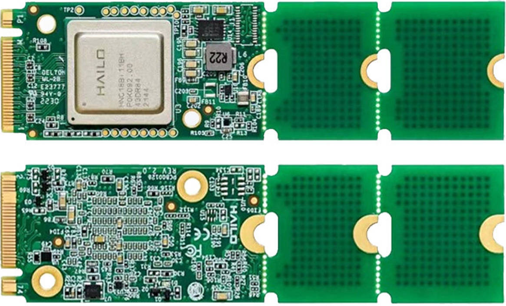
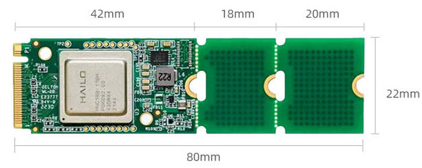

# HAILO-8 AI 加速卡

## 一、产品介绍
### 产品简介
HAILO-8 是专为边缘计算设计的 M.2 AI 加速模块，提供最高 26 TOPS INT8 算力，支持 PCIe Gen3 x4，适用于嵌入式设备、工业控制、智能安防和 IoT 推理场景。



**核心特点**
* 算力：最高可达 26 TOPS (INT8)，适合运行复杂的深度学习模型。
* 功耗：典型 TDP 约 2.5W，远低于同类 GPU/FPGA 方案，适合低功耗边缘设备。
* 接口：支持 PCIe Gen3 x4 高速接口，M.2 Key M 模块化设计，方便集成到定制载板。
* 兼容性：支持 TensorFlow、PyTorch、ONNX、Keras、TFLite 等主流框架。
* 多流推理：支持 多模型并行、多视频流实时推理，适合安防监控、工业检测等场景。
* 工业级设计：工作温度范围 -40°C ~ +85°C，满足严苛环境需求。
* 存储架构：内置存储，无需外部 DRAM，提升能效和集成度

### 详细参数



|名称|参数|
|----|----|
|型号|Hailo-8|
|认证|CE、FCC Class A|
|存储温度|-40°C-85°C|
|工作温度|-40°C-85°C|
|存储/操作湿度|5%RH~90%RH(无凝结)|
|接口类型|M.2 Key M|
|物理尺寸|22x42/22x60/22x80mm|
|电力供应|3.3V±5%|
|热设计功率(TDP)|8.65 W|
|接口|PCIe Gen3,4-lanes(x4)|
|最佳性能(INT8)|26TOPS|


## 二、使用方法
**firefly适配资料通过邮件的方式获取，把订单号发送到<font color=red>sales@t-firefly.com</font>邮箱并注明需获取Hailo-8资料**

### 部署
**适配平台：RK3576,RK3588**
#### Linux
* 确认当前存在hailo-8驱动
```
root@firefly:/# find /boot/lib/modules/ -name "hailo*"
/boot/lib/modules/6.1.141/kernel/drivers/hailort-drivers
/boot/lib/modules/6.1.141/kernel/drivers/hailort-drivers/linux/pcie/hailo_pci.ko
```

* 安装firefly适配包并重启
```
sudo dpkg -i hailort_4.21.0_arm64.deb
sudo dpkg -i hailo8-firefly-1.0.0_arm64.deb
sudo reboot
```

* 确认加载日志
```
root@firefly:/home/firefly# dmesg | grep hailo
[    7.351925] hailo: Init module. driver version 4.21.0
[    7.352293] hailo 0000:01:00.0: Probing on: 1e60:2864...
[    7.352311] hailo 0000:01:00.0: Probing: Allocate memory for device extension, 13192
[    7.352341] hailo 0000:01:00.0: enabling device (0000 -> 0002)
[    7.352361] hailo 0000:01:00.0: Probing: Device enabled
[    7.352403] hailo 0000:01:00.0: Probing: mapped bar 0 - 00000000c54dae26 16384
[    7.352415] hailo 0000:01:00.0: Probing: mapped bar 2 - 00000000f53033c3 4096
[    7.352424] hailo 0000:01:00.0: Probing: mapped bar 4 - 00000000b4d789a1 16384
[    7.352436] hailo 0000:01:00.0: Probing: Setting max_desc_page_size to 4096, (page_size=4096)
[    7.352454] hailo 0000:01:00.0: Probing: Enabled 64 bit dma
[    7.352460] hailo 0000:01:00.0: Probing: Using userspace allocated vdma buffers
[    7.352471] hailo 0000:01:00.0: Disabling ASPM L0s
[    7.352489] hailo 0000:01:00.0: Successfully disabled ASPM L0s
[    7.352617] hailo 0000:01:00.0: Writing file hailo/hailo8_fw.bin
[    7.418141] hailo 0000:01:00.0: File hailo/hailo8_fw.bin written successfully
[    7.418174] hailo 0000:01:00.0: Writing file hailo/hailo8_board_cfg.bin
[    7.418297] hailo 0000:01:00.0: File hailo/hailo8_board_cfg.bin written successfully
[    7.418310] hailo 0000:01:00.0: Writing file hailo/hailo8_fw_cfg.bin
[    7.418359] hailo 0000:01:00.0: File hailo/hailo8_fw_cfg.bin written successfully
[    7.516682] hailo 0000:01:00.0: NNC Firmware loaded successfully
[    7.516728] hailo 0000:01:00.0: FW loaded, took 164 ms
[    7.531865] hailo 0000:01:00.0: Probing: Added board 1e60-2864, /dev/hailo0
```
#### Android
Firefly 目前已适配 RK3576 的 Android 14 和 RK3588 的 Android 12 两个版本。部署时可参考 Firefly 提供的 Android 部分资料，或依据 Hailo-8 官方文档自行操作。完成部署后，请确认模块是否被识别，可参照 Linux 部署中的“确认加载日志”步骤进行验证。

## 三、性能
* **PCIe 2.0 x2**
```
root@firefly:/usr/local# hailortcli run /usr/local/yolov8n.hef
Running streaming inference (/usr/local/yolov8n.hef):
  Transform data: true
    Type:      auto
    Quantized: true
Network yolov8n/yolov8n: 100% | 1008 | FPS: 201.33 | ETA: 00:00:00
> Inference result:
 Network group: yolov8n
    Frames count: 1008
    FPS: 201.34
    Send Rate: 1979.29 Mbit/s
    Recv Rate: 1966.92 Mbit/s
```

* **PCIe 3.0 x4**
```
root@firefly:/usr/local# hailortcli run /usr/local/yolov8n.hef
Running streaming inference (/usr/local/yolov8n.hef):
  Transform data: true
    Type:      auto
    Quantized: true
Network yolov8n/yolov8n: 100% | 2814 | FPS: 562.12 | ETA: 00:00:00
> Inference result:
 Network group: yolov8n
    Frames count: 2814
    FPS: 562.14
    Send Rate: 5526.08 Mbit/s
    Recv Rate: 5491.54 Mbit/s
```

<font color=red>注：模块在PCIe 3.0 x4接口下可实现最佳性能，而Firefly多数 M.2 接口为PCIe 2.0 x2，请结合测试数据评估。另需注意散热，散热不足也会导致性能下降。</font>

## 四、资料
### HAILO-8 官方资料
* 驱动: https://github.com/hailo-ai/hailort-drivers
* 模型: https://github.com/hailo-ai/hailo_model_zoo/tree/master