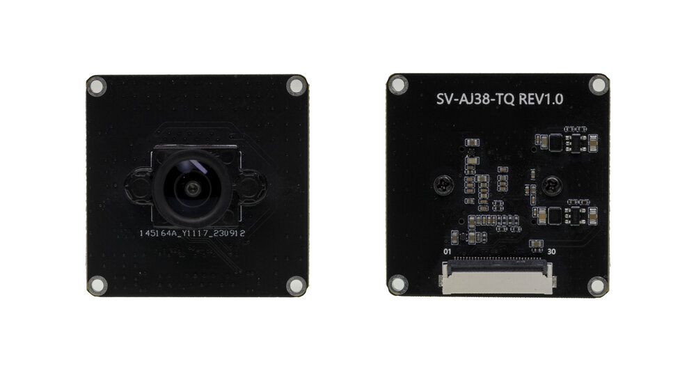
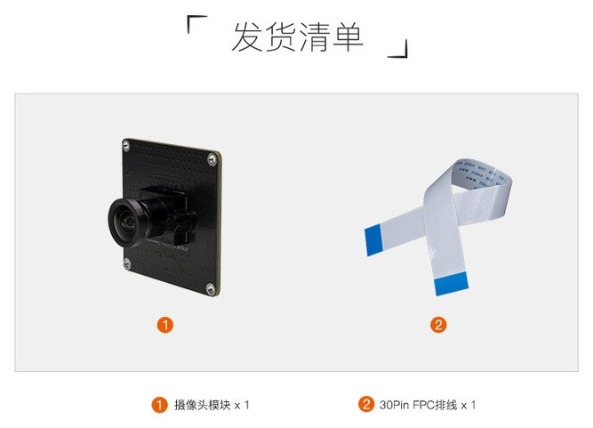
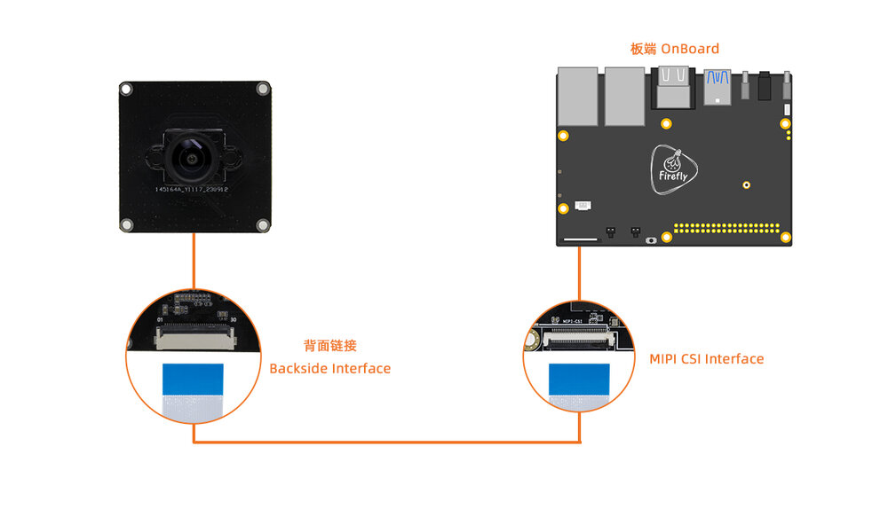

# 一、产品介绍
## 产品简介
CAM-8MS1M(IMX415) 是一款 MIPI 摄像头模组，采用 8M 动态传感器，优质的动态效果将适应更多恶劣场景，减少复杂光线环境对识别算法产生的不良影响，采用标准MIPI接口输出高质量视频流；产品主要应用于人脸识别门禁、考勤、闸机、人证机等场景。

## 发货清单

## 详细参数

|| 参数 |
| ---- | ---- |
|摄像头| CAM-8MS1M(IMX415) |
|CMOS感光芯片|1/2.8 sensor/RGB|
|最大分辨率|3840(H) x 2160(V) (16:9)|
|传感器像素尺寸| 1.45um x 1.45um |
|低照度|0.5Lux/F2.0|
|图像传输速率|3840x2160/60fps|
|信噪比|TBD|
|动态范围|TBD|
|FOV视场角|D:120.3度 、 H:111度、V:76.4度|
|光圈|F2.0|
|镜头焦距|1.95mm|
|畸变|TV Distortion<-3.3%|
|镜头CRA|TBD|
|镜头温度范围|-20° ~ +60°|
|镜头结构|1G5P|
|视频输出格式|RAW10/RAW12|
|红外灯(IR)|NC|
|供电方式|5V±10%/电源纹波要求小于100MV|
|模组接线方式|0.5mm FPC连接器 (**模组端**是30pin，而**板子端**则需要根据实际的硬件接口)|
|电源功耗|TBD|
|工作温度|-10℃ ~ +55℃(Humidity:10%RH ~ 75%RH)|
|储藏温度|-20℃ ~ +65℃(Humidity:10%RH ~ 75%RH)|
|尺寸|38mm x 38mm|

<!--

## 接口定义
## 产品选型
-->

# 二、使用方法

<!--

## 使用说明
-->

## 硬件连接

Firefly的开发板有两种MIPI CSI接口，分别是30pin和24pin接口，连接时需注意区分方向，且只能连接对应Pin口数的CSI接口，`CAM-8MS1M(IMX415)`支持30pin接口，以下是***统一接口示意图***：

### 30pin MIPI CSI接口连接

注意：不要接到带有`MIPI DSI`字样的接口，这可能会导致烧坏模组或者开发板。

详细接口定义参考:

| 主控 | 板卡型号 |
| ---- | ---- |
| RK3566 | [AIO-3566JD4](../../../modules_img/IMX415/imx415_AIO-3566-JD4.jpg), [ROC-RK3566-PC](../../../modules_img/IMX415/imx415_ROC-RK3566-PC.jpg) |
| RK3568 | [AIO-3568J](../../../modules_img/IMX415/imx415_AIO-3568J.jpg), [ROC-RK3568-PC](../../../modules_img/IMX415/imx415_ROC-3568-PC.jpg), [ROC-RK3568-PC SE](../../../modules_img/IMX415/imx415_ROC-3568-PC%20SE.jpg) |
| RK3588 | [ITX-3588J](../../../modules_img/IMX415/imx415_ITX-3588J.jpg),[ROC-RK3588S-PC](../../../modules_img/IMX415/imx415_ROC-RK3588S-PC.jpg), [AIO-3588SJD4](../../../modules_img/IMX415/imx415_AIO-3588SJD4.jpg),[AIO-3588Q](../../../modules_img/IMX415/imx415_AIO-3588Q.jpg), [AIO-3588JD4](../../主板/AIO-3588JD4/usage_camera.md) |
| RK3576 | [ROC-RK3576-PC](../../主板/ROC-RK3576-PC/usage_camera.md)，[AIO-3576-JD4](../../主板/AIO-3576-JD4/usage_camera.md)，[AIO-3576Q](../../主板/AIO-3576Q/usage_camera.md), [AIO-3576C](../../主板/AIO-3576C/usage_camera.md)|

# 三、固件与资料下载
相关文档和固件下载，见官网的[资料下载](https://www.t-firefly.com/doc/download/261.html)。

<!--

## 文档下载
## 配件图纸
## 软件工具
## 固件下载
-->

# 四、入门教程
## 固件烧写

| 主控 | USB 线刷 | SD 卡升级 |
| ---- | ---- | ---- |
|RK3566|[AIO-3566JD4](../../主板/AIO-3566JD4/03-upgrade_firmware.md), [ROC-RK3566-PC](../../主板/ROC-RK3566-PC/03-upgrade_firmware.md)| [AIO-3566JD4](../../主板/AIO-3566JD4/05-upgrade_firmware_sd.md), [ROC-RK3566-PC](../../主板/ROC-RK3566-PC/05-upgrade_firmware_sd.md) |
|RK3568|[AIO-3568J](../../主板/AIO-3568J/03-upgrade_firmware.md), [ROC-RK3568-PC](../../主板/ROC-RK3568-PC/03-upgrade_firmware.md), [ROC-RK3568-PC SE](../../主板/ROC-RK3568-PC-SE/03-upgrade_firmware.md) | [AIO-3568J](../../主板/AIO-3568J/05-upgrade_firmware_sd.md), [ROC-RK3568-PC](../../主板/ROC-RK3568-PC/05-upgrade_firmware_sd.md), [ROC-RK3568-PC SE](../../主板/ROC-RK3568-PC-SE/05-upgrade_firmware_sd.md)|
|RK3588|[ITX-3588J](../../主板/ITX-3588J/upgrade_firmware.md), [ROC-RK3588S-PC](../../主板/ROC-RK3588S-PC/upgrade_firmware.md), [AIO-3588SJD4](../../主板/AIO-3588SJD4/upgrade_firmware.md),[AIO-3588Q](../../主板/AIO-3588Q/upgrade_firmware.md), [AIO-3588JD4](../../主板/AIO-3588JD4/upgrade_firmware.md)|[ITX-3588J](../../主板/ITX-3588J/upgrade_firmware_sd.md), [ROC-RK3588S-PC](../../主板/ROC-RK3588S-PC/upgrade_firmware_sd.md), [AIO-3588SJD4](../../主板/AIO-3588SJD4/upgrade_firmware_sd.md) , [AIO-3588Q](../../主板/AIO-3588Q/upgrade_firmware_sd.md), [AIO-3588JD4](../../主板/AIO-3588JD4/upgrade_firmware_sd.md)|
|RK3576|[ROC-RK3576-PC](../../主板/ROC-RK3576-PC/upgrade_firmware.md),[AIO-3576-JD4](../../主板/AIO-3576-JD4/upgrade_firmware.md),[AIO-3576Q](../../主板/AIO-3576Q/upgrade_firmware.md)|[ROC-RK3576-PC](../../主板/ROC-RK3576-PC/upgrade_firmware_sd.md),[AIO-3576-JD4](../../主板/AIO-3576-JD4/upgrade_firmware_sd.md),[AIO-3576Q](../../主板/AIO-3576Q/upgrade_firmware_sd.md),[AIO-3576C](../../主板/AIO-3576C/upgrade_firmware_sd.md)|

## 固件制作

### RK3566 系列

| 系统 | 板卡型号 |
| ---- | ---- |
| Android11.0 | [AIO-3566JD4](../../主板/AIO-3566JD4/compile_android11.0_firmware.md#gong-ban-bian-yi), [ROC-RK3566-PC](../../主板/ROC-RK3566-PC/compile_android11.0_firmware.md#gong-ban-bian-yi) |
| Ubuntu | [AIO-3566JD4](../../主板/AIO-3566JD4/linux_compile_linux5.10.md#bian-yi-ubuntu-gu-jian), [ROC-RK3566-PC](../../主板/ROC-RK3566-PC/linux_compile_linux5.10.md#bian-yi-ubuntu-gu-jian) |
| Buildroot | [AIO-3566JD4](../../主板/AIO-3566JD4/linux_compile_linux5.10.md#bian-yi-buildroot-gu-jian), [ROC-RK3566-PC](../../主板/ROC-RK3566-PC/linux_compile_linux5.10.md#bian-yi-buildroot-gu-jian) |

### RK3568 系列

| 系统 | 板卡型号 | 
| ---- | ---- | 
| Android11.0 | [AIO-3568J](../../主板/AIO-3568J/compile_android11.0_firmware.md#gong-ban-bian-yi), [ROC-RK3568-PC](../../主板/ROC-RK3568-PC/compile_android11.0_firmware.md#gong-ban-bian-yi), [ROC-RK3568-PC SE](../../主板/ROC-RK3568-PC-SE/compile_android11.0_firmware.md#gong-ban-bian-yi) | 
| Ubuntu | [AIO-3568J](../../主板/AIO-3568J/linux_compile_linux5.10.md#bian-yi-ubuntu-gu-jian), [ROC-RK3568-PC](../../主板/ROC-RK3568-PC/linux_compile_linux5.10.md#bian-yi-ubuntu-gu-jian) |
| Buildroot | [AIO-3568J](../../主板/AIO-3568J/linux_compile_linux5.10.md#bian-yi-buildroot-gu-jian), [ROC-RK3568-PC](../../主板/ROC-RK3568-PC/linux_compile_linux5.10.md#bian-yi-buildroot-gu-jian) |

### RK3588 系列

| 系统 | 板卡型号 | 
| ---- | ---- | 
| Android12.0 | [ITX-3588J](../../主板/ITX-3588J/android_compile_android12.0_firmware.md),[ROC-RK3588S-PC](../../主板/ROC-RK3588S-PC/android_compile_android12.0_firmware.md),[AIO-3588SJD4](../../主板/AIO-3588SJD4/android_compile_android12.0_firmware.md),[AIO-3588Q](../../主板/AIO-3588Q/android_compile_android12.0_firmware.md)|
| Buildroot | [ITX-3588J](../../主板/ITX-3588J/linux_compile.md#bian-yi-buildroot-gu-jian),[ROC-RK3588S-PC](../../主板/ROC-RK3588S-PC/linux_compile.md#bian-yi-buildroot-gu-jian),[AIO-3588SJD4](../../主板/AIO-3588SJD4/linux_compile.md#bian-yi-buildroot-gu-jian),[AIO-3588Q](../../主板/AIO-3588Q/linux_compile.md#bian-yi-buildroot-gu-jian),[AIO-3588MQ](../../主板/AIO-3588MQ/linux_compile.md#bian-yi-buildroot-gu-jian),[AIO-3588JQ](../../主板/AIO-3588JQ/linux_compile.md#bian-yi-buildroot-gu-jian), [AIO-3588JD4](../../主板/AIO-3588JD4/linux_compile.md#bian-yi-buildroot-gu-jian)|
| Ubuntu20.04/Ubuntu22.04 | [ITX-3588J](../../主板/ITX-3588J/linux_compile.md#bian-yi-ubuntu-gu-jian),[ROC-RK3588S-PC](../../主板/ROC-RK3588S-PC/linux_compile.md#bian-yi-ubuntu-gu-jian),[AIO-3588SJD4](../../主板/AIO-3588SJD4/linux_compile.md#bian-yi-ubuntu-gu-jian),[AIO-3588Q](../../主板/AIO-3588Q/linux_compile.md#bian-yi-ubuntu-gu-jian),[AIO-3588MQ](../../主板/AIO-3588MQ/linux_compile.md#bian-yi-ubuntu-gu-jian),[AIO-3588JQ](../../主板/AIO-3588JQ/linux_compile.md#bian-yi-ubuntu-gu-jian), [AIO-3588JD4](../../主板/AIO-3588JD4/linux_compile.md#bian-yi-ubuntu-gu-jian)|
| Debian11/Debian12 | [ITX-3588J](../../主板/ITX-3588J/linux_compile.md#bian-yi-debian-gu-jian),[ROC-RK3588S-PC](../../主板/ROC-RK3588S-PC/linux_compile.md#bian-yi-debian-gu-jian),[AIO-3588SJD4](../../主板/AIO-3588SJD4/linux_compile.md#bian-yi-debian-gu-jian),[AIO-3588Q](../../主板/AIO-3588Q/linux_compile.md#bian-yi-debian-gu-jian),[AIO-3588MQ](../../主板/AIO-3588MQ/linux_compile.md#bian-yi-debian-gu-jian),[AIO-3588JQ](../../主板/AIO-3588JQ/linux_compile.md#bian-yi-debian-gu-jian), [AIO-3588JD4](../../主板/AIO-3588JD4/linux_compile.md#bian-yi-debian-gu-jian)|

### RK3576 系列

| 系统 | 板卡型号 | 
| ---- | ---- | 
| Android14.0 | [ROC-RK3576-PC](../../主板/ROC-RK3576-PC/android_compile_android14.0_firmware.md)，[AIO-3576-JD4](../../主板/AIO-3576-JD4/android_compile_android14.0_firmware.md)，[AIO-3576Q](../../主板/AIO-3576Q/android_compile_android14.0_firmware.md), [AIO-3576C](../../主板/AIO-3576C/android_compile_android14.0_firmware.md)|
| Linux | [ROC-RK3576-PC](../../主板/ROC-RK3576-PC/linux_compile.md)，[AIO-3576-JD4](../../主板/AIO-3576-JD4/linux_compile.md)，[AIO-3576Q](../../主板/AIO-3576Q/linux_compile.md)，[AIO-3576C](../../主板/AIO-3576C/linux_compile.md)|