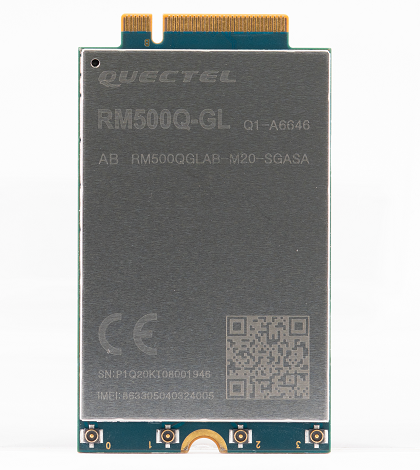
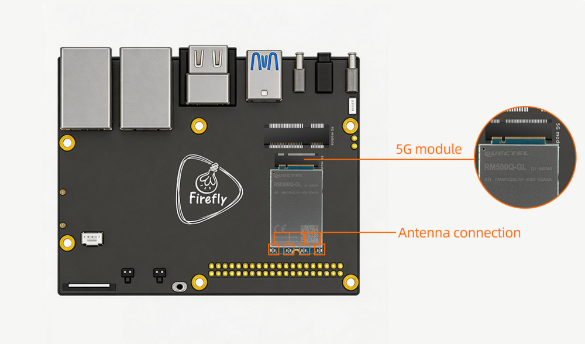

# 一、产品介绍
## 产品简介
### RM500Q-GL

## 详细参数

* **型号**
  * RM500QGLAB-M20-SGASA
* **电源电压**
  * 3.135~4.4 V , 典型值： 3.7V
* **发射功率**
  * WCDMA 频段：Class 3（24 dBm +1/-3 dB）
  * LTE 频段：Class 3（23 dBm ±2 dB）
  * 5G NR 频段：Class 3（23 dBm ±2 dB）
  * LTE B38/B40/B41/B42/B43 频段 HPUE：Class 2（26 dBm ±2 dB）
  * 5G NR n41/n77/n78/n79 bands HPUE：Class 2（26 dBm +2/-3 dB)
* **5G NR 特性**
  * 支持 3GPP Release 15
  * 调制方式：
    * 256QAM (UL)
    * 256QAM (DL)
  * SCS 支持 15 kHz 和 30 kHz
  * 正在开发的 5G NR 频段最大带宽支持 20MHz
  * 5G NR n41/n77/n78/n79 最大带宽支持 100 MHz
  * 支持 Option 3x、3a 和 Option 2
  * NSA TDD：Max 2.5 Gbps (DL) Max 650 Mbps (UL)
  * SA TDD： Max 2.1 Gbps (DL) Max 900 Mbps (UL)
  * n41/n77/n78/n79 频段支持上行 2 × 2 MIMO
  * n1/n2/n3/n7/25/n38/n40/n41/n48/n66/n77/n78/n79 频段支持下行 4 × 4 MIMO
  * 支持 SA 和 NSA 组网模式，所有 5G 频段均支持 SA，n38*/n41/n77/n78/n79 频段支持 NSA
* **LTE 特性**
  * 最大支持 CA Cat 16 FDD 和 TDD
  * 调制方式：
    * (UL) QPSK、16QAM、64QAM、256QAM*
    * (DL) QPSK、16QAM、64QAM、256QAM
  * 支持 1.4~20 MHz（3 × CA）射频带宽
  * LTE： Max 1.0 Gbps (DL) Max 200 Mbps (UL)
  * B1/B2/B3/B4/B7/B25/B30/B38/B39/B40/B41/B42/B43/B48/B66 频段支持下行 4 × 4 MIMO
* **UMTS 特性**
  * 支持 QPSK、16QAM 和 64QAM 调制
  * DC-HSDPA：Max 42 Mbps (DL)
  * HSUPA：Max 5.76 Mbps (UL)
  * WCDMA：Max (DL/UL) 384 kbps
  * 支持 3GPP R8 DC-HSDPA、HSPA+、HSDPA、HSUPA 和 WCDMA
* **接口**
  * USB 接口：符合 USB 3.1 和 USB 2.0 规范
  * (U)SIM 接口：支持Class B（3.0 V）和 Class C（1.8 V）
  * 分集接收天线接口：支持 5G NR/LTE/WCDMA 分集接收
  * PCIE接口：符合 PCIe Gen3 规范，每个通道传输速率可达 8 Gbps
  * 天线接口：×4 (ANT0、ANT1、ANT2_GNSSL1 和 ANT3 四个天线接口 )
* **网络协议特性**
  * 支持 QMI/NTP*协议
  * 支持 PAP 和 EIRP 协议，通常用于 PPP 连接
* **内置GNSS**
  * 支持GPS、GLONASS、BeiDou、Galileo和QZSS
* **结构尺寸**
  * (52.0 ±0.15) mm × (30.0 ±0.15) mm × (2.3 ±0.2) mm
* **重量**
  * 约 8.6g
* **RoHS**
  * 符合 EU RoHS 标准

**注意：**`*`表示移远官方正在开发中

# 二、使用方法

<!--
## 使用说明
-->

## 硬件连接
### 模组连接

<!-- | 主控 | 板卡型号 | 
| ---- | ---- | 
| RK3568 | [AIO-3568J](_images/5G_AIO-3568J.png) | 
| RK3588 | [ITX-3588J](_images/5G_ITX-3588J.jpg), [AIO-3588SJD4](_images/5G_AIO-3588SJD4.jpg) ,[AIO-3588Q](_images/5G_AIO-3588Q.jpg)| -->

### SIM 卡的插入

# 三、固件与资料下载
相关文档和固件下载，见官网的[资料下载](https://community.t-firefly.com/doc/download/133)。

<!--
## 文档下载
## 配件图纸
## 软件工具
## 固件下载
-->

# 四、入门教程
## 固件烧写

| 主控 | USB 线刷 | SD 卡升级 |
| ---- | ---- | ---- |
|RK3568|[AIO-3568J](../../主板/AIO-3568J/03-upgrade_firmware.md) | [AIO-3568J](../../主板/AIO-3568J/05-upgrade_firmware_sd.md)| 
|RK3588|[ITX-3588J](../../主板/ITX-3588J/upgrade_firmware.md), [AIO-3588SJD4](../../主板/AIO-3588SJD4/upgrade_firmware.md),[AIO-3588Q](../../主板/AIO-3588Q/upgrade_firmware.md)| [ITX-3588J](../../主板/ITX-3588J/upgrade_firmware_sd.md), [AIO-3588SJD4](../../主板/AIO-3588SJD4/upgrade_firmware_sd.md),[AIO-3588Q](../../主板/AIO-3588Q/upgrade_firmware_sd.md)|

<!-- ## 固件制作

### RK3568 系列

|  系统   |  板卡型号 | 
|  ----  | ----  | 
| Android11.0 | [AIO-3568J](../../主板/AIO-3568J/compile_android11.0_firmware.md#gong-ban-bian-yi)
| Ubuntu | [AIO-3568J](../../主板/AIO-3568J/ubuntu_compile.md) | 
| Buildroot | [AIO-3568J](../../主板/AIO-3568J/buildroot_compile.md)

### RK3588 系列

|  系统   |  板卡型号 | 
|  ----  | ----  | 
| Android12.0 | [ITX-3588J](../../主板/ITX-3588J/android_compile_android12.0_firmware.md#hdmi-gu-jian-bian-yi), [AIO-3588SJD4](../../主板/AIO-3588SJD4/android_compile_android12.0_firmware.md#hdmi-gu-jian-bian-yi),[AIO-3588Q](../../主板/AIO-3588Q/android_compile_android12.0_firmware.md)|
| Buildroot | [ITX-3588J](../../主板/ITX-3588J/linux_compile_buildroot.md),[AIO-3588SJD4](../../主板/AIO-3588SJD4/linux_compile_buildroot.md),[AIO-3588Q](../../主板/AIO-3588Q/linux_compile_buildroot.md),[AIO-3588MQ](../../主板/AIO-3588MQ/linux_compile_buildroot.md),[AIO-3588JQ](../../主板/AIO-3588JQ/linux_compile_buildroot.md)|
| Ubuntu20.04 | [ITX-3588J](../../主板/ITX-3588J/linux_compile_ubuntu.md),[AIO-3588SJD4](../../主板/AIO-3588SJD4/linux_compile_ubuntu.md),[AIO-3588Q](../../主板/AIO-3588Q/linux_compile_ubuntu.md),[AIO-3588MQ](../../主板/AIO-3588MQ/linux_compile_ubuntu.md),[AIO-3588JQ](../../主板/AIO-3588JQ/linux_compile_buildroot.md)|
| Debian11 | [ITX-3588J](../../主板/ITX-3588J/linux_compile_debian.md),[AIO-3588SJD4](../../主板/AIO-3588SJD4/linux_compile_debian.md),[AIO-3588Q](../../主板/AIO-3588Q/linux_compile_debian.md),[AIO-3588MQ](../../主板/AIO-3588MQ/linux_compile_debian.md),[AIO-3588JQ](../../主板/AIO-3588JQ/linux_compile_debian.md)| -->

## GNSS(可选功能)
公版固件支持 GNSS 功能，但是默认关闭。

### 基本参数
支持 GPS、GLONASS、GALILEO、BEIDOU，兼容标准 NMEA 0183 协议，可通过 USB NMEA 接口输出 1Hz 频率的 NMEA 信息，默认输出串口为 /dev/ttyUSB1，波特率 115200 bit/s。

### 天线要求

* 频率范围:1559~1606 MHz
* 极性:右旋圆极化或线性
* VSWR: < 2(典型值)
* 无源天线增益:> 0dBi

注意: GPS 天线需要使用**无源天线**

### 如何使能 GPS 和修改串口配置
[参考EC20](../EC20/started.md#ru-he-shi-neng-gps-he-xiu-gai-chuan-kou-pei-zhi)