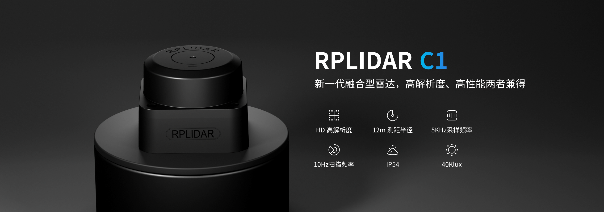

# RPLIDAR C1 激光雷达

## 一、产品介绍
### 产品简介

RPLIDAR C1 是思岚科技推出的融合型 DTOF 激光雷达，面向开发者和室内应用场景。雷达支持 360° 扫描，具有 5kHz 采样频率和 8~12Hz 扫描频率，可用于机器人导航、避障、定位与建图等应用。



### 详细参数

| 名称 | 参数 |
| ---- | ---- |
| 型号 | RPLIDAR C1 |
| 类型 | 融合型 DTOF 激光雷达 |
| 应用范围 | 室内 |
| 机械尺寸 | 55.6 x 55.6 x 41.3 mm |
| 测距半径 | 白色物体：0.05~12 m（70% 反射率）；黑色物体：0.05~6 m（10% 反射率） |
| 采样频率 | 5 kHz |
| 扫描频率 | 8~12 Hz，典型值 10 Hz |
| 角度分辨率 | 0.72° |
| 测距分辨率 | 15 mm |
| 测距精度 | ±30 mm |
| 防护等级 | IP54 |
| 抗环境光能力 | 40 klux |
| 供电电压 | 5 V |
| 数据通讯接口 | TTL UART，460800 bps |
| 工作温度 | 0°C~50°C |

## 二、使用方法
### SDK 使用

最新版本 SDK 可从 GitHub 获取：

```bash
git clone https://github.com/Slamtec/rplidar_sdk.git
cd rplidar_sdk
make
cd output/Linux/Release
ls
```

编译完成后，可看到以下文件：

```text
custom_baudrate  libsl_lidar_sdk.a  simple_grabber  ultra_simple
```

连接 RPLIDAR C1 后，可以使用以下命令确认设备节点：

```bash
dmesg | grep -E "ttyUSB|cp210x"
ls /dev/ttyUSB*
```

在 Firefly Ubuntu 平台上，设备节点通常为 `/dev/ttyUSB0`，C1 的通信波特率为 `460800`。

#### ultra_simple

`ultra_simple` 用于通过串口读取并输出实时扫描数据：

```bash
./ultra_simple --channel --serial /dev/ttyUSB0 460800
```

输出数据示例：

```text
theta: 0.10 Dist: 00666.00 Q: 47
theta: 0.98 Dist: 00669.00 Q: 47
theta: 1.86 Dist: 00671.00 Q: 47
```

其中：

* `theta`：扫描角度，单位为度，范围为 0°~360°。
* `Dist`：障碍物距离，单位为毫米。
* `Q`：信号质量，数值越大表示信号越强，`0` 表示无效点。

#### simple_grabber

`simple_grabber` 会在终端中以 ASCII 字符画显示 0°~360° 范围内的扫描结果：

```bash
./simple_grabber --channel --serial /dev/ttyUSB0 460800
```

雷达原点位于字符画下方，字符越密集通常表示对应方向的障碍物距离越近。

#### custom_baudrate

`custom_baudrate` 用于测试指定波特率下的通信：

```bash
./custom_baudrate /dev/ttyUSB0 460800
```

### ROS 2 使用

验证平台为 Firefly ROC-RK3588S-PC Ubuntu 22.04，使用 ROS 2 Humble。ROS 2 Humble 安装方法请参考[Firefly ROS2 安装教程](https://community.t-firefly.com/docs/software/industry-robot/ROS2)。

下载并编译 SLAMTEC ROS 2 驱动：

```bash
git clone -b ros2 --single-branch https://github.com/Slamtec/rplidar_ros.git
sudo apt install -y python3-colcon-common-extensions
cd rplidar_ros
source /opt/ros/humble/setup.bash
colcon build --symlink-install --parallel-workers 2
source ./install/setup.bash
```

连接雷达后，确认串口设备为 `/dev/ttyUSB0`，并启动驱动节点：

```bash
sudo chmod 777 /dev/ttyUSB0
ros2 launch rplidar_ros rplidar_c1_launch.py
```

另开一个终端，加载 ROS 2 和驱动环境后运行客户端：

```bash
source /opt/ros/humble/setup.bash
cd rplidar_ros
source ./install/setup.bash
ros2 run rplidar_ros rplidar_client
```

客户端会订阅 `/scan` 话题并输出扫描数据。角度单位为度，距离单位为米。

也可以运行可视化软件rviz2，观察点云：

```bash
source /opt/ros/humble/setup.bash
cd rplidar_ros
rviz2 -d rviz/rplidar_ros.rviz
```


## 三、资料

* [RPLIDAR C1 产品介绍](https://www.slamtec.com/cn/c1)
* [RPLIDAR C1 文档与 SDK](https://www.slamtec.com/cn/support#rplidar-c1)
* [RPLIDAR SDK](https://github.com/Slamtec/rplidar_sdk)
* [RPLIDAR ROS 2 驱动](https://github.com/Slamtec/rplidar_ros)