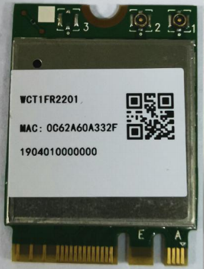

# 产品介绍

## WCT1FR2201 WiFi/BT 模组

WCT1FR2201 是一款基于 RTL8822CE-CG 芯片的双频 WiFi 和蓝牙 5.0 模组，支持 2.4 GHz 和 5 GHz WiFi 频段。

## 规格参数

| 项目 | 参数 |
| ---- | ---- |
| 型号 | WCT1FR2201 PCIe |
| WiFi | IEEE 802.11a/b/g/n/ac，2T2R |
| 蓝牙 | Bluetooth 5.0 |
| 芯片 | RTL8822CE-CG |
| 接口 | WiFi: PCIe；蓝牙: USB |
| 尺寸 | 22.0 mm x 30.0 mm x 2.5 mm |
| 卡型 | M.2 2230-S3-A-E |

## 适配板卡

| CPU | 板卡 |
| ---- | ---- |
| RK3588 | ROC-RK3588-RT |

相关文档和固件请查看官网[资料下载](https://community.t-firefly.com/doc/download/207)。